[GAMES 101 - Lecture 02 03](https://www.bilibili.com/video/BV1X7411F744/)
[中科院2022跨年演讲 - 从一元二次方程到规范场论](https://www.bilibili.com/video/BV1qa411B792/)
[3Blue1Brown - 四元数的可视化](https://www.bilibili.com/video/BV1SW411y7W1/)
[3Blue1Brown - 四元数和三维转动](https://www.bilibili.com/video/BV1Lt411U7og/)
[GAMES104 - 08.游戏引擎的动画技术基础(上)](https://www.bilibili.com/video/BV1jr4y1t7WR)

# 目录
- [代数](#代数)
  - [点乘 dot product](#点乘-dot-product)
  - [叉乘 cross product](#叉乘-cross-product)
- [变换](#变换)
  - [齐次坐标](#齐次坐标)
  - [三维变换](#三维变换)
  - [万向死锁](#万向死锁)
- [四元数](#四元数)
  - [复数](#复数)
  - [四元数 Quaternion](#四元数-quaternion)

------

# 代数

单位向量 可以表示向量的方向

$$
\hat{a}=\frac{\vec{a}}{\vert\vert\vec{a}\vert\vert}
$$

在图形学中 如果不特殊说明 **默认缺省的向量是列向量**

$$
\vec{v}=
\begin{pmatrix}
x\\
y
\end{pmatrix}
$$

$$
\vec{v}^{\ T}=(x,\ y)
$$

## 点乘 dot product
两个向量**点乘的结果是得到一个数** 标量

$$
\vec{a}\cdot \vec{b}=\vert\vert\vec{a}\vert\vert\ \vert\vert\vec{b}\vert\vert\ cos\theta
$$

向量$$\vec{a}$$ $$\vec{b}$$ 之间的夹角为 $$\theta$$

$$
cos\theta=\frac{\vec{a}\cdot \vec{b}}{\vert\vert\vec{a}\vert\vert\ \vert\vert\vec{b}\vert\vert}
$$

对于单位向量

$$
cos\theta=\hat{a}\cdot\hat{b}
$$

图形学中 **点乘的作用就是找到两个向量或方向之间的夹角** 在两个向量都是单位向量时更为方便 只需要**两个单位向量之间点乘 就可以得到它们之间夹角的余弦**

$$
\vec{a}\cdot\vec{b}=\vec{b}\cdot\vec{a}
$$

$$
\vec{a}\cdot(\vec{b}+\vec{c})=\vec{a}\cdot\vec{b}+\vec{a}\cdot\vec{c}
$$

$$
(k\vec{a})\cdot\vec{b}=\vec{a}\cdot(k\vec{b})=k(\vec{a}\cdot\vec{b})
$$

***笛卡尔坐标系中的点乘***

二维中 注意到是两个**列向量**相乘

$$
\vec{a}\cdot\vec{b}=
\begin{pmatrix}
a_1\\
a_2
\end{pmatrix}
\cdot
\begin{pmatrix}
b_1\\
b_2
\end{pmatrix}
=a_1b_1+a_2b_2
$$

三维中

$$
\vec{a}\cdot\vec{b}=
\begin{pmatrix}
a_1\\
a_2\\
a_3\\
\end{pmatrix}
\cdot
\begin{pmatrix}
b_1\\
b_2\\
b_3
\end{pmatrix}
=a_1b_1+a_2b_2+a_3b_3
$$

此后 为了便于数学上的迅速理解 本文对于坐标就写成a1 a2 a3 来表示向量a的坐标的3个维度 而不是使用ax ay az / xa xb 之类的含x y z的写法

将点乘写成矩阵乘法形式 转置后变成行向量就可以进行矩阵乘法了

$$
\vec{a}\cdot\vec{b}=\vec{a}^T\vec{b}=(a_1,a_2,a_3)
\begin{pmatrix}
b_1\\
b_2\\
b_3
\end{pmatrix}
=a_1b_1+a_2b_2+a_3b_3
$$

***Projection 投影***

  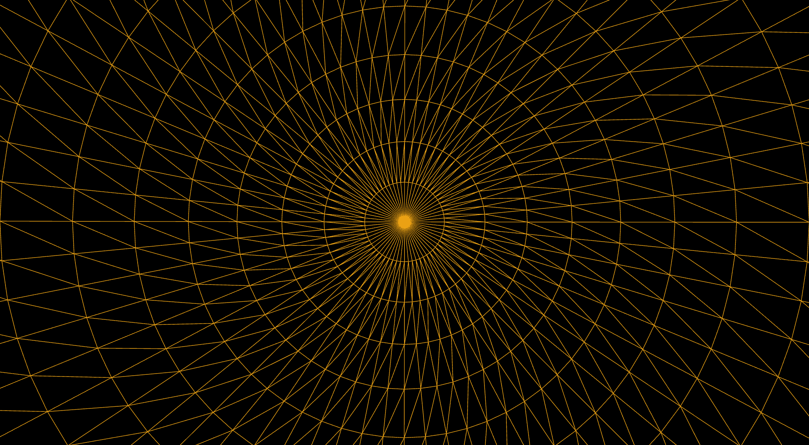

现在希望把 $$\vec{b}$$ 投影到 $$\vec{a}$$ 上去 $$\vec{b}_\perp$$ 和 $$\hat{a}$$ 是同向的

$$
\vec{b}_\perp=\vert\vert\vec{b}\vert\vert cos\theta\ \hat{a}
$$

那么垂直方向的就是 $$\vec{b}-\vec{b}_\perp$$

***两个向量的方向有多接近***

  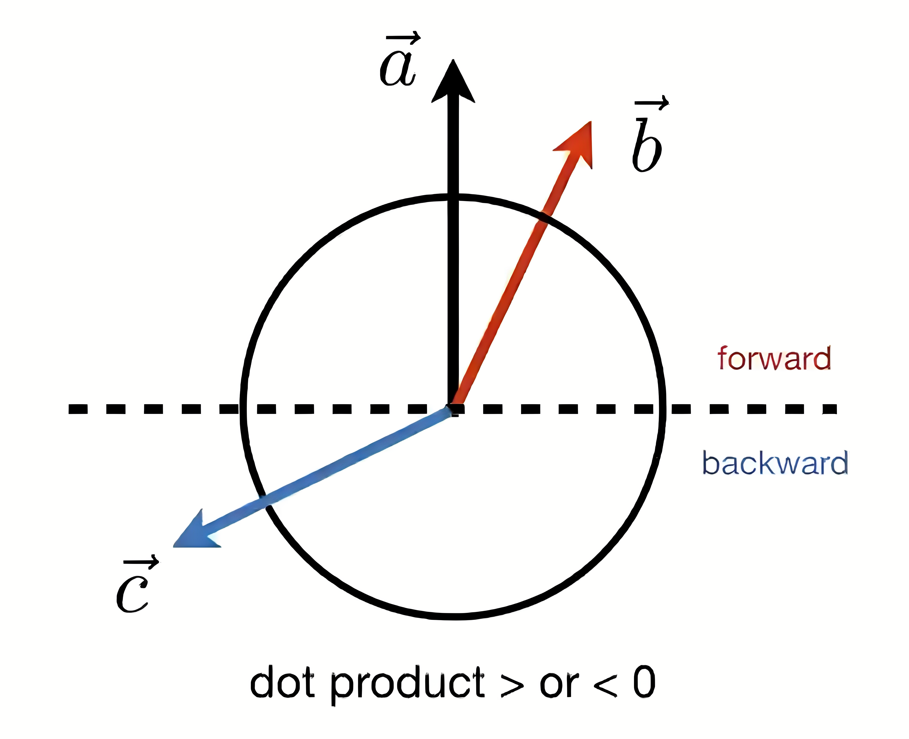

$$\vec{a}$$ 的正方向是上半圆 反方向是下半圆

$$\vec{a}\cdot\vec{b}$$ 大于0 就认为 $$\vec{a}$$ $$\vec{b}$$ 几乎同方向
$$\vec{a}\cdot\vec{c}$$ 小于0 就认为 $$\vec{a}$$ $$\vec{c}$$ 反方向

**若都是单位向量 点乘结果越接近1 两个向量的方向就越接近 越接近-1 两个向量的方向就越相反**

比如金属的高光 入射的光打到金属表面 它会反射 在它发生镜面反射的那个方向附近的一些角度 你是可以看到这个反射的 于是你就可以看到高光 但如果偏离太远就看不到高光 因此需要知道你的观察视角和它反射的方向到底有多接近

## 叉乘 cross product

两个向量**叉乘的结果是得到一个向量**

这个向量的方向和原来的两个向量都垂直 也就是垂直于原来的两个向量所在的平面 方向是右手螺旋定则

$$
\vert\vert\vec{a}\times\vec{b}\vert\vert=\vert\vert\vec{a}\vert\vert\ \vert\vert\vec{b}\vert\vert\ sin\phi
$$

在三维空间中 如果是右手系 已知x轴y轴 就可以通过x轴y轴叉乘得到z轴

$$
\vec{x}\times\vec{y}=+\vec{z}
$$

$$
\vec{y}\times\vec{z}=+\vec{x}
$$

$$
\vec{z}\times\vec{x}=+\vec{y}
$$

$$
\vec{y}\times\vec{x}=-\vec{z}
$$

$$
\vec{z}\times\vec{y}=-\vec{x}
$$

$$
\vec{x}\times\vec{z}=-\vec{y}
$$

$$
\vec{a}\times\vec{b}=-\vec{b}\times\vec{a}
$$

$$
\vec{a}\times\vec{a}=\vec{0}
$$

$$
\vec{a}\times(\vec{b}+\vec{c})=\vec{a}\times\vec{b}+\vec{a}\times\vec{c}
$$

$$
\vec{a}\times(k\vec{b})=k(\vec{a}\times\vec{b})
$$

OpenGL UE都是左手系

***笛卡尔坐标系中的叉乘***

$$
\vec{a}\times\vec{b}=
\begin{pmatrix}
a_2b_3-a_3b_2\\
a_3b_1-a_1b_3\\
a_1b_2-a_2b_1
\end{pmatrix}
$$

有非常容易记忆的方式 将下面的行列式按第一行展开即可

$$
\vec{a} \times \vec{b} = 
\begin{vmatrix}
\vec{i} & \vec{j} & \vec{k} \\
a_1 & a_2 & a_3 \\
b_1 & b_2 & b_3
\end{vmatrix}
$$

***叉乘矩阵***

我们希望能找到一个矩阵$$A^*$$ 使得 $$\vec{a}\times\vec{b}=A^*\ \vec{b}$$ 这个矩阵就称为**叉乘矩阵**

对于列向量

$$
\vec{a}=\begin{pmatrix}
a_1\\
a_2\\
a_3
\end{pmatrix}
$$

它的叉乘矩阵就是

$$
A^*=\begin{pmatrix}
0 & -a_3 & a_2\\
a_3 & 0 & -a_1\\
-a_2 & a_1 & 0
\end{pmatrix}
$$

可以发现这个矩阵是一个斜对称矩阵 记忆方式为
主对角线全为0
1行2列 缺的是a3 1到2是顺序 对应的是负数
2行1列 缺的是a3 2到1是逆序 对应的是正数
3行2列 缺的是a1 3到2是逆序 对应的是正数
以此类推

那么就有

$$
\vec{a}\times\vec{b}=A^*\ \vec{b}=
\begin{pmatrix}
0 & -a_3 & a_2\\
a_3 & 0 & -a_1\\
-a_2 & a_1 & 0
\end{pmatrix}
\begin{pmatrix}
b_1\\
b_2\\
b_3
\end{pmatrix}
$$

实际上 上面的式子也是叉乘的矩阵乘法形式

***判断左右***

  

现在 $$\vec{b}$$ 在 $$\vec{a}$$ **左侧** 也就是说 从 $$\vec{a}$$ 向左旋转或者逆时针旋转 就可以到达 $$\vec{b}$$ 的方向 而 $$\vec{a}\times\vec{b}$$ 的方向是向着纸外的 是z轴的正方向 **是正的**

而 $$\vec{a}$$ 在 $$\vec{b}$$ **右侧** 也就是说 从 $$\vec{b}$$ 向右旋转或者顺时针旋转 就可以到达 $$\vec{a}$$ 的方向 $$\vec{b}\times\vec{a}$$ **是负的**

***判断内外***

  

判断点P是否在三角形内部 顶点A B C是逆时针摆放

$$\vec{AB}\times\vec{AP}$$ 的方向是向纸外的 那么P点就是在 $$\vec{AB}$$ 的左侧
$$\vec{BC}\times\vec{BP}$$ 的方向是向纸外的 那么P点就是在 $$\vec{BC}$$ 的左侧
$$\vec{CA}\times\vec{CP}$$ 的方向是向纸外的 那么P点就是在 $$\vec{CA}$$ 的左侧

则点P在三角形ABC的内部 否则至少有一边使得P点在某条边的右侧 

如果顶点是顺时针摆放 那么P点就会在三条边的右侧 **只要某个点一直在三条边的同侧 这个点就在三角形内部**
这是以后做光栅化的基础 我们要判断三角形覆盖了哪些像素 自然要知道这个像素是不是在三角形内部

如果得到的结果是0 到底算作是在三角形内部还是外部 这种情况就要自己决定了 说它在里面还是在外面都行

***矩阵乘法***

$$
(AB)C=A(BC)
$$

$$
A(B+C)=AB+AC
$$

$$
(A+B)C=AC+BC
$$

$$
(AB)^T=B^TA^T
$$

$$
AA^{-1}=I
$$

$$
(AB)^{-1}=B^{-1}A^{-1}
$$

矩阵和列向量(m×1)乘 那么肯定矩阵是放在左边

# 变换

***缩放***

$$
x'=s_1x
$$

$$
y'=s_2y
$$

$$
\begin{pmatrix}
x'\\
y'\\
\end{pmatrix}=
\begin{pmatrix}
s_1 & 0\\
0 & s_2\\
\end{pmatrix}
\begin{pmatrix}
x\\
y\\
\end{pmatrix}
$$

***反射/对称***
$$
x'=-x
$$

$$
y'=y
$$

$$
\begin{pmatrix}
x'\\
y'\\
\end{pmatrix}=
\begin{pmatrix}
-1 & 0\\
0 & 1\\
\end{pmatrix}
\begin{pmatrix}
x\\
y\\
\end{pmatrix}
$$

上面就是关于y轴对称

***切变***

  

纵坐标不表 底边不变 任何x水平方向的移动都是ay

$$
\begin{pmatrix}
x'\\
y'\\
\end{pmatrix}=
\begin{pmatrix}
1 & a\\
0 & 1\\
\end{pmatrix}
\begin{pmatrix}
x\\
y\\
\end{pmatrix}
$$

***旋转***

  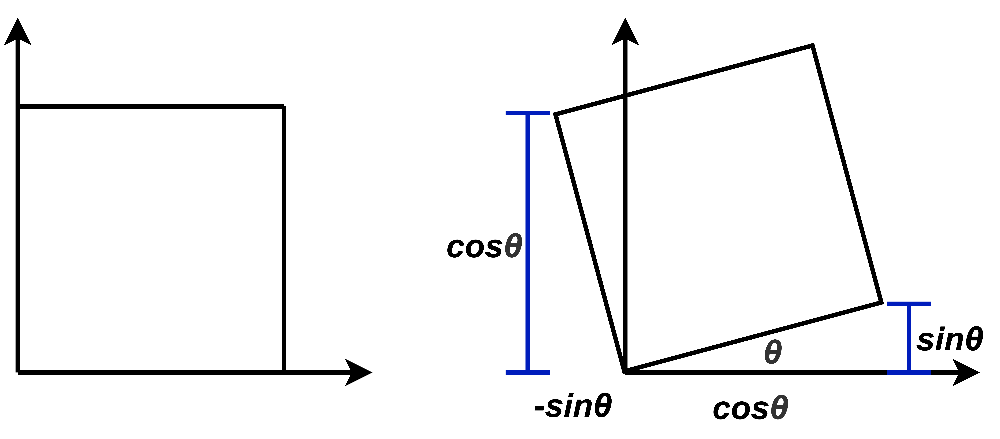

默认绕原点旋转 **默认逆时针旋转**

$$
R_{\theta}=\begin{pmatrix}
cos\theta & -sin\theta\\
sin\theta & cos\theta\\
\end{pmatrix}
$$

$$
R_{-\theta}=\begin{pmatrix}
cos\theta & sin\theta\\
-sin\theta & cos\theta\\
\end{pmatrix}=R_\theta^T=R_\theta^{-1}
$$

偶旋转正交矩阵的逆就是转置
忘记了这个旋转矩阵就直接利用 (1, 0) (0, 1) 这两个点旋转的结果去推导就好了

## 齐次坐标

引入齐次坐标是因为平移变换比较特殊

  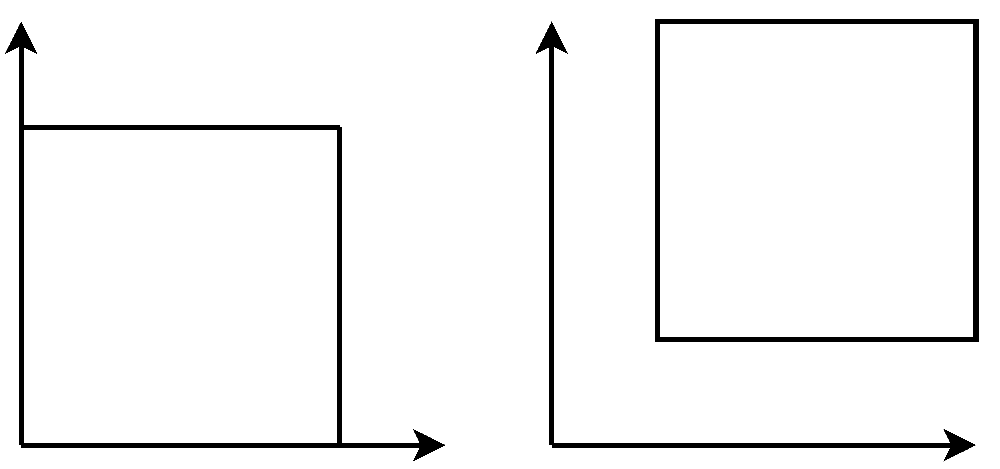

$$
x'=x+t_x
$$

$$
y'=y+t_y
$$

x轴平移$$t_x$$ y轴平移$$t_y$$
就算写成矩阵形式 但这不是线性变换 这是仿射变换
$$
\begin{pmatrix}
x'\\
y'\\
\end{pmatrix}=
\begin{pmatrix}
a & b\\
c & d\\
\end{pmatrix}
\begin{pmatrix}
x\\
y\\
\end{pmatrix}+
\begin{pmatrix}
t_x\\
t_y\\
\end{pmatrix}
$$

现在引入齐次坐标 把二维的点/向量增加一个维度

*二维的点*

$$
\begin{pmatrix}
x\\
y\\
1\\
\end{pmatrix}
$$

*二维的向量*

$$
\begin{pmatrix}
x\\
y\\
0\\
\end{pmatrix}
$$

向量的最后一维是0 是因为向量需要具有平移不变性

那么平移变换就可以写成

$$
\begin{pmatrix}
x'\\
y'\\
w'\\
\end{pmatrix}=
\begin{pmatrix}
1 & 0 & t_x\\
0 & 1 & t_y\\
0 & 0 & 1\\
\end{pmatrix}
\begin{pmatrix}
x\\
y\\
1\\
\end{pmatrix}=
\begin{pmatrix}
x+t_x\\
y+t_y\\
1
\end{pmatrix}
$$

向量+向量=向量
点-点=向量
点+向量=点
点+点=？
比如 在w≠0时 都除以w 就变成一个点 (x/w, y/w) 了

$$
\begin{pmatrix}
x\\
y\\
w\\
\end{pmatrix}=
\begin{pmatrix}
x/w\\
y/w\\
1\\
\end{pmatrix}
$$

那么

$$
\begin{pmatrix}
x_1\\
y_1\\
1\\
\end{pmatrix}+
\begin{pmatrix}
x_2\\
y_2\\
1\\
\end{pmatrix}=
\begin{pmatrix}
x_1+x_2\\
y_1+y_2\\
2\\
\end{pmatrix}
$$

再除以2 就变成了

$$
\begin{pmatrix}
\frac{x_1+x_2}{2}\\
\frac{y_1+y_2}{2}\\
1\\
\end{pmatrix}
$$

会得到两个点的中点

现在任何一种变换(仿射变换)

$$
\begin{pmatrix}
x'\\
y'\\
\end{pmatrix}=
\begin{pmatrix}
a & b\\
c & d\\
\end{pmatrix}
\begin{pmatrix}
x\\
y\\
\end{pmatrix}+
\begin{pmatrix}
t_x\\
t_y\\
\end{pmatrix}
$$

都可以写成

$$
\begin{pmatrix}
x'\\
y'\\
1\\
\end{pmatrix}=
\begin{pmatrix}
a & b & t_x\\
c & d & t_y\\
0 & 0 & 1\\
\end{pmatrix}
\begin{pmatrix}
x\\
y\\
1\\
\end{pmatrix}
$$

***缩放***

$$
\begin{pmatrix}
s_x & 0 & 0\\
0 & s_y & 0\\
0 & 0 & 1\\
\end{pmatrix}
$$

***旋转***

$$
\begin{pmatrix}
cos\alpha & -sin\alpha & 0\\
sin\alpha & cos\alpha & 0\\
0 & 0 & 1\\
\end{pmatrix}
$$

***平移***

$$
\begin{pmatrix}
1 & 0 & t_x\\
0 & 1 & t_y\\
0 & 0 & 1\\
\end{pmatrix}
$$

二维条件下仿射变换 齐次坐标对应矩阵 最后一行都是 0 0 1

------

***逆变换***

对应的是乘以这个变换的逆矩阵

***变换的组合***

变换就是在某个向量前乘一个矩阵 再变换就在前面再乘一个 从右到左逐个使用矩阵

$$
A_n\dots A_2A_1
\begin{pmatrix}
x\\
y\\
1\\
\end{pmatrix}
$$

矩阵乘法没有交换律 所以矩阵乘的顺序调换了 结果就不一样了
矩阵乘法有结合律 所以可以把 $$A_n\dots A_2A_1$$ 先算出来 相当于变换可以组合起来

变换也可以**分解**
如果旋转变换不是以原点为中心变换 可以把旋转中心点平移到原点 当然其它点也会发生对应的移动 这之后再旋转

  

对应矩阵是从右到左排列 $$A_3A_2A_1$$

## 三维变换

点

$$
\begin{pmatrix}
x\\
y\\
z\\
1\\
\end{pmatrix}
$$

向量

$$
\begin{pmatrix}
x\\
y\\
z\\
0\\
\end{pmatrix}
$$

$$
\begin{pmatrix}
x\\
y\\
z\\
w\\
\end{pmatrix}
$$

w≠0 表示点 (x/w, y/w, z/w)

$$
\begin{pmatrix}
x'\\
y'\\
z'\\
1\\
\end{pmatrix}=
\begin{pmatrix}
a & b & c & tx\\
d & e & f & ty\\
g & h & i & tz\\
0 & 0 & 0 & 1\\
\end{pmatrix}
\begin{pmatrix}
x\\
y\\
z\\
1\\
\end{pmatrix}
$$

***缩放***

$$
\begin{pmatrix}
s_x & 0 & 0 & 0\\
0 & s_y & 0 & 0\\
0 & 0 & s_z & 0\\
0 & 0 & 0 & 1\\
\end{pmatrix}
$$

***平移***

$$
\begin{pmatrix}
1 & 0 & 0 & tx\\
0 & 1 & 0 & ty\\
0 & 0 & 1 & tz\\
0 & 0 & 0 & 1\\
\end{pmatrix}
$$

***旋转***

***绕着某个轴旋转***

角度为 $$\theta$$ 比如绕着x轴旋转 y z都在旋转 x是不变的

*绕x轴旋转矩阵*

$$
R_\mathcal{X}(\theta)=\begin{pmatrix}
1 & 0 & 0 & 0\\
0 & cos\theta & -sin\theta & 0\\
0 & sin\theta & cos\theta & 0\\
0 & 0 & 0 & 1\\
\end{pmatrix}
$$

可以发现 其中有

$$
\begin{pmatrix}
cos\theta & -sin\theta\\
sin\theta & cos\theta\\
\end{pmatrix}
$$

这就是二维旋转矩阵 无非是对y z做角度为 $$\theta$$ 的旋转

*绕z轴旋转矩阵*

$$
R_\mathcal{Z}(\theta)=\begin{pmatrix}
cos\theta & -sin\theta & 0 & 0\\
sin\theta & cos\theta & 0 & 0\\
0 & 0 & 1 & 0\\
0 & 0 & 0 & 1\\
\end{pmatrix}
$$

还是能从中提取出

$$
\begin{pmatrix}
cos\theta & -sin\theta\\
sin\theta & cos\theta\\
\end{pmatrix}
$$

就是二维旋转矩阵 是对于x y做的角度为 $$\theta$$ 的旋转

*绕y轴旋转矩阵*

$$
R_\mathcal{Y}(\theta)=\begin{pmatrix}
cos\theta & 0 & sin\theta & 0\\
0 & 1 & 0 & 0\\
-sin\theta & 0 & cos\theta & 0\\
0 & 0 & 0 & 1\\
\end{pmatrix}
$$

现在提取出来的变成了

$$
\begin{pmatrix}
cos\theta & sin\theta\\
-sin\theta & cos\theta\\
\end{pmatrix}
$$

发生了转置 这是为什么？

右手系

$$
\mathcal{X}\times\mathcal{Y}=\mathcal{Z}
$$

$$
\mathcal{Y}\times\mathcal{Z}=\mathcal{X}
$$

$$
\mathcal{Z}\times\mathcal{X}=\mathcal{Y}
$$

它是循环的 是 $$\mathcal{Z}\times\mathcal{X}=\mathcal{Y}$$ 而不是 $$\mathcal{X}\times\mathcal{Z}=\mathcal{Y}$$
二维 默认就是x y平面直角坐标系 逆时针旋转 $$\theta$$
三维 绕y轴旋转 其实是x z在旋转

$$\mathcal{X}\times\mathcal{Y}=\mathcal{Z}$$ 所以绕z轴旋转时 z轴的坐标是不变的 那么现在就可以忽略掉z轴上的坐标 将它拍扁了投影到二维平面之上 认为是二维上的x y坐标轴形成的平面 在整体性地进行逆时针的旋转 角度为 $$\theta$$

  

右手系 现在向着纸外的就是z轴

同理 $$\mathcal{Y}\times\mathcal{Z}=\mathcal{X}$$ 绕x轴旋转时 是y z坐标轴形成的平面 逆时针旋转角度 $$\theta$$

  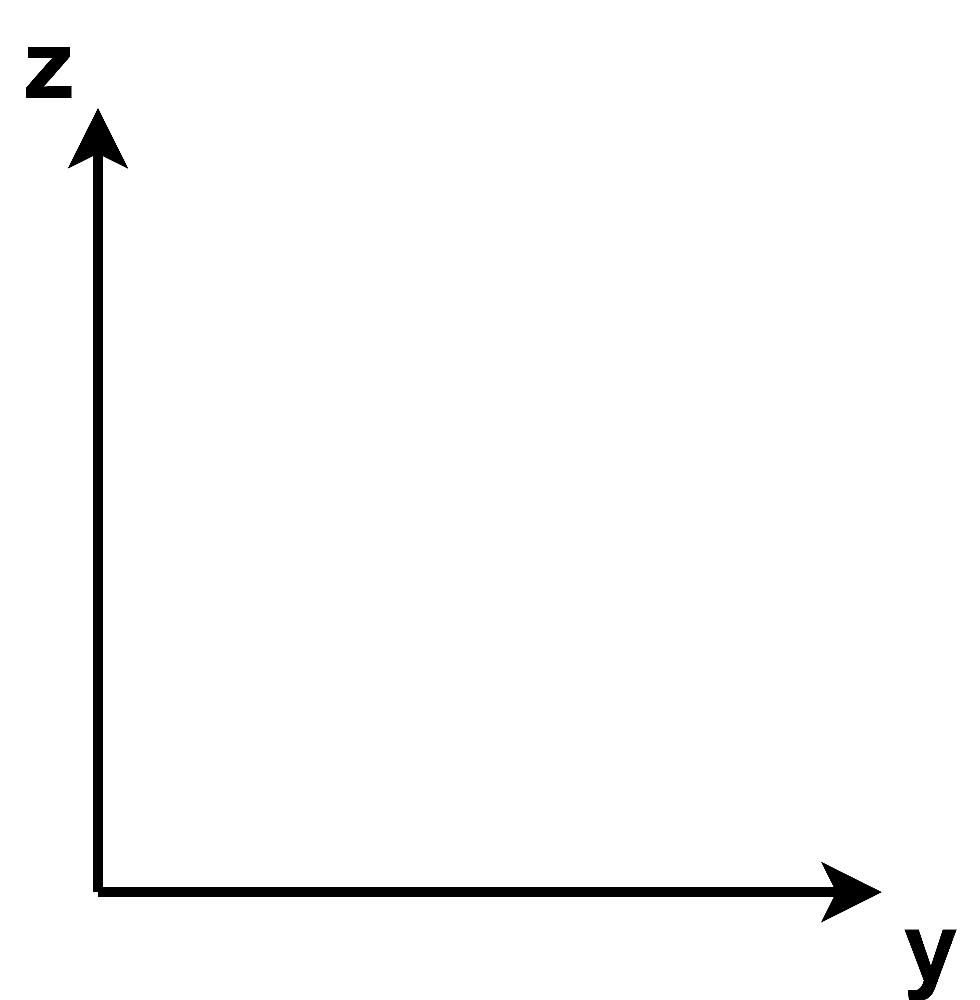

右手系 现在向着纸外的就是x轴

那么 $$\mathcal{Z}\times\mathcal{X}=\mathcal{Y}$$ 绕y轴旋转 就是z x坐标轴形成的平面 逆时针旋转角度 $$\theta$$

  

右手系 现在向着纸外的就是y轴 我们从纸外往里看 y轴的正方向是指着我们的 我们看到了z x这个坐标平面 它要逆时针旋转

但我们通常写坐标的顺序是x y z 写成齐次坐标就是

$$
\begin{pmatrix}
x\\
y\\
z\\
1\\
\end{pmatrix}
$$

那么对于x z坐标形成的平面

  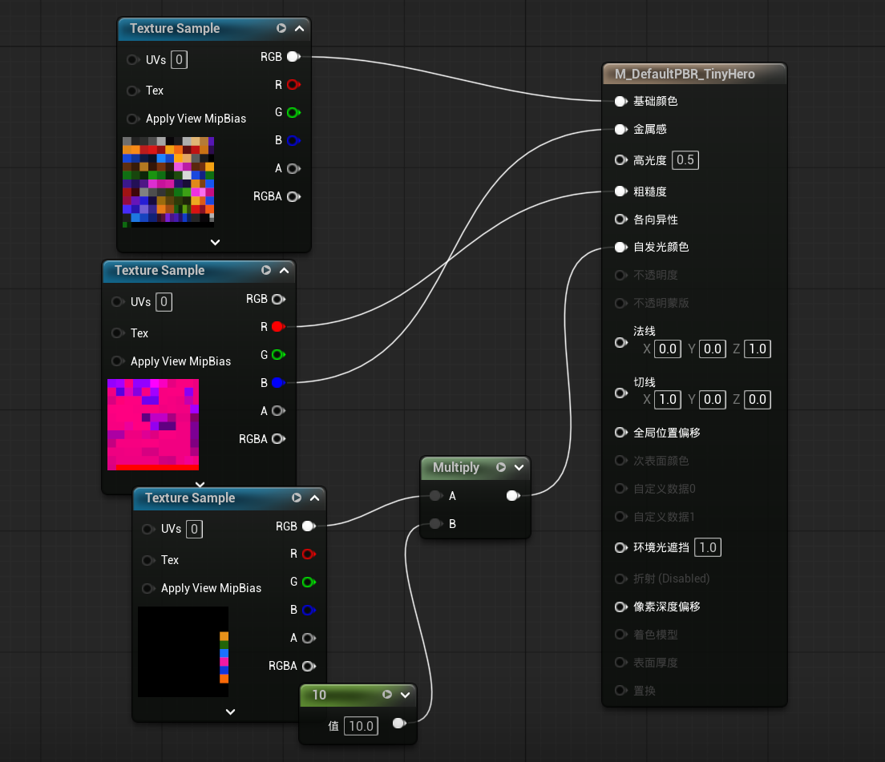

根据右手系 现在向着纸外的是-y 我们要站在纸内里面 往纸外看 才能复现看到我们之前看到的 指着我们的y轴的正方向 也就可以再一次看到正在逆时针旋转着的z x坐标平面 但是对于纸外的人来说 它看到的必然是顺时针旋转的x z坐标平面

  

顺时针旋转了角度 $$\theta$$ 也即逆时针旋转角度 $$-\theta$$
而 $$R_{-\theta}=R_\theta^T$$ 所以那个提取出来的二维旋转矩阵才是发生了转置

***任何一个三维的旋转都可以写成绕x轴 y轴 z轴旋转的组合***

$$
R_{\mathcal{X}\mathcal{Y}\mathcal{Z}}(\alpha,\beta,\gamma)=R_{\mathcal{X}}(\alpha)R_{\mathcal{Y}}(\beta)R_{\mathcal{Z}}(\gamma)
$$

  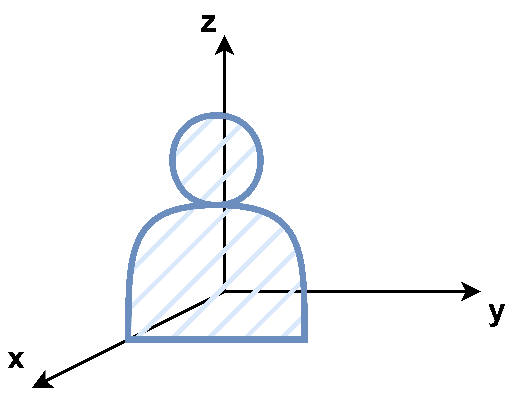

一个人
绕着x轴旋转 roll 滚转
绕着y轴旋转 pitch 俯仰 抬头低头
绕着z轴旋转 yaw 偏航 左右转头

## 万向死锁

利用旋转矩阵 也就是用 欧拉角 $$(\alpha,\beta,\gamma)$$ 作为参数做旋转是非常好的 但是它有一个万向死锁的问题

我们已经知道 任何一个三维的旋转都可以绕3个轴的旋转的组合 默认的顺序就是x y z 如果改变了顺序 得到的结果就是不同的 因为矩阵乘法没有交换律
假如 $$(\alpha,\beta,\gamma)$$ 现在参数值为10 20 40 也就是先绕x轴旋转10度 再绕y轴旋转20度 最后绕z轴旋转40度 然后现在我们把参数修改为10 20 30 一个直觉的理解是 从40度调整回30度 但这是不对的 欧拉角都是独立的 从来不存在直接从10 20 40直接变到10 20 30 而是从0 0 0变换到10 20 30 得到一个新的姿态 最后把之前的10 20 40的姿态替换掉 它不是一个渐进的过程 每一个欧拉角得到的姿态都是独立的 我们眼睛看到的变换似乎是从10 20 40到了10 20 30 所以你以为好像发生了把z轴反过来旋转10度 你以为是相对的 实际上10 20 40和10 20 30都是直接从0 0 0变过来的 直接从初始姿态到结果姿态 是绝对的 独立的

现在我们设置参数 0 90 10 也就是绕x轴不转 之后绕y轴转90度 最后绕z轴转10度 绕y轴转90之后 现在的新的z轴所在的直线 就会和之前的x轴所在的直线重合 那么现在再去做绕z轴转10度 因为欧拉角的旋转永远是对着**当前**的坐标轴一步一步地按顺序去做旋转的 那么绕现在的z轴转 就相当于绕着之前的x轴转 而因为每次做欧拉角旋转 都是从绕x轴开始 所以现在 当绕y设置为90时 做的第一个旋转 绕x的轴 和做第三个旋转 绕z的轴 本质上是同一个轴 是控制的同一个自由度 而**真正的原来的z轴的那个方向的自由度彻底丢了** 是绕y轴旋转90造成的垂直导致的丢失
这就是所谓的万向死锁

为了解决这个万向死锁问题 有一个办法是 把y轴设置成不太可能旋转到90度的轴 比如飞机 就可以把yaw设置成y轴 因为我们很少去做垂直的俯冲和上升
最好是使用其它方式来表达旋转 这就可以引入四元数

# 四元数

## 复数

引入四元数之前 我们需要回顾一下稍早的复数

可以想象 线是有方向的 但这里想说的并不是向量 比如你绕着公园走路 从一个方向走 和另一个方向走 最后都能回到起点 但是这两条路的方向是相反的
所以可以认为 线段也是有方向的 已经知道 $$i^2=-1$$ 那么用 $$i^2$$ 乘以线段a 就会得到方向相反的线段-a 方向就是变化了180度 $$i^2$$ 是i乘了2次 那么i乘了一次就应该是旋转90度

所以如果我们想使用实数 1 和虚数 i 放在一个坐标系 实轴与虚轴的夹角必然是90度 所以复平面不是一般意义上的平面 只有相互垂直的两条线才能构成复平面的坐标系 这正是笛卡尔直角坐标可以表达的平面 而对于一般的平面 只要是相交的两条直线就够了
那么 $$a+ib$$ 这个**数** 就可以用来描述整个二维空间了

既然 $$a+ib$$ 这个数能表达整个二维空间上的任意一个点 那么有没有一个数 可以表达三维空间上的任意一个点？
那就使用四元数 因为三元数表示不了 必须要四个参数才可以

## 四元数 Quaternion

四元数是复数的四维延伸 有3个虚维度 i j k 实数在第4个维度 垂直于全部3个虚数轴

$$
q=a+bi+cj+dk\quad (a,b,c,d\in R)
$$

$$
i^2=j^2=k^2=ijk=-1
$$

i j k是3个虚轴 ijk相乘为-1 既然ijk=-1 那么ij相乘是什么呢 ijkk=-k 而kk=-1 则ij=k 其实3个轴之间都是这样 ij=k jk=i ki=j 这个ijk的运算规则是符合右手法则的

假如现在我们只知道一维的数轴和实数 对于复数 只知道它在代数上是 $$i^2=-1$$
现在可以用分配律来解决复数的乘法 (2+3i)(1-1i)=(2+3)+(3-2)i 只需要分配律 但是我们不能知道它的几何意义

  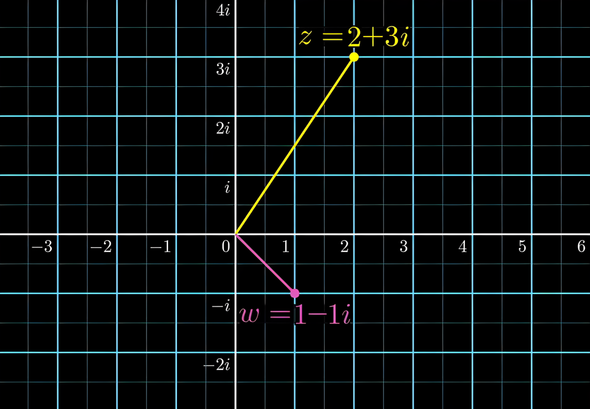

现在我们知道了上图的二维的坐标系 横轴是实轴 纵轴是虚轴 这个东西叫做复平面

$$
z\cdot w
$$

做乘法 可以把z当成一个函数 对w施加某种旋转和拉伸
假如现在我们把坐标轴上的(1,0)这个点 也就是从原点到(1,0)的连线 1+0i 旋转拉伸到和z重合 也就是变成了2+3i 这也就是2+3i=(2+3i)(1+0i)=z(1+0i) 实际上就是用z左乘了1+0i 那么 对于w经历同样的旋转拉伸变换 不就是相当于用z左乘了w吗 实际上这时候复数就相当于一种**作用**

拉伸其实就是缩放 和一维坐标轴上的乘法没什么区别 对于只能懂一维的人也能够理解
但是旋转是什么？
想象复平面上的单位圆 所有单位圆上的点 到原点的距离是1 而1乘任何数都是会得到这个数 那么乘上这些点就对应着纯粹的旋转
但是旋转很明显是一个二维的东西 要如何向只理解一维的人描述旋转呢？

旋转只有一个自由度 一个代表角度的数字 可以唯一地确定一个旋转 所以理论上 可以把所有二维旋转的集合 都化作一个数值 映射到一维的数轴上
使用的方法叫做 球极投影 能将圆映射到直线上 或者将球映射到平面上 甚至将四维超球映射到三维空间

  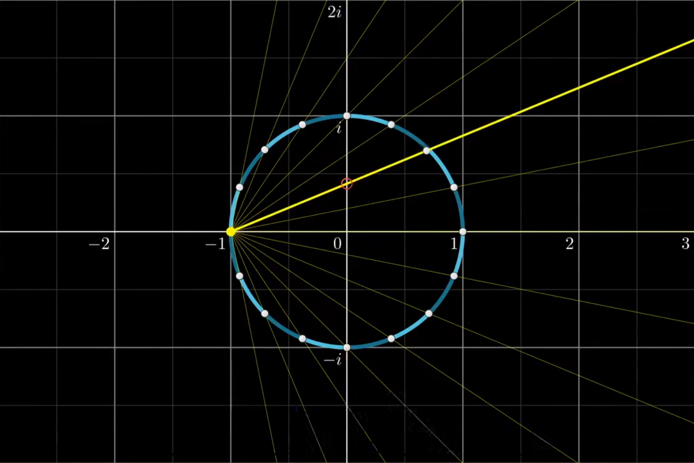

对于单位圆上的每一个点 从-1出发 作直线穿过这点 这条直线和纵轴与圆都有交点 取这条直线与纵轴的交点 这就是圆上的那个交点被投影的地方 那么圆就可以被一一映射到纵轴这条直线上 这个圆最后会变成无限长的直线 理论上(-1,0)这一点是没有映射的 但是可以认为(-1,0)是被映射到了无穷远处的点上
现在化为一维的这条直线 也就是和目前的虚轴重合的这条直线 全都是单位圆上的点 而对于虚平面上单位圆之外的那么多点 目前在一维上是看不到的
但因为我们考虑的是纯旋转 所以只需要理解单位圆就行了

$$i\cdot w$$ 用i乘以任意复数w 效果就是把w逆时针旋转90度

现在再想象如何对一个只能理解二维的人 解释三维球体的旋转
现在把ij轴当作一个平面 然后垂直于这个平面的是实轴 就类似于笛卡尔坐标系的z轴 同时i轴放在x轴上 j轴放在y轴上

  

单位球 由所有到原点距离为1的数组成 取球上任意一点 与实轴为-1的那一点 的连线 与ij所在的平面相交 就会得到一个投影点

  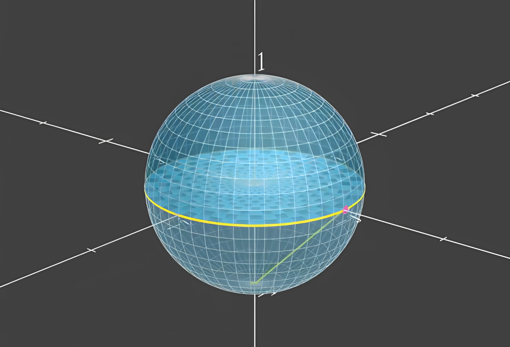

那么稍微观察一下就会发现 对于实轴为0的那些球上的点构成的单位圆 它的投影点就是它本身 而对于它上方的实部为正的那些点 也就是上半球 它们都会投影到单位圆内部 而对于实部为负的下半球 会扩充为单位圆外部的整个平面 实部为-1的那一点 在这种映射之下仍然是没有投影点 但是可以认为它是投影到了无穷远处 而且是整个二维平面上四面八方的无穷远都算
可以理解为整个三维球壳拍扁了 上半部分到单位圆内了 下半部分扩充到了其余的整个平面 仅仅是一个单位球壳 拍扁了就能占据一整个平面

对于任何一个通过实轴为-1的那一点 的圆 不一定是单位圆 而是经过这个点的任何一个圆 投影到平面上 都会是一个直线 当然某种意义上来说 直线只是一个过无穷远处一点的圆 如果这个圆是以原点为圆心的 那它就会投影为一条过原点的直线

  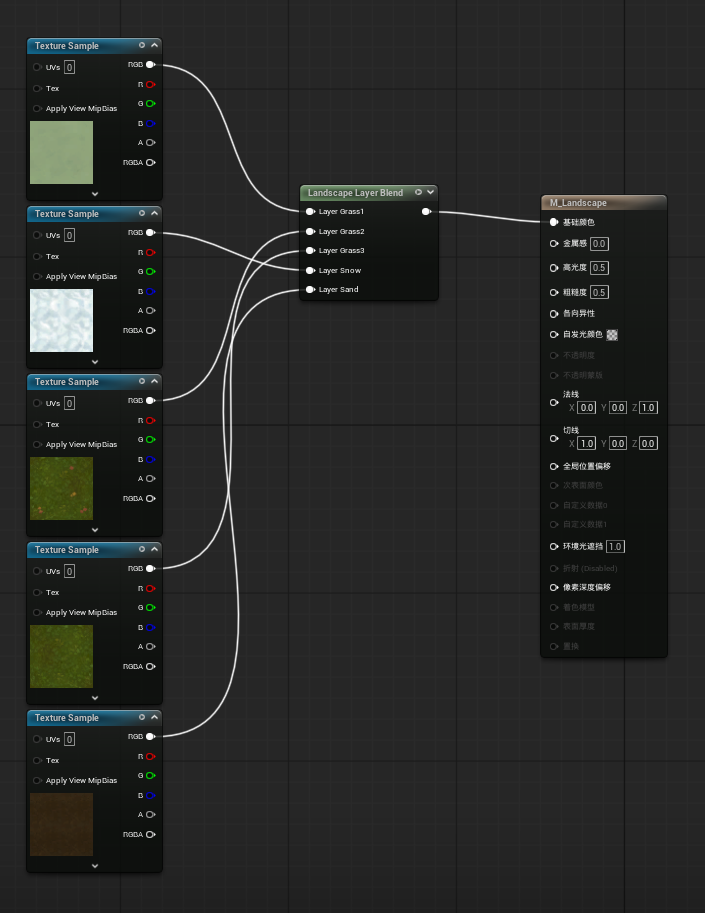

对于只能理解二维的人而言 这个球绕着j轴旋转 在二维上就会显现为 下图中黄色的单位圆逐渐变成纵轴的直线 也就是和现在图上红色直线的位置相同 而红色的直线逐渐变成了和现在图上黄色的圆位置相同的红色单位圆 但实际上在三维的我们知道 这里只不过是发生了一个刚体的旋转 并没有发生任何拉伸的操作 如果是绕i轴旋转而是类似 如果是绕着实轴旋转 就是和在二维上做旋转一模一样 这是我们很熟悉的

  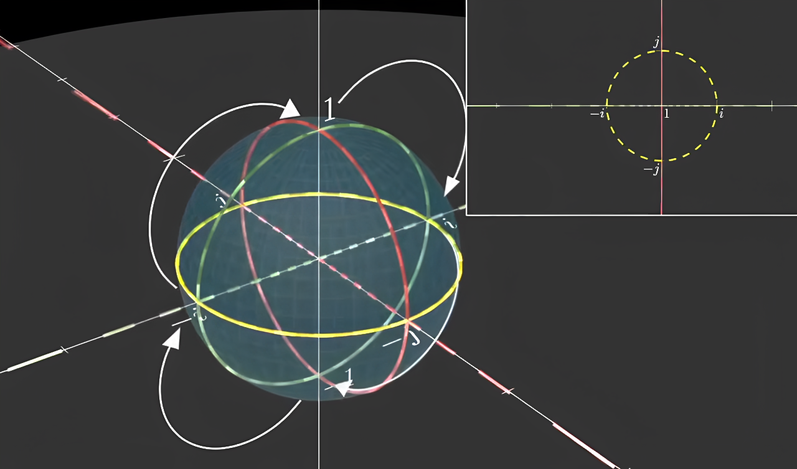

现在轮到我们作为三维的人 来理解四维了 q=a+bi+cj+dk

(a+bi+cj+dk)+(w+xi+yj+zk) = (a+w)+(b+x)i+(c+y)j+(d+z)k
(a+bi+cj+dk)(w+xi+yj+zk) = (aw-bx-cy-dz)+(ax+bw)i+(ay+cw)j+(az+wd)k+(cz-dy)i+(dx-bz)j+(by-cx)k

太长了 需要发明一些新的记录表示方法
记 q=a+bi+cj+dk 为 q=r+v 实部r 称为scalar标量 虚部v=bi+cj+dk 称为vector矢量

$$
q^{-1}=a-bi-cj-dk
$$

假设四元数表示旋转的话 它的逆就表示相反的旋转

$$
q_1+q_2=(r_1,v_1)+(r_2,v_2)=(r_1+r_2,v_1+v_2)
$$

$$
q_1q_2=(r_1,v_1)(r_2,v_2)=(r_1r_2-v_1\cdot v_2,\ r_1v_2+r_2v_1+v_1\times v_2)
$$

但其实 vector 我们一直理解都是有大小也有方向的量 但它最初的含义 就只是满足这样的加法和乘法的量 可以有大小有方向 也可以没有 只要满足这样的运算 就是vector

$$
q=a+bi+cj+dk
$$

现在继续来理解四元数乘法的几何意义 复数的乘法就是包含缩放和旋转
四元数也是有模 就是4个分量平方和的平方根 那么如果除以这个模 就会变成单位四元数 现在缩放已经完成了 我们就来研究单位四元数的旋转 所以我们自然还是研究那个单位四维超球壳 然后它的球极投影就是到达了三维空间

  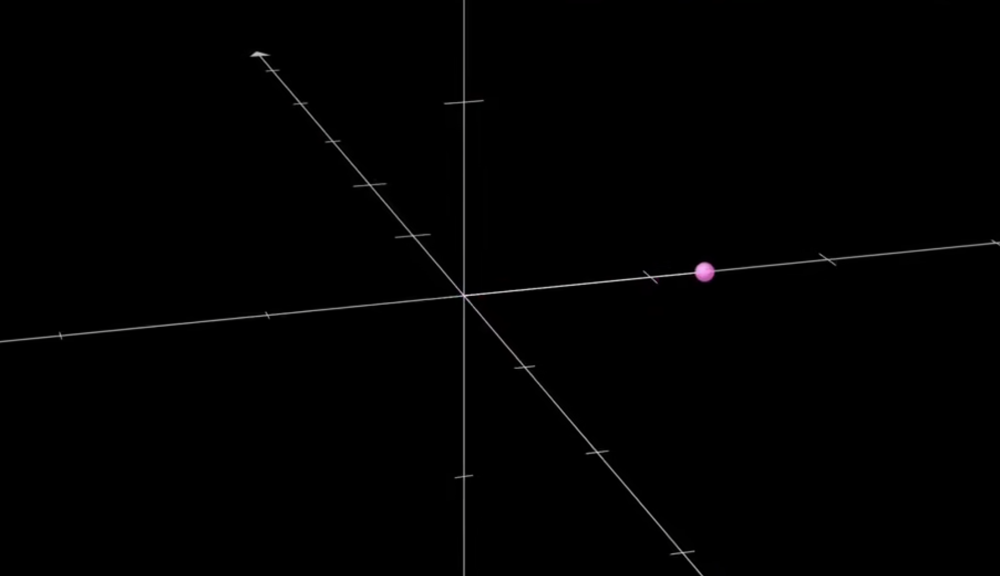

对于上图的这个单位四元数 这个点 我们不知道它是从四维中的哪个方位投影到三维来的 你唯一所知道的就是这里有个点 只知道这个投影的结果 这个点是 四维的实部为-1的那个点 这个点的其它3个虚部都为0 与四维上的另一个点连线 并且与三维相交得到的 它是一条线扎过来的 却只让我们看到了一个点 仅仅一个点 但是其实如果是三维的线 我们在三维空间里去看 我们绝对是可以看到整条线的 但是四维就是这样虚有其表地玩弄着我们 我们只能看到一个点
那么实际上就类似于 二维上的单位圆可以球极投影成为一维上的整条直线 三维上的单位球壳可以球极投影拍扁成二维上的整个平面 我们所身处的整个广阔无垠的三维空间 其实都是四维超球上的仅仅一个单位球壳拍扁得到的 而对于其它所有的单位四元数 包括四维的原点 我们都是看不到的 我们看到的就仅仅是一个四维单位超球壳的球极投影

回想一下二维平面上的单位圆 球极投影成一条直线的过程 对于实部为0 虚轴上为i和-i的这两个点 是怎么投影都没变化的 我们可以看到这个点本身 而对于那些实部为正的线段上的点 就投影到了(-i,i)的这部分虚轴上 实部为负的那部分线段 就投影到了整个直线的其它部分上
再回想一下三维空间中的单位球壳 球极投影成一个二维平面的过程 实部为0的那个单位圆 也是投影了没有发生变化 对于实部为正的那个上半球 就投影到了单位圆内部的二维平面上 下半球投影到了单位圆外部的整个平面的其它部分上

那么 四维超球在做球极投影到三维空间的时候 也必定会有一个投影了也没有发生变化的三维单位球壳 这个三维单位球壳上的点 是所有的实部为0的单位四元数 投影是不变的  而在四维单位超球上 以这个三维单位球壳为分界 对于实部为正的四维单位超球上的点 就会坍缩在这个三维的单位球内部 而对于实部为负的点 就会充盈弥漫至三维单位球之外的其它空间 这两部分共同组成了整个三维空间 这就是这个四维单位超球壳在三维空间上的球极投影

那个三维单位球上面的所有点 与原点的连线 就都是单位向量 因为实部为0 是单位球所以模为1 当然其实四维单位超球壳上的所有点都是单位向量 它的实部就是在-1与1之间 实部为-1的点是有且仅有一个 因为实部为-1 为了保证模为1 就必然要求虚部都为0 这个实部为-1的点 球极投影到三维空间 就是投影到了无穷远处 沿着任意方向走 最终都能找到它 和二维/三维平面上的无穷远处 都是同样的意思

我们所看到的经过三维原点的任意一条直线 其实都是来自于经过实部为-1的那一点上的某个圆投影得来的 注意这里是某个二维的圆 而不是三维的球 当然在四维超球上 某个二维的圆必定是来自于某个三维的球的 而这个三维的球也必然来自于这个四维超球
在三位中 经过原点的直线 它的解析式 或者说它的唯一性 必定是由3个参数才能确定 而恰巧 它的来源是那个二维的圆 这个二维的圆也是由3个参数确定的 思维的超球、三维的球、二维的圆 而这个直线经过原点 同样地 这个二维的圆也经过实部为-1的那一点 所以其实都是由4个参数确定的

还记得吗 之前在三维单位球壳上 经过实部为-1的某个圆 它会投影为二维上的直线 如果这个圆的圆心是三维的原点 那么这个直线也会经过原点 那么其实 对于四维空间单位超球壳上的 经过实部为-1的某个球 它会投影为三维空间中的整个平面 如果这个球心是四维的原点 那么这个平面也会经过原点

类似于二维上看似奇妙的旋转 也不过是来自于三维中的一个刚体运动 那么三维中的旋转 也都可以解释为是来自于四维的一个刚体运动 那么我们就可以用四元数来表达三维中的旋转

首先回顾一下二维的纯旋转 它是用单位复数左乘来做的

  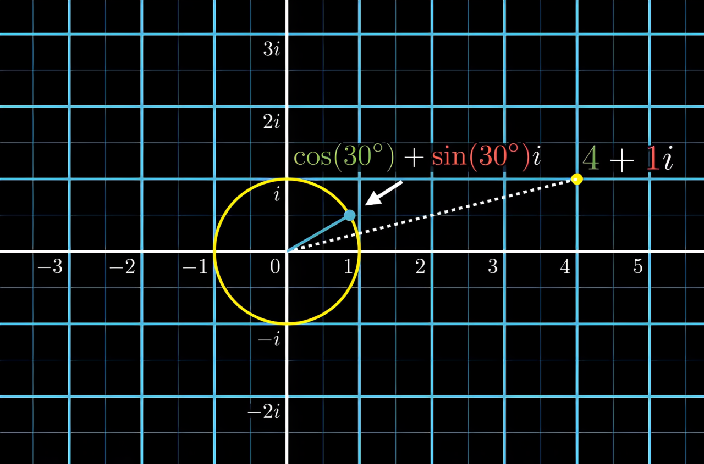

cos30°+sin30°i 是纯旋转 单位复数 用它左乘复数4+1i
(cos30°+sin30°i)(4+1i) 就是相当于将4+1i逆时针旋转了30度后得到的新复数 也可以相当于一个坐标

这样 使用两个复数相乘 就可以实现两个旋转的叠加 之后再左乘要被作用的那个点 就可以完成旋转

用四元数来做三维旋转也是类似的

  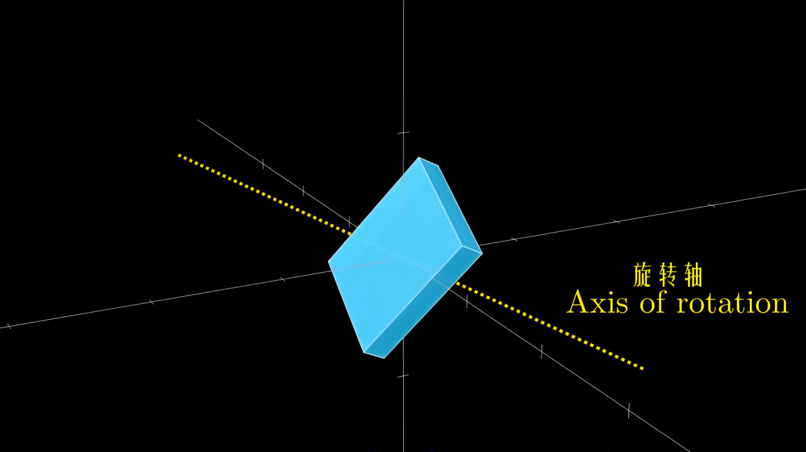

把旋转轴的方向写成一个三维单位向量 其实就是四元数但实部为0 比如0.67i-0.67j-0.33k
然后要把某一个点p=1.00i+0.25jj+1.20k 逆时针旋转40°
则q=( cos(40°/2) + sin(40°/2)(0.67i-0.67j-0.33k) ) 仍然是q=cos+sin×虚部 区别是这里变成了1/2角 稍后解释
那么旋转之后的结果就是

$$
\begin{aligned}
q\cdot p\cdot q^{-1} & = (\cos\tfrac{\theta}{2} + \sin\tfrac{\theta}{2}\ x_0i + \sin\tfrac{\theta}{2}\ y_0j + \sin\tfrac{\theta}{2}\ z_0k) \\
& \quad (x_1i + y_1j + z_1k) \\
& \quad (\cos\tfrac{\theta}{2} - \sin\tfrac{\theta}{2}\ x_0i - \sin\tfrac{\theta}{2}\ y_0j - \sin\tfrac{\theta}{2}\ z_0k)
\end{aligned}
$$

其中 $$\theta$$ 是逆时针旋转的角度
$$(x_0,y_0,z_0)$$ 是旋转轴的单位向量
$$(x_1,y_1,z_1)$$ 是要进行旋转的点

也就是 `( cos(40°/2) + sin(40°/2)(0.67i-0.67j-0.33k) ) ( 1.00i+0.25jj+1.20k ) ( cos(40°/2) + sin(40°/2)(0.67i-0.67j-0.33k) )`

对于该公式 此处不进行证明
p是要进行旋转的点 把三维空间中的点写成实部为0的四元数bi+cj+dk
q就是完全类似于施加作用的那个左乘的四元数 但是因为一些缩放和旋转的原因 就要使用一个左乘一个逆右乘 并且把角度做成1/2
最后得到的结果 也是一个实部为0的四元数 那就是旋转后的三维空间中的点
所以其实左乘一个右乘一个 有一部分原因就是想既能做旋转 又能将结果四元数的实部保持为0

于是 现在我们可以做到 绕着空间中任何一个轴进行旋转

如果想连续做两个旋转 就是

$$
(q_1q_2)p(q_1q_2)^{-1}
$$

如果现在要想从方向u转到方向v怎么做？
首先u和v这两个向量 必然可以定义一个平面 而它们的叉乘 u×v 就会得到这个平面的法向 记w=u×v 方向是右手定则得到的
那么用来做旋转的四元数就是

$$
q=(u\cdot v+\sqrt{(w\cdot w)+(u\cdot v)^2},\ w)
$$

意思就是 实部为 $$u\cdot v+\sqrt{(w\cdot w)+(u\cdot v)^2}$$ 虚部为w
在此不进行公式的推导
