# 目录
- [vector](#vector)
  - [构造](#构造)
  - [基于复制的构造](#基于复制的构造)
  - [copyFrom 区间复制](#copyfrom-区间复制)
  - [重载operator=](#重载operator)
  - [析构](#析构)
  - [expand 扩容](#expand-扩容)
  - [重载operator[]](#重载operator)
  - [insert 插入](#insert-插入)
  - [remove 删除](#remove-删除)
  - [find 无序查找](#find-无序查找)
  - [deduplicate 无序去重](#deduplicate-无序去重)
  - [traverse 遍历](#traverse-遍历)
  - [disordered 逆序对个数](#disordered-逆序对个数)
  - [uniquify 有序去重](#uniquify-有序去重)
  - [search 有序查找](#search-有序查找)
  - [binSearch 二分查找](#binsearch-二分查找)
  - [bubbleSort 起泡排序](#bubblesort-起泡排序)
  - [mergeSort 归并排序](#mergesort-归并排序)
- [list](#list)
  - [构造](#构造)
  - [insertBefore 前插入](#insertbefore-前插入)
  - [copyNodes 基于复制的构造](#copynodes-基于复制的构造)
  - [remove 删除](#remove-删除)
  - [clear 析构](#clear-析构)
  - [find 无序查找](#find-无序查找)
  - [deduplicate 无序去重](#deduplicate-无序去重)
  - [uniquify 有序唯一化](#uniquify-有序唯一化)
  - [search 有序查找](#search-有序查找)
  - [selectionSort 选择排序](#selectionsort-选择排序)
  - [insertSort 插入排序](#insertsort-插入排序)
- [stack queue](#stack-queue)
  - [逆序输出：进制转换](#逆序输出进制转换)
  - [递归嵌套：括号匹配](#递归嵌套括号匹配)
  - [栈混洗](#栈混洗)
  - [中缀表达式](#中缀表达式)

------


# vector

**vector模板类**


```c++
// vector.h
#pragma once
#include <functional>
// 用于函数指针

using Rank = unsigned int; //秩
#define DEFAULT_CAPACITY  3 //默认的初始容量（实际应用中可设置为更大）

template <typename T> class Vector { //向量模板类
protected:
    Rank _size; Rank _capacity;  T* _elem; //规模、容量、数据区
    void copyFrom(T const* A, Rank lo, Rank hi); //复制数组区间A[lo, hi)
    void expand(); //空间不足时扩容
    void shrink(); //装填因子过小时压缩
    bool bubble(Rank lo, Rank hi); //扫描交换
    void bubbleSort(Rank lo, Rank hi); //起泡排序算法
    Rank maxItem(Rank lo, Rank hi); //选取最大元素
    void selectionSort(Rank lo, Rank hi); //选择排序算法
    void merge(Rank lo, Rank mi, Rank hi); //归并算法
    void mergeSort(Rank lo, Rank hi); //归并排序算法
    void heapSort(Rank lo, Rank hi); //堆排序（稍后结合完全堆讲解）
    Rank partition(Rank lo, Rank hi); //轴点构造算法
    void quickSort(Rank lo, Rank hi); //快速排序算法
    void shellSort(Rank lo, Rank hi); //希尔排序算法
public:
    // 构造方法
    Vector(Rank c = DEFAULT_CAPACITY) //容量为c的空向量
    {
        _elem = new T[_capacity = c]; _size = 0;
    }
    Vector(Rank c, Rank s, T v) //容量为c、规模为s、所有元素初始为v；s<=c
    {
        _elem = new T[_capacity = c]; for (_size = 0; _size < s; _elem[_size++] = v);
    }
    Vector(T const* A, Rank n) { copyFrom(A, 0, n); } //数组整体复制
    Vector(T const* A, Rank lo, Rank hi) { copyFrom(A, lo, hi); } //区间
    Vector(Vector<T> const& V) { copyFrom(V._elem, 0, V._size); } //向量整体复制
    Vector(Vector<T> const& V, Rank lo, Rank hi) { copyFrom(V._elem, lo, hi); } //区间
    // 析构方法
    ~Vector() { delete[] _elem; } //释放内部空间
    // 只读访问接口
    Rank size() const { return _size; } //规模
    bool empty() const { return !_size; } //判空
    Rank find(T const& e) const { return find(e, 0, _size); } //无序向量整体查找
    Rank find(T const& e, Rank lo, Rank hi) const; //无序向量区间查找
    Rank select(Rank k) { return quickSelect(_elem, _size, k); } //从无序向量中找到第k大的元素
    Rank search(T const& e) const //有序向量整体查找
    {
        return (0 >= _size) ? -1 : search(e, 0, _size);
    }
    Rank search(T const& e, Rank lo, Rank hi) const; //有序向量区间查找
    // 可写访问接口
    T& operator[] (Rank r); //重载下标操作符，可以类似于数组形式引用各元素
    const T& operator[] (Rank r) const; //仅限于做右值的重载版本
    Vector<T>& operator= (Vector<T> const&); //重载赋值操作符，以便直接克隆向量
    T remove(Rank r); //删除秩为r的元素
    Rank remove(Rank lo, Rank hi); //删除秩在区间[lo, hi)之内的元素
    Rank insert(Rank r, T const& e); //插入元素
    Rank insert(T const& e) { return insert(_size, e); } //默认作为末元素插入
    void sort(Rank lo, Rank hi); //对[lo, hi)排序
    void sort() { sort(0, _size); } //整体排序
    void unsort(Rank lo, Rank hi); //对[lo, hi)置乱
    void unsort() { unsort(0, _size); } //整体置乱
    Rank disordered(); // 逆序对个数
    Rank deduplicate(); //无序去重
    Rank uniquify(); //有序去重
    // 遍历
    void traverse(std::function<void(T&)> visit); //遍历（使用函数指针，只读或局部性修改）
    template <typename VST> void traverse(VST&); //遍历（使用函数对象，可全局性修改）
}; //Vector
```

真正的Vevtor是封装起来的 用户只能使用接口

可以通过模板参数T 指定向量元素的类型 比如`Vector<int>` 而`Vector<Vector<char>>`就是存放char的二维数组 第1维和第2维的大小都不固定 `Vector<int> a[maxn]`二维数组 第1维(行)的大小是固定的maxn 第2维(列)的大小不固定

## 构造

`using Rank = unsigned int;`

头文件Vector模板类中  `Rank _size; Rank _capacity;  T* _elem;` 是维护了一个元素为T类型的protected数组`_elem[]` 虽然它存储的是指针

向量中秩为r的元素 对应于内部数组中的`_elem[r]` 其物理地址为`_elem+r` 指针算数已经隐含了其实是`_elem+r*sizeof(T)`字节 但不允许这样写 只能写`_elem+r` 编译器会自动处理

```c++
Vector ( Rank c = DEFAULT_CAPACITY ) //容量为c的空向量
{
    _elem = new T[_capacity = c];
    _size = 0;
}
```

```c++
Vector ( Rank c, Rank s, T v ) //容量为c、规模为s、所有元素初始为v；s<=c
{
    _elem = new T[_capacity = c];
    for ( _size = 0; _size < s; _elem[_size++] = v );
}
```

## 基于复制的构造

```c++
Vector ( T const* A, Rank n ) //数组整体复制
{
    copyFrom ( A, 0, n );
}
```

`const T* a`或者`T const* a`
表示a是一个指向const T类型数据的指针 指针a本身不是常量 因此可以重新指向其他地址 但`*a`是常量 无法对`*a`进行修改
实际上这个指针就是数组了
使用常量 使得这个方法既可以接收左值 也可以接收右值

```c++
Vector ( T const* A, Rank lo, Rank hi ) //数组区间复制
{
    copyFrom ( A, lo, hi );
}
```

```c++
Vector ( Vector<T> const& V )  //向量整体复制
{
    copyFrom ( V._elem, 0, V._size );
}
```

```c++
Vector ( Vector<T> const& V, Rank lo, Rank hi ) //向量区间复制
{
    copyFrom ( V._elem, lo, hi );
}
```

copyFrom重载了很多形式 所以可以从数组复制 也可以从向量复制

## copyFrom 区间复制

```c++
// vector_copyFrom.h
#pragma once
#include "vector.h"

template <typename T>
void Vector<T>::copyFrom(T const* A, Rank lo, Rank hi)
{
    _elem = new T[_capacity = 2 * (hi - lo)]; // 开辟了两倍的空间 接下来很长一段时间内 不必因为扩容而打断计算过程
    _size = 0; // 先将规模置为0
    while (lo < hi)
        _elem[size++] = A[lo++];
}
```

描述区间往往是用左闭右开 `[lo,hi)`
所以现在就是将`A[lo,hi)`中的元素逐一复制到`_elem[0,hi-lo)`

## 重载operator=

向量之间赋值 如果T不是基本数据类型 就需要重载operator=

```c++
// vector_operator_assignment.h
#pragma once
#include "vector.h"

template <typename T>
Vector<T>& Vector<T>::operator= (Vector<T> const& V)
{
    if (_elem) delete[] _elem; // 释放_elem原有内容
    copyFrom(V._elem, 0, V.size());
    return *this;
}
```

## 析构

```c++
~Vector()
{
    delete [] _elem;
}
```

## expand 扩容


前面介绍的向量 并不具备可扩充的性能 因为它用的是静态空间管理 内部只不过是开辟了数组 占用了一段连续的物理空间

`_size` 元素的总数 占用的逻辑空间数
`_capacity` 占用的物理空间数

静态空间管理策略 `_capacity`是固定的

上溢 overflow `_elem[]`不足以存放所有元素
下溢 underflow `_elem[]`中的元素太少

容量已满的时候 就申请一块新内存 开辟一块新的空间 把旧的内存复制到新内存 并将旧内存所在的空间释放

```c++
// vector_expand.h
#pragma once
#include "vector.h"

template <typename T>
void Vector<T>::expand()
{
    if (_size < _capacity)
        return; // 容量未满的时候无需扩容 否则扩容
    _capacity = max(_capacity, DEFAULT_CAPACITY); // 不低于最小容量

    T* oldElem = _elem;
    _elem = new T[_capacity <<= 1]; // 移位 新开辟一块内粗 容量加倍

    for (int i = 0; i < _size; i++)
        _elem[i] = oldElem[i]; // 逐一复制原来的元素 要求T为基本类型 或者已经重载操作符=
    delete[] oldElem; // 释放原空间
}
```

## 重载operator[]

循秩访问

```c++
// vector_operator_bracket
#pragma once
#include "vector.h"

template <typename T>
T& Vector<T>::operator[](Rank r)
{
    return _elem[r];
}
```

此后 对外的`V[r]`就对应于内部的`V._elem[r]`

## insert 插入

所有后缀元素都右移一个单元 从而空出一个单元 插入

```c++
#pragma once
#include "vector.h"

template <typename T>
Rank Vector<T>::insert(Rank r, T const& e)
{
    expand(); // 如有必要 扩容
    for (int i = _size; i > r; i--) // 自后向前
        _elem[i] = _elem[i - 1]; // 后继元素顺次后移一个单元

    _elem[r] = e; // 置入新元素
    _size++; // 更新容量
    return r; // 返回秩
}
```

## remove 删除

区间删除 将`[lo,hi)`区间中元素全删 并将后继全部前移

```c++
#pragma once
#include "vector.h"

// 区间删除
template <typename T>
Rank Vector<T>::remove(Rank lo, Rank hi)
{
    if (lo == hi) return 0; // 为了效率单独处理退化情况
    while (hi < _size)
        _elem[lo++] = _elem[hi++]; // 自前向后 [lo,_size)顺次前移hi-lo

    _size = lo; // 更新规模
    shrink(); // 如有必要 缩容
}

// 单元素删除 可以看作区间删除的特例
template <typename T>
T Vector<T>::remove(Rank r)
{
    T e = _elem[r]; // 备份被删除元素
    remove(r, r + 1); // 调用区间删除算法
    return e;
}
```

是否可以通过反复调用单元素删除来实现区间删除？ 效率不高 删一个单元素 后继就要移动一次 对于每个元素都要这样做一次

## find 无序查找

无序向量 T为可判等的基本类型 或者已经重载操作符`==`或`!=`
有序向量 T为可比较也可以判等的基本类型 或者已经重载操作符`<`或`>`

从hi出发 逆向地找 逐一地取出向量中的各个元素 与目标元素比对 不相等就忽略 如果到最后试图跃过lo 查找失败

```c++
// vector_find.h
#pragma once
#include "vector.h"

template <typename T>
Rank Vector<T>::find(T const& e, Rank lo, Rank hi) const
{
    while ((lo < hi--) && (e != _elem[hi]));

    return hi;
}
```

## deduplicate 无序去重

每次遇到新元素 都在它的前驱中查找 `find(x)` 如果找到相同的 就剔除 没找到就保留 再去考察下一个元素 也就是直接后继

```c++
// vector_deduplicate.h
#pragma once
#include "vector.h"

template <typename T>
Rank Vector<T>::deduplicate()
{
    int oldSize = _size;
    Rank i = 1; // 从_elem[1]开始 而不是_elem[0]
    while (i < _size) // 自前向后逐一遍历
        find(_elem[i], 0, i) ? i++ : remove(i);
        // _elem[i]是否和前缀[0,i)的元素有雷同？ 若无雷同 考察后继 若有雷同 删除_elem[i]这一项
        // 但做完remove(i)之后 现在的_elem[i]就是原来的_elem[i]的后继 不再需要i++

    return oldSize - _size; // 向量规模变化量 即删除元素总数
}
```

## traverse 遍历

统一对各元素分别实施visit操作 于是就有两种将visit操作传递到vector内部的方式

```c++
#pragma once
#include "vector.h"
#include <functional>

template <typename T>
void Vector<T>::traverse(std::function<void(T&)> visit) // 使用函数指针 只读或局部性修改
// std::function<void(T&)> func 就是接收T&参数的 返回void类型的 名为func的 函数指针
// 和void(*func)(T&)差不多
{
    for (int i = 0; i < _size; i++)
        visit(_elem[i]);
}

template <typename T> template <typename VST>
void Vector<T>::traverse(VST& visit) // 使用函数对象 全局性修改
{
    for (int i = 0; i < _size; i++)
        visit(_elem[i]);
}
```

对于函数对象 就可以这样写

```c++
template <typename T>
struct Increase
{
    void operator()(T& e)
    {
        e++;
    }
}

template <typename T>
void increase(Vector<T>& v)
{
    v.traverse(Increase<T>());
}
```

## disordered 逆序对个数

有序序列中任意一对相邻元素顺序
无序序列中总有一堆相邻元素逆序

相邻逆序对的数目 可以用来度量向量的逆序程度

```c++
// vector_disordered.h
#pragma once
#include "vector.h"

template <typename T>
Rank Vector<T>::disordered()
{
    int n = 0; // 计数器
    for (int i = 1; i < _size; i++) // 遍历各对相邻元素
        n += (_elem[i - 1] > _elem[i]); // 逆序就计数
    return n; // n=0 当且仅当向量有序
}
```

如果只需要判断是否有序 在首次遇到逆序对之后 就可以立即终止

把无序转化成有序 可以使后续操作更简单

## uniquify 有序去重

有序向量中重复元素必定紧挨着构成一个区间 每个区间只要保留单个元素

```c++
// vector_uniquify.h
#pragma once
#include "vector.h"

template <typename T>
Rank Vector<T>::uniquify()  // 单元素删除 低效版本
{
    int oldSize = _size;
    int i = 0;
    while (i < _size - 1)
        (_elem[i] == _elem[i + 1]) ? remove(i + 1) : i++;
    return oldSize - _size;
}
```

对比一下无序的deduplicate是这样的

```c++
Rank i = 1;
while (i < _size)
    find(_elem[i], 0, i) ? i++ : remove(i);
```

所以现在的uniquify就是 拿着一个 前驱里肯定没有任何重复元素 的元素 因为是有序的 所以只有首次出现的那个元素可以被保留 它之后的所有重复元素 都要被删除 所以i要从0开始

这个方法较为低效 因为重复的元素因为move操作 多次前移 如果直接将重复元素区间删除 会更高效

```c++
// vector_uniquify.h
#pragma once
#include "vector.h"

template <typename T>
Rank Vector<T>::uniquify() // 区间删除 高效版本
{
    Rank i = 0, j = 0;
    while (++j < _size)
    {
        if (_elem[i] != _elem[j])
            _elem[++i] = _elem[j];
    }
    _size = ++i;
    return j - i; // 向量规模变化量
}
```

i是重复元素首次出现的位置 j是向后扫描 如果j扫描到不再是重复元素了 而是新的元素首次出现了 i就+1 并直接把j扫描到的那个新元素复制到现在的这个`_elem[i]` 最后直接缩减向量的规模 也就是重新设置`_size` 不涉及任何显式的移动与删除操作

## search 有序查找

```c++
// vector_search.h
template <typename T>
Rank Vector<T>::search(T const& e, Rank lo, Rank hi) const
{
    return (rand() % 2) ?
    binSearch_C(_elem, e, lo, hi) : fibSearch(_elem, e, lo, hi);
    // 各有50%的概率选用二分查找C 或者 Fibonacci查找(略)
    // 为什么是二分查找版本C 原因后面讲
}
```

search接口至少应该使有序向量自身的维护变得非常便利 让有序性得以延续

比如`V.insert(1+V.search(e), e)` 通过search寻找一个位置 然后插入 使得有序向量还是一个有序向量 即使查找失败 也要给新元素一个适当的插入位置 若有重复元素 也要按插入顺序有所排列 新插入的元素在最前或最后

约定 search接口的返回值 总是不大于目标e的最后一个元素的秩 如果有多个命中元素 返回秩最大的那个秩

若查找失败
`-∞ < e < V[lo]` 返回哨兵lo-1 这样后面插入时 就可以把元素放在lo的位置上
`V[hi-1] < e < +∞` 返回hi-1 这样后面插入时 就可以把元素放在hi的位置上


如果有重复元素e 不大于e的最后一个元素 自然是这些元素的右端点 再在它的后面才插入e 正好符合约定

## binSearch 二分查找

**版本A**

减而治之 以任一元素`x = S[mi]`为界 分成三部分 x称为轴点 总是取作中点


经过至多两次比较 或者命中或者问题规模变成一半
若e=x 命中 直接返回
若e<x 或e>x 进入子区间递归

```c++
// vector_binSearch_A.h
#pragma once
#include "vector.h"

template <typename T>
static Rank binSearch_A(T const& e, Rank lo, Rank hi)
{
    while (lo < hi)
    {
        Rank mi = (lo + hi) >> 1; // 取出lo和hi的中点
        if      (e < A[mi]) hi = mi; // 深入[lo,mi)
        else if (A[mi] < e) lo = mi + 1; // 深入(mi,hi) 都是写的<号 建议总是写<号
        else                return mi; // 那实际上就是A[mi]=e 在mi命中
    }
    return -1; // 查找失败
}
```

二分查找A 进入左侧分支 只需要比较一次 但若要进入右侧分支 就要比较两次 不平衡

`S.search(3,0,7)`

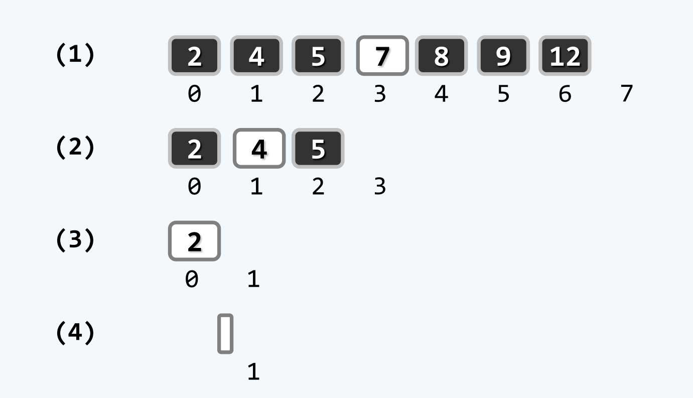

e=3
(1) 现在 lo=0 hi=7 mi=3 A\[mi\]=7 if 3<7? 是 进入左侧分支 hi=3
(2) 现在 lo=0 hi=3 mi=1 A\[mi\]=4 if 3<4? 是 进入左侧分支 hi=1
(3) 现在 lo=0 hi=1 mi=0 A\[mi\]=2 if 3<2? 否 if 2<3? 是 进入右侧分支 lo=1
(4) 现在 lo=1 hi=1 无法进入while循环 return -1 查找失败

**版本B**

二分查找A中 左右分支转向代价不平衡 希望无论向左向右都只需要一次比价 这样所有分支只有2个方向 而不是3个

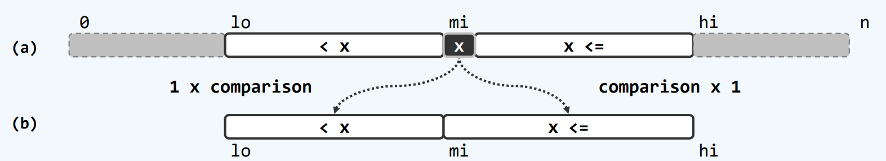

取轴点mi为中点 e<x 深入\[lo,mi) x<=e 深入\[mi,hi) 其实只需要e<x? 比较一次 否则就深入右边 缺点是不能及时判断命中 只有hi-lo=1时 才能判断命中

```c++
// vector_binSearch_B.h
#pragma once
#include "vector.h"

template <typename T>
static Rank binSearch_B(T* A, T const& e, Rank lo, Rank hi)
{
    while (1 < hi - lo) // 查找区间宽度为1时 算法才会终结
    {
        Rank mi = (lo + hi) >> 1;
        (e < A[mi]) ? hi = mi : lo = mi; // [lo,mi)或[mi,hi)
    }
    return (e == A[0]) ? lo : -1; // 返回命中元素的秩 或者-1(失败)
}
```

但是二分查找A B都没有实现search()语义约定 没有返回不大于e的最后一个元素

**版本C**


如果是从(a)到(b) 这个新的hi就等于mi 我们现在做的是有序查找 则A\[mi\]是\[hi,n)中最小的 而e<A\[mi\]
如果是从(a)到(c) 这个新的lo-1就等于mi 有序查找 则A\[mi\]是\[0,lo\]中最大的 而A\[mi\]<=e lo=mi+1 

则始终能保持A[0,lo) <= e < A[hi,n)

假如这种不变性可以一直保持 最后一定会hi=lo 而在[0,lo)的元素都是<=e 在[hi,n)的元素都是>e 那么就只要返回lo-1 这就是不大于e的最大元素

```c++
// vector_binSearch_C.h
#pragma once
#include "vector.h"

template <typename T>
static Rank binSearch_C(T* A, T const& e, Rank lo, Rank hi)
{
    while (lo < hi)
    {
        Rank mi = (lo + hi) >> 1;
        (e < A[mi]) ? hi = mi : lo = mi + 1;
    }
    return --lo; // lo-1 即不大于e的元素的秩 符合接口规定
}
```

比如 现在是1 3 5 7 9 我们要查找e=6
(1) lo=0 hi=4 mi=2 e=6<A\[mi\]=5? 否 则现在lo=mi+1=3 **A[mi]是不大于e的 而区间是左闭区间 所以lo定位到mi的后继元素 移动区间的左侧 保证\[lo,hi)中 区间内部的左侧不包含所有我们目前已知的不大于e的元素 因为我们最终的目标是找到最大的不大于e的元素 我们希望通过lo-1来得到这个元素** 在本例中的这个时候 实际上e已经不在\[lo,hi)之中了
(2) lo=3 hi=4 mi=3 e=6<A[mi]=7? 是 则现在hi=mi=3 **A[mi]是大于e的 移动区间的右侧 保证\[lo,hi)中 区间最右侧的元素是我们目前已知的最小的大于e的元素 但因为是右开区间 所以区间本身是不包含这个元素的** 所以当lo=hi时 \[lo,hi)收敛到的那个元素 当然这时候这个区间由于是右开区间 已经不可能包含任何元素了 **一定是最小的大于e的元素 同时也是最大的不大于e的元素的后继元素** 而我们要找到最大的不大于e的元素 就要lo-1
(3) lo=hi=3 不再是lo<hi 无法进入while循环 return --lo=2 A[2]=5 确实是最大的不大于e=6的元素

再比如 1 3 5 7 9 我们要查找e=5
(1) lo=0 hi=4 mi=2 e=5<A\[mi\]=5? 否 则现在lo=mi+1=3
(2) lo=3 hi=4 mi=3 e=5<A\[mi\]=7? 是 则现在hi=mi=3
(3) lo=hi=3 不再是lo<hi 无法进入while循环 return --lo=2 A[2]=5 确实是最大的不大于e=5的元素
在存在相等元素的时候也同样成立

## bubbleSort 起泡排序

**版本A** 不是vector版本

依次比较每一对相邻元素 称为扫描 每次扫描称为一趟 发现有逆序的相邻元素 就交换它们 如果某一趟扫描没有发现相邻元素逆序 就结束扫描

```c++
void bubbbleSort(int A[], int n)
{
    for(bool sorted = false; sorted=!sorted; n--)
        for(int i=1; i<n; i++)
            if(A[i-1] > A[i]) // 发生逆序
            {
                swap(A[i-1], A[i]); // 交换
                sorted = false;
            }
}
```

`sorted=!sorted` 是因为 如果上一次循环结束结果是sorted=false 将取反变为true 进入循环 如果上一次循环结果是sorted=true 取反变为false将退出循环 结束扫描
`n--` 是因为每一趟交换之后 最大的元素必定在最后面 在下一轮扫描时 就不需要再扫描它了

最大的元素先就位 经k轮扫描交换之后 最大的k个元素必然就位 问题规模缩减至n-k 至多n趟扫描后 算法必然终止

**版本B**

版本A一趟扫描交换之后 右边一些元素必然是有序的 但左边未必无序 希望能尽早地判定 从而提前退出算法

每一趟扫描交换之前 都记录下此时是否存在逆序元素 如果存在 说明发生逆序的这对元素 其中起码有一个是恰在上一趟交换时 从别的地方换过来的 假如上一趟时这个逆序就存在 那么上一趟就应该能把它挑出来 不会遗留到这一趟 所以如果上一趟就没有逆序 没有发生交换 这一趟自然也不可能有逆序 不用发生交换 直接截断

```c++
// vector_bubbleSort_B.h 
#pragma once
#include "vector.h"

template <typename T>
void Vector<T>::bubbleSort(Rank lo, Rank hi)
{
    while (!bubble(lo, hi--););
    // bubble返回的是有序标志 如果有序就停止循环 及时截断
}

template <typename T>
bool Vector<T>::bubble(Rank lo, Rank hi)
{
    bool sorted = true; // 先认为有序 后面再逐个检查各对相邻元素
    while (++lo < hi)
        if (_elem[lo - 1] > _elem[lo])
        {
            sorted = false; // 整体尚未有序
            swap(_elem[lo - 1], _elem[lo]); // 交换
        }
    return sorted; // 返回有序标志
}
```

**版本C**

```c++
∎∎∎∎ ∎∎∎∎∎∎∎∎∎∎∎∎∎
前缀    后缀
```

可能整个vector是这样的 只有前缀一小部分是乱序 后缀全都是有序的 就位的 需要排序的元素只聚集在很小的区间中 但是如果像我们之前那样扫描交换 后缀里的元素是不会发生调整顺序的 每趟扫描交换之后 都是前缀的最后一个、倒数第二个、倒数第三个元素逐渐就位

如果去记录上一趟扫描交换中所进行的最后一次交换的位置 这样就知道在上一趟的扫描交换中 有多长的后缀没有做过任何交换 那么只需要将hi直接指向新的最后交换的位置

```c++
// vector_bubbleSort_C.h
#pragma once
#include "vector.h"

template <typename T>
void Vector<T>::bubbleSort(Rank lo, Rank hi)
{
    while (lo < (hi = bubble(lo, hi)));
}

template <typename T>
Rank Vector<T>::bubble(Rank lo, Rank hi)
{
    Rank last = lo; // 记录最右侧逆序对位置
    while (++lo < hi) // 自左向右
        if (_elem[lo - 1] > _elem[lo]) // 若逆序
        {
            last = lo; // 更新最右侧逆序对位置记录
            swap(_elem[lo - 1], _elem[lo]);
        }
    return last; // 返回最右侧逆序对位置 而不再是bool型sorted
}
```

**算法的稳定性**
输入重复元素之后 输出序列中 重复元素的相对次序不发生改变 则算法是稳定的 bubbleSort中 重复的元素a和b相对位置想要发生变化是不可能的 它们肯定是要先作为相邻元素才可能发生交换 但是元素相同是不可能发生交换的 所以bubbleSort是一个稳定的算法

## mergeSort 归并排序


先将序列一分为二 将子序列递归排序 再合并有序子序列

**二路归并**
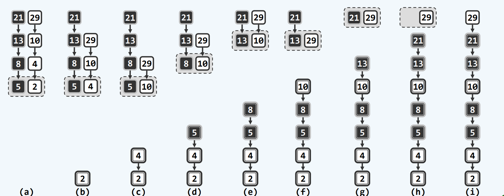

这是两个已经排好序的两段 要把它们归并 只关注首元素 从首元素中挑出更小的元素 如果相等就任意取一个 取出后 后续元素补位
在归并排序中 参与二路归并的两个序列 其实是`S[lo,hi)=S[lo,mi)+S[mi,hi)` A=B+C 来自于同一个更大的向量

**版本A**

```c++
// vector_mergeSort.h
#pragma once
#include "vector.h"

template <typename T>
void Vector<T>::mergeSort(Rank lo, Rank hi)
{
    if (hi - lo < 2) return; // 单元素区间有序
    int mi = (lo + hi) >> 1; // 以中点为界
    mergeSort(lo, mi); // 对前半段排序
    mergeSort(mi, hi); // 对后半段排序
    merge(lo, mi, hi); // 归并
}

template <typename T>
void Vector<T>::merge(Rank lo, Rank mi, Rank hi)
{
    // A = B + C
    T* A = _elem + lo; // 合并后的向量A[0,hi-lo]=_elem[lo,hi]

    int lb = mi - lo;
    T* B = new T[lb]; // 前子向量B[0,lb)=_elem[lo,mi)
    for (Rank i = 0; i < lb; B[i] = A[i++]);
    // 为B开辟新的内存空间 并将A的前半部分复制到前子向量B

    int lc = hi - mi;
    T* C = _elem + mi; // 后子向量C[0,lc)=_elem[mi,hi)
    // C现在就是A的后半段 只是用了一个新的指针去索引
    // 没有开辟新的内存 也没有复制

    for (Rank i = 0, j = 0, k = 0;(j < lb) || (k < lc);)
                                // B[j] C[k]都没了 算法就退出
    {
        if ((j < lb) && (lc <= k) || (B[j] <= C[k]))
        // && 的优先级比 || 更高 就相当于 ( (j < lb) && (lc <= k) ) || (B[j] <= C[k])
        // (B[j]有值 并且 C[k]已经没有了) 或者 C[k]大于等于B[j]
            A[i++] = B[j++]; // 就是取两边相比之下数值更小的 或者只有一边还剩下了元素
            // 这里是B的元素更小 所以取B中的元素放到A里
        if ((k < lc) && (lb <= j) || (c[k] <= B[j]))
        // (C[k]有值 并且 B[j]已经没有了) 或者 B[j]大于等于C[k]
            A[i++] = C[k++];  // 取C中的元素放到A里 
    }
    delete[] B; // 释放临时空间B
}
```

其实A最后是被覆盖的 B是A的前半段 已经从A复制过来了 不怕被覆盖 C是后半段 但是A被覆盖的部分决不会覆盖掉C还未处理的地方


现在是C不复制 省时间 A不开辟 省空间
我自己想的就是拙劣的空间换时间 直接开辟hi-lo长度的空向量 然后在原向量的前半段和后半段分别遍历比较 挑选出来元素之后 就复制到新开辟的这个向量里 但是这样的话 新开辟的这个向量的地址并不是`_elem+lo`

B和C的地位是不对等的 B是复制过来的 而C就是A的一部分 B耗尽时 如图(c) 此时对于C尾部元素的转移是多余的 因为它们本来就在那

**版本B** 删除冗余逻辑

```c++
// vector_mergeSort.h
template <typename T>
void Vector<T>::merge(Rank lo, Rank mi, Rank hi)
{
    T* A = _elem + lo;

    int lb = mi - lo;
    T* B = new T[lb];
    for (Rank i = 0; i < lb; B[i] = A[i++]);

    int lc = hi - mi;
    T* C = _elem + mi;

    for (Rank i = 0, j = 0, k = 0;(j < lb);) // 删除了 || (k < lc) 因为不需要考虑C提前耗尽 只要B提前耗尽 就终止这个算法
    {
        // 两个if语句相较上个版本 交换了位置
        if ((k < lc) && (c[k] <= B[j])) // 进入循环时已经判断了j<lb 则不想需要再考虑j与lb
            A[i++] = C[k++];
        if ((lc <= k) || (B[j] <= C[k]))
            A[i++] = B[j++];
    }
    delete[] B;
}
```

# list

1. 根据是否修改数据结构 所有操作大致分为两类方式
   1. 静态 仅读取 数据结构的内容及组成 一般不变 get search
   2. 动态 需写入 数据结构的局部或整体将改变 insert remove
2. 数据元素的存储与组织方式也分为两种
   1. 静态 数据空间整体创建或销毁 数据元素的物理存储次序 与其逻辑次序严格一致 可支持高效的静态操作
      比如vector的get search 但对于动态操作 insert 需要把后继全部后移
   2. 动态 各数据元素的物理空间 在生命期内是动态地 逐步地分配

列表list采用动态存储策略 其中元素称为节点node 物理上没有规律 各节点通过指针或引用彼此联接 在逻辑上构成一个线性序列

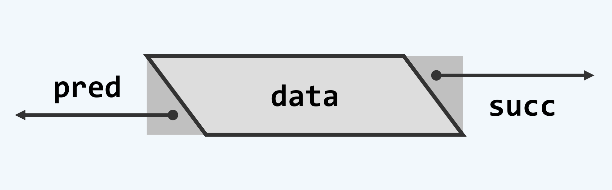相邻节点互称为前驱predecessor 后继successor
除了第一个节点 其余节点都有唯一的前驱 首节点first front
除了最后一个节点 其余节点都有唯一的后继 末节点 last rear

向量支持o(1)的循秩访问 v\[i\]的物理地址=v + i×s s是单个单元占用的空间量

列表也是线性结构 它应该也可以用秩定位节点 从头到尾端出发 从头/尾端出发 沿后继/前驱引用 但是顺序存取list 循位置访问 访问成本过高 访问第i个元素就要利用节点之间的相互引用 找到特定的节点 o(n)

模仿向量循秩访问方式 重载下标操作符 效率比较低

```c++
// list_operator_bracket.h
#pragma once
#include "list.h"

template <typename T>
ListNodePosi<T> List<T>::operator[](Rank r) const
{
    ListNodePosi<T> p = first(); // 从首节点出发
    while (0 < r--) p = p->succ; // 不断沿着succ引用向后行进 结束时p正好处于秩为r的节点
    return p->data;
}
```

**ListNode 列表节点**

```c++
// listNode.h
#pragma once

using Rank = unsigned int; //秩

template <typename T> struct ListNode;
template <typename T> using ListNodePosi = ListNode<T>*; //列表节点位置
template <typename T> struct ListNode
{
    T data; // 数值
    ListNodePosi<T> pred; // 前驱
    ListNodePosi<T> succ; // 后继

    ListNode() {} // 针对header和trailer的构造
    ListNode(T e, ListNodePosi<T> p = NULL, ListNodePosi<T> s = NULL)
        : data, pred(p), succ(s) {} // 默认构造器

    ListNodePosi<T> insertAsPred(T const& e); // 前插入
    ListNodePosi<T> insertAsSucc(T const& e); // 后插入
};
```

**list模板类**

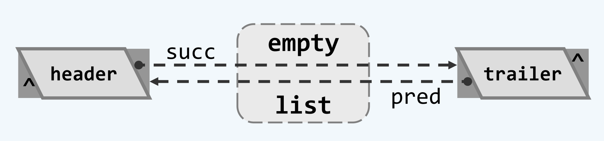
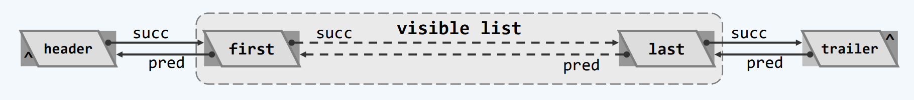

header和trailer 是与生俱来的 二者并不相同
first和last 并不见得不相同 甚至不能保证它们存在
对外 first和last是可见的 header和trailer不可见

```c++
// list.h
#pragma once
#include "listNode.h"

template <typename T>
class List
{
private:
    int _size; // 规模
    ListNodePosi<T> header;
    ListNodePosi<T> trailer; // 头尾哨兵
protected:
    void init(); //列表创建时的初始化
    Rank clear(); //清除所有节点
    void copyNodes(ListNodePosi<T>, Rank); //复制列表中自位置p起的n项
    ListNodePosi<T> merge(ListNodePosi<T>, Rank, List<T>&, ListNodePosi<T>, Rank); //归并
    void mergeSort(ListNodePosi<T>&, Rank); //对从p开始连续的n个节点归并排序
    void selectionSort(ListNodePosi<T>, Rank); //对从p开始连续的n个节点选择排序
    void insertionSort(ListNodePosi<T>, Rank); //对从p开始连续的n个节点插入排序
    void radixSort(ListNodePosi<T>, Rank); //对从p开始连续的n个节点基数排序

public:
    // 构造方法
    List() { init(); } //默认
    List(List<T> const& L) { copyNodes(L.first(), L._size); } //整体复制列表L
    List(List<T> const& L, Rank r, Rank n) //复制列表L中自第r项起的n项
    {
        ListNodePosi<T> p = L.first();
        while (0 < r--) p = p->succ;
        copyNodes(p, n);
    }
    List(ListNodePosi<T> p, Rank n) { copyNodes(p, n); } //复制列表中自位置p起的n项
    // 析构方法
    ~List() { clear(); delete head; delete tail; } //释放（包含头、尾哨兵在内的）所有节点
    // 只读访问接口
    Rank size() const { return _size; } //规模
    bool empty() const { return _size <= 0; } //判空
    ListNodePosi<T> operator[](Rank r) const; //重载，支持循秩访问（效率低）
    ListNodePosi<T> first() const { return header->succ; } //首节点位置
    ListNodePosi<T> last() const { return trailer->pred; } //末节点位置
    bool valid(ListNodePosi<T> p) //判断位置p是否对外合法
    {
        return p && (trailer != p) && (head != p);
    } //将头、尾节点等同于NULL
    ListNodePosi<T> find(T const& e) const //无序列表查找
    {
        return find(e, _size, trailer);
    }
    ListNodePosi<T> find(T const& e, Rank n, ListNodePosi<T> p) const; //无序区间查找
    ListNodePosi<T> search(T const& e) const //有序列表查找
    {
        return search(e, _size, trailer);
    }
    ListNodePosi<T> search(T const& e, Rank n, ListNodePosi<T> p) const; //有序区间查找
    ListNodePosi<T> selectMax(ListNodePosi<T> p, Rank n); //在p及其n-1个后继中选出最大者
    ListNodePosi<T> selectMax() { return selectMax(header->succ, _size); } //整体最大者
    // 可写访问接口
    ListNodePosi<T> insertFirst(T const& e); //将e当作首节点插入
    ListNodePosi<T> insertLast(T const& e); //将e当作末节点插入
    ListNodePosi<T> List<T>::insertBefore(ListNodePosi<T> p, T const& e); // 前插入 后插入完全对称
    ListNodePosi<T> insert(ListNodePosi<T> p, T const& e); //将e当作p的后继插入
    ListNodePosi<T> insert(T const& e, ListNodePosi<T> p); //将e当作p的前驱插入
    T remove(ListNodePosi<T> p); //删除合法位置p处的节点,返回被删除节点
    void merge(List<T>& L) { merge(header->succ, _size, L, L.header->succ, L._size); } //全列表归并
    void sort(ListNodePosi<T>, Rank); //列表区间排序
    void sort() { sort(first(), _size); } //列表整体排序
    Rank deduplicate(); //无序去重
    Rank uniquify(); //有序去重
    // 遍历
    void traverse(void (*)(T&)); //依次实施visit操作（函数指针）
    template <typename VST> void traverse(VST&); //依次实施visit操作（函数对象）
};
```

## 构造

```c++
// list_init.h
#pragma once
#include "list.h"

template <typename T>
void List<T>::init()
{
    header = new ListNode<T>;
    trailer = new ListNode<T>;
    header->succ = trailer; header->pred = NULL;
    trailer->pred = header; trailer->succ = NULL;
    _size = 0;
}
```

现在 对外可见的那个列表是空的 first与last之间的才对外可见

## insertBefore 前插入

```c++
#pragma once
#include "list.h"

template <typename T>
ListNodePosi<T> List<T>::insertBefore(ListNodePosi<T> p, T const& e)
{
    _size++;
    return p->insertAsPred(e);
}

template <typename T>
ListNodePosi<T> ListNode<T>::insertAsPred(T const& e)
{
    ListNodePosi<T> x = new ListNode(e, pred, this);
    // (b)创建节点 数值为e 新插入节点的前驱是当前的前驱 p->pred 新插入节点的后继是当前节点this 也就是p
    pred->succ = x; // (c)原来的前驱 以新的节点作为后继
    pred = x; // 当前节点 以新的节点作为前驱
    return x;
}
```

注意到调用时使用的是`p->insertAsPred(e)` 使用的是`->` 并不是`.` 因为p是`ListNodePosi<T>` 是一个指针 不是对象 不能调用方法
`(*p).insertAsPred(e)`和`p->insertAsPred(e)` 是等效的 


即使this是首节点也没问题 因为有头哨兵

该算法在局部进行 只涉及到3个节点 复杂度为常数

## copyNodes 基于复制的构造

```c++
// list_copyNodes.h
#pragma once
#include "list.h"

template <typename T>
void List<T>::copyNodes(ListNodePosi<T> p, Rank n) // 从某一个列表的位置p开始 随后的连续n个节点
{
    init(); // 创建空列表 创建头尾哨兵 并做初始化
    while (n--)
    {
        insertBefore(trailer, p->data); // 把 从位置p开始的n项 依次作为末节点插入
        p = p->succ; // 转向当前节点的后继
    }
}
```

## remove 删除

```c++
// list_remove.h
#pragma once
#include "list.h"

template <typename T>
T List<T>::remove(ListNodePosi<T> p) // 删除位置p处的节点 并返回其数值
{
    T e = p->data;

    p->pred->succ = p->data; // 把p现在的后继 当作p现在的前驱的后继
    p->succ->pred = p->pred;

    delete p;
    _size--;

    return e; // 返回数值
}
```

## clear 析构

```c++
// list_clear.h
#pragma once
#include "list.h"

template <typename T>
Rank List<T>::clear()
{
    int oldSize = _size;
    while (0 < _size)
        remove(header->succ); // 反复删除首节点 直到列表变空 对外可见的节点有多少个 就删除多少次
    return oldSize;
}
```

## find 无序查找

以位置为p的某个特定节点为基准 在它的n个真前驱(不包括它自己)中 找到某个可能存在的数值为特定值e的节点 找到等于e的最后者

```c++
// list_find.h
#pragma once
#include "list.h"

template <typename T>
ListNodePosi<T> List<T>::find(T const& e, Rank n, ListNodePosi<T> p) const
{
    while (0 < n--)
        if (e == (p = p->pred)->data) // 从后往前 取出数据与e比对 直到命中或范围越界
            return p;
    return NULL; // 越出左边界 查找失败
}
```

`find(e,n,p)` 这个字母顺序 很容易就知道是p的n个真前驱 如果重载成`find(e,p,n)` 就是在p的n个真后继里寻找

## deduplicate 无序去重

```c++
// list_deduplicate.h
#pragma once
#include "list.h"

template <typename T>
Rank List<T>::deduplicate()
{
    if (_size < 2)
        return 0;
    Rank oldSize = _size;
    ListNodePosi<T> p = first(); // p从首节点开始
    Rank r = 1;
    while (trailer != (p = p->succ))
    {
        ListNodePosi<T> q = find(p->data, r, p); // 在p的n个真前驱中 查找重复
        q ? remove(q) : r++; // 若真的存在 删除它 删完之后 r不用增加1 p也归入前缀了 否则秩递增 p就归入前缀了
    }
    return oldSize - _size;
}
```

但是q与p相同 为什么倾向于删除q？ 因为删除p是麻烦的 会使while里`p=p->succ`存在风险

## uniquify 有序唯一化

```c++
// list_uniquify.h
#pragma once
#include "list.h"

template <typename T>
Rank List<T>::uniquify() // 成批剔除重复元素
{
    if (_size < 2) return 0; // 平凡列表自然没有重复
    Rank oldSize = _size;
    ListNodePosi<T> p = first();
    ListNodePosi<T> q;
    while (trailer != ( q = p->succ)) // 反复考察紧邻的节点对(p,q)
    {
        if (p->data != q->data)
            p = q; // 若互异 则转向下一区段
        else
            remove(q); // 若雷同 删除后者
    }
    return oldSize - _size;
}
```

只需遍历整个列表一趟

## search 有序查找

在p的n个真前驱中 找到不大于e的最后者

```c++
// list_search.h
#pragma once
#include "list.h"

template <typename T>
ListNodePosi<T> List<T>::search(T const& e, Rank n, ListNodePosi<T> p) const
{
    while (0 <= n--)
        if (((p = p->pred)->data) <= e) // 从后往前 转向p的直接前驱 取出数据与e比较
            break;
    return p;
}
```

有序查找相比无序查找 根本没有提升效率 这是因为列表是循位置访问

## selectionSort 选择排序

每次在篮子中找到最大的 将它转移出来

bubbleSort也是selectionSort 扫描交换其实是从当前最大的元素开始 然后往后和邻居交换 直到队伍末尾 相邻位置比较后就发生交换 元素移动操作太多 还不如一口气比较 然后一步到位地到达队伍末尾


其实前缀序列和后缀序列是连着的 每次迭代只做了1次元素的移动 当前最大元素挪到最                                                                                                                                                                                      末端 列表这种只靠引用的非常容易挪动 改变引用或者直接交换数据都可以

```c++
// list_selectionSort.h
#pragma once
#include "list.h"

template <typename T>
void List<T>::selectionSort(ListNodePosi<T> p, Rank n)
{
    ListNodePosi<T> head = p->pred;
    ListNodePosi<T> tail = p;
    // 待排序区间

    for (int i = 0; i < n; i++)
        tail = tail->succ;
    while (1 < n)
    {
        insertBefore(tail, remove(selectMax(head->succ, n))); //找到最大的值 删掉 然后把remove返回的这个值 插入到tail之前
        tail = tail->pred; // tail每次向前移动一个节点 tail是待排列序列的尾部
        n--;
    }
}
```

```c++
// list_selectMax.h
#pragma once
#include "list.h"

template <typename T>
ListNodePosi<T> List<T>::selectMax(ListNodePosi<T> p, Rank n)
{
    ListNode<T> max = p; // 记录当前最大节点
    for (ListNode<T> cur = p; 1 < n; n--) // cur是当前遍历
        if (!lt((cur = cur->succ)->data, max->data))
        // !lt less than 不小于 前者不小于后者 就把max更新为这个不小的
        // 若有重复的 最终它会选取最靠后的 那么max只可能递增 不会下降
        // gt greater than
            max = cur;
    return max;
}
```

`insertBefore(tail, remove(selectMax(head->succ, n)));`
insert里用了new remove里用了delete
虽然可以认为是常数时间 但它们用时是通常基本操作的100倍

其实只要修改部分节点的引用就可以 或者把最大的数据交换到队末

`[p,p+n)` 从首节点逐一比对 记录下当前最大的元素 总感觉可以二分地比对 但是列表用不了二分

## insertSort 插入排序

整理扑克牌 抽到就放中间 将更小的牌向左移动 空出位置 将新收到的牌插入


初始时 sorted长度为0 将新收到的牌 插入到已有的牌中 将e插入sorted

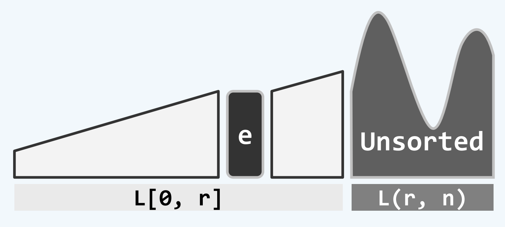

可以发现从`L[0,r) L[r,n)`变成`L[0,r] L(r,n)`了 开闭区间发生变化

`selectionSort`是后缀无序 前缀有序 从无序中挑出最大的 放在有序那堆里 无序中所有元素都不能超过有序的最小值
`insertSort`是前缀有序 后缀无序 为新来的元素在有序中找到一个位置 使有序仍保持有序 但不限定无序中的元素 因为它和有序没关系


```c++
// list_insertSort.h
#pragma once
#include "list.h"

template <typename T>
void List<T>::insertionSort(ListNodePosi<T> p, Rank n)
{
    for (int r = 0; r < n; r++) // r是已经排序的前缀长度
    {
        insertAfter(search(p->data, r, p), p->data); // search返回一个不大于新拿到的牌的最靠后的那张牌
        p = p->succ; // p是未排序的后缀的开头 最新拿到的那张牌 在有哨兵时 p->succ永远是安全的
        remove(p->pred);
    }
}
```

在已经有序的序列中查找 为什么不用二分查找？在选择排序找最大值时 也联想到了二分查找 那么为了用binSearch 直接舍弃List 而用Vector？ 查找一定会加快 但insert remove都很慢 比如insert要把所有后继都往后移 而不是像List一样只要修改局部的引用

# stack queue


栈底bottom 栈顶top LIFO 后进先出

站属于线性序列的特例 所以可以基于向量或列表派生

```c++
// stack.h
#pragma once
#include "../vector/vector.h"

template <typename T>
class Stack : public Vector<T> // 使用public就可以直接沿用size() empty()等
{
public:
    void push(T const& e) { insert(e); } // 入栈
    T pop() { return remove(size() - 1); } // 出战
    T& top() { return (*this)[size() - 1]; } // 取栈顶 返回当前向量的末元素
    // 都可以写成this->insert(e) this->size()
};
```

## 逆序输出：进制转换

| 商 10进制转换为2进制 | 余数 | 商 10进制转换为5进制 | 余数 |
| :------------------: | :--: | :------------------: | :--: |
|          89          |  1   |         2013         |  3   |
|          44          |  0   |         402          |  2   |
|          22          |  0   |          80          |  0   |
|          11          |  1   |          16          |  1   |
|          5           |  1   |          3           |  3   |
|          1           |  1   |          0           |      |
|          0           |      |                      |      |
|   结果为：1011001    |      |    结果为：31023     |      |

只要自底向上输出 但计算过程是自下而上

栈 每计算得到1个数位 就将它压入栈中 输出时优先输出栈顶元素

```c++
// stack_convert.h
#include "stack.h"

void convert(Stack<char>& S, __int64 n, int base)
{
    static char digit[] = { '0','1','2','3','4','5','6','7','8','9','A','B','C','D','E','F' };
    while (n > 0)
    {
        S.push(digit[n % base]); // 余数入栈
        n /= base; // n更新为其对base的除商
    }
}

int main()
{
    Stack<char> S;
    __int64 n = 89;
    int base = 2;
    convert(S, n, base); // 用栈记录转换得到的各数位
    while (!S.empty())
        printf("%c", S.pop()); // 逆序输出
}
```

## 递归嵌套：括号匹配


0)平凡 无括号自然匹配
1)减而治之 `----E----`匹配 则`(----E----)`一定匹配
反过来不一定成立 比如`(   ()())(   )`匹配 但去掉外层括号的`()())(`不匹配
2)分而治之 `----E----`和`----F----`匹配 则`----E--------F----`一定匹配
反过来不一定成立 比如`(()  ())()`是匹配的 但分开为`(()`和`())()` 这两个都是不匹配的

消去一对紧邻的左右括号 而不是`(----E----)`两边的括号
`----L----()----R----`匹配 当且仅当 `----L--------R----`匹配

但怎样找到这样的括号？
可以线性扫描直到找到这对括号 将它删除 但难道接下来还要再一次从头开始扫描再找吗

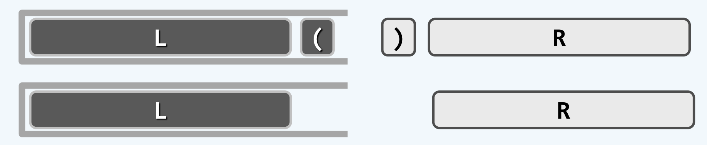

遇到左括号就入栈 再遇到右括号 不仅右括号不入栈 栈顶的左括号也要弹出 等效于刚才被删除的括号 从未存在过 实际上只需要记录左括号

```c++
// stack_paren.cpp
#include "stack.h"

bool paren(const char exp[], int lo, int hi)
{
    Stack<char> S; // 使用栈记录已发现但尚未匹配的左括号
    for (int i = lo; i < hi; i++) // 逐一检查当前字符
    {
        if ('(' == exp[i]) // 是左括号
            S.push(exp[i]); // 左括号入栈
        else if (!S.empty()) // 否则就是右括号
            S.pop(); // 否则就是右括号 遇右括号时 如果栈非空 弹出栈顶的左括号
        else
            return false; // 否则栈为空 即遇到右括号时 栈为空 必然不匹配
    }
    return S.empty(); // 栈空当且仅当匹配 若非空 必定是有左括号 但没有右括号和它配对
}
```

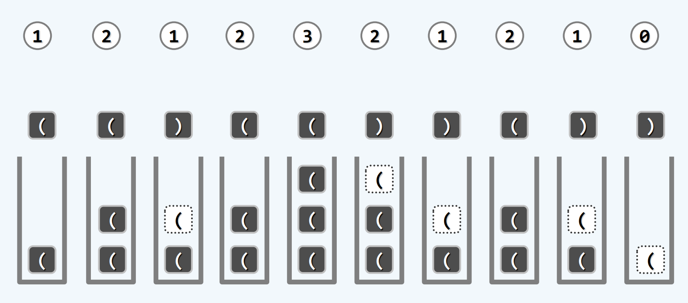

为什么要用栈？ 只要用一个整数计数器就可以完成任务 遇到`(`就加1 遇到`)`就减1 若追钟回到0 即匹配 实际上这个数字正是栈当前的规模 但是栈可以推广至多种括号并存的情况

**多括号并存**


左括号 无论什么括号 都入栈
右括号 栈顶左括号若与它配对 出栈 否则失配

只要能定义是否匹配的规则 不一定是必须括号匹配

## 栈混洗

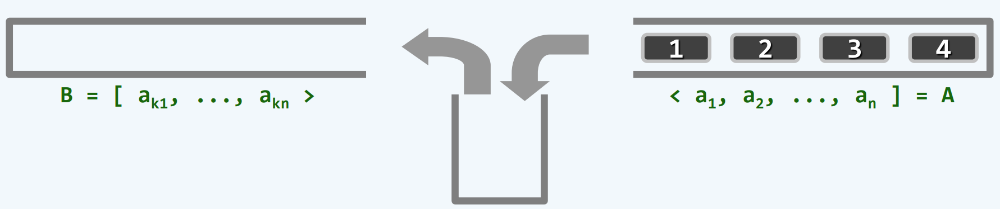
按照某种规则 对栈中元素重新排列

最初 `<a1, a2, ..., an] = A, B=∅, S=∅`

元素都存在于栈A中 要用某种方式转移到另一个初始为空的栈B中 为此需要借助一个中转栈S
只允许将A的顶元素弹出并压入S 或者将S的顶元素弹出并压入B
经过一系列操作 A中元素全部转入B中

`B = [ak1, ...,  akn>` 称为A的一个**栈混洗**

同一输入序列 可以有多种栈混洗 只取决于A push进S 与 pop到B的顺序
可能的栈混洗总数 不可能超过全排列n!

## 中缀表达式

在表达式中寻找能优先计算的子串 算完把数值放在原来位置上 减而治之 最终将消除掉所有运算符 但很难定位到当前可以计算的运算符 使用线性扫描 扫到运算符也不能确认它是当前可计算的 将扫描过的部分保存成栈 能局部计算的部分 和不能计算的缓冲 逐步将尚未扫描的部分扫描处理掉 

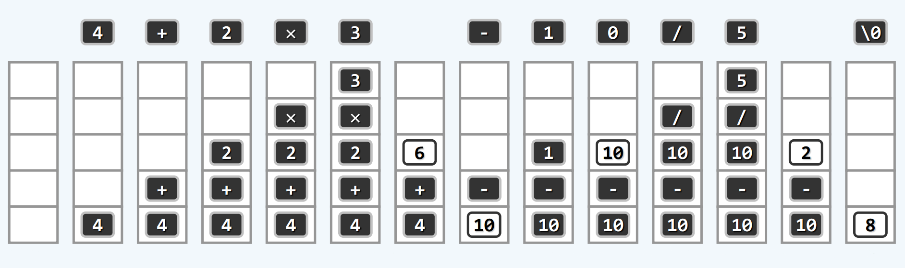

1)是数字就进栈 运算符在尚未判定它有足够高的运算符优先级时也进栈
2)算到`4+2×3`时 遇到减号 相对于现在靠近顶端的乘号 优先级更低 所以现在乘号可以计算了 并将计算结果放入栈中 于是变成`4+6`
3)遇到减号 减号和加号优先级相当 但加号出现在前 先算 就变成`10-`
4)先遇到1 又遇到0 两个数字挨着 这是一个多位数 那么就需要是把1乘上10之后 再加上新来的数字0 1×10+0=10 重新放入栈中 就变成了`10-10`
5)遇到除号 除法优先级高 则减法达不到执行的时候 于是变成`10-10/5`
6)遇到`\0` 看到了末尾标志 那么所有运算符都可以进行计算了 最后栈内的唯一元素 就是我们要的结果

每次计算时 2×3 10/5都不是那么自然

```c++
// stack_evaluate.cpp
#include "stack.h"
#include <cctype>

float evaluate(char* S, char*& RPN)
{
    Stack<float> opnd; // 运算数栈
    Stack<char> optr; // 运算符栈
    optr.push('\0'); // 结束标志首先推入操作符栈
    while (!optr.empty()) // 逐渐处理各字符 直至运算符空
    {
        if (isdigit(*S)) // 当前字符如果是数字
            readNumber(S, opnd); // 读入数字 放入运算符栈 可能多位要完整读入 具体实现暂略
        else // 当前字符是运算符
            switch (orderBetween(optr.top(), *S))
            {
                // 查要看其与栈顶运算符之间优先级的高低
                // 暂略
            }
    }
    return opnd.pop();
}
```

优先级表

```c++
#define N_OPTR 9 // 定义运算符的数量，用于优先级矩阵的维度

const char pri[N_OPTR][N_OPTR] = // 运算符优先级[栈顶][当前]
{
    '>', '>', '<', '<', '<', '<', '<', '>', '>',
    '>', '>', '<', '<', '<', '<', '<', '>', '>',
    '>', '>', '>', '>', '<', '<', '<', '>', '>',
    '>', '>', '>', '>', '<', '<', '<', '>', '>',
    '>', '>', '>', '>', '>', '<', '<', '>', '>',
    '>', '>', '>', '>', '>', '>', ' ', '>', '>',
    '<', '<', '<', '<', '<', '<', '<', '=', ' ',
    ' ', ' ', ' ', ' ', ' ', ' ', ' ', ' ', ' ',
    '<', '<', '<', '<', '<', '<', '<', ' ', '='
};
```

| 栈顶\当前 |  +   |  -   |  *   |  /   |  ^   |  !   |  (   |  )   |  \0  |
| :-------: | :--: | :--: | :--: | :--: | :--: | :--: | :--: | :--: | :--: |
|     +     |  >   |  >   |  <   |  <   |  <   |  <   |  <   |  >   |  >   |
|     -     |  >   |  >   |  <   |  <   |  <   |  <   |  <   |  >   |  >   |
|     *     |  >   |  >   |  >   |  >   |  <   |  <   |  <   |  >   |  >   |
|     /     |  >   |  >   |  >   |  >   |  <   |  <   |  <   |  >   |  >   |
|     ^     |  >   |  >   |  >   |  >   |  >   |  <   |  <   |  >   |  >   |
|     !     |  >   |  >   |  >   |  >   |  >   |  >   |      |  >   |  >   |
|     (     |  <   |  <   |  <   |  <   |  <   |  <   |  <   |  =   |      |
|     )     |      |      |      |      |      |      |      |      |      |
|    \0     |  <   |  <   |  <   |  <   |  <   |  <   |  <   |      |  =   |

```c++
switch (orderBetween(optr.top(), *S))
{
    // 查要看其与栈顶运算符之间优先级的高低
    case '<': // 栈顶运算符优先级更低 比如栈顶加号 又来了个乘号
        optr.push(*S); S++; break; // 计算推迟 当前运算符进栈 目光转向表达式的下一个字符
    case '=': // 优先级相等 只有可能是栈顶为'(' 当前为')' 或者栈顶为'/0' 当前为'/0'
        // 1 栈顶'(' 当前')'
        // 这样一对括号彼此相逢 只可能是括号内的运算符都算完了
        // 括号里只可能有数字 不会有运算符
        // 它们直接消失就好了 栈顶'('也弹出 当前')'忽略 注意力转向表达式的下一个字符
        // 2 栈顶'\0' 当前'\0'
        // 最开始时 我们往栈底推入了一个'\0' 遇到了当前作为整个表达式结束标志的'\0'
        // 将栈顶'\0'弹出 即栈清空 并将注意力跳过当前的\0字符
        optr.pop(); S++; break;
    case '>': // 栈顶运算符优先级更高 可以计算了 结果入栈 比如栈顶乘号 又来了个加号
        char op = optr.pop(); // 弹出目前的栈顶操作符
        if ('!' == op) // 阶乘 一元操作符
            opnd.push(calcu(op, opnd.pop())); // 弹出操作数栈的栈顶 用这个操作符计算 计算结果推回到操作数栈 
        else
        {
            float pOpnd2 = opnd.pop (), pOpnd1 = opnd.pop(); // pOpnd2是后进先出
            opnd.push(calcu(pOpnd1, op, pOpnd2)); // 这两个操作数用操作符计算
            // 如果栈顶是3 第二靠近栈顶的是2 那么pOpnd2就是3 pOpnd1就是2 op是'\' 那就是计算2\3
            // 不直接使用opnd.push(calcu(opnd.pop(),op,opnd.pop()))
            // 因为这两个pop的求值顺序是未定义行为 具体怎样完全取决于编译器
        }
        break;
}
```

看一个例子

`( 1 + 2 ^ 3 ! - 4 ) * ( 5 ! - ( 6 - ( 7 - ( 8 9 - 0 ! ) ) ) ) $`

`pri['$']['(']='<'` `(`进操作符栈optr 数字1进操作数栈opnd
`pri['(']['+']='<'` `+`进栈 2进栈 
`pri['+']['^']='<'` `^`进栈 3进栈
`pri['^']['!']='<'` `!`进栈

而`pri['!']['-']='>'` `-`无法进栈
所以是时候计算栈顶操作符`!`了 弹出栈顶操作符`!` 

现在

optr `$ ( + ^ !` 
opnd `1 2 3`

随着optr将栈顶`!`弹出 opnd的栈顶3也被弹出 `!`是一元操作符 则发生计算 `3!=6` 计算结果6重新放回栈中

optr `$ ( + ^`
opnd `1 2 6`

此时我们注意力还在刚才仍未进栈的操作符`-`上
现在optr的栈顶是`^` 而`pri['^']['-']='>'` 所以应该先算`^` 这是一个二元操作符 `pOpnd2 = 6` `pOpnd1 = 2` 弹出操作数 `pOpnd1 op pOpnd2`也就是`2^6` 计算结果64重新放回栈中

optr `$ ( +`
opnd `1 64`

此时我们的注意力仍然在尚未进栈的操作符`-`上
现在optr的栈顶是`+` `pri['+']['-']='>'` 应该先算`+` 这是二元操作符 `pOpnd2=64` `pOpnd1=1` 那么 `pOpnd1 op pOpnd2`就是`1+64` 计算结果65重新放回到栈中

optr `$ (`
opnd `65`

此时我们的注意力还是在尚未进栈的操作符`-`上
现在optr的栈顶是`(` `pri['(']['-']='<'` `pri['-'][]`

[未完待续]
