# 编辑器

在UE5.6中创建一个游戏-空白-蓝图 命名为Slash

点击窗口上方的绿色三角 开始**模拟** 点一下视口 进入PIE模式 play in editor 在编辑器里玩游戏 现在就可以用WASD进行移动 E上升 C下降 按shift+F1就可以退出视口 找回鼠标 按红色正方形就停止模拟 也可以按esc

现在我们不是模拟模式 不能移动任何东西 但是我们可以一直按着鼠标左键拖动 就可以前后左右移动
但我们不能调节俯仰角 在之前的模拟模式下 一直按着鼠标左键就可以调节俯仰视角 现在我们需要按着鼠标右键移动来调节俯仰视角 但是我们所在的位置并没有发生任何变化
同时按鼠标左右键 就可以上下左右移动 但不会发生前后移动
最好的办法当然是**一边按鼠标按键 一边按WASD进行移动** 按C放大 Z缩小 都是聚焦于鼠标所在之处的视野 E上升 F下降 ctrl+鼠标滚轮也可以放大缩小
右上角那个旁边有数字的摄像机图标可以调节摄像头速度 我们将其调节为3

视图右上角点击**眼睛图标** 最上边视口统计数据 FPS就可以查看帧率
再往下 随便开关一个复选框比如大气或者地形 就可以看到一些变化
注意到碰撞是没有被勾选的 尝试勾选 发现CPU占用率就开始提高 看到物体周围会有一些蓝紫色轮廓线 这个轮廓显示的是它们的碰撞体积 碰撞体积让引擎的物理计算更高效 碰撞体积越简单 计算越快 游戏性能越好 所以往往是比较简单的形状
再往下翻 尝试启用或禁用一些后处理与光源类型

仍然是视图右上角 **光照按钮** 可以切换很多模式 无光照模式就是灰色的 线框模式是呈现几何结构 可以看到每个网格体中多边形的每条边 调节一下俯仰 就会发现无论是地底还是天空 都是圆形 这也就是天空球 完全是球体
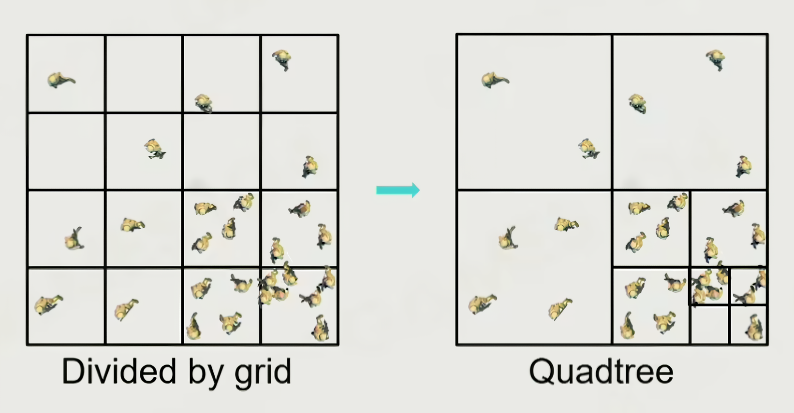

切换回光照模式 再看另一个按键 **透视按钮** 可以切换各种正交模式 通过鼠标滚轮缩放 这样就可以根据网格精确摆放物体了
再往下翻可以看到**书签**功能 可以设置书签 按ctrl+1就是设置书签1 按键盘上的数字1 就可以跳转到书签1 这些书签其实就是摄像机的位置
继续往下可以看到**游戏视图** 快捷键是G 开启之后 一些莫名其妙的灰白色图标就消失了 只显示游戏中会出现的物体
继续往下 可以看到**高分辨率截图** 左上角的方形可以选择位置 点击捕获 它就存储在了`Slash\Saved\Screenshots\WindowsEditor`文件夹里 上面的图片就是用这个功能截图的 虽然我也不认为这到底哪里很高清

最右上角的田字格 点击就可以变成4个**窗格** 每个窗格都有属于它自己的功能图标 这样就可以同时查看不同模式的 田字格左侧的三个点 点击就可以切换成不同的窗格排列格式
在下方还有一个沉浸式视图 就可以**全屏显示** 快捷键是F11 无论是模拟还是非模拟下都可以使用

要移动对象 我们首先要先有对象 鉴于我们的项目是空白的 现在就需要导入资产 去Epic Games的Fab里下载资产 为了拯救我们的C盘 现在需要修改一个缓存路径 打开UE的安装目录 找到`Epic Games\UE_5.6\Engine\Config`里的`BaseEngine.ini` 用记事本打开 搜索`ENGINEVERSIONAGNOSTICUSERDIR%DerivedDataCache` 将其替换为`GAMEDIR%DerivedDataCache` 就可以把缓存放在项目所在目录 接下来来到Epic Games的设置 找到下载与安装 点击转至下载设置 就会弹出download settings 下面的Advanced - Fab library Data Cache Directory 修改目录 总之放到非C盘的地方

然后去Fab里挑选喜欢的资产 Add to my library 然后去My library里 将它添加到项目里 这样我们打开UE 按ctrl+空格 或者鼠标点击左下角**内容侧滑菜单** 按右上角的停靠在布局中 就可以将其固定在视口下方 点×就可以直接关掉 现在我们将它关掉 以看到更大的视口 还可以拖动视口右侧边缘来放大

我们再次调出内容侧滑菜单 在 内容 文件夹里 就可以找到很多资产 静态网格体都是在Mesh文件夹里 随便拖动一个到视口

视口左下角有个x y z轴 我们旋转视角的时候 它也在旋转 让我们知道x y z轴的方向 **蓝色为z轴 红色为x轴 绿色为y轴**

视图左上角有4个图标 **选择Q 平移W 旋转E 缩放R**
点击选择 被选中的资产就会有黄色边缘 按delete就可以删除它
点击移动 这样就是选中并平移对象 在对象上会出现坐标轴 鼠标放在坐标轴上 坐标轴箭头亮了 这个方向拖动就可以移动 鼠标放在小方块上就可以同时选中两个方向 两个坐标轴箭头都会亮 按住shift的同时拖动 相机就会跟着选中的对象一起移动
旋转 缩放 都是类似 缩放数值改为-1 就是对应方向镜像
在移动模式下按alt 随便往一个箭头方向拖动 就能复制这个资产 按shift挨个点击就可以同时选中多个 这时再按alt 就可以批量复制 旋转模式下按alt也可以复制 发生旋转的是副本

发现我们在做这些操作时 是不流畅的 稍微右边的3个旁边有数字的蓝色图标就是调整这个的 都是**网格吸附**功能 吸附到网格 旋转固定角度 缩放固定增量 点按一下就关闭了 旁边的数字是每次能移动的距离 左侧紧挨着的灰色的图标是吸附到平面 数值可以调整它距离平面的默认距离

再左边那个旁边有3个点的圆地球图标 是切换**世界坐标轴**和对象自己的box的坐标轴 通常认为对象的局部x轴是它的前进方向 这样就可以决定到底是按世界坐标方向移动它 还是按它自己的朝向移动它

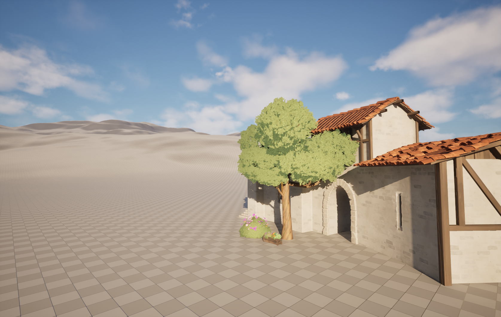

如果找不到自己想选中的物体 就可以去看视口右侧的**大纲**选项卡 可以发现光源、地面、出生点也在里面 在大纲视图里点击 就会发现对象在视口里被选中了 双击或者按F键 就可以在视口里聚焦到它 左侧的眼睛图标可以隐藏它 上方有搜索框可以搜索 按ctrl挨个点选就可以同时选中多个 按shift点选目标的第一个和最后一个 就可以选中这之间的所有对象 这时再按ctrl点击某个不想要的对象 就可以取消点选 这时再按delete 就可以一起删除

在视口里随便找个地方 右键 放置Actor 比如放置一个定向光源 就可以看到影子的位置改变了

大纲视图的下方 有**细节**选项卡
在**变换**这一栏中 有位置 旋转 缩放 右侧三角箭头可以选择是绝对坐标还是相对坐标 再右侧可以修改数字进行调整 而在我们使用WER快捷键的3种模式进行移动时 这些数字也在发生改变 在修改数字时 按下tab 就会跳到右侧的下一个框继续进行修改 最右侧的弯曲箭头 是重置为默认
看变换上方有一些选项按钮 目前我们默认所在的是**所有**
如果点击比如物理 就是在 所有 中筛选成只保留 物理 相关的属性 现在我们把一个物体让它腾空 找到物理这一栏中的**模拟物理** 点击视口上方绿色三角进入模拟模式 我们会发现它发生了坠落 甚至可能发生倾倒与滚动 比如下面这棵树


在下方也可以勾选是否**启用重力** 现在我们挑选一个质量较轻的物体 将它置于空中 打开模拟物理 但是关闭启用重力 然后我们飞过去撞这个物体 它就会飘到远处 比如这个箱子


选中这个物体 按一下end 它就会吸附到地面上了

现在我们看整个UE编辑器的最右下角 大概会显示有什么未保存 或者我们直接按ctrl+S **保存当前关卡** 建议在内容文件夹里创建一个名为Maps的文件夹 这样我们下次进入这个UE项目时 就可以点击左上角 文件 - 打开关卡 找到那个我们保存的关卡 来继续我们上次编辑的部分


*试着练习了基本操作 使用了Fab商店里下载的 Stylized Fantasy Provencal、RPG Hero Squad PBR Ployart、Sallon Interior*

上方绿色三角稍微左侧 有一个盾牌形状右下角是绿色加号的按钮 点击它 可以看到导入内容和Fab 也能看到Quixel Bridge 点击它 里面有很多扫描真实物体得到的素材 点击右上角人物头像 登录账号 就可以下载一些素材 但我们还是倾向于使用Fab

现在打开内容侧滑菜单 找到一个静态网格体 静态网格体图片下方 名字上方的线是蓝绿色的 这是它的颜色标识 双击这个静态网格体 会有一个弹窗 我们就进入了静态网格体编辑器 在此之前我们的视口一直都是关卡编辑器 按滚轮就可以对其进行缩放 比如我们可以在右边切换它的材质

***开放世界***

一般来说 大型世界都是分成好几个关卡 你只会加载一个关卡 角色在这里移动 角色到达边缘后 就加载下一个关卡 这样玩家到达下一个地图时 前一个地图就卸载了 现在UE支持开放世界 与其用很多小地图 不如用一张大地图 UE会把这个世界分成很多块 只加载玩家所在的那一块 这叫世界分区 

现在点击左上角文件 - 新建关卡 - 空白开放世界 先把这个关卡保存一下 我们希望这个新的关卡成为打开项目时的默认关卡 点击左上角编辑 - 项目设置 左侧边栏 找到地图和模式选项 将编辑器开始地图和游戏默认地图都修改为我们刚刚新建的地图

创建之后就是一片漆黑 什么都没有 现在我们可以从零开始创建了 现在大纲视图里只有WorldDataLayers世界数据层和WorldPartitionMiniMap世界分区小地图

左上角点击 窗口 - 世界分区 - 世界分区编辑器 现在可以看到右下方细节选项卡旁边出现了一个名为**世界分区**的选项卡 我们将可以在这个小地图上看到我们整个世界的地图 并且看到我们在地图上的位置

## 天空

1. 天空大气 sky atmosphere 和真实的大气层一样 如果有光源 它就会散射光线 产生各种美丽的气象效果 最多可以有两个大气光源 比如用两个光源分别模拟太阳和月亮
2. 定向光源 directional light 模拟一个无限远处的光源 所有物体上的阴影都是平行的 我们将**使用定向光源来模拟太阳**

点击左上方那个盾牌右下角绿色加号按钮 选择**放置Actor面板** 我们直接搜索天空 或者在 更多 里找到**天空大气** 将它拖到视口里随便一个地方 然后再光源里找到**定向光源** 随便拖到一个地方 现在我们可以看到天空和太阳 我们还可以拖入一个定向光源 会提醒我们 多个定向光源正在竞争

必须要按下ctrl的同时移动 才能移动太阳 现在我们有**两个太阳** 可以通过更改它们的大气层太阳索引来区分二者 再大纲视图里找到DirectionalLight 在细节选项卡里搜索 大气太阳光 可以看到**大气太阳光索引** 现在显示为0 我们不动它 现在在大纲视图里找到DirectionalLight2 修改它的大气太阳光索引为1 天空中仍然只有一个太阳 这是因为如果按照之前那种移动位置的办法 我们只是拖动了光源 改变了它的坐标 却没有修改光的方向 需要按ctrl+L 同时鼠标移动 才会**改变光的方向** 不再是两个平行的光源 天空中终于出现两个太阳 但是ctrl+L只能移动DirectionalLight的方向 而对于移动DirectionalLight2 需要ctrl+shift+L

也可以完全不用快捷键 在大纲视图中选中那个光源 直接在细节选项卡 - 通用 - 变换 - 旋转 里修改旋转角度数值

可以发现 变换里还有一行是移动性 目前是固定 还有静态和可移动两个选项
光源的移动性设置决定了它在游戏中的行为和操作方式

- 静态
  其照明效果在游戏中无法更改 无法更改该光源的位置 方向 强度 颜色 静态光源的计算速度最快 因为它们在游戏中不会发生变化 这也允许我们烘焙光照 如果某个静态物体的阴影永远不会改变 就可以把阴影和光照信息烘焙进场景 这样计算就在游戏开始前完成了 而不是在游戏里实时计算
- 固定
  可以在游戏中改变颜色和亮度 但是位置和方向不能改变 这样能实现部分光照烘焙 照在不动的静态物体上的光 它的阴影就可以被烘焙 但是动态物体的阴影还是得跟着动
- 可移动
  最耗费计算资源 可以在游戏中移动和改变属性 就像会移动的太阳一样 会投射动态阴影 无法烘焙

现在我们把这两个太阳都修改成可移动 顺便我们把这两个定向光源分别重命名为Sun0和Sun1 对应索引为0和1

3. 天空光照 sky light 捕捉整个场景 并将捕捉到的光照信息应用到场景中 就像天空 山脉 和所有其它事物都在将光反射到场景中 这是获得全局光照效果的方式 天空光照只在特定条件下执行这些捕捉 取决于天空光照的移动性
   静态天空光照 它会在你构建光照时更新 对于静止和可移动的天空光照 它会在加载时更新一次 如果你手动捕捉也会更新 所以你可以运行一个函数来执行捕捉 现在有一个选项叫做实时捕获 如果你启用它 我们将持续执行此捕捉 所以当我们的场景发生变化 例如太阳升起落下或者其他变化时 天空光照将持续更新 执行此捕捉并将光线应用到场景中

在放置Actor面板里搜索天空 或者在光源选项卡里找到 **天空光照** 将其拖入视口 在细节- 通用 - 变换里 将它设置成可移动的 稍微往下翻 在 光源 里 可以找到**实时捕获** 将其勾选上

现在就可以实现**昼夜循环**了 天空光照会随着天空中的光源变化而自动调整 

4. 指数级高度雾 exponential height fog 雾的浓度会随着高度变化 越低的地方雾越浓 模拟的是气压 指数高度雾可以设置两种颜色 一种用于星球向阳面 一种用于背阳面
5. 体积云 volumetric clouds 以前 云只是天空球体网格上的材质 但现在我们可以拥有体积云了 它是动态的三维的 并且由材质驱动 所以你可以改变材质 云也会随之改变 它们还会向大气一样散射光线 所以我们可以获得一些非常酷炫的效果 让光线穿过这些云 

我们搜索指数级高度雾 或者在 更多 - 视觉效果 里找到**指数级高度雾** 将其拖入视口
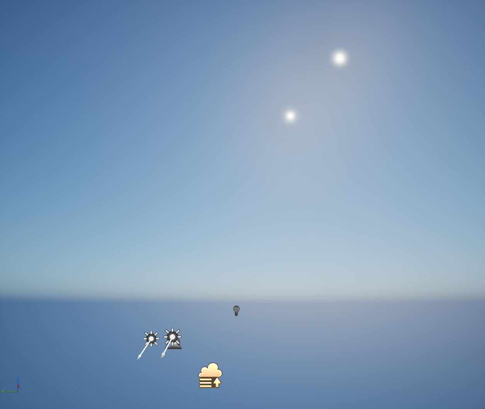
注意到下方不再是黑色了 而是填充成了蓝色 在细节选项卡里 我们可以修改雾的密度 雾高度衰减

在 更多 - 视觉效果 里找到体积云 拖入视口

现在我们选中一个太阳 将其旋转方向到地平线附近 在细节选项卡里找到使用色温并勾选 然后修改温度 这样就会呈现不同的颜色

我们在大纲视图里新建一个名为sky的文件夹 把刚刚添加的所有这些关于天空的Actor都移动到里面 按住ctrl可以批量选中 顺便把它们的x y都修改成0 同时把z轴坐标拉开一些距离 方便我们找到它 同时也方便我们通过聚焦它来找到世界的中心 当然也可以通过双击世界分区上的某个位置来快速跳转


## 地形

项目名称下方 我们现在是选择模式 接下来切换到**地形模式**

在左侧面板 将**组件数量**修改成16×16 当然这个数字是随意的 然后点击下方的创建 创建的时候一定要选一个材质 这样才能看到地面

看左侧面板 我们现在处于雕刻模式 这种状况下鼠标就不能轻易使用了 于是我们最好使用快捷键shift+1 切换到选择模式 这样就可以摆放各种物体 选择模式下 我们点选地面 发现是选中了一个格子 在大纲视图下是定位到了LandscapeStreamingProxy一串数字 这代表的就是一个组件 而我们之前创建了16×16个这样的组件 选中它时 按下delete 就可以删除


**圆形笔刷** 笔刷衰减的意思就是 内圆和外圆之间的差距 其余笔刷的各种功能 请自行体会


*选择了草地材质创建地形 试着使用雕刻模式下的星星图标Alpha笔刷雕刻了*

**材质**一般都是和网格体绑定在一起 我们随便拖入一个静态网格体 **静态网格体都是`SM_`一串字母命名的** 在大纲视图里 右键 浏览至资产 双击这个静态网格体 进入静态网格体编辑器 就可以查看它的材质 或者在细节面板 往下翻 就能看到它的材质 如果是复杂的静态网格体 比如房子 它应该有多种材质 这些很多的材质都是`MI_`一串字母 这是基于`M_`材质创建的一个材质实例 我们在内容浏览器里搜索`M_` 随便找到一个材质 右键 引用查看器 就能知道到底有哪个静态网格体使用了这个材质 我们先把使用了这个材质的静态网格体 随便选一个拖入视口中


双击这个材质 就可以看到它的各种参数


我们可以把这个弹出来的编辑器选项卡 拖到我们的关卡旁边 从此之后 我们再点击静态网格体或者材质 它都不会是一个新的弹窗 而是**作为选项卡 出现在我们的关卡选项卡旁边** 我们点击Texture Sample里的方形纹理贴图 它就会在内容管理器里 以文件夹视图显示


我们回到那个材质 按住alt键 然后鼠标左键点击纹理采样的RGB输出节点 就能看到没有这个贴图时的样子


点击左上角的应用 所有使用这个材质的东西就会都发生变化 可以回到关卡里查看一下差异


再刚才点击的RGB那里 鼠标左键拖拽连接到基础颜色 就重新连接上了

我们整个地形都是完全相同的草地材质 之前我们用的材质都是从静态网格体借用的 现在去Fab里专门下载一些适用于地形的各种材质

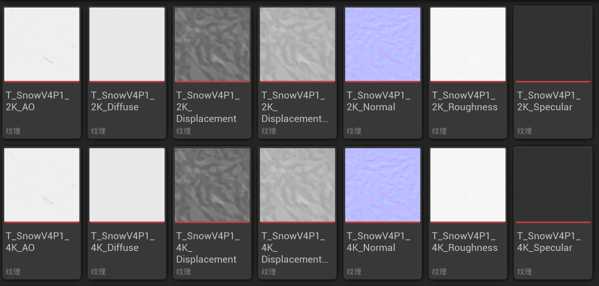
现在打开的这个是雪地材质 这种蓝紫色的就是**法线贴图** 名字常常是一串字母_normal 它是管理材质的凹凸不平的

现在 我们在内容文件夹里 创建一个名为landscape的文件夹 顺便整理一下我们之前导入的资产 如果想要移动资产的位置 请务必在UE里移动 而不是在windows文件资源管理器里移动 会发生混乱


进入Landscape文件夹 右键新建一个材质 命名为`M_Landscape` 然后双击进入材质编辑器 左侧细节面板 往下翻 可以找到一个名为**完全粗糙**的复选框 因为地面是没有反射性的 它没有光泽和闪光 应该是粗糙的

我们现在主要关心基础颜色和法线 其实我们可以导入纹理作为基础颜色 或者 导入一个法线贴图 连接上就可以了 但我们希望地形可以使用多种材质 就需要使用**图层** 在材质图表的空白处右键 搜索Landscape Layer Blend 

左侧细节选项卡出现了 材质表达式地形层混合 图层 0数组元素 点击右边的加号 这样我们就添加了一个数组元素 点击 索引[0] 左侧的小三角 就可以展开 看到这5个成员 在材质列表里现在显示的是Layer None 这是因为我们在细节面板里命名的图形名称为None
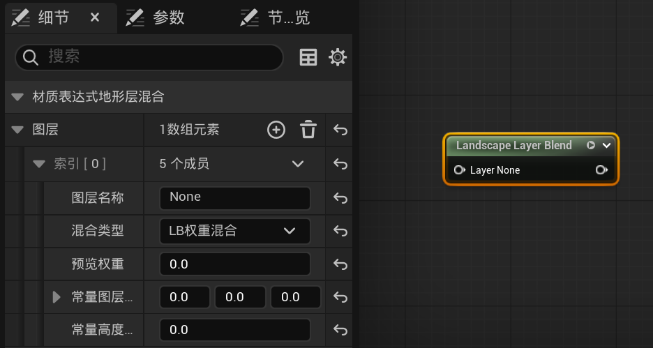

我们将其重命名为Snow 不要使用空格 混合类型可选权重混合、透明度Alpha混合、高度混合 我们使用**权重混合**来混合这个材质层和其它图层

回到内容侧滑菜单里 找到一个想要的纹理 拖拽到`M_Landspace`的选项卡上 然后放到材质图表里 将纹理的RGB连接到Landscape Layer Blend上 再将Layer Blend连接到基础颜色上


现在我们需要添加法线纹理 选中Layer Blend 按ctrl+D直接复制这个图层列表 或者按ctrl+C再ctrl+V也可以 同样是连接上 再将图层连接到法线上 我稍微更换了一些材质 调整了布局 增加了AO和Normal纹理 如下图


现在把我们的Landscape的材质切换为刚才我们编辑的材质M_Landscape 然后切换到地形模式 - 绘制 - 目标层 - 层 点击右侧倒数第二个像地球一样旁边有箭头的图标 如下图中黄色高亮部分 **从指定的材质创建层**


然后可能还是没有任何变化 重新打开UE 先把地形材质换成其它的 再换回来 就会出现 如果还没出现 就再重启UE
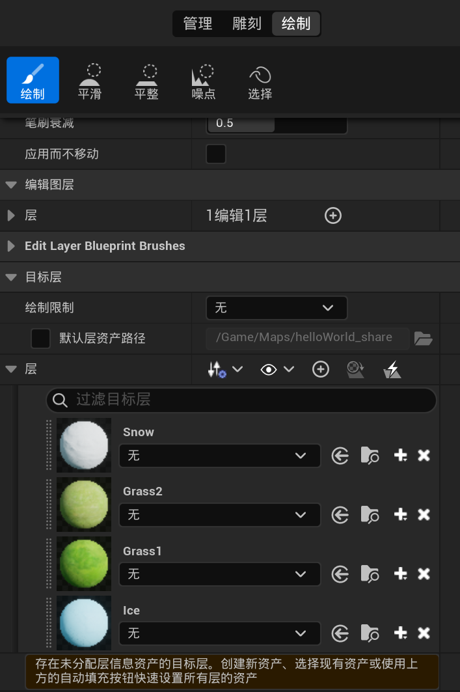

点击Grass1右边的加号 **创建层信息** 会让我们选择 是权重混合层 还是非权重混合层 权混合图层会彼此混合 当我们在一个图层上绘制另一个图层时 它们会混合在一起 非权重混合层不会混合在一起 是一层一层叠加的 比如泥土上的雪 不会混合在一起 而就是呈现出 雪覆盖在泥土之上 我们现在使用**权重混合层** 会出现一个弹窗 创建新地形层信息对象 我们就将其保存在Landscape文件夹里 也不需要修改名字 它默认的名字就是 Grass1_LayerInfo 我们对每一个图层都这样做
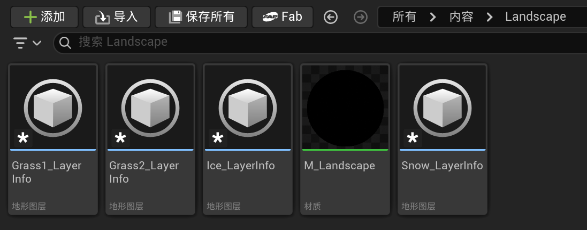

现在可以开始绘制了 先在绘制面板中右键Grass1选择填充图层 这样整个地图就都是这个材质了 选择材质和笔刷进行绘制就好


有时候我们打开地图时 发现之前做的东西都消失了 这时候打开世界分区选项卡 随便用鼠标选定框选一个区域 右键 从选择加载区域 这样我们做的东西就又出现了


为了方便地形的快速加载 我们可以打开M_Landscpae 选中所有纹理 都换成 **共享：包裹** 然后点击应用


## 植被

现在我们添加植被 从选择模式切换到植被模式 在资产中找到**静态网格体植物** 拖入+植被下方的空白处 使用静态网格体植物 就可以使很大数量的相同植物共享纹理的内存位置 效率更高 它们唯一不同的地方就是位置、旋转角度、缩放比例 我们也可以将静态网格体拖入其中 它会有弹窗 创建成为新的静态网格体植物

植物面板里的植被 左上方有复选框 按住ctrl或者shift可以多选 这时点击其中一个植物的复选框 其余被选中的都会跟着一起勾选 进入绘制模式 请尽量将绘制密度缩小 否则加载地图会很慢

对于静态网格体 我们可以在编辑器里打开它 找到它的材质 它的材质的参数组里有一栏为wind 我们可以将遥远的批量植被的风力关掉 优化性能 可以对会动的物体使用Nanite的 Nanite允许你使用极高多边形网格 而计算成本只是很小的一部分


如果想批量修改某些资产的属性 可以批量选择后 右键 - 资产操作 - 编辑**属性矩阵**中的选择 这个操作对于静态网格体和静态网格体植物都能使用
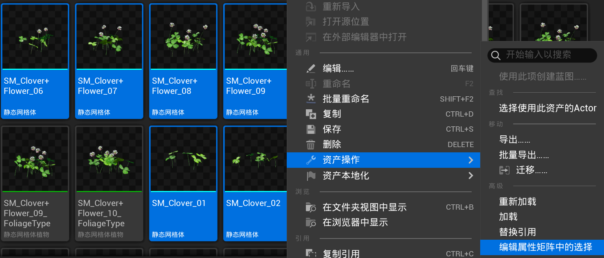

我们就使用这个功能 对于这几种树的静态网格体植物 打开属性矩阵编辑器 在右侧 固定列 面板中 搜索碰撞 将碰撞描述文件名修改为 BlockAll 现在双击某一种树的静态网格体植物 在弹窗中往下拉 可以看到碰撞预设现在是BlockAll 我们进入PIE模式 就能发现自己无法穿过这些树

## 后期处理特效

回到选择模式 点击左上方那个盾牌右下角绿色加号按钮 打开放置Actor面板 在更多 - 体积 里找到 **后期处理体积** 将其拖入视口 在细节面板 - 通用 里找到 后期处理体积设置 - 无限范围（未限定） 勾选它 这样就可以应用到整个关卡

后期处理体积可以改变场景的显示效果 在细节面板可以看到很多调色功能面板 颜色分级 电影 透镜 都可以尝试 透镜 - bloom就是光晕效果 会对场景中的太阳和灯光造成影响 透镜 - Exposure里的Min EV100和Max EV100 都是亮度 


*仅调节色温5500 global绿色饱和度3 bloom2.5 变化不明显*

## 关卡实例

可以批量选中静态网格体 右键 - 关卡 - **创建关卡实例** 也可以**创建已打包关卡Actor** 使我们将关卡实例打包到称为Actor的东西中 我们还没有正式讨论过Actor 但我们知道场景里的所有东西都是Actor 我们就选择创建已打包关卡Actor *New Packed Level Actor* 它让我们选择枢纽点类型 枢纽点的意思就是旋转中心 我们想让它怎么旋转 它会将旋转中心放在网格体最低高度的中心位置 我们就使用默认的中心最小Z 接下来就出现一个另存为的弹窗 我们在Maps文件夹内新建一个名为 PackedLevelInstances的文件夹 将这个关卡起个名字保存起来 之后又出现 资产另存为的弹窗 我们就将它存储在刚才保存的关卡旁边
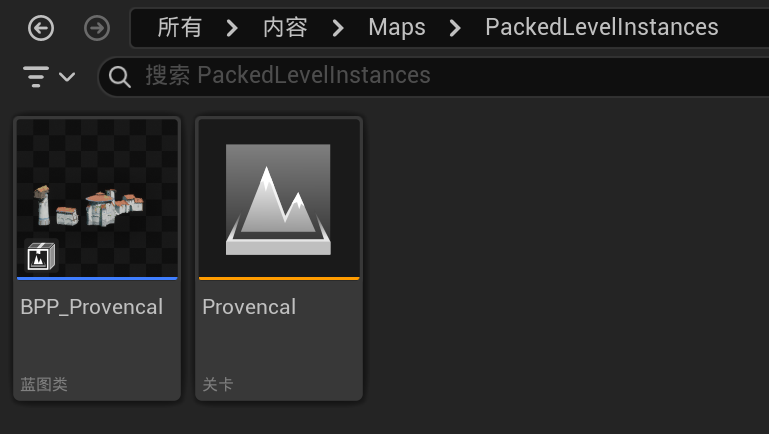现在可以发现 大纲视图中那些零散的静态网格体消失了 而是整合成了一个**蓝图类** 现在它们可以整体地拖动 点击这个关卡 因为没有灯光所以漆黑一片 但是在大纲视图里可以看到组成它们的静态网格体 点击其中的某一个就可以看到轮廓 也可以从光照模式切换到无光照或者线框模式 看到它们 而在现在的这个小关卡内 我们就可以随意移动它们 修改结束之后 右键这个关卡 点击**更新压缩蓝图** 大关卡里的对应部分就会发生变化
不存储成蓝图 直接将其它关卡拖拽进现在的关卡也可以 但是就不能像蓝图一样能保持更新

双击我们刚刚保存的蓝图类 就会打开蓝图编辑器 我们进来的时候默认是 事件图表 选项卡 点稍微左边的 视口 我们就可以看到这个蓝图的图形 这就是Actor 它是由许多单独组件组成的 在左侧的 组件 选项卡中 可以看到组成它的组件的名字 这些都是关卡实例组件 比普通的静态网格体效率要高 

回到我们的关卡 点选视口里的这个蓝图类 右键 - 关卡 - 中断 - 破坏关卡实例 这样它就变回了离散的静态网格体

现在去Epic Games里 下载Project Titan示例 我们将从中获取资产 顺便使用一些蓝图类的资产 继续地编


地图中的某个静态网格体或者关卡摆好了位置 可以在大纲视图对其右键 替换选中的Actor 在它原来的位置上替换为其它Actor 也可以在细节面板里切换
如果某个关卡导入后 拖拽时 不能使所有部件都一起移动 可以先移动其主要部分到达理想位置 再在细节面板 所有 - 关卡 里先换成None 再切换为我们导入的关卡 就会全都跟着过来了

如果有静态网格体的某个部分很多余 可以从选择模式切换到**建模模式** 选中静态网格体 在左侧面板中 选择 - **三角形选择** 用笔刷在静态网格体上选中需要删除的部位 之后点击 网格体编辑 - 删除 最后点击视口下方的 选择三角形 - 接受 如果是想把这一部分分离出来 比如把门从房子上拆下来 成为独立的静态网格体 就点选 网格体编辑 - 分隔 还需要做一步改变旋转轴 选中门 在想作为旋转中心的地方右键 - 锚点 - 在此处设置枢轴偏移

# UEC++

## 向量

向量 包含大小和方向 那么它是如何存储的呢 和二维坐标一样 也是存储在一个**有序对**中 x, y分别是顶点到终点在x轴或y轴上的距离之差

假设有一个角色 它有个坐标 敌人也有自己的坐标 假如有个AI系统 那么就需要知道敌人到角色的距离和方向 也就是敌人到角色的向量 才能追上角色 那么(x2-x1, y2-y1, z2-z1)就是向量 又比如角色要瞄准敌人 射出一支箭 那么就需要角色到敌人的向量 假设角色打偏了 枪声使敌人注意到角色 试图反击 此时就需要知道敌人到角色的向量 这是角色到敌人向量的反向向量 只有符号相反

向量也有数乘 加减法

假设有一个敌人 在空间中有坐标 并且占据一定范围的空间 也有一个角色 在某个坐标 假设这个角色有一个特殊攻击 比如火球 火球只能飞那么远 假设角色正瞄准敌人 那么就是需要角色到敌人的向量 但是向量的长度是只有那么远 还不足以打到敌人 假设这个角色得到了某种buff或强化 射程翻倍 这时候就需要向量数乘 ×2

我们可以用向量来表示一个东西的坐标 也就是从原点到这个坐标的向量 **位置向量** 坐标也用向量表示之后 就可以通过 一个东西的位置向量 一个东西到另一个东西的向量 使用向量加法 就得到另一个东西的位置向量

敌人要接近玩家 每个敌人都有指向玩家角色的向量 但是这个向量的长度要根据敌人的移动速度进行缩放 这就需要单位向量 再乘以敌人的移动速度 就是我们需要的向量 将向量除以向量的长度 就可以得到单位向量

UE使用的是**左手系** 但是物体也有它自己的坐标 也就是相对于世界坐标的那个local坐标系 规定**物体的前进方向为x轴** z代表它的上方 而既然使用左手系 y轴就是它的右侧方向 那么绕y轴旋转就是改变它的俯仰角 pitch 绕z轴旋转是改变了它的偏航角度 yaw 绕x轴旋转是改变它的滚转角 roll

## UE的Visual Studio推荐设置

工具 - 选项 - 项目和解决方案 - 常规 取消勾选生成完成时有错误则始终显示错误列表

工具 - 选项 - 文本编辑器 - 所有语言 - 滚动条 勾选使用垂直滚动条的缩略图模式

工具 - 选项 - 文本编辑器 - C/C++ - 高级 - 浏览/导航 将 隐藏外部依赖项文件夹 置为True

工具 - 选项 - 文本编辑器 - C/C++ - IntelliSence - 启用64位IntelliSence

工具 - 选项 - 文本编辑器 - C/C++ - 查看 将 **显示非活动块** 置为False
因为UE5建议我们使用实时编码 而不是热重载

工具 - 选项 - 调试 - 常规 - 启用热重载 取消勾选

工具 - 自定义 - 命令 - 工具栏 将下拉菜单修改为 标准 然后点击下方预览中的 解决方案配置 再点击其右侧的 修改所选内容 将宽度变更为200

## UE 类的继承

```c++
UObject
  ↓
AActor
  ↓
APawn  
  ↓
ACharacter
```

UE继承体系的顶层是名为UObject的类 UObject的实例称为object
UObject类派生出AActor类 称为actor
APawn类继承自AActor ACharacter类继承自APawn

所有继承自UObject但不是Actor的类 类名前都加U前缀 这样就能从类名看出来它不是Actor 而是一个UObject
所有继承自Actor的类 类名前都加A前缀

1. **UObject**类 很基础 能存储数据 但不能自己放到场景里
2. **Actor**类 继承了UObject类的一切 可以放进关卡里 所以在游戏关卡里看到的一切都至少是从Actor类及其子类开始 Actor可以有视觉表现 比如网格体
3. **APawn**类 继承自Actor 它们可以被控制器controller操控 控制器是一种专门用来控制Pawn的Actor 当你按下WASD角色发生移动时 是因为控制器接收到了你的输入 进行处理 并将信息转化为角色向前移动的动作 对于那些需要根据某种输入移动的事物 无论是玩家按键移动鼠标 还是通过AI计算的输入 就用Pawn
4. **ACharacter**类 继承自APawn类 因此也能被控制器操控 它还具有更多功能 更适合像人类这样的双足生物 它包含一个角色移动组件 负责各种与移动角色相关的计算 所以Character只是具有更多功能的一种特殊类型的Pawn 一般来说如果你需要一种非常基础的生物 只需要接收输入并四处移动 用Pawn就够了 但如果想要更多Character特定的功能 就要用Character了

我们把父类的名字命名为Parent类 子类命名为Child类 我们可以说一个Child类的实例同时也是一个Parent 它继承了Parent类的功能和变量 却不能说一个Parent是一个Child

假设你有一个类 它可以拥有自己的变量 这些变量中 有些可能是其它类或者结构体的自定义数据类型 所以你的类里可能有个成员变量 它本身就是另一个类的实例 我们把第一个类称为外层类 另一个类称为内层类 内层类也可以有它自己的变量 有一些变量的数据类型是来自于其它类和结构体的 所以内层类里还是有内层类

UE中 类就经常这样嵌套 游戏项目的顶层 有一个名为Package包的类 Package类里嵌套/包含着一个名为World世界的类 World类里嵌套/包含着一个名为Level关卡的类 现在一些obejct就放在关卡里 这些都是从Actor或者其更低的继承层级派生的类 所以Level包含Actor Actor有它自己变量 有些是Component组件 Component是Actor拥有的子类 它提供Actor可以使用的附加功能 所以Actor可以拥有一个或多个Component 有些object不像这些类一样放在Package里 这些通常是资源 比如meshes、textures、sound files等等


## reflection与垃圾回收

**reflection**是程序在运行时自检的能力 程序会分析自身内部的情况 然后收集程序数据 C++没有自带reflection功能 但是UE有自己的reflection系统来收集这些数据 这个reflection系统负责把数据和UE编辑器系统整合 把部分数据暴露给蓝图 并用**垃圾回收**自动管理内存 不用的时候自动删除对象 这样就释放了内存

假设你动态分配了一个堆对象 又创建了一个指向这个对象的指针 指针变量一出作用域 指针就没了 在UE中 如果一个对象参与垃圾回收系统 垃圾回收系统就会追踪有多少个变量引用它 如果没有任何变量引用它了 这个对象就自动删掉了 在普通C++里 你需要自己释放内存 如果你遗忘了就会内存泄露 但是垃圾回收会自动删掉它 不需要我们手动delete了

要让类参与UE的垃圾回收 需要用**特殊的宏**去标记 来让reflection系统识别它

```c++
#include "Fighter.generated.h"

UCLASS()
class AFighter : public AActor
{
	GENERATED_BODY()

    UPROPERTY()
    UStaticMesh SwordMesh;
    
    UFUNCTION()
    void SwingSword();
}
```

UE的类声明顶部有一个**UClass宏** 用于所有继承自Uobject的类 这样这个类就能参与reflection系统 也就参与了垃圾回收
要让变量和函数也参与reflection系统 就要分别用**UProperty宏**和**UFunction宏**标记它们 这样我们才能把这些变量和函数暴露给蓝图
GENERATED_BODY宏 是**UE头文件工具 Unreal Header Tool, UHT**自动生成的
**带括号的宏** 有时可以像函数一样接收输入 这些输入叫作specifier说明符 可以改变这些宏的行为 所以我们可以自定义UPROPERTY宏和UFUNCTION宏 来控制它们如何把变量和函数暴露给reflection系统和蓝图

这些宏会在编译时触发UTH去生成reflection系统的代码 我们可以看到 使用了reflection系统的类 在头文件顶部都会有一个特殊的include文件 这就是`className.geneated.h`文件 这个**generated.h文件**中就包含UE因为这些宏自动生成的代码 这样reflection系统就能从这个类里获取信息

## 创建Actor

现在我们的项目是蓝图项目 任何蓝图项目 都可以通过创建第一个类转换成C++项目 点击顶部工具栏 工具 - 新建C++类 这里面有很多常用的类 鼠标悬停在上面就可以知道什么意思 但是UE里的类 远不止这些 点击所有类 就是所有的类

选择Actor 并点击下一步 类的类型可以选择public还是private 如果选择了public 就会发现下面的路径里 头文件在Public文件夹里 源文件在Private文件夹里
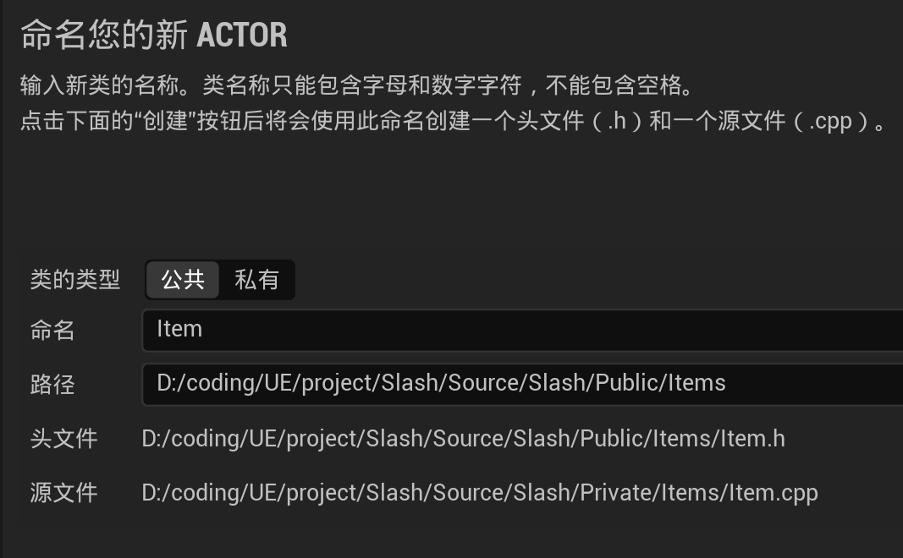

这时候就是按照visual studio的提示装一些插件 重新回到UE打开Slash项目时 出现了这样的问题
点yes也无效 所以 建议在创建C++类之前先**备份** 这样随时就可以回到蓝图模式

总之我尝试多种办法仍没能解决上面的问题 这里其实应该是装了Visual Studio Integration Tool插件之后发生的问题 但我尚未解决 于是最终在.uproject中用文本编辑器禁用了这个插件

现在还是选择                                                                                                                                                                                                                                                                                                                                                                                                                                                                                                                                                                                                                                                                                                                                                                                                                                                                                                                                                                                                                                                                                                                                                                                                                                                                                                                                                                                                                                                                                                                                                                                                                                                                                                                                                                                                                                                                                                                                                                                                        新建一个新的C++项目 为了配合名为HelloWorld的地图关卡 将这个项目命名为HelloWorld 并把之前这个蓝图项目的content文件夹全部在UE编辑器里迁移过去 现在再去新建Actor就可以成功了

现在 收起内容文件夹 可以看到下方还有一个C++类文件夹
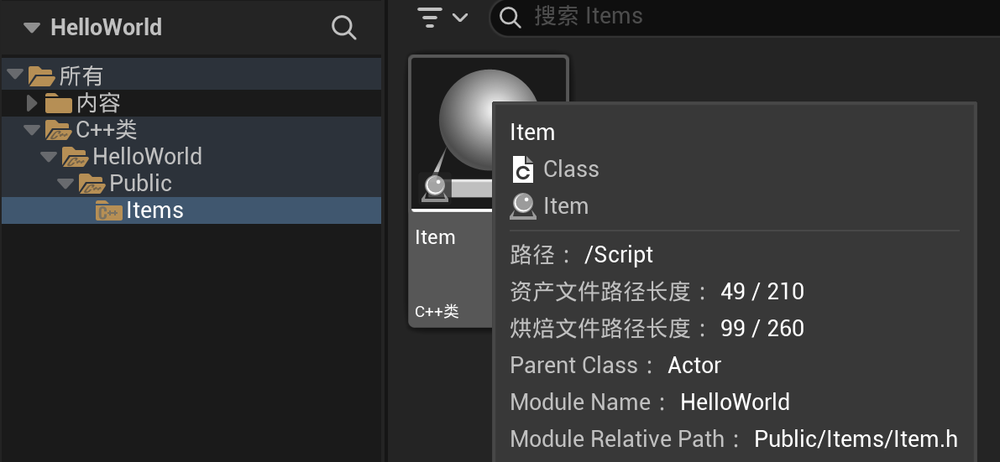

可以看到 父类是Actor 模块/module名是HelloWorld 我们的游戏项目是Visual Studio解决方案里的一个module module的相对路径是`Public/Items/Item.h` 双击就会转到Visual Studio打开这个C++类

在VS解决方案资源管理器可以看到
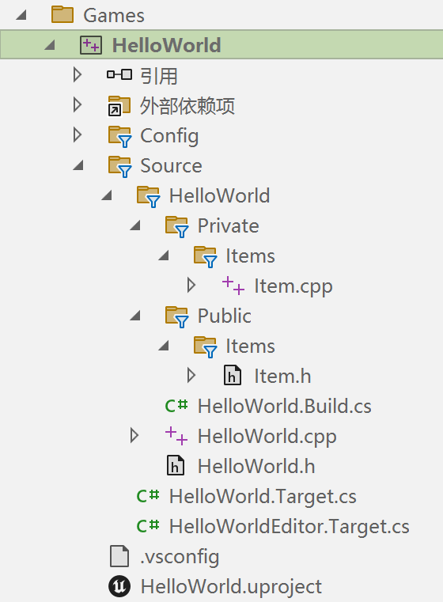

这几个`.cs`文件控制着项目包含哪些module 不用管它们 至于HelloWorld.cpp HelloWorld.h是项目自动生成的 里面只有头文件和宏

```c++
// Item.h

#pragma once

#include "CoreMinimal.h"
#include "GameFramework/Actor.h"
#include "Item.generated.h"

UCLASS()
class HELLOWORLD_API AItem : public AActor
{
	GENERATED_BODY()
	
public:	
	// Sets default values for this actor's properties
	AItem();

protected:
	// Called when the game starts or when spawned
	virtual void BeginPlay() override;

public:	
	// Called every frame
	virtual void Tick(float DeltaTime) override;
};
```

我们现在逐行查看Item.h

```c++
#pragma once

#include "CoreMinimal.h"
#include "GameFramework/Actor.h"
#include "Item.generated.h"
```

如果想要继承某个类 就必须包含它的头文件 在Item.h里 则是包含了Actor.h的头文件 而Actor的头文件在Game框架里 这个generated.h文件就是前文提到的 它包含了使我们的类参与reflection系统所需的所有代码 所以后面使用了UCLASS宏 这样AItem类就可以参与UE的reflection系统

```c++
UCLASS()
class HELLOWORLD_API AItem : public AActor // 继承自AActor类
{
```

鼠标悬停在`HELLOWORLD_API`上 可以看到它展开后是`__declspec(dllexport)` 意思是这个类型可以被dll动态库使用 这是UE自动添加的 我们不用管它 创建新类时它都会自动存在 

```c++
	GENERATED_BODY()
```

编译时 这个GENERATED_BODY宏会被generate.h文件中的部分代码替换 从而增强这个Actor的功能 所以可以把我们的这个类理解为一个功能增强的普通C++类 它能参与UE的幕后工作 从而与引擎的reflection连接 这样就可以做很多事情 比如可以基于这个类创建蓝图 并将属性创建给蓝图 

```c++
public:	
	// Sets default values for this actor's properties
	AItem();

protected:
	// Called when the game starts or when spawned
	virtual void BeginPlay() override;

public:	
	// Called every frame
	virtual void Tick(float DeltaTime) override;
};
```

public中 默认情况下已经有了一个构造函数 注释也告诉我们 构造函数会设置这个Actor属性的默认值
proctected中 包含一个虚函数void BeginPlay的重写 意思是BeginPlay是一个虚函数 继承自Actor类 我们正在重写它 注释说 游戏开始或者游戏中实体生成时调用
底部的public中 有一个名为Tick的函数 是虚函数的重写 接收一个名为DeltaTime的浮点数参数 注释说每一帧都会调用 所以tick函数会每秒钟调用多次

```c++
// Item.cpp

#include "Items/Item.h"

// Sets default values
AItem::AItem()
{
 	// Set this actor to call Tick() every frame.  You can turn this off to improve performance if you don't need it.
	PrimaryActorTick.bCanEverTick = true;

}

// Called when the game starts or when spawned
void AItem::BeginPlay()
{
	Super::BeginPlay();
	
}

// Called every frame
void AItem::Tick(float DeltaTime)
{
	Super::Tick(DeltaTime);

}
```

在Item.cpp中 可以看到构造函数的定义
`PrimaryActorTick.bCanEverTick = true;`
注释说 设置这个Actor在每一帧调用Tick() 如果不需要就可以关闭它来提升性能 所以如果我们不需要这个Actor使用Tick函数 就可以把这个true设置为false
我们将鼠标悬停在PrimaryActorTick上 或者直接右键速览定义 可以看到它的类型是FActorTickFunction 这是一个结构体 在EngineBaseTypes.h文件中定义 包含名为bCanEverTick的bool变量 可以看到它的定义 `uint8 bCanEverTick:1` 意思是 本来这是一个uint8 无符号8位整数 通常占1字节 但是使用`:1` 这是**位域** 表示这个变量只占用1bit 而不是一整个byte 节省内存
所以不是所有的变量都直接在Actor类中声明 而是引擎将其打包成了结构体 这样Actor类就不会被变量和函数填满了 这就是UE将 类 按行为的类别 组织起来的一种方法

还有BeginPlay和Tick 发现它们的前面还有一个Super 这是作用域解析符 后面跟着函数名 这是UE的一个功能 意思是我们正在调用这个函数的父类版本 我们现在的Item类继承自Actor类 所以父类的版本就是Actor类的版本 我们现在调用的BeginPlay和Tick都是Actor类的版本

现在有两个public 所以我们可以整理一下 顺便把注释删掉一些

```c++
// Item.h
#pragma once

#include "CoreMinimal.h"
#include "GameFramework/Actor.h"
#include "Item.generated.h"

UCLASS()
class HELLOWORLD_API AItem : public AActor
{
	GENERATED_BODY()
	
public:	
	AItem();
	virtual void Tick(float DeltaTime) override;

protected:
	virtual void BeginPlay() override;
};
```

```c++
// Item.cpp
#include "Items/Item.h"

AItem::AItem()
{
	PrimaryActorTick.bCanEverTick = true;
}

void AItem::BeginPlay()
{
	Super::BeginPlay();
}

void AItem::Tick(float DeltaTime)
{
	Super::Tick(DeltaTime);
}
```

## 创建蓝图

现在我们可以从内容侧滑菜单 把我们的Item拖入视口 于是我们在大纲视图里就可以看到它 在细节面板的Actor选项卡中 甚至没有改变它的位置的选项 因为它现在太简陋了 什么都没有 一般情况下我们不会直接把C++类拖拽进来 我们做的是基于C++类创建蓝图 我们的Item继承自Actor类 我们可以把蓝图理解成C++类的子类 我们创建从C++类继承的蓝图 C++类是父类 所以蓝图会继承C++的功能 蓝图让我们在编辑器里操作类时 能以更好的方式与之交互 所以我们现在先把拖拽进去的这个Item类先删掉 然后基于Item类创建一个蓝图

在内容文件夹里新建文件夹 命名为Blueprints 在其中再新建一个文件夹 命名为Items

我们可以在C++类里 右键Item类 点击 **创建基于Item的蓝图类**
或者进入我们的想要存放蓝图类的文件夹 也就是Blueprints/Items文件夹 在空白处右键 新建一个蓝图类 就会有一个弹窗 让我们选取父类 在 所有类 中找到我们的Item类 命名为BP_Item 这样就知道这是Item的蓝图类 而不是C++类 

现在我们把它拖拽进视口 这一次可以移动它的位置了 我们在内容侧滑菜单中双击BP_Item 就可以进入蓝图编辑器  可以看到视口左下角有一个左手系 这是它自己的局部坐标系 左边是组件面板 默认情况下 所有Actor至少含有一个组件 默认自带一个根组件和一个组件
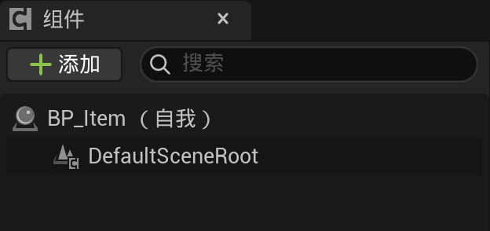

双击DefaultSceneRoot 在右侧细节面板会显示一些信息 这里显示的是蓝图类自身的全部属性

视口上方有几个选项卡 视口、构造脚本、事件图表

**事件图表**就是我们放蓝图节点 执行蓝图逻辑的地方 蓝图是一个独立的系统 用来编写功能 用蓝图节点代替写代码 现在这里已经有几个节点了 BeginPlay、ActorBeginOverlap、Tick 因为我们现在还没有用到它们 所以显示灰色

现在我们可以右键新建节点 比如我们希望游戏开始之后就打印字符串 我们右键搜索print 选择Print String 这前面花体f的意思是函数 我们把BeginPlay的执行引脚连接到Print String上 鼠标悬停在Print String上粉色的圆圈上 信息提示要输出到日志的字符串 我们可以连接变量等输入 来决定要打印的字符串 或者直接双击Hello文本框里进行编辑 我们就修改成BeginPlay
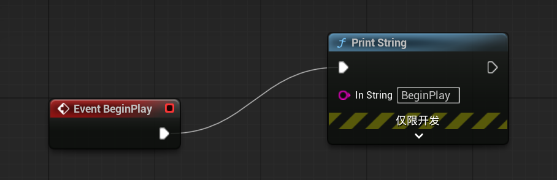

我们修改了蓝图 在整个蓝图编辑器的左上角 有一个 编译 按钮 这就像在C++里修改代码 然后在IDE里编译一样 可以点击编译进行编译 或者直接点击右上角的绿色三角开始玩游戏 开始游戏后蓝图会自动编译 我们现在把这个蓝图编辑器选项卡拖拽到关卡选项卡旁边 然后点击蓝图编辑器里右上方的的绿色三角 现在游戏就在一个单独的窗口运行 并且可以全屏 我们回到关卡里 再次进入PIE模式 就会发现左上角会短暂显示一条信息

Print String节点中 仅限开发 的下方小箭头是下拉菜单 可以显示一些额外的属性 比如文本颜色Text Color 持续时间Duration 单位是秒 所以**Print String可以用来验证某个函数或者事件是否执行了** 就像我们常常在写代码时中使用的print

BeginPlay节点是红色 是事件 Event
Print String节点是蓝色 是函数

将鼠标悬停在BeginPlay节点右上角的红色方块上 会显示Output Delegate委托 所以“事件”是蓝图术语中对于“委托”的称呼 虽然我们现在完全不知道委托是什么意思 和函数不一样 事件没有输入执行引脚

我们再看**构造脚本**选项卡 有点像事件图表 但是它**在游戏开始前就运行了 事实上只要这个蓝图的任何属性发生变化 它就会执行** 比如我们进入蓝图的细节面板 对其进行修改 每次修改任何内容 这个构造脚本都会触发 所以很适合在游戏开始之前做一些准备工作 而**事件图表中的节点是在游戏过程中执行的**

如果我们开始游戏时在地图中的位置 距离我们刚刚摆放这个蓝图太远 它就不会输出我们刚才设置好的文本 因为太远了 这是开放世界的特性

## 日志系统 TEXT宏

我们刚才的操作能验证蓝图版本的BeginPlay确实被调用了 现在我们要去验证C++版本的BeginPlay是否被调用了 所以我们先把那个Print String节点删掉 回到Visual Studio 打开Item.cpp 这就是BeginPlay函数 我们想打印一些文本到日志里 要使用UE的专用宏**UE_LOG**

我们在BeginPlay中添加一行 `UE_LOG()` 当我们打字到这里时 将鼠标悬停在UE_LOG上 就可以看到一个庞大的提示框
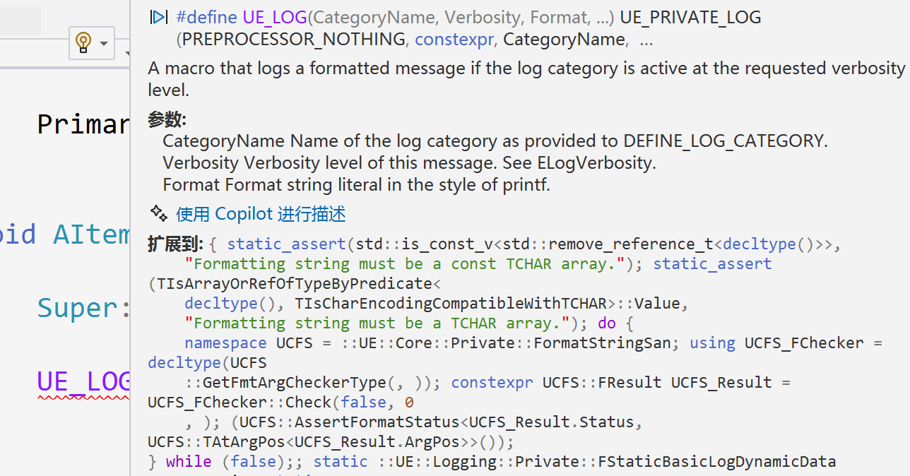
里面写了它需要的参数

第1个是CategoryName 类别名称 现在有很多日志类别 甚至你可以自定义 但我们在这里使用**LogTemp** 是临时日志类别 用于调试时频繁添加和删除的日志

现在Visual Studio又提示我剩下的参数

也可以使用ctrl+shift+space来触发这个提示框

第2个参数Verbosity是日志详细级别 控制到Log Warning Error 我们这里就使用Warning级别

第3个参数 Format 指定日志输出的格式 比如
在这个小悬浮窗提示框里 Format再后面是`__VA_ARGS` 而在之前的那个大的提示框里 显示的Fromat后面是省略号 总之意思就是 UE日志可以接收任意数量的参数 VA是variable变量的缩写 ARGS是arguments参数的缩写 现在我们就只传一个 现在我们要传入的是一段文本字符串 来打印到输出日志 此处使用**TEXT宏** 它接收一个字符串字面量作为输入参数 比如 `TEXT("Begin Play called!")` 那么它就会把这个字符串字面量转换为Unicode格式 Unicode能包含的字符远比ANSI格式多得多 比如汉字

我们现在去查看UE官方文档 [C++ Coding Standard](https://dev.epicgames.com/documentation/zh-cn/unreal-engine/epic-cplusplus-coding-standard-for-unreal-engine) 在网页中按ctrl+F 搜索`TEXT()` 就可以看到它写着 

> 在字符串字面量周围固定使用 `TEXT()` 宏。
> 若未使用 `TEXT()` 宏，在文字中构建 `FStrings` 的代码将导致不理想的字符转换过程。 

现在我们完全不知道**FStrings**是什么 这是UE的字符串类型 我们使用print string时 注意到输入是字符串类型 但是在蓝图编辑里 UE会把F去掉 但它确实就是作为输入的FString 就像编辑器会去掉AActor前面的A

虽然你不用TEXT宏 看起来也能正常运行 但它背后会发生一些你看不到的流程 比如字符串转换 总而言之 **用TEXT宏包装字符串字面量是一个好的做法**

最终我们是在`AItem::BeginPlay`里添加了一行 `UE_LOG(LogTemp, Warning, TEXT("Begin Play called!"));` 这后面的分号 也可以不加 因为这是宏

```c++
void AItem::BeginPlay()
{
	Super::BeginPlay();

	UE_LOG(LogTemp, Warning, TEXT("Begin Play called!"));
}
```

现在 要编译它 我们只需要保存就可以了 我们并没有在VS里编译 现在回到UE
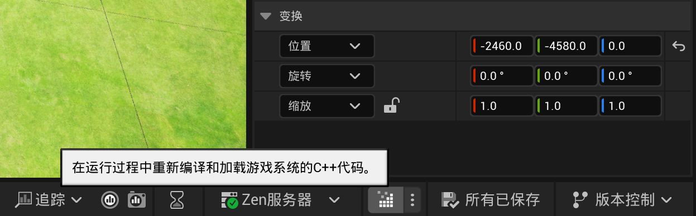

点击UE右下角的这个图标 这就是**热重载** 旁边的三个点是编译选项菜单 点击它 可以看到已经勾选了 启用实时代码编写 实施编码就是将C++函数的修改热补丁到当前进程 这比编译VS项目要快很多 我们就点击这个热重载图标 会出现一个实时编码窗口 稍等就会提示成功 然后我们关掉这个窗口

点击绿色三角进入PIE模式 点击视口左下方调出 输出日志 我们将其停靠在布局中 然后按绿色三角进入PIE模式 现在就会看到黄颜色的`LogTemp: Warning: Begin Play called!`

如果是在关闭UE编辑器时对于VS项目进行了修改 只点击热重载就会看不到变化 必须要**在VS中编译整个解决方案** 才能使改动在项目中生效 可以在解决方案资源管理器中右键 生成解决方案 或者在上方菜单栏 生成 - 生成解决方案 或者直接快捷键ctrl+shift+B 如果你是在打开着UE编辑器时去生成 VS会提示你把UE关掉 否则可能失败 也可以只生成我们修改了的module 本例中就是Build HelloWorld

VS还有一个快捷键 ctrl+F5 可以**编译并启动UE编辑器** 于是我们又打开了刚刚关掉的UE编辑器

刚才已经说过 当距离太远时 日志系统并不会打印 所以我们要找到一个较小的地图 新建关卡 - 基本 然后把我们的BP_Item拖拽进新的地图里 进入PIE模式 可以看到输出了Begin Play的日志

进入BP_Item的蓝图编辑器 Event BeginPlay没有连接引脚 但它却不是灰色 我们再拖拽Print String出来 连接上 这样从蓝图编辑器进入PIE模式时 左上角会输出文本 在搜索Print String时 还可以看到一个叫Log String的函数 这和UE_LOG宏很像

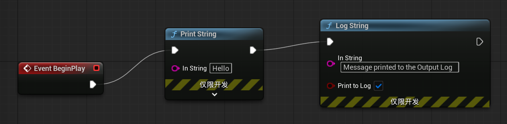

 这之后回到关卡 进入PIE模式 在输出日志里查找 我们可以在C++日志输出的黄颜色Warning的上一行找到 `LogBlueprintUserMessages: Message printed to the Output Log` 这是LogBlueprintUserMessages 日志蓝图用户消息 而不是LogTemp临时日志 再上一行是 `LogBlueprintUserMessages: [BP_Item_C_1] Hello` 这是PIE模式下浮现在视口左上角的字符串

Print String节点 点击 仅限开发 的下方小箭头 可以看到Key 鼠标悬停在上面 可以看到它的类型是Name命名 可以让我们指定一个值 来控制这些打印字符串消息的行为 现在是None ctrl+D再创建一个相同的节点 连接上 分别重命名


继续进入PIE模式 可以看到两个都打印出来了 2nd在上 1st在下 说明新消息会显示在上面 但是如果两个Print String使用相同的Key 新消息就会替换旧消息 而不是像现在这样叠加 所以如果我们把这两个Print String的Key都设为1 就会发现只打印2nd 因为第一个被第二个替换了

下面的tick事件 每一帧都会被调用 给它连接一个Print String
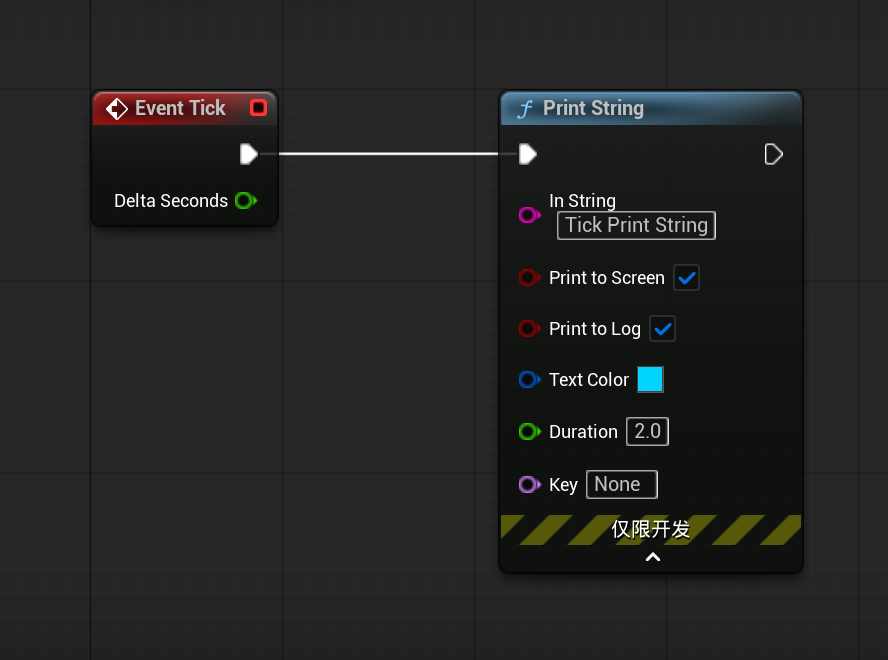

现在再进入PIE模式 它会一直满屏打印 如果我们把Key设置成有效的值 比如0 它就会一直保持在一个地方持续打印 持续时间超过我们设置的Duration2.0
Delta Seconds是一个浮点数 表示自上一帧以来经过的时间 增量时间 帧的持续时间很短 所以这个值会很小 毫秒级 将Delta Seconds连接到In String 会显示 浮点单精度to字符串 就会出现一个新节点 绿色进去 粉色出来 这是一个转换节点 负责把双精度浮点数转换成字符串 鼠标悬停在Delta Seconds 会显示它是单精度浮点数 但是这个转换节点 既能接受双精度数也能接受浮点数作为输入 这背后其实有一个隐式转换的过程
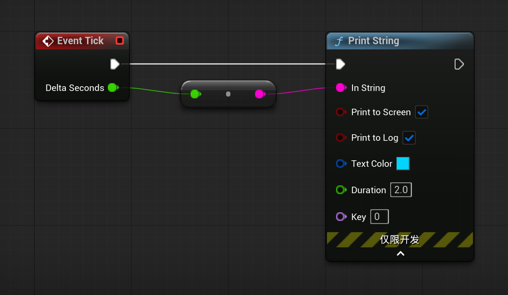

现在进入PIE模式 会打印出来Delta Seconds 这个数值一直在变 每一帧我们都会打印出Delta Seconds的值 而且这个值在不同的帧之间是会变化的

我们将所有这些Print String节点都删除 编译保存 回到C++

在Begin Play里 我们想向屏幕打印一条信息 而不是直接把它扔到输出日志里

输入GEngine并悬停 可以看到它是一个`UEngine*`类型的指针变量 提示我们全局引擎指针可能为空使用前需检查 这是一个全局指针变量 我们可以在任何类中访问它 这个指针有自己的函数 可以用->使用它

先检查一下GEngine是不是空指针 通常情况下它都是有效的 尤其是在BeginPlay函数执行后 BeginPlay函数通常在GEngine初始化完成后调用 但检查一下总是好的

我们使用GEngine全局变量的一个函数AddOnScreenDebugMessage

`GEngine->AddOnScreenDebugMessage(1, 2.f, FColor::Cyan, FString("Item OnScreen Message!"))`

IntelliSense会提示我们要传入的参数
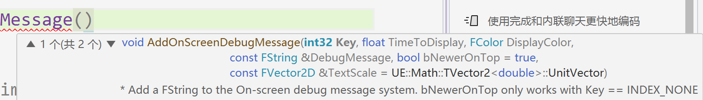

1个(共2个)的意思是 这个函数有两个重载版本 按小三角查看不同版本 第1个参数Key就是键值 用不同的键值对应不同的消息 第2个参数是显示时长 我们这里用2.f 也就是2的浮点数 消息会显示2秒 或者直接写2 那就是一个int 会自动从整数转换成浮点数 这里我们还是**直接用浮点字面量 省去编译器隐式转换的麻烦** 用浮点值时 我们常用.f指定它是浮点字面量 第3个参数是颜色 是FColor类型 输入`FColor::`就能看到一些选项 Fcolor**类有一些静态变量 不需要创建实例就可以调用** 静态变量里有一些现成的颜色 包含rgb和Alpha透明度这4个数值 cyan是蓝绿色 第4个参数是FString类型 在这里我们调用FString的构造函数利用字符串字面量创建一个FString 第5个参数是名为bNewerOnTop的bool值 默认情况下为true 意味着新的消息会显示在旧消息上方 再后面的其它**参数也都有默认值 我们不必须传入它们**

```c++
void AItem::BeginPlay()
{
	Super::BeginPlay();

	UE_LOG(LogTemp, Warning, TEXT("Begin Play called!"));

	if (GEngine)
	{
		GEngine->AddOnScreenDebugMessage(1, 2.f, FColor::Cyan, FString("Item OnScreen Message!"));
	}
}
```

我们回到UE进行热重载 成功地输出日志

现在我们想在tick函数里打印一下deltaTime的值

```c++
void AItem::Tick(float DeltaTime)
{
	Super::Tick(DeltaTime);

	UE_LOG(LogTemp, Warning, TEXT("Delta Time: %f"), DeltaTime);
}
```

UE_LOG函数宏里 参数个数随便加 所以直接把deltaTime放在这 使用格式说明符%f指定位置 UE_LOG就会用文本宏后面给出的第一个参数来替换%f 这种**格式说明符**来自于C语言的printf
回到UE热重载就会发现输出日志里一直在打印`LogTemp: Warning: Delta Time: 0.008333`

现在将其打印到屏幕上
```c++
void AItem::Tick(float DeltaTime)
{
	Super::Tick(DeltaTime);

	UE_LOG(LogTemp, Warning, TEXT("Delta Time: %f"), DeltaTime);

	if (GEngine)
	{
		FString DeltaTimeMessage = FString::Printf(TEXT("Delta Time: %f"), DeltaTime);
		GEngine->AddOnScreenDebugMessage(1, 2.f, FColor::Cyan, DeltaTimeMessage);
	}
}
```

`FString::Printf`是用于格式化字符串的静态函数 类似于C语言的sprintf sprintf和printf的区别就是 printf常常是输出到控制台 sprintf是输出到内存中的字符串变量 不会直接输出到屏幕

FString是UE自己的类型 和STL里的类似 最好还是用UE自带的类型 因为UE会尽力保证它用的所有类型和函数都是跨平台的

但是我们怎么能知道有`FString::Printf`这个函数的存在呢 我们可以直接右键FString 转到定义 然后查看它有什么方法 当然这高达2000行 我们可以阅读它 最前面是构造函数和重载操作符之类的 或者查看[FString官方文档](https://dev.epicgames.com/documentation/zh-cn/unreal-engine/fstring-in-unreal-engine)

如果我们现在想得到关卡里这个物体的名字

```c++
// 错误代码
if (GEngine)
{
    FString Name = GetName(); // 会返回关卡里这个物体的名字
    FString NameMessage = FString::Printf(TEXT("Item Name: %s"), Name);
    GEngine->AddOnScreenDebugMessage(1, 2.f, FColor::Cyan, NameMessage);
}
```

我们简单地以为可以这样写 但其实我们要写成
`FString NameMessage = FString::Printf(TEXT("Item Name: %s"), *Name);`

这个`*Name`看起来是指针的解引用 但实际上是**FString类重载了字符串的`*`运算符 这个`*`的作用是提供一个C风格的字符串** 对于这个`FString::Printf`的格式说明符比如%s 我们不能对它传入FString字符串 只能对它传入C风格的字符串 也就是字符串字面量`const char*` 对于UE而言准确来说是`const TCHAR*` TCHAR是宽字符数组的别名 能存储比char更多的信息 UE使用的是Unicode编码 比ANSI编码的普通字符信息量更大

UE文档里写着 使用%s参数包含FStrings时 必须使用`*`运算符返回%s参数所需的`TCHAR*`

所以现在要使用这个重载了的`oprator*` 将它转换成C风格的字符串 其实C语言的printf的%f 也是只能传入字符串字面量`const char*` 说到底 C并没有像C++那样的String类型 C的字符串本质上都是`const char*` 所以UE这个大概是模仿了C语言才这样规定的 而C++是没有这个格式说明符功能的 String是重载了operator+或者用append

UE_LOG使用%s时也是一样
`UE_LOG(LogTemp, Warning, TEXT("Item Name: %s"), *Name);`

```c++
void AItem::Tick(float DeltaTime)
{
	Super::Tick(DeltaTime);

	UE_LOG(LogTemp, Warning, TEXT("Delta Time: %f"), DeltaTime);

	if (GEngine)
	{
		FString Name = GetName();
		FString NameMessage = FString::Printf(TEXT("Item Name: %s"), *Name);
		GEngine->AddOnScreenDebugMessage(1, 2.f, FColor::Cyan, NameMessage);

		UE_LOG(LogTemp, Warning, TEXT("Item Name: %s"), *Name);
	}
}
```

修改后热重载 输出日志就会出现 `LogTemp: Warning: Delta Time: 0.008334` `LogTemp: Warning: Item Name: BP_Item_C_1`

现在在大纲视图选中我们的BP_Item 按ctrl+D再创建一个BP_ITem2 就会发现输出日志中既有BP_ITem_C_1也有BP_Item_C_0 这是它们的内部名称 每次tick都会打印2个DeltaTime 分别来自不同Actor对于Tick的调用

```c++
LogTemp: Warning: Delta Time: 0.008334
LogTemp: Warning: Item Name: BP_Item_C_1
LogTemp: Warning: Delta Time: 0.008334
LogTemp: Warning: Item Name: BP_Item_C_0
```

## 调试形状

### 调试球

对于我们的Item 它并不是静态网格体 没有形体 在PIE模式下我们看不到它们 但是现在我们还没有往Item类中添加任何网格 但还是想看看它们在游戏中的位置

需要头文件DrawDebugHelpers.h 里面有很多调试辅助函数 其中就包括一个绘制调试球体的函数DrawDebugSphere 翻译成中文就是绘制调试球 第1个参数是名为Inworld的UWorld类型指针 还记得吗在之前谈到[UE类的继承](#UE-类的继承)时说过 World是Package的子类 是Layer的父类 现在绘制调试球需要知道我们在哪个世界 可以使用`GetWorld()`获取我们所在的世界 VS有个小技巧是选中一些代码 使用鼠标拖拽就可以换到另一行里

```c++
GetWorld();
```

鼠标悬停在这个函数上面 可以看到它是返回一个UWorld类型的指针 提示信息里显示 这是一个缓存世界指针的名为Getter的指针 如果这个Actor实际上没有在一个关卡里生成就会返回null 为了遵守良好的C++编程规范 我们还是先检查一下它是否非空

第2个参数 中心坐标 类型是FVector 第3个参数 半径 float型 在数字后面用.f表示浮点数 第4个参数 segments 分段 因为球是网状的 就是网格分段的数目 int32类型 不同于我们平时使用的int 整数类型通常是32位 但大小会因平台而异 UE要确保我们一直用32位整数 所以是int32 第5个参数 颜色 第6个参数 bPresistentLines 会不会有持久线 如果设定为true 就会有持久线 也就是说调试球体不会消失 设置为false 就需要在第7个参数 设置球体的生命周期 单位是秒 

```c++
void AItem::BeginPlay()
{
	Super::BeginPlay();

	UWorld* world = GetWorld();
	if (world)
	{
		FVector Location = GetActorLocation();
		DrawDebugSphere(world, Location, 25.f, 24, FColor::Red, false, 30.f);
	}
}
```

回到UE热重载 进入PIE模式 就可以看到那些我们本来看不到的物体 周围是红色的球

### 函数宏

如果可以不要输入这么多参数也能制造一个调试球就好了 假如我们并不会修改这个球的半径 segements 颜色 生命周期 那么就使用**函数宏**

`#define THIRTY 30`
这样代码里所有用到整数30的地方 都可以用这个宏来替换 而函数宏就可以接受输入

```c++
#define DRAW_SPHERE(Location) if (GetWorld()) DrawDebugSphere(GetWorld(), Location, 25.f, 12, FColor::Red, true)
```

**用括号指定输入** 这里不指定类型 只给出输入名称 本例中就是Location **在同一行内写完的if语句是合法的** 当然还是写成大括号会更清晰

现在我们再在代码里使用`DRAW_SPHERE(GetActorLocation())` 它就会被替换成`if (GetWorld()) DrawDebugSphere(GetWorld(), GetActorLocation(), 25.f, 12, FColor::Red, true)`这样的代码

```c++
void AItem::BeginPlay()
{
	Super::BeginPlay();

	DRAW_SPHERE(GetActorLocation());
}
```

使用宏时 `DRAW_SPHERE(GetActorLocation())`或者`DRAW_SPHERE(GetActorLocation());` **有没有分号都可以**

使用调试形状时 性能会迅速下降 因为它并不是为发布的游戏准备的 就只是用来调试

现在这个宏是在Item.cpp里 只能在这个类里使用 如果把它放在头文件里 那么所有包含那个头文件的类就都可以使用这个宏 我们不妨将它放在HelloWorld.h里 然后在Item.cpp里include这个头文件

发现Item.cpp的路径是`???\HelloWorld\Source\HelloWorld\Private\Items\Item.cpp` `???`的意思是存放UE项目的文件夹路径 而HelloWorld.h的路径是`???\HelloWorld\Source\HelloWorld\HelloWorld.h` 直接写`#include HelloWorld.h`是找不到这个头文件的

于是我们在VS解决方案资源管理器里 右键HelloWorld项目 - 属性 - VC++目录 找到包含目录 这里面有很多包含目录 是由HelloWorld.Build.cs文件自动构建的
进入编辑 看到计算的值 就可以看到里面有

```c++
..\..\Source
..\..\Source\HelloWorld\Private
..\..\Source\HelloWorld\Public
```

所以 之前我们在Item.cpp里include Item.h 就需要写成`#include Items/Item.h` 因为Item.h是在`???\HelloWorld\Source\HelloWorld\Private\Items\Item.h`里

所以现在如果想要include HelloWorld.h 就要从`..\..\Source`开始 它的这两个`..` 是向上找两次父级 那么它是相对于谁的父级呢 然而HelloWorld.sln或者HelloWorld.uproject的位置 都是和source同级的 实际上它是位于`???\HelloWorld\Intermediate\ProjectFiles`里面的HelloWorld.vcxproj 它向上找两次父级之后 就是`???\HelloWorld` 所以`???\HelloWorld\Source`对它而言就是`..\..\Source`

而HelloWorld.h是在`???\HelloWorld\Source\HelloWorld\HelloWorld.h` 那么从Source开始写就是 `#include "HelloWorld/HelloWorld.h"`

```c++
#include "HelloWorld/HelloWorld.h"
```

### 调试线

调试线 从Actor位置开始 到Actore位置加上前向向量的位置结束 这样就能看到一条线 从Actor位置出发 沿着前向向量方向延伸到空间中的某个点 UE的默认单位是厘米 调试线对于**表示特定向量的方向**非常有用

```c++
void AItem::BeginPlay()
{
	Super::BeginPlay();

	UWorld* World = GetWorld();
	FVector Location = GetActorLocation();
	if (World)
	{
		FVector Forward = GetActorForwardVector();
		DrawDebugLine(World, Location, Location + Forward * 100.f, FColor::Red, true, -1.f, 0, 1.f);
	}
}
```

`GetActorForwardVector()` 返回的是前向方向的单位向量 也就是其本地坐标x轴的正方向 乘以100.f 就是将单位向量缩放为100个单位的向量 明明写了持续时间为true 但是为了后面能修改线条的粗细参数 还是要把持续时间写上来占位 默认值是-1.f 那么就写这个 这之后的参数是深度优先级 类型是uint8 无符号8位整数 决定了这条线是绘制在其它线的上面还是下面 在我们这里线条相互覆盖也无所谓 默认值是0 那我们就写成0 **数值越低优先级越高** 所以它会显示在其它线条上面 再下一个参数是线条粗细 

回到UE热重载就可以看到线条

也可以使用宏
```c++
#define DRAW_LINE(StartLocation, EndLocation) if (GetWorld()) DrawDebugLine(GetWorld(), StartLocation, EndLocation, FColor::Red, true, -1.f, 0, 1.f)
```

```c++
void AItem::BeginPlay()
{
	Super::BeginPlay();

	DRAW_SPHERE(GetActorLocation());
	DRAW_LINE(GetActorLocation(), GetActorLocation() + GetActorForwardVector() * 100.f);
}
```

### 调试点

离得远 看起来点会变大 离得越近反而点会变小 实际上它的大小是没有变的

```c++
void AItem::BeginPlay()
{
	Super::BeginPlay();

	UWorld* World = GetWorld();
	FVector Location = GetActorLocation();
	if (World)
	{
		FVector Forward = GetActorForwardVector();
		DrawDebugPoint(World, Location, 20.f, FColor::Red, true);
	}
}
```

函数宏
```c++
#define DRAW_POINT(Location) if (GetWorld()) DrawDebugPoint(GetWorld(), Location, 20.f, FColor::Red, true)
```

```c++
void AItem::BeginPlay()
{
	Super::BeginPlay();

	DRAW_SPHERE(GetActorLocation());
	DRAW_LINE(GetActorLocation(), GetActorLocation() + GetActorForwardVector() * 100.f);
	DRAW_POINT(GetActorLocation() + GetActorForwardVector() * 100.f); // 这里是把点画在线的终点
}
```

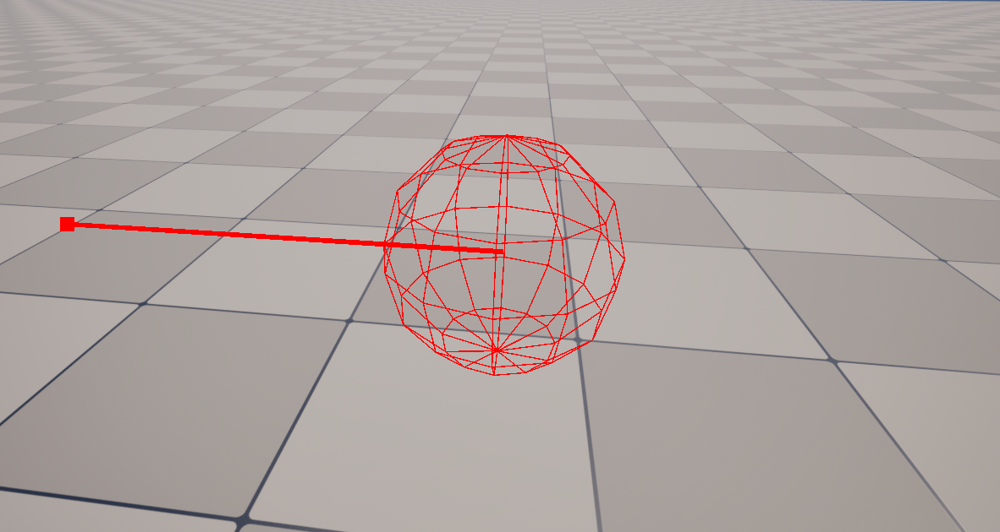

### 调试向量

现在是画了一个线段和一个点 但为什么不能直接画成箭头呢

函数宏

```c++
#define DRAW_VECTOR(StartLocation, EndLocation) if (GetWorld()) \
	{ \
		DrawDebugLine(GetWorld(), StartLocation, EndLocation, FColor::Red, true, -1.f, 0, 1.f); \
		DrawDebugPoint(GetWorld(), EndLocation, 20.f, FColor::Red, true); \
	}
```
末尾用反斜杠`\`换行 表示宏定义未完成

```c++
void AItem::BeginPlay()
{
	Super::BeginPlay();

	DRAW_SPHERE(GetActorLocation());
	DRAW_VECTOR(GetActorLocation(), GetActorLocation() + GetActorForwardVector() * 100.f);
}
```

效果和刚才用line+point是一样的 只需要传入起点和终点

修改了头文件 关闭UE 用VS Build HelloWorld 编译 再重新启动UE

### 调试宏头文件

直接写HelloWorld.h里感觉不太好 最好是有个专门的调试宏所在的头文件 这样如果需要调试宏功能 只要include那个头文件就可以了 在解决方案资源管理器 对HelloWorld项目右键 - 添加 - 新建项 创建头文件DebugMacros.h 将它放在\Source\HelloWorld里 和Private Public并列 将HelloWorld.h里的宏转移到里面

```c++
#pragma once

#include "DrawDebugHelpers.h"

#define DRAW_SPHERE(Location) if (GetWorld()) DrawDebugSphere(GetWorld(), Location, 25.f, 12, FColor::Red, true)
#define DRAW_LINE(StartLocation, EndLocation) if (GetWorld()) DrawDebugLine(GetWorld(), StartLocation, EndLocation, FColor::Red, true, -1.f, 0, 1.f)
#define DRAW_POINT(Location) if (GetWorld()) DrawDebugPoint(GetWorld(), Location, 20.f, FColor::Red, true)
#define DRAW_VECTOR(StartLocation, EndLocation) if (GetWorld()) \
	{ \
		DrawDebugLine(GetWorld(), StartLocation, EndLocation, FColor::Red, true, -1.f, 0, 1.f); \
		DrawDebugPoint(GetWorld(), EndLocation, 20.f, FColor::Red, true); \
	}
```

这样Items.cpp中就可以改成`#include "HelloWorld/DebugMacros.h"`

## 修改Actor的位置/旋转角度

### 修改位置

```c++
void AItem::BeginPlay()
{
	Super::BeginPlay();

	SetActorLocation(FVector(0.f, 0.f, 100.f));

	DRAW_SPHERE(GetActorLocation());
	DRAW_VECTOR(GetActorLocation(), GetActorLocation() + GetActorForwardVector() * 100.f);
}
```

SetActorLocation接收FVector类型来设置位置 现在进入UE热重载 进入PIE模式 就会发现调试球到达了我们设定好的位置(0,0,100) 这样我们就修改了Actor的位置

### 修改旋转角度

现在使用SetActorRotation修改旋转角 输入SetActorRotation并输入括号之后提示框会显示有两种选项 第1个接收FQuat类型参数 第2个接收FRotator类型参数 FRotator重载了接收3个值的构造函数 第1个值是俯仰角 第2个是偏航角 第3个是滚转角 从上往下看 这是顺时针旋转

```c++
void AItem::BeginPlay()
{
	Super::BeginPlay();

	SetActorRotation(FRotator(0.f, 45.f, 0.f));

	DRAW_SPHERE(GetActorLocation());
	DRAW_VECTOR(GetActorLocation(), GetActorLocation() + GetActorForwardVector() * 100.f);
}
```

## 偏移量 WorldOffset

偏移量offset会加到Actor的位置上 进而修改Actor的位置 **如果每一帧都添加一个world offset 这样就可以看到Actor在移动了** 但我们用调试球看不到这个效果 因为我们只在BeginPlay里调用了调试球 现在需要创建一个新的宏来绘制单帧的调试球 这样就能每帧绘制更新后的位置了

进入DebugMacros.h

```c++
#define DRAW_SPHERE_SingleFrame(Location) if (GetWorld()) DrawDebugSphere(GetWorld(), Location, 25.f, 12, FColor::Red, false, -1.f)
```

持续时间不再是true **如果只想绘制1帧 就需要将生命周期设为-1.0f** 当然我们也可以创建调试线 调试点 调试向量的单帧版本

```c++
#define DRAW_SPHERE(Location) if (GetWorld()) DrawDebugSphere(GetWorld(), Location, 25.f, 12, FColor::Red, true)
#define DRAW_SPHERE_SingleFrame(Location) if (GetWorld()) DrawDebugSphere(GetWorld(), Location, 25.f, 12, FColor::Red, false, -1.f)
#define DRAW_LINE(StartLocation, EndLocation) if (GetWorld()) DrawDebugLine(GetWorld(), StartLocation, EndLocation, FColor::Red, true, -1.f, 0, 1.f)
#define DRAW_LINE_SingleFrame(StartLocation, EndLocation) if (GetWorld()) DrawDebugLine(GetWorld(), StartLocation, EndLocation, FColor::Red, false, -1.f, 0, 1.f)
#define DRAW_POINT(Location) if (GetWorld()) DrawDebugPoint(GetWorld(), Location, 20.f, FColor::Red, true)
#define DRAW_POINT_SingleFrame(Location) if (GetWorld()) DrawDebugPoint(GetWorld(), Location, 20.f, FColor::Red, false, -1.f)
#define DRAW_VECTOR(StartLocation, EndLocation) if (GetWorld()) \
	{ \
		DrawDebugLine(GetWorld(), StartLocation, EndLocation, FColor::Red, true, -1.f, 0, 1.f); \
		DrawDebugPoint(GetWorld(), EndLocation, 20.f, FColor::Red, true); \
	}
#define DRAW_VECTOR_SingleFrame(StartLocation, EndLocation) if (GetWorld()) \
	{ \
		DrawDebugLine(GetWorld(), StartLocation, EndLocation, FColor::Red, false, -1.f, 0, 1.f); \
		DrawDebugPoint(GetWorld(), EndLocation, 20.f, FColor::Red, false, -1.f); \
	}
```

现在回到Item.cpp 删掉我们对BeginPlay修改的内容

```c++
void AItem::BeginPlay()
{
	Super::BeginPlay();
}
```

而是**对tick函数进行修改**

```c++
void AItem::Tick(float DeltaTime)
{
	Super::Tick(DeltaTime);

	AddActorWorldOffset(FVector(1.f, 0.f, 0.f));
	DRAW_SPHERE_SingleFrame(GetActorLocation());
}
```

**AddActorWorldOffset**需要接收一个FVector `FVector(1.f, 0.f, 0.f)` 写在tick函数里 就会在每一帧使Actor的坐标x增加1

修改之后 关闭UE 在VS中编译 再重新打开UE 进入PIE模式 就可以看到调试球正在进行移动 是**沿着世界坐标系**的x轴移动

我们每一帧移动一次 所以很流畅 但是帧率是会变动的 如果设备的帧率降低 游戏里的移动速度就会慢很多 在UE - 编辑 - 项目设置 - 引擎 - 一般设置 可以找到帧率 勾选 使用固定帧率 它就限定在了默认的30帧 再次进入PIE模式 就会发现调试球的移动变慢了

我们当然希望无论帧率是多少 这些Actor的移动速度都是一样的 就要使用DeltaTime DeltaTime会告诉我们上一帧之后过了多久 也就是每帧消耗的时间 以秒为单位 按DeltaTime缩放 就能**保证移动速度恒定**

```c++
void AItem::Tick(float DeltaTime)
{
	Super::Tick(DeltaTime);

	// 设定以cm/s为单位的移动速度
	float MovementRate = 50.f;

	// 而我们想要知道 如果希望Actor以上面这样的速度移动 每一帧要移动多少距离
    // 只有知道了这个数值 才能设置在tick函数里的偏移量
	// 每一帧的持续时间是DeltaTime秒 而速度的单位是cm/秒
	// 那么每一帧移动的距离就是 ( MovementRate * DeltaTime )cm
	AddActorWorldOffset(FVector(MovementRate*DeltaTime, 0.f, 0.f));
	DRAW_SPHERE_SingleFrame(GetActorLocation());
}
```

也可以旋转偏移 AddActorWorldRotation

```c++
void AItem::Tick(float DeltaTime)
{
	Super::Tick(DeltaTime);

	float MovementRate = 50.f;
	float RotationRate = 45.f;

	AddActorWorldOffset(FVector(MovementRate*DeltaTime, 0.f, 0.f));
	AddActorWorldRotation(FRotator(0.f, RotationRate*DeltaTime, 0.f));
	DRAW_SPHERE_SingleFrame(GetActorLocation());
	DRAW_VECTOR_SingleFrame(GetActorLocation(), GetActorLocation()+GetActorForwardVector()*100.f);
}
```

现在它就会一边旋转一边向前移动 每秒旋转45°

