# 目录
- [地编](#地编)
  - [天空](#天空)
  - [地形](#地形)
  - [植被](#植被)
  - [后期处理特效](#后期处理特效)
  - [关卡实例](#关卡实例)
- [UEC++](#uec)
  - [向量](#向量)
  - [UE的Visual Studio推荐设置](#ue的visual-studio推荐设置)
  - [UE 类的继承](#ue-类的继承)
  - [反射与垃圾回收](#反射与垃圾回收)
  - [创建Actor](#创建actor)
  - [创建蓝图](#创建蓝图)
  - [日志系统 TEXT宏](#日志系统-text宏)
  - [调试形状](#调试形状)
    - [调试球](#调试球)
    - [函数宏](#函数宏)
    - [调试线](#调试线)
    - [调试点](#调试点)
    - [调试向量](#调试向量)
    - [调试宏头文件](#调试宏头文件)
  - [移动Actor](#移动actor)
    - [修改位置](#修改位置)
    - [修改旋转角度](#修改旋转角度)
    - [偏移量 WorldOffset](#偏移量-worldoffset)
      - [三角函数](#三角函数)
  - [暴露给蓝图](#暴露给蓝图)
    - [将变量暴露给蓝图](#将变量暴露给蓝图)
    - [将函数暴露给蓝图](#将函数暴露给蓝图)
  - [模板函数](#模板函数)
  - [组件 Component](#组件-component)
    - [蓝图](#蓝图)
    - [C++](#c)
  - [Pawn类](#pawn类)
    - [胶囊组件](#胶囊组件)
    - [前向声明](#前向声明)
    - [骨骼网格组件](#骨骼网格组件)
    - [按键绑定](#按键绑定)
    - [添加摄像机](#添加摄像机)
    - [控制器输入](#控制器输入)
  - [Character类](#character类)
    - [按键绑定](#按键绑定)
    - [添加摄像机](#添加摄像机)
    - [导入MMD模型与动作](#导入mmd模型与动作)
    - [IK重定向](#ik重定向)
    - [状态机](#状态机)
    - [动画蓝图 C++](#动画蓝图-c)
    - [跳跃](#跳跃)
    - [Control Rig 脚IK](#control-rig-脚ik)
    - [动画技术](#动画技术)
  - [碰撞](#碰撞)
    - [委托 delegate](#委托-delegate)
    - [重叠事件 C++](#重叠事件-c)
  - [武器](#武器)
    - [插槽 sockets](#插槽-sockets)
    - [手K动画](#手k动画)
    - [拾取并装备](#拾取并装备)
    - [角色状态枚举](#角色状态枚举)
    - [多个动画蓝图](#多个动画蓝图)
    - [蒙太奇 montages](#蒙太奇-montages)
    - [动画通知](#动画通知)
    - [声音 meta sounds](#声音-meta-sounds)
    - [脚下Niagara粒子](#脚下niagara粒子)
    - [动画修复 MMD骨骼修改](#动画修复-mmd骨骼修改)
    - [连招](#连招)
    - [收起剑](#收起剑)
    - [绑定到背后](#绑定到背后)
    - [播放声音 C++](#播放声音-c)
  - [攻击](#攻击)
    - [盒体追踪 Box Trace C++](#盒体追踪-box-trace-c)
    - [UE接口 Interface](#ue接口-interface)

------

# 地编

在UE5.6中创建一个游戏-空白-蓝图 命名为Slash

点击窗口上方的绿色三角 开始**模拟** 点一下视口 进入PIE模式 play in editor 在编辑器里玩游戏 现在就可以用WASD进行移动 E上升 C下降 按shift+F1就可以退出视口 找回鼠标 按红色正方形就停止模拟 也可以按esc

现在我们不是模拟模式 不能移动任何东西 但是我们可以一直按着鼠标左键拖动 就可以前后左右移动
但我们不能调节俯仰角 在之前的模拟模式下 一直按着鼠标左键就可以调节俯仰视角 现在我们需要按着鼠标右键移动来调节俯仰视角 但是我们所在的位置并没有发生任何变化
同时按鼠标左右键 就可以上下左右移动 但不会发生前后移动
最好的办法当然是**一边按鼠标按键 一边按WASD进行移动** 按C放大 Z缩小 都是聚焦于鼠标所在之处的视野 E上升 F下降 ctrl+鼠标滚轮也可以放大缩小
右上角那个旁边有数字的摄像机图标可以调节摄像头速度 我们将其调节为3

视图右上角点击**眼睛图标** 最上边视口统计数据 FPS就可以查看帧率
再往下 随便开关一个复选框比如大气或者地形 就可以看到一些变化
注意到碰撞是没有被勾选的 尝试勾选 发现CPU占用率就开始提高 看到物体周围会有一些蓝紫色轮廓线 这个轮廓显示的是它们的碰撞体积 碰撞体积让引擎的物理计算更高效 碰撞体积越简单 计算越快 游戏性能越好 所以往往是比较简单的形状
再往下翻 尝试启用或禁用一些后处理与光源类型

仍然是视图右上角 **光照按钮** 可以切换很多模式 无光照模式就是灰色的 线框模式是呈现几何结构 可以看到每个网格体中多边形的每条边 调节一下俯仰 就会发现无论是地底还是天空 都是圆形 这也就是天空球 完全是球体


切换回光照模式 再看另一个按键 **透视按钮** 可以切换各种正交模式 通过鼠标滚轮缩放 这样就可以根据网格精确摆放物体了
再往下翻可以看到**书签**功能 可以设置书签 按ctrl+1就是设置书签1 按键盘上的数字1 就可以跳转到书签1 这些书签其实就是摄像机的位置
继续往下可以看到**游戏视图** 快捷键是G 开启之后 一些莫名其妙的灰白色图标就消失了 只显示游戏中会出现的物体
继续往下 可以看到**高分辨率截图** 左上角的方形可以选择位置 点击捕获 它就存储在了`Slash\Saved\Screenshots\WindowsEditor`文件夹里 上面的图片就是用这个功能截图的 虽然我也不认为这到底哪里很高清

最右上角的田字格 点击就可以变成4个**窗格** 每个窗格都有属于它自己的功能图标 这样就可以同时查看不同模式的 田字格左侧的三个点 点击就可以切换成不同的窗格排列格式
在下方还有一个沉浸式视图 就可以**全屏显示** 快捷键是F11 无论是模拟还是非模拟下都可以使用

要移动对象 我们首先要先有对象 鉴于我们的项目是空白的 现在就需要导入资产 去Epic Games的Fab里下载资产 为了拯救我们的C盘 现在需要修改一个缓存路径 打开UE的安装目录 找到`Epic Games\UE_5.6\Engine\Config`里的`BaseEngine.ini` 用记事本打开 搜索`ENGINEVERSIONAGNOSTICUSERDIR%DerivedDataCache` 将其替换为`GAMEDIR%DerivedDataCache` 就可以把缓存放在项目所在目录 接下来来到Epic Games的设置 找到下载与安装 点击转至下载设置 就会弹出download settings 下面的Advanced - Fab library Data Cache Directory 修改目录 总之放到非C盘的地方

然后去Fab里挑选喜欢的资产 Add to my library 然后去My library里 将它添加到项目里 这样我们打开UE 按ctrl+空格 或者鼠标点击左下角**内容侧滑菜单** 按右上角的停靠在布局中 就可以将其固定在视口下方 点×就可以直接关掉 现在我们将它关掉 以看到更大的视口 还可以拖动视口右侧边缘来放大

我们再次调出内容侧滑菜单 在 内容 文件夹里 就可以找到很多资产 静态网格体都是在Mesh文件夹里 随便拖动一个到视口

视口左下角有个x y z轴 我们旋转视角的时候 它也在旋转 让我们知道x y z轴的方向 **蓝色为z轴 红色为x轴 绿色为y轴**

视图左上角有4个图标 **选择Q 平移W 旋转E 缩放R**
点击选择 被选中的资产就会有黄色边缘 按delete就可以删除它
点击移动 这样就是选中并平移对象 在对象上会出现坐标轴 鼠标放在坐标轴上 坐标轴箭头亮了 这个方向拖动就可以移动 鼠标放在小方块上就可以同时选中两个方向 两个坐标轴箭头都会亮 按住shift的同时拖动 相机就会跟着选中的对象一起移动
旋转 缩放 都是类似 缩放数值改为-1 就是对应方向镜像
在移动模式下按alt 随便往一个箭头方向拖动 就能复制这个资产 按shift挨个点击就可以同时选中多个 这时再按alt 就可以批量复制 旋转模式下按alt也可以复制 发生旋转的是副本

发现我们在做这些操作时 是不流畅的 稍微右边的3个旁边有数字的蓝色图标就是调整这个的 都是**网格吸附**功能 吸附到网格 旋转固定角度 缩放固定增量 点按一下就关闭了 旁边的数字是每次能移动的距离 左侧紧挨着的灰色的图标是吸附到平面 数值可以调整它距离平面的默认距离

再左边那个旁边有3个点的圆地球图标 是切换**世界坐标轴**和对象自己的box的坐标轴 通常认为对象的局部x轴是它的前进方向 这样就可以决定到底是按世界坐标方向移动它 还是按它自己的朝向移动它


如果找不到自己想选中的物体 就可以去看视口右侧的**大纲**选项卡 可以发现光源、地面、出生点也在里面 在大纲视图里点击 就会发现对象在视口里被选中了 双击或者按F键 就可以在视口里聚焦到它 左侧的眼睛图标可以隐藏它 上方有搜索框可以搜索 按ctrl挨个点选就可以同时选中多个 按shift点选目标的第一个和最后一个 就可以选中这之间的所有对象 这时再按ctrl点击某个不想要的对象 就可以取消点选 这时再按delete 就可以一起删除

在视口里随便找个地方 右键 放置Actor 比如放置一个定向光源 就可以看到影子的位置改变了

大纲视图的下方 有**细节**选项卡
在**变换**这一栏中 有位置 旋转 缩放 右侧三角箭头可以选择是绝对坐标还是相对坐标 再右侧可以修改数字进行调整 而在我们使用WER快捷键的3种模式进行移动时 这些数字也在发生改变 在修改数字时 按下tab 就会跳到右侧的下一个框继续进行修改 最右侧的弯曲箭头 是重置为默认
看变换上方有一些选项按钮 目前我们默认所在的是**所有**
如果点击比如物理 就是在 所有 中筛选成只保留 物理 相关的属性 现在我们把一个物体让它腾空 找到物理这一栏中的**模拟物理** 点击视口上方绿色三角进入模拟模式 我们会发现它发生了坠落 甚至可能发生倾倒与滚动 比如下面这棵树


在下方也可以勾选是否**启用重力** 现在我们挑选一个质量较轻的物体 将它置于空中 打开模拟物理 但是关闭启用重力 然后我们飞过去撞这个物体 它就会飘到远处 比如这个箱子


选中这个物体 按一下end 它就会吸附到地面上了

现在我们看整个UE编辑器的最右下角 大概会显示有什么未保存 或者我们直接按ctrl+S **保存当前关卡** 建议在内容文件夹里创建一个名为Maps的文件夹 这样我们下次进入这个UE项目时 就可以点击左上角 文件 - 打开关卡 找到那个我们保存的关卡 来继续我们上次编辑的部分


*试着练习了基本操作 使用了Fab商店里下载的 Stylized Fantasy Provencal、RPG Hero Squad PBR Ployart、Sallon Interior*

上方绿色三角稍微左侧 有一个盾牌形状右下角是绿色加号的按钮 点击它 可以看到导入内容和Fab 也能看到Quixel Bridge 点击它 里面有很多扫描真实物体得到的素材 点击右上角人物头像 登录账号 就可以下载一些素材 但我们还是倾向于使用Fab

现在打开内容侧滑菜单 找到一个静态网格体 静态网格体图片下方 名字上方的线是蓝绿色的 这是它的颜色标识 双击这个静态网格体 会有一个弹窗 我们就进入了静态网格体编辑器 在此之前我们的视口一直都是关卡编辑器 按滚轮就可以对其进行缩放 比如我们可以在右边切换它的材质

***开放世界***

一般来说 大型世界都是分成好几个关卡 你只会加载一个关卡 角色在这里移动 角色到达边缘后 就加载下一个关卡 这样玩家到达下一个地图时 前一个地图就卸载了 现在UE支持开放世界 与其用很多小地图 不如用一张大地图 UE会把这个世界分成很多块 只加载玩家所在的那一块 这叫世界分区 

现在点击左上角文件 - 新建关卡 - 空白开放世界 先把这个关卡保存一下 我们希望这个新的关卡成为打开项目时的默认关卡 点击左上角编辑 - 项目设置 左侧边栏 找到地图和模式选项 将编辑器开始地图和游戏默认地图都修改为我们刚刚新建的地图

创建之后就是一片漆黑 什么都没有 现在我们可以从零开始创建了 现在大纲视图里只有WorldDataLayers世界数据层和WorldPartitionMiniMap世界分区小地图

左上角点击 窗口 - 世界分区 - 世界分区编辑器 现在可以看到右下方细节选项卡旁边出现了一个名为**世界分区**的选项卡 我们将可以在这个小地图上看到我们整个世界的地图 并且看到我们在地图上的位置

## 天空

1. 天空大气 sky atmosphere 和真实的大气层一样 如果有光源 它就会散射光线 产生各种美丽的气象效果 最多可以有两个大气光源 比如用两个光源分别模拟太阳和月亮
2. 定向光源 directional light 模拟一个无限远处的光源 所有物体上的阴影都是平行的 我们将**使用定向光源来模拟太阳**

点击左上方那个盾牌右下角绿色加号按钮 选择**放置Actor面板** 我们直接搜索天空 或者在 更多 里找到**天空大气** 将它拖到视口里随便一个地方 然后再光源里找到**定向光源** 随便拖到一个地方 现在我们可以看到天空和太阳 我们还可以拖入一个定向光源 会提醒我们 多个定向光源正在竞争

必须要按下ctrl的同时移动 才能移动太阳 现在我们有**两个太阳** 可以通过更改它们的大气层太阳索引来区分二者 再大纲视图里找到DirectionalLight 在细节选项卡里搜索 大气太阳光 可以看到**大气太阳光索引** 现在显示为0 我们不动它 现在在大纲视图里找到DirectionalLight2 修改它的大气太阳光索引为1 天空中仍然只有一个太阳 这是因为如果按照之前那种移动位置的办法 我们只是拖动了光源 改变了它的坐标 却没有修改光的方向 需要按ctrl+L 同时鼠标移动 才会**改变光的方向** 不再是两个平行的光源 天空中终于出现两个太阳 但是ctrl+L只能移动DirectionalLight的方向 而对于移动DirectionalLight2 需要ctrl+shift+L

也可以完全不用快捷键 在大纲视图中选中那个光源 直接在细节选项卡 - 通用 - 变换 - 旋转 里修改旋转角度数值

可以发现 变换里还有一行是移动性 目前是固定 还有静态和可移动两个选项
光源的移动性设置决定了它在游戏中的行为和操作方式

- 静态
  其照明效果在游戏中无法更改 无法更改该光源的位置 方向 强度 颜色 静态光源的计算速度最快 因为它们在游戏中不会发生变化 这也允许我们烘焙光照 如果某个静态物体的阴影永远不会改变 就可以把阴影和光照信息烘焙进场景 这样计算就在游戏开始前完成了 而不是在游戏里实时计算
- 固定
  可以在游戏中改变颜色和亮度 但是位置和方向不能改变 这样能实现部分光照烘焙 照在不动的静态物体上的光 它的阴影就可以被烘焙 但是动态物体的阴影还是得跟着动
- 可移动
  最耗费计算资源 可以在游戏中移动和改变属性 就像会移动的太阳一样 会投射动态阴影 无法烘焙

现在我们把这两个太阳都修改成可移动 顺便我们把这两个定向光源分别重命名为Sun0和Sun1 对应索引为0和1

3. 天空光照 sky light 捕捉整个场景 并将捕捉到的光照信息应用到场景中 就像天空 山脉 和所有其它事物都在将光反射到场景中 这是获得全局光照效果的方式 天空光照只在特定条件下执行这些捕捉 取决于天空光照的移动性
   静态天空光照 它会在你构建光照时更新 对于静止和可移动的天空光照 它会在加载时更新一次 如果你手动捕捉也会更新 所以你可以运行一个函数来执行捕捉 现在有一个选项叫做实时捕获 如果你启用它 我们将持续执行此捕捉 所以当我们的场景发生变化 例如太阳升起落下或者其他变化时 天空光照将持续更新 执行此捕捉并将光线应用到场景中

在放置Actor面板里搜索天空 或者在光源选项卡里找到 **天空光照** 将其拖入视口 在细节- 通用 - 变换里 将它设置成可移动的 稍微往下翻 在 光源 里 可以找到**实时捕获** 将其勾选上

现在就可以实现**昼夜循环**了 天空光照会随着天空中的光源变化而自动调整 

4. 指数级高度雾 exponential height fog 雾的浓度会随着高度变化 越低的地方雾越浓 模拟的是气压 指数高度雾可以设置两种颜色 一种用于星球向阳面 一种用于背阳面
5. 体积云 volumetric clouds 以前 云只是天空球体网格上的材质 但现在我们可以拥有体积云了 它是动态的三维的 并且由材质驱动 所以你可以改变材质 云也会随之改变 它们还会向大气一样散射光线 所以我们可以获得一些非常酷炫的效果 让光线穿过这些云 

我们搜索指数级高度雾 或者在 更多 - 视觉效果 里找到**指数级高度雾** 将其拖入视口

注意到下方不再是黑色了 而是填充成了蓝色 在细节选项卡里 我们可以修改雾的密度 雾高度衰减

在 更多 - 视觉效果 里找到体积云 拖入视口

现在我们选中一个太阳 将其旋转方向到地平线附近 在细节选项卡里找到使用色温并勾选 然后修改温度 这样就会呈现不同的颜色

我们在大纲视图里新建一个名为sky的文件夹 把刚刚添加的所有这些关于天空的Actor都移动到里面 按住ctrl可以批量选中 顺便把它们的x y都修改成0 同时把z轴坐标拉开一些距离 方便我们找到它 同时也方便我们通过聚焦它来找到世界的中心 当然也可以通过双击世界分区上的某个位置来快速跳转


## 地形

项目名称下方 我们现在是选择模式 接下来切换到**地形模式**

在左侧面板 将**组件数量**修改成16×16 当然这个数字是随意的 然后点击下方的创建 创建的时候一定要选一个材质 这样才能看到地面

看左侧面板 我们现在处于雕刻模式 这种状况下鼠标就不能轻易使用了 于是我们最好使用快捷键shift+1 切换到选择模式 这样就可以摆放各种物体 选择模式下 我们点选地面 发现是选中了一个格子 在大纲视图下是定位到了LandscapeStreamingProxy一串数字 这代表的就是一个组件 而我们之前创建了16×16个这样的组件 选中它时 按下delete 就可以删除


**圆形笔刷** 笔刷衰减的意思就是 内圆和外圆之间的差距 其余笔刷的各种功能 请自行体会


*选择了草地材质创建地形 试着使用雕刻模式下的星星图标Alpha笔刷雕刻了*

**材质**一般都是和网格体绑定在一起 我们随便拖入一个静态网格体 **静态网格体都是`SM_`一串字母命名的** 在大纲视图里 右键 浏览至资产 双击这个静态网格体 进入静态网格体编辑器 就可以查看它的材质 或者在细节面板 往下翻 就能看到它的材质 如果是复杂的静态网格体 比如房子 它应该有多种材质 这些很多的材质都是`MI_`一串字母 这是基于`M_`材质创建的一个材质实例 我们在内容浏览器里搜索`M_` 随便找到一个材质 右键 引用查看器 就能知道到底有哪个静态网格体使用了这个材质 我们先把使用了这个材质的静态网格体 随便选一个拖入视口中


双击这个材质 就可以看到它的各种参数


我们可以把这个弹出来的编辑器选项卡 拖到我们的关卡旁边 从此之后 我们再点击静态网格体或者材质 它都不会是一个新的弹窗 而是**作为选项卡 出现在我们的关卡选项卡旁边** 我们点击Texture Sample里的方形纹理贴图 它就会在内容管理器里 以文件夹视图显示


我们回到那个材质 按住alt键 然后鼠标左键点击纹理采样的RGB输出节点 就能看到没有这个贴图时的样子


点击左上角的应用 所有使用这个材质的东西就会都发生变化 可以回到关卡里查看一下差异


再刚才点击的RGB那里 鼠标左键拖拽连接到基础颜色 就重新连接上了

我们整个地形都是完全相同的草地材质 之前我们用的材质都是从静态网格体借用的 现在去Fab里专门下载一些适用于地形的各种材质


现在打开的这个是雪地材质 这种蓝紫色的就是**法线贴图** 名字常常是一串字母_normal 它是管理材质的凹凸不平的

现在 我们在内容文件夹里 创建一个名为landscape的文件夹 顺便整理一下我们之前导入的资产 如果想要移动资产的位置 请务必在UE里移动 而不是在windows文件资源管理器里移动 会发生混乱


进入Landscape文件夹 右键新建一个材质 命名为`M_Landscape` 然后双击进入材质编辑器 左侧细节面板 往下翻 可以找到一个名为**完全粗糙**的复选框 因为地面是没有反射性的 它没有光泽和闪光 应该是粗糙的

我们现在主要关心基础颜色和法线 其实我们可以导入纹理作为基础颜色 或者 导入一个法线贴图 连接上就可以了 但我们希望地形可以使用多种材质 就需要使用**图层** 在材质图表的空白处右键 搜索Landscape Layer Blend 

左侧细节选项卡出现了 材质表达式地形层混合 图层 0数组元素 点击右边的加号 这样我们就添加了一个数组元素 点击 索引[0] 左侧的小三角 就可以展开 看到这5个成员 在材质列表里现在显示的是Layer None 这是因为我们在细节面板里命名的图形名称为None


我们将其重命名为Snow 不要使用空格 混合类型可选权重混合、透明度Alpha混合、高度混合 我们使用**权重混合**来混合这个材质层和其它图层

回到内容侧滑菜单里 找到一个想要的纹理 拖拽到`M_Landspace`的选项卡上 然后放到材质图表里 将纹理的RGB连接到Landscape Layer Blend上 再将Layer Blend连接到基础颜色上


现在我们需要添加法线纹理 选中Layer Blend 按ctrl+D直接复制这个图层列表 或者按ctrl+C再ctrl+V也可以 同样是连接上 再将图层连接到法线上 我稍微更换了一些材质 调整了布局 增加了AO和Normal纹理 如下图


现在把我们的Landscape的材质切换为刚才我们编辑的材质M_Landscape 然后切换到地形模式 - 绘制 - 目标层 - 层 点击右侧倒数第二个像地球一样旁边有箭头的图标 如下图中黄色高亮部分 **从指定的材质创建层**


然后可能还是没有任何变化 重新打开UE 先把地形材质换成其它的 再换回来 就会出现 如果还没出现 就再重启UE


点击Grass1右边的加号 **创建层信息** 会让我们选择 是权重混合层 还是非权重混合层 权混合图层会彼此混合 当我们在一个图层上绘制另一个图层时 它们会混合在一起 非权重混合层不会混合在一起 是一层一层叠加的 比如泥土上的雪 不会混合在一起 而就是呈现出 雪覆盖在泥土之上 我们现在使用**权重混合层** 会出现一个弹窗 创建新地形层信息对象 我们就将其保存在Landscape文件夹里 也不需要修改名字 它默认的名字就是 Grass1_LayerInfo 我们对每一个图层都这样做


现在可以开始绘制了 先在绘制面板中右键Grass1选择填充图层 这样整个地图就都是这个材质了 选择材质和笔刷进行绘制就好


有时候我们打开地图时 发现之前做的东西都消失了 这时候打开世界分区选项卡 随便用鼠标选定框选一个区域 右键 从选择加载区域 这样我们做的东西就又出现了


为了方便地形的快速加载 我们可以打开M_Landscpae 选中所有纹理 都换成 **共享：包裹** 然后点击应用


## 植被

现在我们添加植被 从选择模式切换到植被模式 在资产中找到**静态网格体植物** 拖入+植被下方的空白处 使用静态网格体植物 就可以使很大数量的相同植物共享纹理的内存位置 效率更高 它们唯一不同的地方就是位置、旋转角度、缩放比例 我们也可以将静态网格体拖入其中 它会有弹窗 创建成为新的静态网格体植物

植物面板里的植被 左上方有复选框 按住ctrl或者shift可以多选 这时点击其中一个植物的复选框 其余被选中的都会跟着一起勾选 进入绘制模式 请尽量将绘制密度缩小 否则加载地图会很慢

对于静态网格体 我们可以在编辑器里打开它 找到它的材质 它的材质的参数组里有一栏为wind 我们可以将遥远的批量植被的风力关掉 优化性能 可以对会动的物体使用Nanite的 Nanite允许你使用极高多边形网格 而计算成本只是很小的一部分


如果想批量修改某些资产的属性 可以批量选择后 右键 - 资产操作 - 编辑**属性矩阵**中的选择 这个操作对于静态网格体和静态网格体植物都能使用


我们就使用这个功能 对于这几种树的静态网格体植物 打开属性矩阵编辑器 在右侧 固定列 面板中 搜索碰撞 将碰撞描述文件名修改为 BlockAll 现在双击某一种树的静态网格体植物 在弹窗中往下拉 可以看到碰撞预设现在是BlockAll 我们进入PIE模式 就能发现自己无法穿过这些树

## 后期处理特效

回到选择模式 点击左上方那个盾牌右下角绿色加号按钮 打开放置Actor面板 在更多 - 体积 里找到 **后期处理体积** 将其拖入视口 在细节面板 - 通用 里找到 后期处理体积设置 - 无限范围（未限定） 勾选它 这样就可以应用到整个关卡

后期处理体积可以改变场景的显示效果 在细节面板可以看到很多调色功能面板 颜色分级 电影 透镜 都可以尝试 透镜 - bloom就是光晕效果 会对场景中的太阳和灯光造成影响 透镜 - Exposure里的Min EV100和Max EV100 都是亮度 


*仅调节色温5500 global绿色饱和度3 bloom2.5 变化不明显*

## 关卡实例

可以批量选中静态网格体 右键 - 关卡 - **创建关卡实例** 也可以**创建已打包关卡Actor** 使我们将关卡实例打包到称为Actor的东西中 我们还没有正式讨论过Actor 但我们知道场景里的所有东西都是Actor 我们就选择创建已打包关卡Actor *New Packed Level Actor* 它让我们选择枢纽点类型 枢纽点的意思就是旋转中心 我们想让它怎么旋转 它会将旋转中心放在网格体最低高度的中心位置 我们就使用默认的中心最小Z 接下来就出现一个另存为的弹窗 我们在Maps文件夹内新建一个名为 PackedLevelInstances的文件夹 将这个关卡起个名字保存起来 之后又出现 资产另存为的弹窗 我们就将它存储在刚才保存的关卡旁边
现在可以发现 大纲视图中那些零散的静态网格体消失了 而是整合成了一个**蓝图类** 现在它们可以整体地拖动 点击这个关卡 因为没有灯光所以漆黑一片 但是在大纲视图里可以看到组成它们的静态网格体 点击其中的某一个就可以看到轮廓 也可以从光照模式切换到无光照或者线框模式 看到它们 而在现在的这个小关卡内 我们就可以随意移动它们 修改结束之后 右键这个关卡 点击**更新压缩蓝图** 大关卡里的对应部分就会发生变化
不存储成蓝图 直接将其它关卡拖拽进现在的关卡也可以 但是就不能像蓝图一样能保持更新

双击我们刚刚保存的蓝图类 就会打开蓝图编辑器 我们进来的时候默认是 事件图表 选项卡 点稍微左边的 视口 我们就可以看到这个蓝图的图形 这就是Actor 它是由许多单独组件组成的 在左侧的 组件 选项卡中 可以看到组成它的组件的名字 这些都是关卡实例组件 比普通的静态网格体效率要高 

回到我们的关卡 点选视口里的这个蓝图类 右键 - 关卡 - 中断 - 破坏关卡实例 这样它就变回了离散的静态网格体

现在去Epic Games里 下载Project Titan示例 我们将从中获取资产 顺便使用一些蓝图类的资产 继续地编


地图中的某个静态网格体或者关卡摆好了位置 可以在大纲视图对其右键 替换选中的Actor 在它原来的位置上替换为其它Actor 也可以在细节面板里切换
如果某个关卡导入后 拖拽时 不能使所有部件都一起移动 可以先移动其主要部分到达理想位置 再在细节面板 所有 - 关卡 里先换成None 再切换为我们导入的关卡 就会全都跟着过来了

如果有静态网格体的某个部分很多余 可以从选择模式切换到**建模模式** 选中静态网格体 在左侧面板中 选择 - **三角形选择** 用笔刷在静态网格体上选中需要删除的部位 之后点击 网格体编辑 - 删除 最后点击视口下方的 选择三角形 - 接受 如果是想把这一部分分离出来 比如把门从房子上拆下来 成为独立的静态网格体 就点选 网格体编辑 - 分隔 还需要做一步改变旋转轴 选中门 在想作为旋转中心的地方右键 - 锚点 - 在此处设置枢轴偏移

# UEC++

## 向量

向量 包含大小和方向 那么它是如何存储的呢 和二维坐标一样 也是存储在一个**有序对**中 x, y分别是顶点到终点在x轴或y轴上的距离之差

假设有一个角色 它有个坐标 敌人也有自己的坐标 假如有个AI系统 那么就需要知道敌人到角色的距离和方向 也就是敌人到角色的向量 才能追上角色 那么(x2-x1, y2-y1, z2-z1)就是向量 又比如角色要瞄准敌人 射出一支箭 那么就需要角色到敌人的向量 假设角色打偏了 枪声使敌人注意到角色 试图反击 此时就需要知道敌人到角色的向量 这是角色到敌人向量的反向向量 只有符号相反

向量也有数乘 加减法

假设有一个敌人 在空间中有坐标 并且占据一定范围的空间 也有一个角色 在某个坐标 假设这个角色有一个特殊攻击 比如火球 火球只能飞那么远 假设角色正瞄准敌人 那么就是需要角色到敌人的向量 但是向量的长度是只有那么远 还不足以打到敌人 假设这个角色得到了某种buff或强化 射程翻倍 这时候就需要向量数乘 ×2

我们可以用向量来表示一个东西的坐标 也就是从原点到这个坐标的向量 **位置向量** 坐标也用向量表示之后 就可以通过 一个东西的位置向量 一个东西到另一个东西的向量 使用向量加法 就得到另一个东西的位置向量

敌人要接近玩家 每个敌人都有指向玩家角色的向量 但是这个向量的长度要根据敌人的移动速度进行缩放 这就需要单位向量 再乘以敌人的移动速度 就是我们需要的向量 将向量除以向量的长度 就可以得到单位向量

UE使用的是**左手系** 但是物体也有它自己的坐标 也就是相对于世界坐标的那个local坐标系 规定**物体的前进方向为x轴** z代表它的上方 而既然使用左手系 y轴就是它的右侧方向 那么绕y轴旋转就是改变它的俯仰角 pitch 绕z轴旋转是改变了它的偏航角度 yaw 绕x轴旋转是改变它的滚转角 roll

## UE的Visual Studio推荐设置

工具 - 选项 - 项目和解决方案 - 常规 取消勾选生成完成时有错误则始终显示错误列表

工具 - 选项 - 文本编辑器 - 所有语言 - 滚动条 勾选使用垂直滚动条的缩略图模式

工具 - 选项 - 文本编辑器 - C/C++ - 高级 - 浏览/导航 将 隐藏外部依赖项文件夹 置为True

工具 - 选项 - 文本编辑器 - C/C++ - IntelliSence - 启用64位IntelliSence

工具 - 选项 - 文本编辑器 - C/C++ - 查看 将 **显示非活动块** 置为False
因为UE5建议我们使用实时编码 而不是热重载

工具 - 选项 - 调试 - 常规 - 启用热重载 取消勾选

工具 - 自定义 - 命令 - 工具栏 将下拉菜单修改为 标准 然后点击下方预览中的 解决方案配置 再点击其右侧的 修改所选内容 将宽度变更为200

如果涉及到清理Binaries Intermediate Saved文件夹 并且删除了.sln文件 右键.uproject - Generate Visual Studio project files 之后需要在VS打开这个.sln 并且在解决方案中把当前项目 本例中就是HelloWorld 右键 - 设为启动项目
这样之后 按Ctrl+F5 才能打开UE项目

## UE 类的继承

```c++
UObject
  ↓
AActor
  ↓
APawn  
  ↓
ACharacter
```

UE继承体系的顶层是名为UObject的类 UObject的实例称为object
UObject类派生出AActor类 称为actor
APawn类继承自AActor ACharacter类继承自APawn

所有继承自UObject但不是Actor的类 类名前都加U前缀 这样就能从类名看出来它不是Actor 而是一个UObject
所有继承自Actor的类 类名前都加A前缀

1. **UObject**类 很基础 能存储数据 但不能自己放到场景里
2. **Actor**类 继承了UObject类的一切 可以放进关卡里 所以在游戏关卡里看到的一切都至少是从Actor类及其子类开始 Actor可以有视觉表现 比如网格体
3. **APawn**类 继承自Actor 它们可以被控制器controller操控 控制器是一种专门用来控制Pawn的Actor 当你按下WASD角色发生移动时 是因为控制器接收到了你的输入 进行处理 并将信息转化为角色向前移动的动作 对于那些需要根据某种输入移动的事物 无论是玩家按键移动鼠标 还是通过AI计算的输入 就用Pawn
4. **ACharacter**类 继承自APawn类 因此也能被控制器操控 它还具有更多功能 更适合像人类这样的双足生物 它包含一个角色移动组件 负责各种与移动角色相关的计算 所以Character只是具有更多功能的一种特殊类型的Pawn 一般来说如果你需要一种非常基础的生物 只需要接收输入并四处移动 用Pawn就够了 但如果想要更多Character特定的功能 就要用Character了

我们把父类的名字命名为Parent类 子类命名为Child类 我们可以说一个Child类的实例同时也是一个Parent 它继承了Parent类的功能和变量 却不能说一个Parent是一个Child

假设你有一个类 它可以拥有自己的变量 这些变量中 有些可能是其它类或者结构体的自定义数据类型 所以你的类里可能有个成员变量 它本身就是另一个类的实例 我们把第一个类称为外层类 另一个类称为内层类 内层类也可以有它自己的变量 有一些变量的数据类型是来自于其它类和结构体的 所以内层类里还是有内层类

UE中 类就经常这样嵌套 游戏项目的顶层 有一个名为Package包的类 Package类里嵌套/包含着一个名为World世界的类 World类里嵌套/包含着一个名为Level关卡的类 现在一些obejct就放在关卡里 这些都是从Actor或者其更低的继承层级派生的类 所以Level包含Actor Actor有它自己变量 有些是Component组件 Component是Actor拥有的子类 它提供Actor可以使用的附加功能 所以Actor可以拥有一个或多个Component 有些object不像这些类一样放在Package里 这些通常是资源 比如meshes、textures、sound files等等


## 反射与垃圾回收

**反射reflection**是程序在运行时自检的能力 程序会分析自身内部的情况 然后收集程序数据 C++没有自带反射功能 但是UE有自己的反射系统来收集这些数据 这个反射系统负责把数据和UE编辑器系统整合 把部分数据暴露给蓝图 并用**垃圾回收**自动管理内存 不用的时候自动删除对象 这样就释放了内存

假设你动态分配了一个堆对象 又创建了一个指向这个对象的指针 指针变量一出作用域 指针就没了 在UE中 如果一个对象参与垃圾回收系统 垃圾回收系统就会追踪有多少个变量引用它 如果没有任何变量引用它了 这个对象就自动删掉了 在普通C++里 你需要自己释放内存 如果你遗忘了就会内存泄露 但是垃圾回收会自动删掉它 不需要我们手动delete了

要让类参与UE的垃圾回收 需要用**特殊的宏**去标记 来让反射系统识别它

```c++
#include "Fighter.generated.h"

UCLASS()
class AFighter : public AActor
{
    GENERATED_BODY()

    UPROPERTY()
    UStaticMesh SwordMesh;
    
    UFUNCTION()
    void SwingSword();
}
```

UE的类声明顶部有一个**UClass宏** 用于所有继承自Uobject的类 这样这个类就能参与反射系统 也就参与了垃圾回收
要让变量和函数也参与反射系统 就要分别用**UProperty宏**和**UFunction宏**标记它们 这样我们才能把这些变量和函数暴露给蓝图
GENERATED_BODY宏 是**UE头文件工具 Unreal Header Tool, UHT**自动生成的
**带括号的宏** 有时可以像函数一样接收输入 这些输入叫作specifier说明符 可以改变这些宏的行为 所以我们可以自定义UPROPERTY宏和UFUNCTION宏 来控制它们如何把变量和函数暴露给反射系统和蓝图

这些宏会在编译时触发UTH去生成反射系统的代码 我们可以看到 使用了反射系统的类 在头文件顶部都会有一个特殊的include文件 这就是`className.geneated.h`文件 这个**generated.h文件**中就包含UE因为这些宏自动生成的代码 这样反射系统就能从这个类里获取信息

## 创建Actor

现在我们的项目是蓝图项目 任何蓝图项目 都可以通过创建第一个类转换成C++项目 点击顶部工具栏 工具 - 新建C++类 这里面有很多常用的类 鼠标悬停在上面就可以知道什么意思 但是UE里的类 远不止这些 点击所有类 就是所有的类

选择Actor 并点击下一步 类的类型可以选择public还是private 如果选择了public 就会发现下面的路径里 头文件在Public文件夹里 源文件在Private文件夹里


这时候就是按照visual studio的提示装一些插件 重新回到UE打开Slash项目时 出现了这样的问题
点yes也无效 所以 建议在创建C++类之前先**备份** 这样随时就可以回到蓝图模式

总之我尝试多种办法仍没能解决上面的问题 这里其实应该是装了Visual Studio Integration Tool插件之后发生的问题 但我尚未解决 于是最终在.uproject中用文本编辑器禁用了这个插件

现在还是选择                                                                                                                                                                                                                                                                                                                                                                                                                                                                                                                                                                                                                                                                                                                                                                                                                                                                                                                                                                                                                                                                                                                                                                                                                                                                                                                                                                                                                                                                                                                                                                                                                                                                                                                                                                                                                                                                                                                                                                                                        新建一个新的C++项目 为了配合名为HelloWorld的地图关卡 将这个项目命名为HelloWorld 并把之前这个蓝图项目的content文件夹全部在UE编辑器里迁移过去 现在再去新建Actor就可以成功了

现在 收起内容文件夹 可以看到下方还有一个C++类文件夹


可以看到 父类是Actor 模块/module名是HelloWorld 我们的游戏项目是Visual Studio解决方案里的一个module module的相对路径是`Public/Items/Item.h` 双击就会转到Visual Studio打开这个C++类

在VS解决方案资源管理器可以看到


这几个`.cs`文件控制着项目包含哪些module 不用管它们 至于HelloWorld.cpp HelloWorld.h是项目自动生成的 里面只有头文件和宏

```c++
// Item.h

#pragma once

#include "CoreMinimal.h"
#include "GameFramework/Actor.h"
#include "Item.generated.h"

UCLASS()
class HELLOWORLD_API AItem : public AActor
{
    GENERATED_BODY()
    
public:    
    // Sets default values for this actor's properties
    AItem();

protected:
    // Called when the game starts or when spawned
    virtual void BeginPlay() override;

public:    
    // Called every frame
    virtual void Tick(float DeltaTime) override;
};
```

我们现在逐行查看Item.h

```c++
// Item.h
#pragma once

#include "CoreMinimal.h"
#include "GameFramework/Actor.h"
#include "Item.generated.h"
```

如果想要继承某个类 就必须包含它的头文件 在Item.h里 则是包含了Actor.h的头文件 而Actor的头文件在Game框架里 这个generated.h文件就是前文提到的 它包含了使我们的类参与反射系统所需的所有代码 所以后面使用了UCLASS宏 这样AItem类就可以参与UE的反射系统

```c++
// Item.h
UCLASS()
class HELLOWORLD_API AItem : public AActor // 继承自AActor类
{
```

鼠标悬停在`HELLOWORLD_API`上 可以看到它展开后是`__declspec(dllexport)` 意思是这个类型可以被dll动态库使用 这是UE自动添加的 我们不用管它 创建新类时它都会自动存在 

```c++
// Item.h 接着上一个代码块
    GENERATED_BODY()
```

编译时 这个GENERATED_BODY宏会被generate.h文件中的部分代码替换 从而增强这个Actor的功能 所以可以把我们的这个类理解为一个功能增强的普通C++类 它能参与UE的幕后工作 从而与引擎的反射系统连接 这样就可以做很多事情 比如可以基于这个类创建蓝图 并将属性创建给蓝图 

```c++
// Item.h 接着上一个代码块
public:    
    // Sets default values for this actor's properties
    AItem();

protected:
    // Called when the game starts or when spawned
    virtual void BeginPlay() override;

public:    
    // Called every frame
    virtual void Tick(float DeltaTime) override;
};
```

public中 默认情况下已经有了一个构造函数 注释也告诉我们 构造函数会设置这个Actor属性的默认值
proctected中 包含一个虚函数void BeginPlay的重写 意思是BeginPlay是一个虚函数 继承自Actor类 我们正在重写它 注释说 游戏开始或者游戏中实体生成时调用
底部的public中 有一个名为Tick的函数 是虚函数的重写 接收一个名为DeltaTime的浮点数参数 注释说每一帧都会调用 所以tick函数会每秒钟调用多次

```c++
// Item.cpp

#include "Items/Item.h"

// Sets default values
AItem::AItem()
{
     // Set this actor to call Tick() every frame.  You can turn this off to improve performance if you don't need it.
    PrimaryActorTick.bCanEverTick = true;

}

// Called when the game starts or when spawned
void AItem::BeginPlay()
{
    Super::BeginPlay();
    
}

// Called every frame
void AItem::Tick(float DeltaTime)
{
    Super::Tick(DeltaTime);

}
```

在Item.cpp中 可以看到构造函数的定义
`PrimaryActorTick.bCanEverTick = true;`
注释说 设置这个Actor在每一帧调用Tick() 如果不需要就可以关闭它来提升性能 所以如果我们不需要这个Actor使用Tick函数 就可以把这个true设置为false
我们将鼠标悬停在PrimaryActorTick上 或者直接右键速览定义 可以看到它的类型是FActorTickFunction 这是一个结构体 在EngineBaseTypes.h文件中定义 包含名为bCanEverTick的bool变量 可以看到它的定义 `uint8 bCanEverTick:1` 意思是 本来这是一个uint8 无符号8位整数 通常占1字节 但是使用`:1` 这是**位域** 表示这个变量只占用1bit 而不是一整个byte 节省内存
所以不是所有的变量都直接在Actor类中声明 而是引擎将其打包成了结构体 这样Actor类就不会被变量和函数填满了 这就是UE将 类 按行为的类别 组织起来的一种方法

还有BeginPlay和Tick 发现它们的前面还有一个Super 这是作用域解析符 后面跟着函数名 这是UE的一个功能 意思是我们正在调用这个函数的父类版本 我们现在的Item类继承自Actor类 所以父类的版本就是Actor类的版本 我们现在调用的BeginPlay和Tick都是Actor类的版本

现在有两个public 所以我们可以整理一下 顺便把注释删掉一些

```c++
// Item.h
#pragma once

#include "CoreMinimal.h"
#include "GameFramework/Actor.h"
#include "Item.generated.h"

UCLASS()
class HELLOWORLD_API AItem : public AActor
{
    GENERATED_BODY()
    
public:    
    AItem();
    virtual void Tick(float DeltaTime) override;

protected:
    virtual void BeginPlay() override;
};
```

```c++
// Item.cpp
#include "Items/Item.h"

AItem::AItem()
{
    PrimaryActorTick.bCanEverTick = true;
}

void AItem::BeginPlay()
{
    Super::BeginPlay();
}

void AItem::Tick(float DeltaTime)
{
    Super::Tick(DeltaTime);
}
```

## 创建蓝图

现在我们可以从内容侧滑菜单 把我们的Item拖入视口 于是我们在大纲视图里就可以看到它 在细节面板的Actor选项卡中 甚至没有改变它的位置的选项 因为它现在太简陋了 什么都没有 一般情况下我们不会直接把C++类拖拽进来 我们做的是基于C++类创建蓝图 我们的Item继承自Actor类 我们可以把蓝图理解成C++类的子类 我们创建从C++类继承的蓝图 C++类是父类 所以蓝图会继承C++的功能 蓝图让我们在编辑器里操作类时 能以更好的方式与之交互 所以我们现在先把拖拽进去的这个Item类先删掉 然后基于Item类创建一个蓝图

在内容文件夹里新建文件夹 命名为Blueprints 在其中再新建一个文件夹 命名为Items

我们可以在C++类里 右键Item类 点击 **创建基于Item的蓝图类**
或者进入我们的想要存放蓝图类的文件夹 也就是Blueprints/Items文件夹 在空白处右键 新建一个蓝图类 就会有一个弹窗 让我们选取父类 在 所有类 中找到我们的Item类 命名为BP_Item 这样就知道这是Item的蓝图类 而不是C++类 

现在我们把它拖拽进视口 这一次可以移动它的位置了 我们在内容侧滑菜单中双击BP_Item 就可以进入蓝图编辑器  可以看到视口左下角有一个左手系 这是它自己的局部坐标系 左边是组件面板 默认情况下 所有Actor至少含有一个组件 默认自带一个根组件和一个组件


双击DefaultSceneRoot 在右侧细节面板会显示一些信息 这里显示的是蓝图类自身的全部属性

视口上方有几个选项卡 视口、构造脚本、事件图表

**事件图表**就是我们放蓝图节点 执行蓝图逻辑的地方 蓝图是一个独立的系统 用来编写功能 用蓝图节点代替写代码 现在这里已经有几个节点了 BeginPlay、ActorBeginOverlap、Tick 因为我们现在还没有用到它们 所以显示灰色

现在我们可以右键新建节点 比如我们希望游戏开始之后就打印字符串 我们右键搜索print 选择Print String 这前面花体f的意思是函数 我们把BeginPlay的执行引脚连接到Print String上 鼠标悬停在Print String上粉色的圆圈上 信息提示要输出到日志的字符串 我们可以连接变量等输入 来决定要打印的字符串 或者直接双击Hello文本框里进行编辑 我们就修改成BeginPlay


我们修改了蓝图 在整个蓝图编辑器的左上角 有一个 编译 按钮 这就像在C++里修改代码 然后在IDE里编译一样 可以点击编译进行编译 或者直接点击右上角的绿色三角开始玩游戏 开始游戏后蓝图会自动编译 我们现在把这个蓝图编辑器选项卡拖拽到关卡选项卡旁边 然后点击蓝图编辑器里右上方的的绿色三角 现在游戏就在一个单独的窗口运行 并且可以全屏 我们回到关卡里 再次进入PIE模式 就会发现左上角会短暂显示一条信息

Print String节点中 仅限开发 的下方小箭头是下拉菜单 可以显示一些额外的属性 比如文本颜色Text Color 持续时间Duration 单位是秒 所以**Print String可以用来验证某个函数或者事件是否执行了** 就像我们常常在写代码时中使用的print

BeginPlay节点是红色 是事件 Event
Print String节点是蓝色 是函数

将鼠标悬停在BeginPlay节点右上角的红色方块上 会显示Output Delegate委托 所以“事件”是蓝图术语中对于“委托”的称呼 虽然我们现在完全不知道委托是什么意思 和函数不一样 事件没有输入执行引脚

我们再看**构造脚本**选项卡 有点像事件图表 但是它**在游戏开始前就运行了 事实上只要这个蓝图的任何属性发生变化 它就会执行** 比如我们进入蓝图的细节面板 对其进行修改 每次修改任何内容 这个构造脚本都会触发 所以很适合在游戏开始之前做一些准备工作 而**事件图表中的节点是在游戏过程中执行的**

如果我们开始游戏时在地图中的位置 距离我们刚刚摆放这个蓝图太远 它就不会输出我们刚才设置好的文本 因为太远了 这是开放世界的特性

## 日志系统 TEXT宏

我们刚才的操作能验证蓝图版本的BeginPlay确实被调用了 现在我们要去验证C++版本的BeginPlay是否被调用了 所以我们先把那个Print String节点删掉 回到Visual Studio 打开Item.cpp 这就是BeginPlay函数 我们想打印一些文本到日志里 要使用UE的专用宏**UE_LOG**

我们在BeginPlay中添加一行 `UE_LOG()` 当我们打字到这里时 将鼠标悬停在UE_LOG上 就可以看到一个庞大的提示框

里面写了它需要的参数

第1个是CategoryName 类别名称 现在有很多日志类别 甚至你可以自定义 但我们在这里使用**LogTemp** 是临时日志类别 用于调试时频繁添加和删除的日志

现在Visual Studio又提示我剩下的参数

也可以使用ctrl+shift+space来触发这个提示框

第2个参数Verbosity是日志详细级别 控制到Log Warning Error 我们这里就使用Warning级别

第3个参数 Format 指定日志输出的格式 比如
在这个小悬浮窗提示框里 Format再后面是`__VA_ARGS` 而在之前的那个大的提示框里 显示的Fromat后面是省略号 总之意思就是 UE日志可以接收任意数量的参数 VA是variable变量的缩写 ARGS是arguments参数的缩写 现在我们就只传一个 现在我们要传入的是一段文本字符串 来打印到输出日志 此处使用**TEXT宏** 它接收一个字符串字面量作为输入参数 比如 `TEXT("Begin Play called!")` 那么它就会把这个字符串字面量转换为Unicode格式 Unicode能包含的字符远比ANSI格式多得多 比如汉字

我们现在去查看UE官方文档 [C++ Coding Standard](https://dev.epicgames.com/documentation/zh-cn/unreal-engine/epic-cplusplus-coding-standard-for-unreal-engine) 在网页中按ctrl+F 搜索`TEXT()` 就可以看到它写着 

> 在字符串字面量周围固定使用 `TEXT()` 宏。
> 若未使用 `TEXT()` 宏，在文字中构建 `FStrings` 的代码将导致不理想的字符转换过程。 

现在我们完全不知道**FStrings**是什么 这是UE的字符串类型 我们使用print string时 注意到输入是字符串类型 但是在蓝图编辑里 UE会把F去掉 但它确实就是作为输入的FString 就像编辑器会去掉AActor前面的A

虽然你不用TEXT宏 看起来也能正常运行 但它背后会发生一些你看不到的流程 比如字符串转换 总而言之 **用TEXT宏包装字符串字面量是一个好的做法**

最终我们是在`AItem::BeginPlay`里添加了一行 `UE_LOG(LogTemp, Warning, TEXT("Begin Play called!"));` 这后面的分号 也可以不加 因为这是宏

```c++
// Item.cpp
void AItem::BeginPlay()
{
    Super::BeginPlay();

    UE_LOG(LogTemp, Warning, TEXT("Begin Play called!"));
}
```

现在 要编译它 我们只需要保存就可以了 我们并没有在VS里编译 现在回到UE


点击UE右下角的这个图标 这就是**热重载** 旁边的三个点是编译选项菜单 点击它 可以看到已经勾选了 启用实时代码编写 实施编码就是将C++函数的修改热补丁到当前进程 这比编译VS项目要快很多 我们就点击这个热重载图标 会出现一个实时编码窗口 稍等就会提示成功 然后我们关掉这个窗口

点击绿色三角进入PIE模式 点击视口左下方调出 输出日志 我们将其停靠在布局中 然后按绿色三角进入PIE模式 现在就会看到黄颜色的`LogTemp: Warning: Begin Play called!`

如果是在关闭UE编辑器时对于VS项目进行了修改 只点击热重载就会看不到变化 必须要**在VS中编译整个解决方案** 才能使改动在项目中生效 可以在解决方案资源管理器中右键 生成解决方案 或者在上方菜单栏 生成 - 生成解决方案 或者直接快捷键ctrl+shift+B 如果你是在打开着UE编辑器时去生成 VS会提示你把UE关掉 否则可能失败 也可以只生成我们修改了的module 本例中就是Build HelloWorld

VS还有一个快捷键 ctrl+F5 可以**编译并启动UE编辑器** 于是我们又打开了刚刚关掉的UE编辑器

刚才已经说过 当距离太远时 日志系统并不会打印 所以我们要找到一个较小的地图 新建关卡 - 基本 然后把我们的BP_Item拖拽进新的地图里 进入PIE模式 可以看到输出了Begin Play的日志

进入BP_Item的蓝图编辑器 Event BeginPlay没有连接引脚 但它却不是灰色 我们再拖拽Print String出来 连接上 这样从蓝图编辑器进入PIE模式时 左上角会输出文本 在搜索Print String时 还可以看到一个叫Log String的函数 这和UE_LOG宏很像


 这之后回到关卡 进入PIE模式 在输出日志里查找 我们可以在C++日志输出的黄颜色Warning的上一行找到 `LogBlueprintUserMessages: Message printed to the Output Log` 这是LogBlueprintUserMessages 日志蓝图用户消息 而不是LogTemp临时日志 再上一行是 `LogBlueprintUserMessages: [BP_Item_C_1] Hello` 这是PIE模式下浮现在视口左上角的字符串

Print String节点 点击 仅限开发 的下方小箭头 可以看到Key 鼠标悬停在上面 可以看到它的类型是Name命名 可以让我们指定一个值 来控制这些打印字符串消息的行为 现在是None ctrl+D再创建一个相同的节点 连接上 分别重命名


继续进入PIE模式 可以看到两个都打印出来了 2nd在上 1st在下 说明新消息会显示在上面 但是如果两个Print String使用相同的Key 新消息就会替换旧消息 而不是像现在这样叠加 所以如果我们把这两个Print String的Key都设为1 就会发现只打印2nd 因为第一个被第二个替换了

下面的tick事件 每一帧都会被调用 给它连接一个Print String


现在再进入PIE模式 它会一直满屏打印 如果我们把Key设置成有效的值 比如0 它就会一直保持在一个地方持续打印 持续时间超过我们设置的Duration2.0
Delta Seconds是一个浮点数 表示自上一帧以来经过的时间 增量时间 帧的持续时间很短 所以这个值会很小 毫秒级 将Delta Seconds连接到In String 会显示 浮点单精度to字符串 就会出现一个新节点 绿色进去 粉色出来 这是一个转换节点 负责把双精度浮点数转换成字符串 鼠标悬停在Delta Seconds 会显示它是单精度浮点数 但是这个转换节点 既能接受双精度数也能接受浮点数作为输入 这背后其实有一个隐式转换的过程


现在进入PIE模式 会打印出来Delta Seconds 这个数值一直在变 每一帧我们都会打印出Delta Seconds的值 而且这个值在不同的帧之间是会变化的

我们将所有这些Print String节点都删除 编译保存 回到C++

在Begin Play里 我们想向屏幕打印一条信息 而不是直接把它扔到输出日志里

输入GEngine并悬停 可以看到它是一个`UEngine*`类型的指针变量 提示我们全局引擎指针可能为空使用前需检查 这是一个全局指针变量 我们可以在任何类中访问它 这个指针有自己的函数 可以用->使用它

先检查一下GEngine是不是空指针 通常情况下它都是有效的 尤其是在BeginPlay函数执行后 BeginPlay函数通常在GEngine初始化完成后调用 但检查一下总是好的

我们使用GEngine全局变量的一个函数AddOnScreenDebugMessage

`GEngine->AddOnScreenDebugMessage(1, 2.f, FColor::Cyan, FString("Item OnScreen Message!"))`

IntelliSense会提示我们要传入的参数


1个(共2个)的意思是 这个函数有两个重载版本 按小三角查看不同版本 第1个参数Key就是键值 用不同的键值对应不同的消息 第2个参数是显示时长 我们这里用2.f 也就是2的浮点数 消息会显示2秒 或者直接写2 那就是一个int 会自动从整数转换成浮点数 这里我们还是**直接用浮点字面量 省去编译器隐式转换的麻烦** 用浮点值时 我们常用.f指定它是浮点字面量 第3个参数是颜色 是FColor类型 输入`FColor::`就能看到一些选项 Fcolor**类有一些静态变量 不需要创建实例就可以调用** 静态变量里有一些现成的颜色 包含rgb和Alpha透明度这4个数值 cyan是蓝绿色 第4个参数是FString类型 在这里我们调用FString的构造函数利用字符串字面量创建一个FString 第5个参数是名为bNewerOnTop的bool值 默认情况下为true 意味着新的消息会显示在旧消息上方 再后面的其它**参数也都有默认值 我们不必须传入它们**

```c++
// Item.cpp
void AItem::BeginPlay()
{
    Super::BeginPlay();

    UE_LOG(LogTemp, Warning, TEXT("Begin Play called!"));

    if (GEngine)
    {
        GEngine->AddOnScreenDebugMessage(1, 2.f, FColor::Cyan, FString("Item OnScreen Message!"));
    }
}
```

我们回到UE进行热重载 成功地输出日志

现在我们想在tick函数里打印一下deltaTime的值

```c++
// Item.cpp
void AItem::Tick(float DeltaTime)
{
    Super::Tick(DeltaTime);

    UE_LOG(LogTemp, Warning, TEXT("Delta Time: %f"), DeltaTime);
}
```

UE_LOG函数宏里 参数个数随便加 所以直接把deltaTime放在这 使用格式说明符%f指定位置 UE_LOG就会用文本宏后面给出的第一个参数来替换%f 这种**格式说明符**来自于C语言的printf
回到UE热重载就会发现输出日志里一直在打印`LogTemp: Warning: Delta Time: 0.008333`

现在将其打印到屏幕上
```c++
// Item.cpp
void AItem::Tick(float DeltaTime)
{
    Super::Tick(DeltaTime);

    UE_LOG(LogTemp, Warning, TEXT("Delta Time: %f"), DeltaTime);

    if (GEngine)
    {
        FString DeltaTimeMessage = FString::Printf(TEXT("Delta Time: %f"), DeltaTime);
        GEngine->AddOnScreenDebugMessage(1, 2.f, FColor::Cyan, DeltaTimeMessage);
    }
}
```

`FString::Printf`是用于格式化字符串的静态函数 类似于C语言的sprintf sprintf和printf的区别就是 printf常常是输出到控制台 sprintf是输出到内存中的字符串变量 不会直接输出到屏幕

FString是UE自己的类型 和STL里的类似 最好还是用UE自带的类型 因为UE会尽力保证它用的所有类型和函数都是跨平台的

但是我们怎么能知道有`FString::Printf`这个函数的存在呢 我们可以直接右键FString 转到定义 然后查看它有什么方法 当然这高达2000行 我们可以阅读它 最前面是构造函数和重载操作符之类的 或者查看[FString官方文档](https://dev.epicgames.com/documentation/zh-cn/unreal-engine/fstring-in-unreal-engine)

如果我们现在想得到关卡里这个物体的名字

```c++
// Item.cpp
// 错误代码
if (GEngine)
{
    FString Name = GetName(); // 会返回关卡里这个物体的名字
    FString NameMessage = FString::Printf(TEXT("Item Name: %s"), Name);
    GEngine->AddOnScreenDebugMessage(1, 2.f, FColor::Cyan, NameMessage);
}
```

我们简单地以为可以这样写 但其实我们要写成
`FString NameMessage = FString::Printf(TEXT("Item Name: %s"), *Name);`

这个`*Name`看起来是指针的解引用 但实际上是**FString类重载了字符串的`*`运算符 这个`*`的作用是提供一个C风格的字符串** 对于这个`FString::Printf`的格式说明符比如%s 我们不能对它传入FString字符串 只能对它传入C风格的字符串 也就是字符串字面量`const char*` 对于UE而言准确来说是`const TCHAR*` TCHAR是宽字符数组的别名 能存储比char更多的信息 UE使用的是Unicode编码 比ANSI编码的普通字符信息量更大

UE文档里写着 使用%s参数包含FStrings时 必须使用`*`运算符返回%s参数所需的`TCHAR*`

所以现在要使用这个重载了的`oprator*` 将它转换成C风格的字符串 其实C语言的printf的%f 也是只能传入字符串字面量`const char*` 说到底 C并没有像C++那样的String类型 C的字符串本质上都是`const char*` 所以UE这个大概是模仿了C语言才这样规定的 而C++是没有这个格式说明符功能的 String是重载了operator+或者用append

UE_LOG使用%s时也是一样
`UE_LOG(LogTemp, Warning, TEXT("Item Name: %s"), *Name);`

```c++
// Item.cpp
void AItem::Tick(float DeltaTime)
{
    Super::Tick(DeltaTime);

    UE_LOG(LogTemp, Warning, TEXT("Delta Time: %f"), DeltaTime);

    if (GEngine)
    {
        FString Name = GetName();
        FString NameMessage = FString::Printf(TEXT("Item Name: %s"), *Name);
        GEngine->AddOnScreenDebugMessage(1, 2.f, FColor::Cyan, NameMessage);

        UE_LOG(LogTemp, Warning, TEXT("Item Name: %s"), *Name);
    }
}
```

修改后热重载 输出日志就会出现 `LogTemp: Warning: Delta Time: 0.008334` `LogTemp: Warning: Item Name: BP_Item_C_1`

现在在大纲视图选中我们的BP_Item 按ctrl+D再创建一个BP_ITem2 就会发现输出日志中既有BP_ITem_C_1也有BP_Item_C_0 这是它们的内部名称 每次tick都会打印2个DeltaTime 分别来自不同Actor对于Tick的调用

```c++
LogTemp: Warning: Delta Time: 0.008334
LogTemp: Warning: Item Name: BP_Item_C_1
LogTemp: Warning: Delta Time: 0.008334
LogTemp: Warning: Item Name: BP_Item_C_0
```

## 调试形状

### 调试球

对于我们的Item 它并不是静态网格体 没有形体 在PIE模式下我们看不到它们 但是现在我们还没有往Item类中添加任何网格 但还是想看看它们在游戏中的位置

需要头文件DrawDebugHelpers.h 里面有很多调试辅助函数 其中就包括一个绘制调试球体的函数DrawDebugSphere 翻译成中文就是绘制调试球 第1个参数是名为Inworld的UWorld类型指针 还记得吗在之前谈到[UE类的继承](#UE-类的继承)时说过 World是Package的子类 是Layer的父类 现在绘制调试球需要知道我们在哪个世界 可以使用`GetWorld()`获取我们所在的世界 VS有个小技巧是选中一些代码 使用鼠标拖拽就可以换到另一行里

```c++
// Item.cpp
void AItem::BeginPlay()
{
    Super::BeginPlay();

    GetWorld();
```

先在这个地方写一个`GetWorld();` 鼠标悬停在这个函数上面 可以看到它是返回一个UWorld类型的指针 提示信息里显示 这是一个缓存世界指针的名为Getter的指针 如果这个Actor实际上没有在一个关卡里生成就会返回null 为了遵守良好的C++编程规范 我们还是先检查一下它是否非空

第2个参数 中心坐标 类型是FVector 第3个参数 半径 float型 在数字后面用.f表示浮点数 第4个参数 segments 分段 因为球是网状的 就是网格分段的数目 int32类型 不同于我们平时使用的int 整数类型通常是32位 但大小会因平台而异 UE要确保我们一直用32位整数 所以是int32 第5个参数 颜色 第6个参数 bPresistentLines 会不会有持久线 如果设定为true 就会有持久线 也就是说调试球体不会消失 设置为false 就需要在第7个参数 设置球体的生命周期 单位是秒 

```c++
// Item.cpp
void AItem::BeginPlay()
{
    Super::BeginPlay();

    UWorld* world = GetWorld();
    if (world)
    {
        FVector Location = GetActorLocation();
        DrawDebugSphere(world, Location, 25.f, 24, FColor::Red, false, 30.f);
    }
}
```

回到UE热重载 进入PIE模式 就可以看到那些我们本来看不到的物体 周围是红色的球

### 函数宏

如果可以不要输入这么多参数也能制造一个调试球就好了 假如我们并不会修改这个球的半径 segements 颜色 生命周期 那么就使用**函数宏**

`#define THIRTY 30`
这样代码里所有用到整数30的地方 都可以用这个宏来替换 而函数宏就可以接受输入

```c++
// Item.cpp
#define DRAW_SPHERE(Location) if (GetWorld()) DrawDebugSphere(GetWorld(), Location, 25.f, 12, FColor::Red, true)
```

**用括号指定输入** 这里不指定类型 只给出输入名称 本例中就是Location **在同一行内写完的if语句是合法的** 当然还是写成大括号会更清晰

现在我们再在代码里使用`DRAW_SPHERE(GetActorLocation())` 它就会被替换成`if (GetWorld()) DrawDebugSphere(GetWorld(), GetActorLocation(), 25.f, 12, FColor::Red, true)`这样的代码

```c++
// Item.cpp
void AItem::BeginPlay()
{
    Super::BeginPlay();

    DRAW_SPHERE(GetActorLocation());
}
```

使用宏时 `DRAW_SPHERE(GetActorLocation())`或者`DRAW_SPHERE(GetActorLocation());` **有没有分号都可以**

使用调试形状时 性能会迅速下降 因为它并不是为发布的游戏准备的 就只是用来调试

现在这个宏是在Item.cpp里 只能在这个类里使用 如果把它放在头文件里 那么所有包含那个头文件的类就都可以使用这个宏 我们不妨将它放在HelloWorld.h里 然后在Item.cpp里include这个头文件

发现Item.cpp的路径是`???\HelloWorld\Source\HelloWorld\Private\Items\Item.cpp` `???`的意思是存放UE项目的文件夹路径 而HelloWorld.h的路径是`???\HelloWorld\Source\HelloWorld\HelloWorld.h` 直接写`#include HelloWorld.h`是找不到这个头文件的

于是我们在VS解决方案资源管理器里 右键HelloWorld项目 - 属性 - VC++目录 找到包含目录 这里面有很多包含目录 是由HelloWorld.Build.cs文件自动构建的
进入编辑 看到计算的值 就可以看到里面有

```c++
..\..\Source
..\..\Source\HelloWorld\Private
..\..\Source\HelloWorld\Public
```

所以 之前我们在Item.cpp里include Item.h 就需要写成`#include Items/Item.h` 因为Item.h是在`???\HelloWorld\Source\HelloWorld\Private\Items\Item.h`里

所以现在如果想要include HelloWorld.h 就要从`..\..\Source`开始 它的这两个`..` 是向上找两次父级 那么它是相对于谁的父级呢 然而HelloWorld.sln或者HelloWorld.uproject的位置 都是和source同级的 实际上它是位于`???\HelloWorld\Intermediate\ProjectFiles`里面的HelloWorld.vcxproj 它向上找两次父级之后 就是`???\HelloWorld` 所以`???\HelloWorld\Source`对它而言就是`..\..\Source`

而HelloWorld.h是在`???\HelloWorld\Source\HelloWorld\HelloWorld.h` 那么从Source开始写就是 `#include "HelloWorld/HelloWorld.h"`

```c++
#include "HelloWorld/HelloWorld.h"
```

### 调试线

调试线 从Actor位置开始 到Actore位置加上前向向量的位置结束 这样就能看到一条线 从Actor位置出发 沿着前向向量方向延伸到空间中的某个点 UE的默认单位是厘米 调试线对于**表示特定向量的方向**非常有用

```c++
// Item.cpp
void AItem::BeginPlay()
{
    Super::BeginPlay();

    UWorld* World = GetWorld();
    FVector Location = GetActorLocation();
    if (World)
    {
        FVector Forward = GetActorForwardVector();
        DrawDebugLine(World, Location, Location + Forward * 100.f, FColor::Red, true, -1.f, 0, 1.f);
    }
}
```

`GetActorForwardVector()` 返回的是前向方向的单位向量 也就是其本地坐标x轴的正方向 乘以100.f 就是将单位向量缩放为100个单位的向量 明明写了持续时间为true 但是为了后面能修改线条的粗细参数 还是要把持续时间写上来占位 默认值是-1.f 那么就写这个 这之后的参数是深度优先级 类型是uint8 无符号8位整数 决定了这条线是绘制在其它线的上面还是下面 在我们这里线条相互覆盖也无所谓 默认值是0 那我们就写成0 **数值越低优先级越高** 所以它会显示在其它线条上面 再下一个参数是线条粗细 

回到UE热重载就可以看到线条

也可以使用宏
```c++
// Item.cpp
#define DRAW_LINE(StartLocation, EndLocation) if (GetWorld()) DrawDebugLine(GetWorld(), StartLocation, EndLocation, FColor::Red, true, -1.f, 0, 1.f)
```

```c++
// Item.cpp
void AItem::BeginPlay()
{
    Super::BeginPlay();

    DRAW_SPHERE(GetActorLocation());
    DRAW_LINE(GetActorLocation(), GetActorLocation() + GetActorForwardVector() * 100.f);
}
```

### 调试点

离得远 看起来点会变大 离得越近反而点会变小 实际上它的大小是没有变的

```c++
// Item.cpp
void AItem::BeginPlay()
{
    Super::BeginPlay();

    UWorld* World = GetWorld();
    FVector Location = GetActorLocation();
    if (World)
    {
        FVector Forward = GetActorForwardVector();
        DrawDebugPoint(World, Location, 20.f, FColor::Red, true);
    }
}
```

函数宏
```c++
// Item.cpp
#define DRAW_POINT(Location) if (GetWorld()) DrawDebugPoint(GetWorld(), Location, 20.f, FColor::Red, true)
```

```c++
// Item.cpp
void AItem::BeginPlay()
{
    Super::BeginPlay();

    DRAW_SPHERE(GetActorLocation());
    DRAW_LINE(GetActorLocation(), GetActorLocation() + GetActorForwardVector() * 100.f);
    DRAW_POINT(GetActorLocation() + GetActorForwardVector() * 100.f); // 这里是把点画在线的终点
}
```


### 调试向量

现在是画了一个线段和一个点 但为什么不能直接画成箭头呢

函数宏

```c++
// Item.cpp
#define DRAW_VECTOR(StartLocation, EndLocation) if (GetWorld()) \
    { \
        DrawDebugLine(GetWorld(), StartLocation, EndLocation, FColor::Red, true, -1.f, 0, 1.f); \
        DrawDebugPoint(GetWorld(), EndLocation, 20.f, FColor::Red, true); \
    }
```
末尾用反斜杠`\`换行 表示宏定义未完成

```c++
// Item.cpp
void AItem::BeginPlay()
{
    Super::BeginPlay();

    DRAW_SPHERE(GetActorLocation());
    DRAW_VECTOR(GetActorLocation(), GetActorLocation() + GetActorForwardVector() * 100.f);
}
```

效果和刚才用line+point是一样的 只需要传入起点和终点

修改了头文件 关闭UE 用VS Build HelloWorld 编译 再重新启动UE

### 调试宏头文件

直接写HelloWorld.h里感觉不太好 最好是有个专门的调试宏所在的头文件 这样如果需要调试宏功能 只要include那个头文件就可以了 在解决方案资源管理器 对HelloWorld项目右键 - 添加 - 新建项 创建头文件DebugMacros.h 将它放在\Source\HelloWorld里 和Private Public并列 将HelloWorld.h里的宏转移到里面

```c++
// DebugMacros.h
#pragma once

#include "DrawDebugHelpers.h"

#define DRAW_SPHERE(Location) if (GetWorld()) DrawDebugSphere(GetWorld(), Location, 25.f, 12, FColor::Red, true)
#define DRAW_LINE(StartLocation, EndLocation) if (GetWorld()) DrawDebugLine(GetWorld(), StartLocation, EndLocation, FColor::Red, true, -1.f, 0, 1.f)
#define DRAW_POINT(Location) if (GetWorld()) DrawDebugPoint(GetWorld(), Location, 20.f, FColor::Red, true)
#define DRAW_VECTOR(StartLocation, EndLocation) if (GetWorld()) \
    { \
        DrawDebugLine(GetWorld(), StartLocation, EndLocation, FColor::Red, true, -1.f, 0, 1.f); \
        DrawDebugPoint(GetWorld(), EndLocation, 20.f, FColor::Red, true); \
    }
```

这样Items.cpp中就可以改成`#include "HelloWorld/DebugMacros.h"`

## 移动Actor

### 修改位置

```c++
// Item.cpp
void AItem::BeginPlay()
{
    Super::BeginPlay();

    SetActorLocation(FVector(0.f, 0.f, 100.f));

    DRAW_SPHERE(GetActorLocation());
    DRAW_VECTOR(GetActorLocation(), GetActorLocation() + GetActorForwardVector() * 100.f);
}
```

SetActorLocation接收FVector类型来设置位置 现在进入UE热重载 进入PIE模式 就会发现调试球到达了我们设定好的位置(0,0,100) 这样我们就修改了Actor的位置

### 修改旋转角度

现在使用SetActorRotation修改旋转角 输入SetActorRotation并输入括号之后提示框会显示有两种选项 第1个接收FQuat类型参数 第2个接收FRotator类型参数 FRotator重载了接收3个值的构造函数 第1个值是俯仰角 第2个是偏航角 第3个是滚转角 从上往下看 这是顺时针旋转

```c++
// Item.cpp
void AItem::BeginPlay()
{
    Super::BeginPlay();

    SetActorRotation(FRotator(0.f, 45.f, 0.f));

    DRAW_SPHERE(GetActorLocation());
    DRAW_VECTOR(GetActorLocation(), GetActorLocation() + GetActorForwardVector() * 100.f);
}
```

### 偏移量 WorldOffset

偏移量offset会加到Actor的位置上 进而修改Actor的位置 **如果每一帧都添加一个world offset 这样就可以看到Actor在移动了** 但我们用调试球看不到这个效果 因为我们只在BeginPlay里调用了调试球 现在需要创建一个新的宏来绘制单帧的调试球 这样就能每帧绘制更新后的位置了

进入DebugMacros.h

```c++
// DebugMacros.h
#define DRAW_SPHERE_SingleFrame(Location) if (GetWorld()) DrawDebugSphere(GetWorld(), Location, 25.f, 12, FColor::Red, false, -1.f)
```

持续时间不再是true **如果只想绘制1帧 就需要将生命周期设为-1.0f** 当然我们也可以创建调试线 调试点 调试向量的单帧版本

```c++
// DebugMacros.h
#define DRAW_SPHERE(Location) if (GetWorld()) DrawDebugSphere(GetWorld(), Location, 25.f, 12, FColor::Red, true)
#define DRAW_SPHERE_SingleFrame(Location) if (GetWorld()) DrawDebugSphere(GetWorld(), Location, 25.f, 12, FColor::Red, false, -1.f)
#define DRAW_LINE(StartLocation, EndLocation) if (GetWorld()) DrawDebugLine(GetWorld(), StartLocation, EndLocation, FColor::Red, true, -1.f, 0, 1.f)
#define DRAW_LINE_SingleFrame(StartLocation, EndLocation) if (GetWorld()) DrawDebugLine(GetWorld(), StartLocation, EndLocation, FColor::Red, false, -1.f, 0, 1.f)
#define DRAW_POINT(Location) if (GetWorld()) DrawDebugPoint(GetWorld(), Location, 20.f, FColor::Red, true)
#define DRAW_POINT_SingleFrame(Location) if (GetWorld()) DrawDebugPoint(GetWorld(), Location, 20.f, FColor::Red, false, -1.f)
#define DRAW_VECTOR(StartLocation, EndLocation) if (GetWorld()) \
    { \
        DrawDebugLine(GetWorld(), StartLocation, EndLocation, FColor::Red, true, -1.f, 0, 1.f); \
        DrawDebugPoint(GetWorld(), EndLocation, 20.f, FColor::Red, true); \
    }
#define DRAW_VECTOR_SingleFrame(StartLocation, EndLocation) if (GetWorld()) \
    { \
        DrawDebugLine(GetWorld(), StartLocation, EndLocation, FColor::Red, false, -1.f, 0, 1.f); \
        DrawDebugPoint(GetWorld(), EndLocation, 20.f, FColor::Red, false, -1.f); \
    }
```

现在回到Item.cpp 删掉我们对BeginPlay修改的内容

```c++
// Item.cpp
void AItem::BeginPlay()
{
    Super::BeginPlay();
}
```

而是**对tick函数进行修改**

```c++
// Item.cpp
void AItem::Tick(float DeltaTime)
{
    Super::Tick(DeltaTime);

    AddActorWorldOffset(FVector(1.f, 0.f, 0.f));
    DRAW_SPHERE_SingleFrame(GetActorLocation());
}
```

**AddActorWorldOffset**需要接收一个FVector `FVector(1.f, 0.f, 0.f)` 写在tick函数里 就会在每一帧使Actor的坐标x增加1

修改之后 关闭UE 在VS中编译 再重新打开UE 进入PIE模式 就可以看到调试球正在进行移动 是**沿着世界坐标系**的x轴移动

我们每一帧移动一次 所以很流畅 但是帧率是会变动的 如果设备的帧率降低 游戏里的移动速度就会慢很多 在UE - 编辑 - 项目设置 - 引擎 - 一般设置 可以找到帧率 勾选 使用固定帧率 它就限定在了默认的30帧 再次进入PIE模式 就会发现调试球的移动变慢了

我们当然希望无论帧率是多少 这些Actor的移动速度都是一样的 就要使用DeltaTime DeltaTime会告诉我们上一帧之后过了多久 也就是每帧消耗的时间 以秒为单位 按DeltaTime缩放 就能**保证移动速度恒定**

```c++
// Item.cpp
void AItem::Tick(float DeltaTime)
{
    Super::Tick(DeltaTime);

    // 设定以cm/s为单位的移动速度
    float MovementRate = 50.f;

    // 而我们想要知道 如果希望Actor以上面这样的速度移动 每一帧要移动多少距离
    // 只有知道了这个数值 才能设置在tick函数里的偏移量
    // 每一帧的持续时间是DeltaTime秒 而速度的单位是cm/秒
    // 那么每一帧移动的距离就是 ( MovementRate * DeltaTime )cm
    AddActorWorldOffset(FVector(MovementRate*DeltaTime, 0.f, 0.f));
    DRAW_SPHERE_SingleFrame(GetActorLocation());
}
```

也可以旋转偏移 AddActorWorldRotation

```c++
// Item.cpp
void AItem::Tick(float DeltaTime)
{
    Super::Tick(DeltaTime);

    float MovementRate = 50.f;
    float RotationRate = 45.f;

    AddActorWorldOffset(FVector(MovementRate*DeltaTime, 0.f, 0.f));
    AddActorWorldRotation(FRotator(0.f, RotationRate*DeltaTime, 0.f));
    DRAW_SPHERE_SingleFrame(GetActorLocation());
    DRAW_VECTOR_SingleFrame(GetActorLocation(), GetActorLocation()+GetActorForwardVector()*100.f);
}
```

现在它就会一边旋转一边向前移动 每秒旋转45°

#### 三角函数

打开Item.h 创建private私有变量RunningTime 表示运行时间

```c++
// Item.h
UCLASS()
class HELLOWORLD_API AItem : public AActor
{
    GENERATED_BODY()
    
public:    
    AItem();
    virtual void Tick(float DeltaTime) override;

protected:
    virtual void BeginPlay() override;
private:
    float RunningTime;
};
```

```c++
// Item.cpp
void AItem::Tick(float DeltaTime)
{
    Super::Tick(DeltaTime);

    RunningTime += DeltaTime;

    float DeltaZ = 0.25f * FMath::Sin(RunningTime * 5.f);
    AddActorWorldOffset(FVector(0.f, 0.f, DeltaZ));

    DRAW_SPHERE_SingleFrame(GetActorLocation());
    DRAW_VECTOR_SingleFrame(GetActorLocation(), GetActorLocation()+GetActorForwardVector()*100.f);
}
```

DeltaZ是我们要设置的z值变化 FMath是一个包含很多数学函数的函数库 符号函数是FMath类里的一个静态函数 Sin是正弦函数 接收double作为参数 也可以传float 再缩放一下RunningTime 最后再将Sin乘一个系数 修改它的振幅

回到UE热重载 可以发现调试球在上下移动

现在代码里的数字0.25f和5.f 过于**magic number**了 所以可以在Item.h类的定义中 定义Private变量

```c++
// Item.h
private:
    float RunningTime;
    float Amplitude;
    float TimeConstant;
```

不需要初始化 然后在构造函数里再赋值 注意是构造函数 不是tick函数
当然也可以就在定义里直接初始化`float Amplitude = 0.25f;` 效率更高

```c++
// Item.h
AItem::AItem() : Amplitude(0.25f), TimeConstant(5.f)
{
    PrimaryActorTick.bCanEverTick = true;
}
```

本例中我们选择直接在定义里初始化

```c++
// Item.cpp
void AItem::Tick(float DeltaTime)
{
    Super::Tick(DeltaTime);

    RunningTime += DeltaTime;

    float DeltaZ = Amplitude * FMath::Sin(RunningTime * TimeConstant);
    AddActorWorldOffset(FVector(0.f, 0.f, DeltaZ));

    DRAW_SPHERE_SingleFrame(GetActorLocation());
    DRAW_VECTOR_SingleFrame(GetActorLocation(), GetActorLocation()+GetActorForwardVector()*100.f);
}
```

现在就没有magic number了

## 暴露给蓝图

### 将变量暴露给蓝图

进入BP_Item的蓝图编辑器 我们可以把C++类里的变量添加到详细信息面板 本例中就主要关注Amplitude TimeConstant

需要把Amplitude公开到蓝图 需要为Amplitude添加一个**UPROPERTY宏** 这样就能参与反射系统 从而将这个浮点型变量暴露到蓝图中

UPROPERTY()有好几种说明符
首先尝试使用`UPROPERTY(EditDefaultOnly)`

```c++
// Item.h
private:
    float RunningTime;

    UPROPERTY(EditDefaultsOnly)
    float Amplitude = 0.25f;

    float TimeConstant = 5.f;
```

这样修改之后 在蓝图编辑器 细节面板里 可以找到Item栏的Amplitude参数 默认是0.25 可以在蓝图编辑器里编辑它了

现在这样 只能在蓝图编辑器的细节面板里找到这个值并且编辑 但是在关卡编辑器中 在大纲面板点选这个BP_Item 就无法在关卡编辑器右下角的细节面板里找到这个值

`UPROPERTY(EditInstanceOnly)`

```c++
// Item.h
private:
    float RunningTime;

    UPROPERTY(EditDefaultsOnly)
    float Amplitude = 0.25f;

    UPROPERTY(EditInstanceOnly)
    float TimeConstant = 5.f;
```

现在就可以在关卡编辑器右下角细节面板找到Time Constant变量 可以看到它是5.0 还可以修改

`UPROPERTY(EditAnywhere)`
这样在蓝图编辑器的细节面板和关卡编辑器的细节面板就都可以找到被这个宏标记的变量

**在蓝图编辑器进行修改后 要记得点左上角的编译**

`UPROPERTY(VisibleDefaultsOnly)`
我们自然可以猜到 在这样之后 对于蓝图编辑器的细节面板可见 但是不可修改

```c++
// Item.h
UPROPERTY(VisibleDefaultsOnly)
float RunningTime;

UPROPERTY(EditAnywhere)
float Amplitude = 0.25f;

UPROPERTY(EditAnywhere)
float TimeConstant = 5.f;
```

在UE热重载 在蓝图编辑器的细节面板可以看到 RunningTime默认值是0 不可编辑 其实我们没有初始化它 但是加了一个UPROPERTY 它就能保证这个值初始化 默认是0 现在进入PIE模式 在蓝图编辑器里 这个Running Time的值没有发生变化 是因为默认蓝图的tick函数没有运行 它并不是BP_Item蓝图类的实例或对象 所以在蓝图编辑器里无法看到Running Time的更新

`UPROPERTY(VisibleInstanceOnly)`
关卡编辑器的细节面板可见 Running Time一直在更新

`UPROPERTY(VisibleAnywhere)`
蓝图编辑器和关卡编辑器的细节面板都可见 

这个Running Time 是C++代码计算出来的 不能手动更改 所以至多设置成可见 

`UPROPERTY(EditAnywhere, BlueprintReadOnly)`
也可以**暴露给蓝图编辑器里的事件图表** UPROPERTY可以接收多个输入 蓝图只读 BlueprintReadOnly是**不能用于private变量 要放在protected里**

`UPROPERTY(EditAnywhere, BlueprintReadWrite)`
蓝图编辑器的事件图表可写

```c++
// Item.h
protected:
    virtual void BeginPlay() override;

    UPROPERTY(EditAnywhere, BlueprintReadWrite)
    float Amplitude = 0.25f;

    UPROPERTY(EditAnywhere, BlueprintReadWrite)
    float TimeConstant = 5.f;
private:
    UPROPERTY(VisibleAnywhere)
    float RunningTime;
```

现在在蓝图编辑器的事件图表视口里 右键 搜索 Amplitude 可以看到get Amplitude读 和 set Amplitude写

想要在蓝图编辑器左侧 我的蓝图 面板中的 变量一栏 看到Amplitude 需要点击 我的蓝图 面板内部 右上方的齿轮 勾选 显示继承的变量
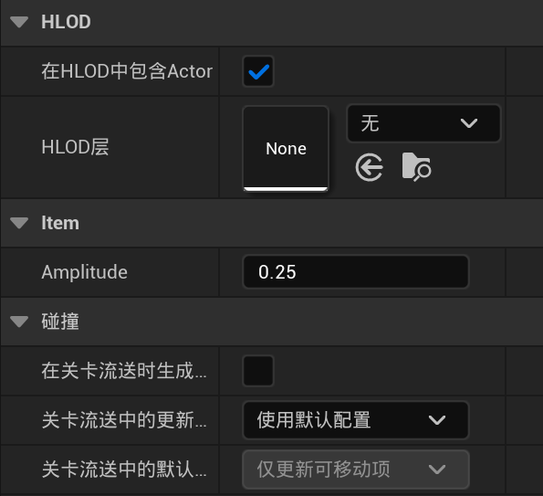

现在就可以看到变量一栏的Item栏 出现了Amplitude和Time Constant

现在无论是在蓝图编辑器右侧细节面板中 还是左侧我的蓝图面板中 Amplitude和Time Constant变量都是在Item类别之下 但是如果接下来变量越来越多 就会变得杂乱 如果还能继续分类整理一下就好了

```c++
// Item.h
protected:
    virtual void BeginPlay() override;

    UPROPERTY(EditAnywhere, BlueprintReadWrite, Category = "Sine Parameters")
    float Amplitude = 0.25f;

    UPROPERTY(EditAnywhere, BlueprintReadWrite, Category = "Sine Parameters")
    float TimeConstant = 5.f;
```

现在这些参数就不在Item类别下了 而是Sine Parameters类别下 无论是在关卡编辑器视口右侧的细节面板里 还是在蓝图编辑器左侧我的蓝图面板 蓝图编辑器右侧细节面板里 都完成了分类 按我们目前的设置 它在这些地方都是可编辑的

```c++
// Item.h
private:
    UPROPERTY(VisibleAnywhere, BlueprintReadOnly, meta = (AllowPrivateAccess = "true"))
    float RunningTime;
```

这样就可以将变量放到private 又能在蓝图的事件图表中只读 meta是**元说明符**

### 将函数暴露给蓝图

前面在Item.cpp中 `Amplitude * FMath::Sin(RunningTime * TimeConstant)` 是经过变换的正弦函数 我们接下来要将它暴露给蓝图

将函数放在public protected private 取决于我们是否打算从类外面调用这个函数 是否有其它对象可以访问这个对象并调用这个函数 如果有 就要设置成是public 否则没有必要public 那么它就可以是protected或者private 接下来 考虑是否要在这个类的子类里调用这个函数 如果需要 就设置成protected 如果确定只有当前这个类要用这个函数 那就设置成private **不确定的时候就将函数先放在protected 之后再将它们挪到其它区域**

将这个正弦函数的声明放在Item.h 的 `class HELLOWORLD_API AItem : public AActor` 的 `protected:` 里

```c++
// Item.h
float TransformedSin(float Value);
```

鼠标悬停在`TransformedSin`上 点击下方出现的**螺丝刀标志**右侧的向下小三角 点击 创建"TransformedSin"的定义(在Item.cpp中) 
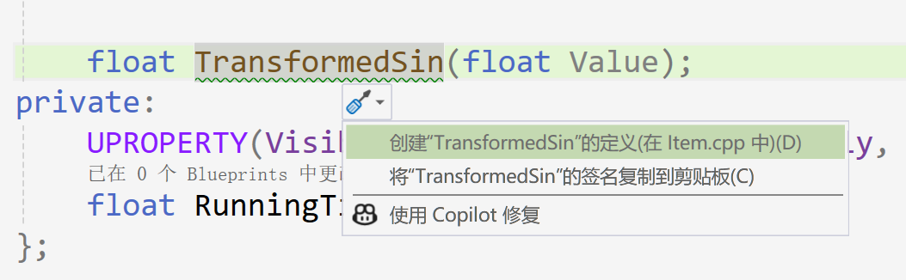
这样它就会自动在Item.cpp中创建一个静态函数

```c++
// Item.cpp
float AItem::TransformedSin(float Value)
{
    return 0.0f;
}
```

将它补全

```c++
// Item.cpp
float AItem::TransformedSin(float Value)
{
    return Amplitude * FMath::Sin(Value * TimeConstant);
}
```

这样就可以让调用这个函数的人 可以直接传入任何它们想让这个经过变换后的正弦函数处理的内容

再使用**UFUNCTION宏**将它暴露给蓝图

`UFUNCTION(BlueprintCallable)`
放在Item.h中的函数声明前面

```c++
// Item.h
UFUNCTION(BlueprintCallable)
float TransformedSin(float Value);
```

然后把tick函数中的对于正弦函数的调用注释掉
```c++
// Item.cpp
void AItem::Tick(float DeltaTime)
{
    Super::Tick(DeltaTime);

    RunningTime += DeltaTime;

    //float DeltaZ = Amplitude * FMath::Sin(RunningTime * TimeConstant);
    //AddActorWorldOffset(FVector(0.f, 0.f, DeltaZ));

    DRAW_SPHERE_SingleFrame(GetActorLocation());
    DRAW_VECTOR_SingleFrame(GetActorLocation(), GetActorLocation()+GetActorForwardVector()*100.f);
}
```

现在tick函数里就只更新运行时间了 回到UE热重载 进入BP_Item的蓝图编辑器 事件图表视口 右键 搜索找到TransformedSin 就可以使用它

`UFUNCTION(BlueprintPure)`
蓝图纯节点 和刚才的区别就是在蓝图没有白色五边形的执行引脚 那么就不会参与程序执行流程 不会改变游戏世界的状态 但是它左侧也是有一个可以设置的输入参数 就只是根据输入计算一个值 并返回结果输出

现在回到VS把value参数删掉 换回Running Time
```c++
// Item.h
UFUNCTION(BlueprintPure)
float TransformedSin();
```

```c++
// Item.cpp
float AItem::TransformedSin()
{
    return Amplitude * FMath::Sin(RunningTime * TimeConstant);
}
```

我们可以完全复制出一个余弦函数

```c++
// Item.h
UFUNCTION(BlueprintPure)
float TransformedCos();
```

```c++
// Item.cpp
float AItem::TransformedCos()
{
    return Amplitude * FMath::Cos(RunningTime * TimeConstant);
}
```

在AddActorWorldOffset节点的DeltaLocation上 右键 分割结构体引脚 然后将TransformedSin节点的输出连接到DeltaLocationX 将TransformedCos节点的输出连接到DeltaLocationY
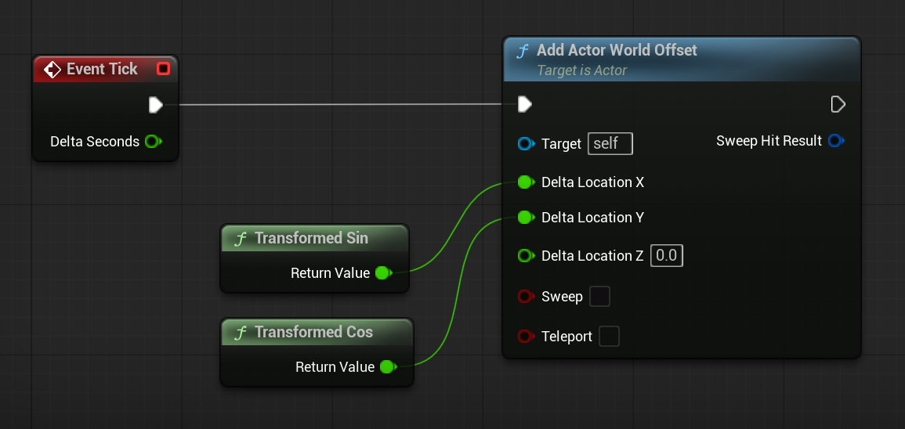
上图中 AddActorWorldOffset节点就是**BlueprintCallable** 是蓝色的 左右两侧具有白色多边形引脚 TransformedSin和TransformedCos节点就是**BlueprintPure** 是绿色的

点击左上角编译 现在再进入PIE模式 可以通过调试球看到 BP_Item在转动 这是因为正弦余弦存在相位差

## 模板函数

在 Item.h 的`AItem`类中 protected里 接着TransformedSin和TransformedCos的声明后面 声明一个模板函数

```c++
// Item.h
template<typename T>
T Avg(T First, T Second);
```

鼠标悬停在`Avg`上 点击下方出现的螺丝刀图标 选择 创建"Avg"的定义(在Item.h中) 于是在Item.h中 AItem类的外面 目前是文件末尾 就会出现

```c++
// Item.h
template<typename T>
inline T AItem::Avg(T First, T Second)
{
    return T();
}
```

这个inline是 在调用这个`AItem::Avg`函数时 它只会将这个函数\{ \}中的内容 也就是函数体 在编译时替换掉函数调用 并没有一个实际的函数 就像宏一样 

```c++
// Item.h
template<typename T>
inline T AItem::Avg(T First, T Second)
{
    return (First + Second) / 2;
}
```

现在T可以接收任何类型 只要该类型支持加法和除法运算

```c++
// Item.cpp
void AItem::BeginPlay()
{
    Super::BeginPlay();

    int32 AvgInt = Avg<int32>(1, 3);
    UE_LOG(LogTemp, Warning, TEXT("Avg of 1 and 3: %d"), AvgInt)
}
```

UE热重载 输出日志里就会出现`LogTemp: Warning: Avg of 1 and 3: 2`

```c++
// Item.cpp
void AItem::BeginPlay()
{
    Super::BeginPlay();

    int32 AvgInt = Avg<int32>(1, 3);
    UE_LOG(LogTemp, Warning, TEXT("Avg of 1 and 3: %d"), AvgInt)
        
    float AvgFloat = Avg<float>(3.45f, 6.78f);
    UE_LOG(LogTemp, Warning, TEXT("Avg of 3.45 and 6.78: %f"), AvgFloat)
}
```

`LogTemp: Warning: Avg of 3.45 and 6.78: 5.115000`

现在把`AItem::BeginPlay`里新增的上面这些计算平均数的代码删掉吧 目光转到Item.h中的`AItem::Tick`

```c++
// Item.h
void AItem::Tick(float DeltaTime)
{
    Super::Tick(DeltaTime);

    RunningTime += DeltaTime;

    //float DeltaZ = Amplitude * FMath::Sin(RunningTime * TimeConstant);
    //AddActorWorldOffset(FVector(0.f, 0.f, DeltaZ));

    DRAW_SPHERE_SingleFrame(GetActorLocation());
    DRAW_VECTOR_SingleFrame(GetActorLocation(), GetActorLocation()+GetActorForwardVector()*100.f);

    FVector AvgVector = Avg<FVector>(GetActorLocation(), FVector::ZeroVector);
    DRAW_POINT_SingleFrame(AvgVector);
}
```

`FVector::ZeroVector`是一个变量 x y z坐标都为0 但是是**静态向量 所以可以直接从类访问它 不需要从FVector的实例获取**
现在平均值是Actor当前位置和零向量 两个向量的平均值 得到的结果就是这两个向量的中点向量 我们使用调试点来显示 使用 `DRAW_POINT_SingleFrame`宏

在UE热重载 我们已经可以看到一个悬空的点 显示的是原点和Actor之间的中点 

模板函数可以用同一个函数处理各种数据类型的输入参数 实现同样的功能 在使用我们的这个Avg时 要求数据类型必须支持加法和除法运算 **模板函数的限制就是 我们传入的数据类型必须能应付函数里要做的操作**

在刚才的代码块中 `AItem::Tick`函数的末尾 再加上`FRotator AvgRotator = Avg<FRotator>(GetActorRotation(), FRotator::ZeroRotator);` 尝试热重载 但是编译失败了 说找不到除法操作符 它需要一个`UE::Math::TRotator<double>`类型的左操作数 但是两个Rotator的除法没有任何意义 如果要实现这个功能 就要自己编写代码 引擎本身没有这个功能

## 组件 Component

### 蓝图

Actor可以包含组件 这样能让Actor拥有原本没有的功能 比如在游戏世界中显示模型 这样就可以直接看到它 而不用画调试球了

假如我们有个叫Weapon武器的Actor 比如你可能需要给它一个模型 所以我们就会为此添加一个组件 这样我们就能在游戏中看到这个武器的样子 你挥动武器的时候 可能想知道武器什么时候打到东西 这样就需要物理 所以可以在武器模型刀刃周围放一个隐形的碰撞盒组件 用来检测我们打到敌人时的碰撞事件 给武器添加这些组件 提升它的功能性

每个Actor至少带一个组件 之前创建BP_Item之后 我们会在组件面板看到它有一个默认的DefaultSceneRoot默认场景根节点 这是一个**场景组件** 蓝图编辑器左侧 我的蓝图面板 组件栏中 在我们之前把Amplitude和TimeConstant暴露到我的蓝图中时见到过
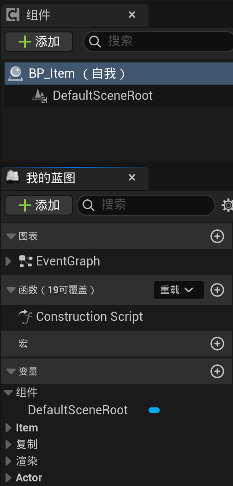

这个DefaultSceneRoot就是Actor的根组件 在C++的Actor.h文件中声明了这个变量 在C++中 它叫RootComponent 类型是USceneCompnent 前缀U表示 这是一个Uobject 不是Actor的派生类 所以它在UE的继承体系中比较靠上

现在场景组件的功能较弱 它有一个特性 就是变换transform 其实就是在关卡编辑器中 选中某个物体后 在右下角细节面板 通用 - 变换 中的 位置、旋转、缩放信息 实际上变换是一种数据结构 包含3个主要信息 位置 是一个FVector 旋转 FRotator 缩放 FVector 

**场景组件可以附加到其它组件上** 所以场景组件之间也可以相互附加 Actor的根组件DefaultSceneRoot包含了Actor的变换信息 所以调用`GetActorLocation()`获取Actor的世界坐标FVector时 实际上返回的是根组件的位置 也就是说 它返回的是根组件transform变量里保存的位置信息 所以Actor必须至少包含一个组件 也就是根组件 因为它包含变换的信息

蓝图中有一个组件面板 最上面显示着组件的名字(自我) 下面的第一个组件就是DefaultSceneRoot 因为场景组件支持附加 所以我们可以给Actor添加一个新的场景组件 并把它附加到根组件上 附加到根组件上后 场景组件就会跟着根组件一起移动 两者之间的相对距离始终保持不变

下面了解一下继承自场景组件的类
UE中我们最常遇到的就是**静态网格组件** 我们有USceneComponent类 其中一个派生类是**UStaticMeshComponent** 我们已经知道 USceneComponent有自己的变换 并且可以附加到其它组件上 而UStaticMeshComponent作为它的子类 也继承了这些特性 所以静态网格组件有自己的变换 并且可以附加到其它组件上 但是它还有一个额外特性 也就是拥有一个网格mesh 所以**UStaticMeshComponent类包含一个UStaticMesh类型的变量**

回到武器的例子 如果我们创建一个Weapon的新Actor 它会有一个默认的DefaultSceneRoot 也就是一个场景组件 现在我们添加一个静态网格组件 命名为WeaponMesh WeaponMesh将附加到DefaultSceneRoot上 因此 DefaultSceneRoot移动时 网格也会跟着移动 即使WeaponMesh附加到DefaultSceneRoot上 我们也可以向上移动网格 比如修改它相对于DefaultSceneRoot的相对变换 但是即便如此 当我们再次移动DefaultSceneRoot时 网格也还是会跟着一起动 并保持相对着相对位置

现在DefaultSceneRoot的类型是USceneComponent 而UStaticMeshComponent是USceneComponent的子类 所以我们可以把网格WeaponMesh重新指定成路径 这样一来 我们的DefaultSceneRoot就会被UStaticMeshComponent类型所替换 也就是说WeaponMesh成为了根组件 这样是没有问题的 因为父类指针可以指向子类对象 根组件是USceneComponent类型指针 现在指向了一个UStaticMeshComponent类型对象 所以我们可以用这种方式覆盖根组件

打开UE 进入BP_Item的蓝图编辑器 进入视口标签页 里面是基本上空空如也 有一个像折叠镜一样的东西 其实这个就是左侧组件面板里的DefaultSceneRoot 那就是根组件 点击左上角绿色加号 添加 就能从下拉菜单选择各种组件 找到静态网格体组件 就保持它默认的名字StaticMesh 但是添加了之后 视口也没有发生什么变化 我们在组件中选中这个StaticMesh 可以看到右侧细节面板中 有一栏是静态网格体 显示是None 这是这个StaticMesh的变量 类型为StaticMesh 所以说 我们刚才创建的是静态网格体组件UStaticMeshComponent类型的对象 这是一个组件 是从场景组件派生的 可以附加到其它组件上 并不是静态网格体UStaticMesh类型的对象 是一个装网格信息的类 我们可以点击小箭头在下拉菜单指定要用哪个网格给这个静态网格体变量 目前我们随便指定一个 如果想重置为默认值 就点右侧的弯箭头 也可以在关卡编辑器的内容侧滑菜单找到网格体 用鼠标拖入到BP_Item的蓝图编辑器 
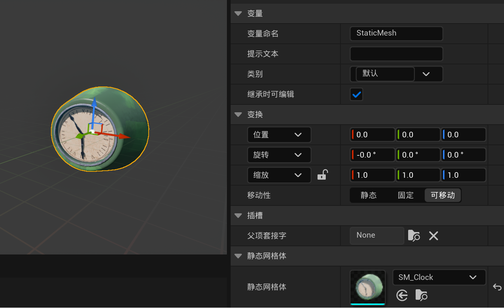

有些静态网格体的旋转中心不是在正中心 是在底部 这取决于建模师在Maya Blender等软件里建模时做的设计选择

保存一下 回到关卡编辑器 就可以看到我们的BP_Item已经有了静态网格模型 进入PIE模式 它还是像以前一样依据正弦余弦在动 调试球的中心在静态网格体的旋转中心 要记得我们目前是在蓝图里使用蓝图节点让它们动的 而不是在C++中修改了tick函数

再一次进入BP_Item的蓝图编辑器 我们可以把这个网格体进行移动 这样它就相对于那个形状犹如折叠镜的根节点有一定的偏移 进入PIE模式 就发现调试球的中心并不在网格体的旋转中心了 而是发生了偏移 但是它的运动方式和根节点是一样的

现在我们把根节点就换成这个StaticMesh 在蓝图编辑器左侧 组件面板 选中StaticMesh 将它拖拽到DefaultSceneRoot上 提示框显示 放置到此处使StaticMesh成为新的根 默认的根将被删除 拖拽之后 DefaultSceneRoot就消失了 StaticMesh成为了新的根 在视口中可以看到那个折叠镜形状也消失了 再一次进入PIE模式 调试球中心再一次和静态网格体的旋转中心重合

现在我们无法在蓝图编辑器视口里移动这个网格体了 因为现在它就是蓝图的参考坐标系 它是根节点 不能移动蓝图的根组件 我们现在也可以添加附加到根节点的新组件 点绿色加号添加 再添加一个静态网格StaticMesh1 把它从None变成选择一个静态网格 我们就可以看到两个静态网格体叠加的样子 并且可以通过拖拽StaticMesh1 来修改它们的相对位置 因为这个StaticMesh1并不是根组件 进入PIE模式 也能看到它们 保持着相对位置 也可以右键某个组件选择删除 或者选中后直接按delete 如果删除了现在作为根组件的StaticMesh 视口中的网格体会消失 DefaultSceneRoot会重新出现 视口中也会再次出现那个折叠镜形状 UE不允许Actor没有根组件 所以删除根组件后 它会创建一个新的场景根组件 因为Actor必须有变换信息 需要位置和旋转信息

### C++

我们的Item类 是继承自Actor类 UE会根据这个类创建一个**类默认对象** Item Class Default Object 简称CDO 这个类默认对象 它是在UE启动时自动创建的 编译代码其实也顺便把它给生成了 它保存着这个类的默认值 当你创建了这个类的实例时 如果没有特别指定 就会使用CDO中的值来初始化这个实例的属性 这个类默认对象存在于UE的反射系统里 UE会为每个类创建类默认对象 然后它会执行每个类的构造函数设置默认值 这对于蓝图来说特别关键 蓝图的默认值由引擎初始化 这些信息来自于蓝图对应的类和默认对象 所有这些过程都在后台完成 UE自动为我们做了大量的初始化工作

类的构造函数在游戏引擎启动的早期阶段执行 也就是说 在类的构造函数中执行某些操作还为时过早 **如果想在游戏开始时确保所有游戏对象都初始化 那么我们必须在BeginPlay函数中执行 而不是在对象的构造函数中**
比如有一个名为Bomb的类 它会在游戏一开始就爆炸 你可能希望它检测附近有哪些Actor 然后对它们造成伤害 那么你肯定不会想在Bomb的构造函数里这么做 时机太早了 不是所有Actor都已完成初始化 引擎还没有创建它们的类默认对象来初始化这些Actor的默认值 这种功能必须使用BeginPlay 因为那时所有Actor都已初始化完毕

我们之所以提到类默认对象 是因为组件的处理过程是类似的

组件是附加到Actor上的对象 **组件本身也是UObject 在UE中 一个UObject可以拥有其它UObject 这些被拥有的UObject 就是子对象 所以组件就是Actor的子对象** 

**默认子对象**DefaultSubobject是指 在Actor的构造函数中创建的组件 这些组件会成为这个Actor类的CDO的一部分 也就是说 当这个Actor类被创建时 它就会默认带有这些组件
当你定义一个Actor类时 你可能希望它默认包含一些组件 比如静态网格组件 这些组件在Actor被创建时就应该存在 所以我们要把创建组件的代码 写在Actor的构造函数里 这样我们就能告诉UE 这个Actor的每一个实例都应该默认包含这个组件 并且这个组件的初始值由CDO中的这个默认子对象提供

到这里我们已经发现了 类本身是有一个UE为它自动生成的类默认对象CDO的 我们并不需要显式地创建 但是UE并不会自动为我们的Actor添加组件 如果我们想要一个组件 就必须手动地显式创建 组件是Actor的一部分 我们需要在Actor的构造函数中显式创建默认子对象 这样这个组件就会成为Actor的CDO的一部分

假设我们有一个Item类 想要添加一个叫ItemMesh的组件 那么我们就需要把这个组件创建成类的一个默认子对象

创建默认子对象时我们需要提供一些信息

1. 我们需要确定子对象的类型 比如UStaticMeshComponent
2. 然后取一个内部名称 这个名称和实际的变量名不一样 UE用它来做很多事情 主要是追踪不同的对象
3. 创建默认子对象 要用一个模板函数 这样就可以接收不同的数据类型

`CreateDefaultSubobject<UStaticMeshComponent>(TEXT("ItemMeshComponent"))`
`UStaticMeshComponent`就是子对象的类型 `TEXT("ItemMeshComponent")`是它的内部名称 

创建默认值对象函数会返回新创建子对象的地址 所以我们可以把它存储在指针里 像这样的帮我们创建对象的函数 叫做**工厂函数** 工厂Factory就是一个帮我们创建对象的函数 在C++里你可能习惯于用new关键字创建对象的新实例 然后把对象的地址存储在指针里 在UE里我们基本不用new关键字 引擎自带的工厂函数会帮我们创建对象并处理很多内部事务 比如注册对象让引擎知道它的存在

所以现在我们明白了 **要在C++里创建新的组件 就是要创建一个默认子对象 这样它就会伴随着CDO被创建** 然后我们就是类似于用new创建 但是我们不是使用new 而是使用工厂函数 这样做是为了集成到UE的对象管理系统中 在传统C++里 我们会使用new在堆上分配内存并调用构造函数 然后在不需要时用delete释放内存 但是UE中 就是使用UE的智能指针 或者让UE的垃圾回收系统来管理 对于组件 我们使用`CreateDefaultSubobject` 在Actor或父组件的构造函数中创建 这样这些组件就会成为该Actor或父组件的子对象 并随着父对象的销毁而销毁

回到VS 首先清理一下我们原本的演示代码 暂时保留正弦余弦函数和RunningTime 删掉调试形状 因为我们马上就要添加一个组件 到时候就能在场景里看到它了 

```c++
// Item.cpp
#include "Items/Item.h"
#include "HelloWorld/DebugMacros.h"

AItem::AItem()
{
    PrimaryActorTick.bCanEverTick = true;
}

void AItem::BeginPlay()
{
    Super::BeginPlay();
}

float AItem::TransformedSin()
{
    return Amplitude * FMath::Sin(RunningTime * TimeConstant);
}

float AItem::TransformedCos()
{
    return Amplitude * FMath::Cos(RunningTime * TimeConstant);
}

void AItem::Tick(float DeltaTime)
{
    Super::Tick(DeltaTime);

    RunningTime += DeltaTime;

}
```

```c++
// Item.h
#pragma once

#include "CoreMinimal.h"
#include "GameFramework/Actor.h"
#include "Item.generated.h"

UCLASS()
class HELLOWORLD_API AItem : public AActor
{
    GENERATED_BODY()
    
public:    
    AItem();
    virtual void Tick(float DeltaTime) override;

protected:
    virtual void BeginPlay() override;

    UPROPERTY(EditAnywhere, BlueprintReadWrite, Category = "Sine Parameters")
    float Amplitude = 0.25f;

    UPROPERTY(EditAnywhere, BlueprintReadWrite, Category = "Sine Parameters")
    float TimeConstant = 5.f;

    UFUNCTION(BlueprintPure)
    float TransformedSin();

    UFUNCTION(BlueprintPure)
    float TransformedCos();

    template<typename T>
    T Avg(T First, T Second);


private:
    UPROPERTY(VisibleAnywhere, BlueprintReadOnly, meta = (AllowPrivateAccess = "true"))
    float RunningTime;
};

template<typename T>
inline T AItem::Avg(T First, T Second)
{
    return (First + Second) / 2;
}
```

现在我们要在Item.h添加一个组件 就放在private的末尾

```c++
// Item.h
UPROPERTY(VisibleAnywhere)
UStaticMeshComponent* ItemMesh;
```

`UStaticMeshComponent* ItemMesh;` 我们只是创建了一个UStaticMeshComponent类型的空指针 然后用UPROPERTY将这个指针暴露给反射系统和蓝图 当我们创建新组件并将地址保存在这个指针里之后 子对象就存在于我们的Actor中了 UE通常会进行垃圾回收 它会检查世界里的所有对象 看看有没有指针指向它们 如果没有 它就会直接删除这些对象 **添加UPROPERTY会让这个变量参与反射系统 这样UE就知道这个指针指向哪个对象了 它就会知道这个对象还在使用 不会被回收**

现在我们有了ItemMesh指针 接下来要创建一个新的静态网格组件子对象 打开Item.cpp 我们要在Actor的构造函数里完成这个操作 在构造函数里 我们创建一个新的静态网格组件

```c++
// Item.cpp
AItem::AItem()
{
    PrimaryActorTick.bCanEverTick = true;

    ItemMesh = CreateDefaultSubobject<UStaticMeshComponent>(TEXT("ItemMesh"));
    RootComponent = ItemMesh;
}
```

`CreateDefaultSubobject`是一个模板函数 这个函数会返回一个指向新创建对象的指针 所以我们要把这个工厂函数返回的地址 存到ItemMesh指针变量里

根组件可以重新指定到另一个场景组件 ItemMesh是静态网格组件 继承自场景组件 所以我们可以把Actor继承的根组件变量重新指定给ItemMesh 就像蓝图一样 根组件指针变量指向的默认场景根会自动删除 这是因为垃圾回收系统会发现根组件不再指向它了 因为它没有任何指针指向 所以会被垃圾回收并删除 现在我们的根组件指针RootComponent指向我们新创建的ItemMesh子对象

回到UE热重载 进入BP_Item的蓝图编辑器 看左上角组件选项卡 已经有我们创建的ItemMeshComponent了 显示为`Item Mesh(ItemMeshComponent)` 而且它就是根组件 点击视口 什么都没有 连折叠镜都没有了 这是因为我们的ItemMesh是一个静态网格组件 它有个静态网格变量 但是默认是空的None

如有需要 我们可以直接在C++里硬编码静态网格体使其不是None 但是通常的做法是在C里创建组件 然后在蓝图里设置它的静态网格体属性 这样就更灵活了我们可以创建多个BP_Item 然后在每一个蓝图里分别设置它们的静态网格体

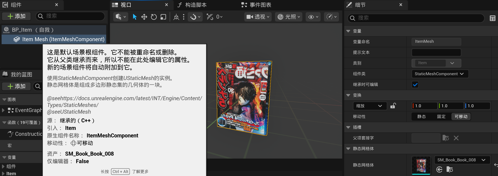
可以看到 我们原来的是ItemMesh中间没有空格 因为C++变量名不能有空格 现在在组件选项卡里 UE看到了我们使用了两个词 因为Item和Mesh都是首字母大写 所以它自动为我们处理成有空格 让蓝图更易读 括号里的ItemMeshComponent是我们创建默认子对象时提供的内部名称 而且我们使用UPROPERTY宏标记的是`VisibleAnywhere` 如果让它是`EditableAnywhere` 那就意味着我们可以直接修改指针值 其实对于编辑器就只是一个地址 对于场景组件没什么意义 **我们一般不会让场景组件EditableAnywhere 只是VisibleAnywhere就足够了**

场景组件有自己的属性 可以在右侧细节面板修改 可以看到 变换 一栏 有一个缩放 我们已经知道 场景组件拥有完整的变换 包含位置 旋转 缩放 但是 如果这个组件是**根组件 我们就不能改变它的位置或旋转 如果想要改变它的位置 就只能在世界中的Actor实例上进行操作**

进入PIE模式 会发现BP_Item还是在旋转 这是因为我们之前使用了蓝图纯函数 使用正弦和余弦函数分别对X和Y产生了偏移 现在我们把正弦函数的引脚从Delta X换成连接到Delta Z 鼠标悬停在连线上 直到这条连线高亮 然后按alt 就可以断开连线 顺便把余弦函数删掉 编译后再次进入PIE模式 就发现我们的BP_Item换成了上下浮动

在C++中创建组件 我们所做的就只是

1. 在Item.h中 用给定的组件类型(比如UStaticMeshComponent类型) 创建一个 指向我们所要创建的组件 的指针
   `UStaticMeshComponent* ItemMesh;` 这样当这个类的所有实例被创建时 就都会拥有这个指针变量 我们将在这个类的构造函数中为这个指针赋值
   实际上之前在做Amplitude的时候 最开始我们也是打算在Item.h里创建这个变量 之后在Item.cpp 类的构造函数中对其赋值
2. 然后使用`UPROPERTY(VisibleAnywhere)`将它暴露给蓝图编辑器 这样我们就能在蓝图编辑器里修改它的静态网格变量了
3. 在Item.cpp中 在类的构造函数中 创建类的默认子对象
   `ItemMesh = CreateDefaultSubobject<UStaticMeshComponent>(TEXT("ItemMeshComponent"));` 这样在这个类的每一个实例创建之后 就都会拥有这个组件
4. 然后重新赋值根组件 存储新创建的ItemMesh的地址 这样所有Actor实例默认的DefaultSceneRoot就都被删掉了 根组件就指向了我们新创建的ItemMesh
   `RootComponent = ItemMesh;`

## Pawn类

已经说过 Pawn除了继承Actor类的功能 还有一些额外功能 首先可以被控制器操控 我们可以输入键盘按键 鼠标点击 移动鼠标 用这些数据来控制Pawn的移动 

我们创建一个pawn 鸟类 这样就能有一个飞翔的鸟类
打开UE 关卡编辑器左上角 - 工具 - 新建C++类 选择Pawn 点击下一步 选择公共 命名为Bird 路径设置为`???/HelloWorld/Source/HelloWorld/Pawns/` 然后点击创建类 这时候UE会自动开始热重载 回到VS 会有一个弹窗说 已在环境外修改解决方案 我们点击全部重新加载 就可以看到Bird.cpp和Bird.h 稍作整理

```c++
// Bird.h
#pragma once

#include "CoreMinimal.h"
#include "GameFramework/Pawn.h"
#include "Bird.generated.h"

UCLASS()
class HELLOWORLD_API ABird : public APawn
{
    GENERATED_BODY()

public:
    ABird();
    virtual void Tick(float DeltaTime) override;

    // Called to bind functionality to input
    virtual void SetupPlayerInputComponent(class UInputComponent* PlayerInputComponent) override;

protected:
    virtual void BeginPlay() override;
};
```

```c++
// Bird.cpp
#include "Pawns/Bird.h"

ABird::ABird()
{
    PrimaryActorTick.bCanEverTick = true;

}

void ABird::BeginPlay()
{
    Super::BeginPlay();
    
}

void ABird::Tick(float DeltaTime)
{
    Super::Tick(DeltaTime);

}

// Called to bind functionality to input
void ABird::SetupPlayerInputComponent(UInputComponent* PlayerInputComponent)
{
    Super::SetupPlayerInputComponent(PlayerInputComponent);

}
```

我们的类名叫Bird Pawn派生自Actor 所以C++中它的名字前面会有一个A 但是在UE编辑器中 比如蓝图编辑器里 UE会自动帮我们去掉这个A
还可以发现 比Item类多了一个`SetupPlayerInputComponent` 设置玩家输入组件 允许我们接收输入 比如按下键盘 移动鼠标 我们可以访问并利用这些数据来控制我们的pawn 

UE 在内容侧滑菜单 所有 - C++类 - HelloWorld - Public - Pawns - Bird 就可以看到我们的Bird类 现在在内容文件夹 - Blueprints 里 创建一个Pawns文件夹 然后进入Pawns文件夹 右键 新建蓝图类 在弹出窗口 所有类一栏中 搜索Bird 选择Bird 创建一个蓝图类 命名为BP_Bird

先去Fab商城里下载一个具备动画的鸟类的资产 然后双击这个BP_Bird 进入蓝图编辑器 可以看到它现在有组件DefaultSceneRoot 我们肯定需要个网格体才能看到小鸟 但这不是我们要添加的第一个组件

### 胶囊组件

首先用一个**胶囊体**capsule 用来做基本的碰撞检测 游戏里的每一个网格mesh都是由多边形构成的 这只鸟类就有很多多边形 多边形数量对于做碰撞检测而言还是太多了 检测与实际网格的碰撞需要引擎进行大量计算 判断飞过来的这个物体是否与任何多边形相撞 所以需要用更简单的胶囊体来处理碰撞 当物体靠近并与胶囊体发生碰撞 引擎就能检测到碰撞 计算量大幅减少 我们通常会使用一个包含基本几何形状的组件来处理碰撞

UE有一个名为**UCapsuleComponent**胶囊组件的类 U前缀表示它源于UObject 而不是Actor UObject类 派生出USceneComponent场景组件 可以变换 还支持附加 而UCapsuleComponent是从USceneComponent派生出来的 所以它支持附加 也支持变换 当然还有其他类也源于这些对象 这条继承链实际上更复杂 在这里我们只关注胶囊组件 

胶囊组件用于简单的碰撞检测 它的几何形状非常简单 在编辑器中还会以红线显示 这样我们就能看到它的碰撞体积了

打开Bird.h 因为胶囊组件是这个Actor的内部信息 所以放到private

```c++
private:
    UCapsuleComponent* Capsule;
```

写完这一句之后 我们发现VS对`UCapsuleComponent`标红了 提示我们说UCapsuleComponent标识符未定义 关闭UE 使用VS编译 BuildHelloWorld 输出信息里出现报错 都是围绕着这个指针产生的问题 因为编译器并不认识UCapsuleComponent

现在只要确保我们不用未定义的类型 就能避免所有这些错误 其实这个类型在UE中定义了 只不过是在一个特定的头文件里
我们打开[UE官方文档](https://dev.epicgames.com/documentation/zh-cn/unreal-engine/unreal-engine-5-6-documentation) 在右侧搜索栏输入`UCapsuleComponent`直接按搜索 我们并没有找到任何有效的东西 在搜索时要保证页面语言是英文 可以按地球图标进行切换 输入完UCapsuleComponent之后 不能立刻按搜索 而是要在那个输入时悬浮出来的选项卡里 选择后缀为**API Documentation**的 UCapsuleComponent 实际上在我们上一次在官方文档中搜索FString时 也可以使用这种方法
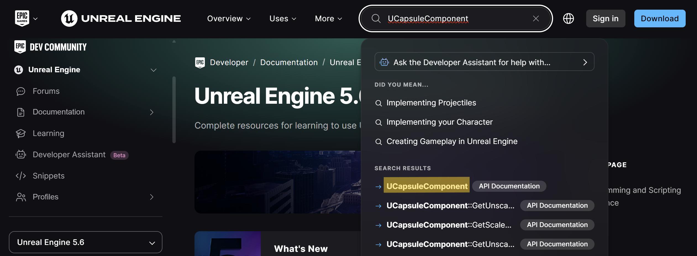

最后我们进入了[UCapsuleComponent文档](https://dev.epicgames.com/documentation/en-us/unreal-engine/API/Runtime/Engine/UCapsuleComponent?application_version=5.6)

在文档开头 它告诉我们这个类在引擎中定义的头文件的位置 `/Engine/Source/Runtime/Engine/Classes/Components/CapsuleComponent.h` 也告诉我们如果要包含这个头文件的包含路径 `#include "Components/CapsuleComponent.h"`

稍微往下翻 我们就可以看到它的继承层级Inheritance Hierarchy

```c++
UObjectBase → UObjectBaseUtility → UObject → UActorComponent → USceneComponent → UPrimitiveComponent → UShapeComponent → UCapsuleComponent
```

继承自UObject 之后是UActorComponent 然后是USceneComponent 剩下就是我们没接触过的东西 比我们之前说的复杂许多 继承体系中越往下 每个子类添加的功能就越多

再后面就是一些函数

**在UE中include头文件时 一定要放在.generated.h之前 也就是说.generated.h必须放在最后** 否则就会报错 这是因为当UE引入.generated.h时 预处理器会自动插入大量代码 使得这个类能够工作并与反射系统集成

现在我们

```c++
// Bird.h
#include "Components/CapsuleComponent.h"
```

这样之后 就发现`UCapsuleComponent`的标红消失了 关闭UE 按ctrl+F5编译并重新打开 

想在蓝图中看到这个胶囊组件 就要把它暴露到蓝图 需要使用PROPERTY宏

```c++
// Bird.h
private:
    UPROPERTY(VisibleAnywhere)
    UCapsuleComponent* Capsule;
```

现在这个Capsule只是一个指针变量 我们还没有创建胶囊对象 需要在胶囊的构造函数中为胶囊创建一个默认子对象 并将Capsule设置为根组件

```c++
// Bird.cpp
ABird::ABird()
{
    PrimaryActorTick.bCanEverTick = true;

    Capsule = CreateDefaultSubobject<UCapsuleComponent>(TEXT("Capsule"));
    SetRootComponent(Capsule);
}
```

`SetRootComponent(Capsule);`和我们之间写的`RootComponent = Capsule;` 功能是一样的 **SetRootCoponent**是我们继承的设置根组件的函数 可以通过传入一个场景组件来设置根组件 而Capsule确实就是一个场景组件 符合输入要求
使用SetRootCoponent 那么在将来UE决定将RootComponent设置成private变量 我们的代码仍能编译 因为SetRootCoponent是public函数

在UE热重载 然后再内容侧滑菜单 双击BP_Bird 之后点击上方的打开完整蓝图编辑器 我们可以在组件面板看到Capsule 它现在是根节点 点击视口 可以看到胶囊体的形状

我们可以**调整胶囊的高度和半径** 需要在蓝图编辑器 组件面板 选中Capsule组件 右侧细节面板 形状一栏 可以设置 胶囊体半高 胶囊体半径 我们将它变小 直到像鸟类那样小 也可以在C++中修改

```c++
ABird::ABird()
{
    PrimaryActorTick.bCanEverTick = true;

    Capsule = CreateDefaultSubobject<UCapsuleComponent>(TEXT("Capsule"));
    Capsule->SetCapsuleHalfHeight(20.f);
    Capsule->SetCapsuleRadius(15.f);
    SetRootComponent(Capsule);
}
```

这个`SetCapsuleHalfHeight`函数的第二个参数是`bool bUpdateOverlapes = true` 意思是如果我们的胶囊体设置为在重叠时触发事件 那么像这样缩放胶囊体就能检查修改HalfHeight后是否与其它物体重叠 暂时我们先不讨论 无需传入参数 就保持它的默认值true

### 前向声明

在前面我们通过`#include "Components/CapsuleComponent.h"` 解决了声明`UCapsuleComponent`指针时的报错问题 其实这并不是最佳实践 下面讲解原因

```c++
// Creature.h
class ACreature : public APawn
{
    UCapsuleComponent* Capsule;
    
};
```

在Creature里 我们想要一个胶囊组件指针 现在编译器就会报错标红 当我们include胶囊组件的头文件之后 标红就消失了 但是我们点击编译之后 预处理器就会看到这个include语句 然后找到CapsuleComponent.h文件 直接用CapsuleComponent.h文件里的所有内容替换掉那行include语句 CapsuleComponent是在CapsuleComponent.h里面定义的类 所以编译器处理到我们的变量时就知道这个类型已经定义过了 但是如果在Creature.h里又复制CapsuleComponent.h 这样的话Creature.h文件就会变得很大了 Creature.h文件比CapsuleComponent.h还要大 如果头文件之间这样反复嵌套互相调用 也就是**循环依赖** 编译器根本处理不了这种问题 而且即使我们用了pragma once 最终**每一个头文件也都会变得很大** 而且在某一个头文件中 很有可能不需要那么多其它头文件的功能

先看Creature.cpp中对于CapsuleComponent类的使用

```c++
// Creature.cpp
ACreature::ACreature()
{
    Capsule = CreateDefaultSubobject<UCapsuleComponent>(TEXT("Capsule"));
    
};
```

在Creature.h中创建指针时 类的尺寸大小无关紧要 因为指针只负责存储内存地址 每一个指针的size都是相同的 在Creature.cpp文件中 Creature类自带构造函数 我们使用CreateDefaultSubobject在它的构造函数里创建CapsuleComponent对象 直到这个操作 我们才需要知道CapsuleComponent的大小 才能在内存中分配足够的空间

我们的解决方案是 既然所有对于CapsuleComponent的实际使用都是发生在Creature.cpp文件里的 而Creature.h中对于CapsuleComponent的使用 也只是使用了固定大小的指针 并不涉及CapsuleComponent类的实例本身的尺寸大小 那么我们就希望交给Creature.cpp文件来解决 也就是说 不在Creature.h中包含CapsuleComponent.h 而是只在Creature.cpp中包含 我们**只在cpp中include这个cpp真正需要使用的.h文件**

所以在Creature.h中 我们可以在声明CapsuleComponent指针类型变量时 直接进行**forward declare前向声明/提前声明**

```c++
// Creature.h
class ACreature : public APawn
{
    class UCapsuleComponent* Capsule;
    
};
```

这里的**class关键字** 表示我们正在对UCapsuleComponent类型进行前向声明 前向声明的意思就是 声明一个class类型 我们没明确定义它 只是告诉编译器 UCapsuleComponent类型不在这个Creature.h文件里定义 但你可以在别处找到

我们真正需要用到UCapsuleComponent的地方 比如创建这个类型的新对象 都是发生在Creatue.cpp里 我们提前在Creature.h里声明UCapsuleComponent时 编译器认为这里是不完整类型 意思是描述了一个标识符 但缺少确定它大小的信息 而确定它大小的信息 在UCapsuleComponent.h里面的类的声明里 在得到 对于不完整类型 使用起来是受限的 我们只能创建它的指针 却不能访问成员变量 函数 或者创建对象 因为我们并不知道这个类型的大小 我们只知道这是一个指针 所以在Creature.cpp里 创建UCapsuleComponent实例时 只要它是不完整的类型 就会报错 因为类定义在头文件里 所以我们要在Creature.cpp里 `#include "Components/CapsuleComponent.h"`

*必须使用头文件的场合*

1. **继承父类时 必须包含父类的头文件**
   比如 Bird类继承自Pawn类 我们不可能在不知道Pawn类的尺寸 成员函数 变量 等细节的情况下继承它 所以UE在生成类时自动提供了头文件 `#include "GameFramework/Pawn.h"` 我们还可以看到`#include "CoreMinimal.h"`和`#include "Bird.generated.h"` 这些也都会自动包含进来 因为我们需要在CoreMinimal.h中的一些类型 比如我们的Item.h中 也包含了CoreMinimal.h 很多文件都包含了它 这样就不会出现循环依赖了 因为CoreMinimal.h中包含了很多基础信息 我们可以把CoreMinimal.h包含到所有头文件中 并且永远不会重复包含 因为我们的每一个头文件都有pragma once

2. **需要知道类型大小的时候 需要包含这个类的头文件**
   比如我们之前用工厂函数创建类的实例时

3. **要访问某个类的成员变量和函数 需要包含这个类的头文件**
   因为我们想要访问的 类的变量和函数 的信息 就在头文件里 所以必须要包含这个类的头文件

我们将遵循最佳实践 只在需要的地方包含头文件

我们回到Brid.h 不再在Brid.h里包含胶囊组件 而是将它删掉 换成在Brid.cpp里include

```c++
// Bird.h
#pragma once

#include "CoreMinimal.h"
#include "GameFramework/Pawn.h"
#include "Bird.generated.h"

UCLASS()
class HELLOWORLD_API ABird : public APawn
{
    GENERATED_BODY()

public:
    ABird();
    virtual void Tick(float DeltaTime) override;

    // Called to bind functionality to input
    virtual void SetupPlayerInputComponent(class UInputComponent* PlayerInputComponent) override;

protected:
    virtual void BeginPlay() override;

private:
    UPROPERTY(VisibleAnywhere)
    class UCapsuleComponent* Capsule;
};
```

```c++
// Bird.cpp
#include "Pawns/Bird.h"
#include "Components/CapsuleComponent.h"

ABird::ABird()
{
    PrimaryActorTick.bCanEverTick = true;

    Capsule = CreateDefaultSubobject<UCapsuleComponent>(TEXT("Capsule"));
    Capsule->SetCapsuleHalfHeight(20.f);
    Capsule->SetCapsuleRadius(15.f);
    SetRootComponent(Capsule);
}

void ABird::BeginPlay()
{
    Super::BeginPlay();
    
}

void ABird::Tick(float DeltaTime)
{
    Super::Tick(DeltaTime);

}

// Called to bind functionality to input
void ABird::SetupPlayerInputComponent(UInputComponent* PlayerInputComponent)
{
    Super::SetupPlayerInputComponent(PlayerInputComponent);

}
```

当我们在头文件中前向声明某个类 就可以继续在头文件中使用它们了

````c++
private:
    UPROPERTY(VisibleAnywhere)
    class UCapsuleComponent* Capsule;

    UCapsuleComponent* SecondCapsule;
````

最后一行并不会报错 因为编译器已经知道这个类型被前向声明过了 但是如果试图在这个前向声明的上方声明这个变量 编译器就会报错 编译器从文件顶部开始逐行读取 当编译器读到那一行时 它还不认识这个类型

所以有些人喜欢把所有的前向声明都写在文件的开头 我们可以就写在头文件下面

```c++
// Bird.h
#include "CoreMinimal.h"
#include "GameFramework/Pawn.h"
#include "Bird.generated.h"

class UCapsuleComponent;

UCLASS()
class HELLOWORLD_API ABird : public APawn
{
```

但我们还是会在private里再写一遍 作为类的成员变量

```c++
// Bird.h
#pragma once

#include "CoreMinimal.h"
#include "GameFramework/Pawn.h"
#include "Bird.generated.h"

class UCapsuleComponent;

UCLASS()
class HELLOWORLD_API ABird : public APawn
{
    GENERATED_BODY()

public:
    ABird();
    virtual void Tick(float DeltaTime) override;

    // Called to bind functionality to input
    virtual void SetupPlayerInputComponent(class UInputComponent* PlayerInputComponent) override;

protected:
    virtual void BeginPlay() override;

private:
    UPROPERTY(VisibleAnywhere)
    class UCapsuleComponent* Capsule;
};
```

还记得我们在Item.h中使用了

```c++
UStaticMeshComponent* ItemMesh;
```

它没有报错 我们也没有前向声明它 也没有在开头声明 这是因为默认已经包含进去了 我们的项目是基于AActor的 AActor的头文件伦理就包含了这些头文件 在某个地方 UStaticMeshComponent已经被包含或者前向声明过了

所以遇到因为类型未定义报错 可以考虑前向声明 如果不确定 直接前向声明总是没错的 然后只要在cpp文件中包含对应的头文件就可以了

### 骨骼网格组件

我们之前学的都是静态网格体 但是鸟是有动画的 需要用骨骼网格组件

```c++
UObject
  ↓
USceneComponent
  ↓
USkeletalMeshComponent
```

USkeletalMeshComponent骨骼网格体组件继承了UObject的属性 并且功能更强大 就像静态网格组件有自己的StaticMesh变量一样 骨骼网格组件也有自己的SkeletalMesh变量 SkeletalMesh包含一个Skeleton骨架 有了骨架 就能进行动画

现在找到下载的鸟类资产中的骨骼网格体 前缀一般为SK_ 让我们想起静态网格体的前缀SM 双击进入骨骼网格体编辑器 和静态网格体编辑器差不多 但是有一些额外的功能 右下角资产详情面板 显示了材质和一些其它信息 右上角有骨骼树 显示了骨骼的层级结构 里面的命名都是什么Body Arm Wing Head Eye Leg Foot Tail 我们在视口里默认是看不到骨骼的
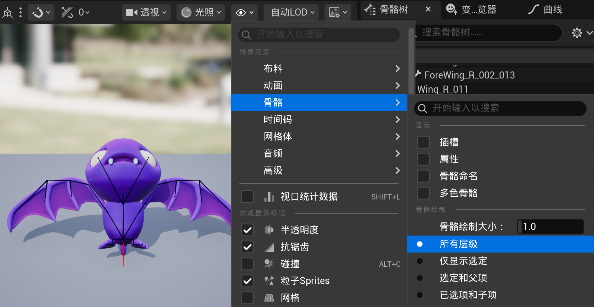

选择视口上方的眼睛图标 - 骨骼 - 所有层级 就会在视口中显示骨骼 现在骨架中的骨骼是按照网格赋予权重的 也就是 一根骨头动 对应的网格就会跟着变形移动 我们可以点击并移动这些骨头 通过双击选中 或者可以在骨骼树中选中 它就会出现旋转工具 我们当然也可以通过QWER切换编辑工具 比如我们对翅膀根部进行旋转 会发现整个翅膀都会发生移动 这是因为网格做了权重绘制 网格上的顶点会跟着骨头发生移动 这通常是在Maya或Blender等建模软件中完成的 给骨骼添加骨架并进行权重绘制 这个过程叫做**绑定** 所以绑定要做的工作就是 为骨骼创建骨架 让网格能随着骨骼变形和动画 动画资源包含骨骼运动信息 每块骨骼都会以不同的方式影响模型网格

再次点击上方眼睛图标 - 骨骼 - 仅显示选定 这样我们就能一次只选择一根骨骼 只显示选中的那根骨骼 因为骨骼网格带有骨骼 骨骼移动时 网格也会跟着动 所以我们可以利用这个网格制作动画

现在进入鸟类资产的动画文件夹 可以看到一些动画序列 这些数据包含了骨骼运动的信息 可以双击任何一个 看到底端有时间线 随着进度条从左到右移动 模型也在动画播放 我们可以随时暂停动画 逐帧查看动画效果 这个动画只和这个模型关联 动画编辑器右上角的图标可以让我们直接跳转到骨骼网格或骨骼

骨骼网格体编辑器 点开默认是下图这样
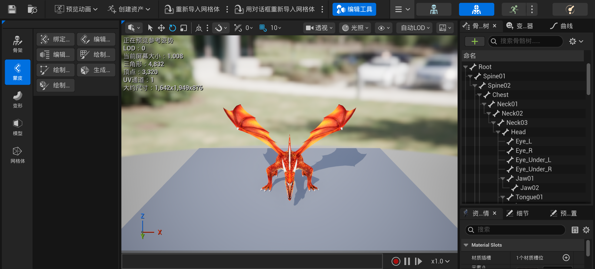

点击右上角左边的骷髅图标就是进入骨架编辑器页面
我们可以看到这个骨架对应的网格模型 如果还有使用同一个骨架的骨骼网络 就可以在 右侧 预览场景设置面板 - 网格体 - 预览网格体(骨骼) 右侧向下三角箭头 切换成不同的网格 只要共用一个骨架就可以 但是目前我们只有一只鸟的骨骼网格用到了这个骨架

点击右上角最右侧的跑步小人图标就是动画界面 在右下角资产浏览器就可以切换查看多个不同动画

接下来给鸟的Pawn添加一个骨骼网格组件 回到VS

在Bird.h中 我们之前在文件开头 前向声明的部分 再加一行`class USkeletalMeshComponent;`

```c++
// Bird.h
#include "CoreMinimal.h"
#include "GameFramework/Pawn.h"
#include "Bird.generated.h"

class UCapsuleComponent;
class USkeletalMeshComponent;
```

然后在类的结尾 Private中添加 并将其设置为蓝图可见

```c++
private:
    UPROPERTY(VisibleAnywhere)
    class UCapsuleComponent* Capsule;

    UPROPERTY(VisibleAnywhere)
    USkeletalMeshComponent* BirdMesh;
```

再次强调 这只是一个指针 并没有初始化 还需要在Bird.cpp创建一个默认子对象 

我们先去[官方文档API](#https://dev.epicgames.com/documentation/en-us/unreal-engine/API/Runtime/Engine/USkeletalMeshComponent?application_version=5.6)中搜索USkeletalMeshComponent 找到它的头文件 `#include "Components/SkeletalMeshComponent.h"` 将它写在Bird.cpp的开头

```c++
// Bird.cpp
#include "Pawns/Bird.h"
#include "Components/CapsuleComponent.h"
#include "Components/SkeletalMeshComponent.h"
```

我们需要在Bird的构造函数中创建默认子对象 这个USkeletalMeshComponent类继承自场景组件 所以支持附加 我们要把它附加到根组件上 这样 如果根组件发生移动 鸟的网格也会跟着发生移动 我们需要使用场景组件的函数SetupAttachment 来将它附加到其它场景组件上 SetupAttachment需要接收一个USceneComponent类型的输入参数 根组件RootComponent是protected 所以我们可以在子类Bird.cpp中访问它 `BirdMesh->SetupAttachment(RootComponent);` 这里我们可以用RootComponent 也可以用Capsule 或者用GetRootComponent() 得到的都是根组件 因为我们之前已经把根组件绑定成胶囊体Capsule了 这个函数的第2个参数InSocketName 接收FName类型 可以用它指定一个socket名称 我们还没有学到socket 此时我们只需要知道 场景组件可以有socket 如果我们指定一个socket的名称 SetupAttachment就会将我们的BirdMesh连接到这个socket 我们暂时不传入socket参数 默认值就是NAME_None 这是一个FName类型的变量 表示我们还没有连接到任何socket

```c++
BirdMesh = CreateDefaultSubobject<USkeletalMeshComponent>(TEXT("BirdMesh"));
BirdMesh->SetupAttachment(RootComponent);
```

现在我们的BirdMesh已经设置为 附加到根组件 也就是胶囊体上 回到UE热重载 打开BP_Bird 在左侧组件面板中 可以看到在Capsule下方有BirdMesh 双击选中BirdMesh 在右侧细节面板中 可以查看它的属性 往下翻可以看到网格体一栏 默认是None 但我们可以进行修改 点击下拉菜单 可以查看项目里所有骨骼网格 我们选择一个 就出现了网格 它默认朝向Y轴 左手边是X轴 我们按E 使用旋转工具 将其逆时针旋转90度至面朝X轴 也就是前进方向为X轴

我们适当调整胶囊体Capsule的大小 使其匹配骨骼网格的大小 发现胶囊体的中心 并不在鸟的重心上 鸟只在胶囊体的上半部分中 所以我们需要按W 使用平移工具将鸟向下移

回到关卡编辑器 拖动一个BP_Bird的实例到关卡中 为了匹配关卡 将其适当缩放 进入PIE模式 就可以看到它

### 按键绑定

默认状况下 我们并不会控制这只鸟 它也没有任何动作 但这只鸟是一个Pawn 我们可以操纵它 设置好之后 它就能接收输入了

回到BP_Bird的骨骼网格编辑器 选择BirdMesh 右侧细节面板 动画一栏 有一个动画模式 默认是使用动画蓝图 我们暂且不谈动画蓝图 可以在下拉菜单中选择使用动画资产 就可以选择 要播放的动画 目前是None 图标下方是绿色的线 我们之前看到的动画序列素材下方都是绿色的线 这种绿色就代表动画序列的类型 在这里选择一个飞行动画 编译 进入PIE模式 就可以看到鸟在飞了 这是因为我们让它播放了这个动画序列 

在UE中 一启动游戏 就会生成一个控制器并分配给你 这个控制器代表你在游戏中的形象 游戏会识别这个控制器 认为那就是你 控制器允许我们操控一个Pawn 而Actor不能操控 我们要操控这只鸟 配置项目 以便接收用户控制器输入

所有Pawn都有一个叫做autopossessed_player的变量 我们可以设置它的默认值 如果将它设置成**Player 0** 意思是游戏世界里的第一个玩家 如果是在多人游戏中 第一个玩家是Player 0 第二个玩家就是Player 1 但我们目前只打算做单人游戏 所以就只有Player 0 所以将我们的Pawn的autopossessed_player变量设置为Player 0 意思就是 我们游戏中唯一的一个玩家将默认控制这只鸟

现在我们进入PIE模式 我们不能操控这只鸟 它只是按照动画自己在飞 我们能操控的仍然只是我们的视角 所以现在需要设置这个Pawn的autopossessed_player变量 这样之后 我们之前在PIE模式中的默认pawn将不再存在 现在进入PIE模式 可以看到上方有暂停标志和红色方块 而在它们的右侧有一个横线上方三角形的图案 鼠标悬浮在上面 显示了它的功能是 **和玩家控制器分离 允许常规编辑器控制** 快捷键为F8 点击它 就可以看到这个玩家控制器了 是一个表面类似足球条纹的灰色球形 可以看到它在细节面板中的名字是DefaultPawn0 在游戏开始前 它是不会出现在游戏世界里的 游戏开始后会自动生成 我们还能发现 分离之后 鼠标再也不会沉浸式地进入视口了 也就是说不用再使用Shift+F1分离鼠标 它自动就是分离的 UE自动为我们生成玩家控制器 是因为它发现我们没有配置任何Pawn

现在退出PIE模式 在大纲面板中选中BP_Bird 在右侧细节面板 往下翻 可以在Pawn一栏中找到 自动控制玩家 默认状态下是 已禁用 下拉菜单可以选择将其分配给玩家0到玩家7 **这里的多个控制器 并不是指多人联网游戏 而是指本地多人游戏 也就是我们当前的电脑上有多少个控制器** 在这里选择玩家0 这样之后我们再也看不到鸟的模型

进入PIE模式 发现鼠标重新变得沉浸了 但是我们无法进行移动 也看不到我们的鸟 或者我们能看到穿模后的鸟的一部分 但我们似乎可以通过物体间的相对位置 来判定 我们现在的视角 确实就是这只鸟面朝的方向 按Shift+F1 找回鼠标 再按横线上方三角形的那个图标 分离 现在可以看到我们的鸟 现在没有灰色足球了 因为我们没有再生成默认Pawn 引擎知道我们已经控制一个角色了 再按F8 就再次控制了这个角色 动不了是因为还没有添加移动功能

autopossessed_player这个变量 可以用C++设置 刚才我们是用蓝图设置的 回到VS 

```c++
ABird::ABird()
{
    PrimaryActorTick.bCanEverTick = true;

    Capsule = CreateDefaultSubobject<UCapsuleComponent>(TEXT("Capsule"));
    Capsule->SetCapsuleHalfHeight(900.f);
    Capsule->SetCapsuleRadius(900.f);
    SetRootComponent(Capsule);

    BirdMesh = CreateDefaultSubobject<USkeletalMeshComponent>(TEXT("BirdMesh"));
    BirdMesh->SetupAttachment(RootComponent);

    AutoPossessPlayer = EAutoReceiveInput::Player0;
}
```

AutoPossessPlayer是一个`TEunmAsbyte<EAutoReceiveInput::Type>`类型 这是一个枚举 只是被一个TEnumAsByte包装器包起来了 有尖括号 表示模板 这是为了确保枚举在内存中只占用一个字节 所以这个包装器存储的是EAutoReceiveInput类型 我们设置它的时候 可以选择一个EAutoReceiveInput枚举常量 输入`EAutoReceiveInput::` 我们就可以看到提示框里显示了这个枚举包含的所有常量值 Disabled Player0 - Player7 我们在这里选择Player0 我们可以对EAutoReceiveInput右键 - 转到定义

```c++
/** Specifies which player index will pass input to this actor/component */
UENUM()
namespace EAutoReceiveInput
{
    enum Type : int
    {
        Disabled,
        Player0,
        Player1,
        Player2,
        Player3,
        Player4,
        Player5,
        Player6,
        Player7,
    };
}
```

所以如果我们想调用Player0 就要写成`EAutoReceiveInput::Player0` 因为它在EAutoReceiveInput这个命名空间里 枚举Type本身并不是一个命名空间 其实更现代的C++会直接使用**枚举类**

```c++
enum class EAutoReceiveInput : int
{
    Disabled,
    Player0,
    Player1,
    Player2,
    Player3,
    Player4,
    Player5,
    Player6,
    Player7,
};
```

回到UE 现在要为我们的项目配置输入 关卡编辑器上方菜单栏 - 编辑 - 项目设置 - 引擎 - 输入 - 绑定 这里有文字提示我们 轴和操作映射现已废弃 请改用增强输入操作和输入映射上下文 但我们还是决定使用轴映射 暂时忽略操作映射

点击**轴映射**右侧加号 就会出现 新建轴映射_0 我们将其改名为MoveForward 向前移动 下面有个None 还有缩放 默认值为1 暂时我们先不过多讨论 点击向下三角箭头
下拉菜单可以选择输入类型 弹出窗口里有手柄 键盘 鼠标 运动 触摸 等等 在这里我们点击 键盘 会出现所有按键 选择W 也可以点击左侧键盘图标 然后再按键盘上的W 它就会变成W

**一个轴映射可以绑定一个或多个按键** 现在我们把W键绑定到了MoveForward上 它将  在我们的Pawn上 也就是Bird类上 创造一个函数

回到VS Bird.h 现在创建MoveForward函数的声明 返回值void 接收参数float 打算将它设置为protected  因为不打算在类的外部使用 这样也可以在子类中调用

```c++
// Bird.h
protected:
    virtual void BeginPlay() override;
    void MoveForward(float Value);
```

鼠标悬停在MoveForward上 会出现螺丝刀图标 如果没有出现 就对MoveForward右键 - 快速操作和重构 发现没有出现 创建"MoveForward"的定义(在Bird.cpp中) 只出现了 选择创建声明/定义 点击后 它为我们跳转到了ArchVisCharacter.cpp中的AArchVisCharacter::MoveForward 这是一个已经写好了的方法 我们还是手动在Brid.cpp中创建 就放在ABird::BeginPlay函数下方

```c++
// Brid.cpp
void ABird::BeginPlay()
{
    Super::BeginPlay();
    
}

void ABird::MoveForward(float Value)
{

}

void ABird::Tick(float DeltaTime)
{
    Super::Tick(DeltaTime);

}
```

我们要把它绑定到前进轴映射上 在ABird::SetupPlayerInputComponent中

```c++
// Bird.cpp
void ABird::SetupPlayerInputComponent(UInputComponent* PlayerInputComponent)
{
    Super::SetupPlayerInputComponent(PlayerInputComponent);

    PlayerInputComponent->BindAxis(TEXT("MoveForward"), this, &ABird::MoveForward)
}
```

SetupPlayerInputComponent的设置会在游戏开始的很早阶段就执行 它接收一个名为PlayerInputComponent的UInputComponent类型指针参数 UInputComponent类有把回调函数绑定到轴映射的方法BindAxis 因为PlayerInputComponent是指针 所以使用->运算符可以调用BindAxis BindAxis的第1个参数 FName类型 可以接收字符串字面量 最好放在TEXT宏中 `TEXT("MoveForward")` 或者可以直接传入一个FName类型 `FName("MoveForward")` BindAxis的另一个重载版本中 第2个参数是UserClass类型指针 UserClass用户类位于继承层次结构的较高位置 我们的Bird类是这个类的子类 所以这里可以传入我们的Bird Pawn **使用this指针 指向我们当前类的这个对象** 我们确实是想要把这个MoveForward轴映射绑定到我们当前的的Bird Pawn实例上 第3个参数是`FOnFloatValueChanged::TMethodPtr<UserClass> Func` 能体会到这里是需要传入一个函数指针 那么我们就应该把MoveForward的地址传入 也就是`&ABird::MoveForward` 这里**要写完整** 不能只是MoveForward 于是这里的用法 确实就是之前学习C++时提到的[函数指针的回调](https://chocomintopia.github.io/1-Cherno-C++.html#%E5%9B%9E%E8%B0%83) 我们成功将MoveForward函数绑定到了前进的轴映射上 这样之后 游戏运行时 我们的MoveForward函数就会每一帧执行 有点类似于Tick函数 区别是它不是DeltaTime 而是Value值 Value值取决于我们是否按下了绑定到这个轴映射的按键

因为现在我们还没有写下MoveForward的具体实现 所以我们可以使用日志系统来测试一下

```c++
// Bird.cpp
void MoveForward(float Value)
{
    UE_LOG(LogTemp, Warning, TEXT("Move Forward Value: %f"), Value);
}
```

回到UE 热重载 进入PIE模式 发现输出日志中在持续打印`LogTemp: Warning: Move Forward Value: 0.000000` 确保鼠标是沉浸在视口内 **按下W Value就变成了1 这个Value值会随着你按或不按W键而发生变化** 可以利用这个信息来控制Bird的移动

那么如何移动Bird？

```c++
// Bird.cpp

```

AddActorWorldOffset通常不是移动Pawn的方法 需要使用移动组件 `if (Value != 0.0)` 那么我们就知道有一个控制器正在控制着这个Pawn 世界上其它没被控制的Pawn都不能动 所以再加一个判断条件 检查控制器controller是不是空指针
`if ((Controller != nullptr) && (Value != 0.0))`
按住ctrl点击Controller 就跳转到了Pawn.h 上方注释写Controller currently possessing this Actor 定义是`TObjectPtr<AController> Controller;` Controller是一个指向AController类型的TObjectPtr智能指针 可以直接写成`if (Controller && (Value != 0.0))` 效果是一样的 如果Controller有效且Value不为0 就继续执行下一步

我们需要知道移动的方向 可以使用`GetActorForwardVector()`得到 将其存储再一个名为Forward的局部FVector变量中

现在我们得到了前进方向向量 调用Pawn类继承的**AddMovementInput**函数 第一个参数是FVector类型 WorldDirection 第2个参数是ScaleValue 第3个参数是bool bForce 默认是false 决定我们是否使用力
`AddMovementInput(Forward, Value);`
Value不会改变向量的长度 AddMovementInput只关心Value是0 正数还是负数 如果是0 AddMovementInput不会有任何效果 如果是正数 AddMovementInput会直接使用这个Forward向量 如果是负数 就使用Forward向量的反方向

转到AddMovementInput的定义 跳转到了Pawn.cpp

```c++
// Pawn.cpp
void APawn::AddMovementInput(FVector WorldDirection, float ScaleValue, bool bForce /*=false*/)
{
    UPawnMovementComponent* MovementComponent = GetMovementComponent();
    if (MovementComponent)
    {
        MovementComponent->AddInputVector(WorldDirection * ScaleValue, bForce);
    }
    else
    {
        Internal_AddMovementInput(WorldDirection * ScaleValue, bForce);
    }
}
```

```c++
// PawnMovementComponent.cpp
void UPawnMovementComponent::AddInputVector(FVector WorldAccel, bool bForce /*=false*/)
{
    if (PawnOwner)
    {
        PawnOwner->Internal_AddMovementInput(WorldAccel, bForce);
    }
}
```

```c++
// Pawn.cpp
void APawn::Internal_AddMovementInput(FVector WorldAccel, bool bForce /*=false*/)
{
    if (bForce || !IsMoveInputIgnored())
    {
        ControlInputVector += WorldAccel;
    }
}
```

所以它就是把Forward交给了移动组件来处理 这个移动组件负责处理所有移动操作

现在回到UE热重载 然后打开BP_Bird的蓝图编辑器 在组件面板 没有看到移动组件 这是因为Pawn默认情况下不包含移动组件 在左侧组件面板 点击 添加 搜索 floating pawn movement 选择浮动Pawn移动 默认名称为FloatingPawnMovement 我们就**新建了一个移动组件** 选中它 在右侧细节面板 可以看到 我们可以修改它的很多属性 速度 加速度等等 保持默认值 点击左侧编译 之后进入PIE模式 现在按下W键 我们可以发生移动了 虽然只能向前移动 也只能看到鸟模型的穿模状态

点击关卡编辑器上方 编辑 - 项目设置 - 输入 我们目前只有W 现在继续点击MoveForward的右侧加号 添加一个S **缩放设置为-1** 现在再次进入PIE模式 我们就既可以向前走 也可以向后走 但是**如果传入的数值是非1的正数 速度不会翻倍** **移动组件只需要AddMovementInput为它提供方向信息 剩下的速度加速度等等都是它自己的参数** 

### 添加摄像机

我们总是使用热重载 最好偶尔关掉UE 在VS中编译一下 ctrl+F5 这是因为热重载并没有真正编译代码 只是在UE中热重载 VS项目其实没有编译 所以如果关闭再打开UE 之前在C++中的改动就会消失 所以最好每一次都是通过ctrl+F5来打开UE

现在来解决我们移动时只能看到穿模后的鸟模型的问题 将摄像机组件添加到我们的Pawn上

将摄像机绑定到根组件也就是胶囊组件上 是可以做 但不是最佳方案 最好是连接到弹簧臂SpringArm组件 在BP_Bird蓝图编辑器中 组件面板 新建一个SpringArm组件 绑定到Capsule上 再新建一个Carema组件 绑定到SpringArm上 选中SpringArm 可以看到它看起来像是一条红线 连接着根组件和摄像机组件 弹簧臂的作用是 当摄像机撞到墙上 弹簧臂就会收缩回去 这样即使墙挡着 我们也能放大pawn 看到我们的pawn 在右侧细节面板可以看到 摄像机 - 目标臂长度TargetArmLength **想要调整摄像机位置时 就调整目标臂长度** 这样就能在运行时动态控制摄像机距离 **想调整角度就旋转机械臂而不是摄像机** 我们设置一个障碍物 发现BP_Bird撞过去的时候 摄像机确实会因为撞到墙而放大

删掉刚才在蓝图中添加的SpringArm和Camera组件 回到VS Bird.h private中 添加弹簧臂组件和摄像机组件 这些组件都是基于场景组件的 所以都有附加功能 并且在前面写前向声明

```c++
// Bird.h
// private: 末尾
    UPROPERTY(VisibleAnywhere)
    USpringArmComponent* SpringArm;

    UPROPERTY(VisibleAnywhere)
    UCameraComponent* ViewCamera;
```

```c++
// Bird.h
class USpringArmComponent;
class UCameraComponent;
```

在官方文档中找到头文件

```c++
// Bird.cpp
#include "GameFramework/SpringArmComponent.h"
#include "Camera/CameraComponent.h"
```

在构造函数末尾 `AutoPossessPlayer = EAutoReceiveInput::Player0;`之前

```c++
// Bird.cpp
SpringArm = CreateDefaultSubobject<USpringArmComponent>(TEXT("=SpringArm"));
SpringArm->SetupAttachment(GetRootComponent());
SpringArm->TargetArmLength = 300.f;

ViewCamera = CreateDefaultSubobject<UCameraComponent>(TEXT("ViewCamera"));
ViewCamera->SetupAttachment(SpringArm);
```

现在到蓝图编辑器仔细调整SpringArm的长度和角度 按弯箭头恢复默认 数值就会回到我们在C++中设置的值

### 控制器输入

UE的Controller类 没有位置loacation 但是有旋转信息rotation 没有网格mesh 是隐形的 所以为它设置什么大小和缩放都没有意义 淡水有旋转 可以用于鼠标输入 借助轴映射 可以用一个回调函数来获取鼠标移动的信息 然后用它来控制controller控制器的旋转 是一个FRotator 包含俯仰 偏航 滚转信息 我们可以修改这些参数 使用AddControllerPitchInput函数 可以添加俯仰输入到控制器的旋转中 AddControllerYawInput偏航输入 AddControllerRollInput滚转输入 

在UE 关卡编辑器 上方 编辑 - 项目设置 - 输入 新建一个轴映射 命名为Turn 点击右侧加号 新建一个键值 在下拉菜单选择 鼠标 - 鼠标X 这样就可以绕z轴旋转小鸟 让它左右移动 **轴映射每一帧都会被评估 就像tick函数一样**

打开BP_Bird的蓝图编辑器 在事件图表中右键 搜索turn 找到Input-Axis Values一栏之下的前面带有箭头图标的Turn 再右键搜索 print string 将InputAxis Turn的执行引脚连接到Print String的执行引脚 将Axis Value连接到In String 现在屏幕就会被字符串消息刷屏 鼠标沉浸入视口中 鼠标左移 就会打印出大量负数 右移就是正数 这个数值代表移动鼠标的速度

回到蓝图编辑器 删除print string 右键 搜索 add controller yaw 点击Add Controller YawInput 将Turn的执行引脚连接到Add Controller YawInput上 将Axis Value连接到Val上 现在就能为控制器添加偏航旋转 但控制器是隐形的 只旋转控制器 我们什么都看不到 编译 进入PIE模式 左右移动鼠标 什么都不会发生 我们可以让小鸟跟随这个偏航旋转 在蓝图编辑器左侧组件面板 点击BP_Bird(自我) 在右侧细节面板找到Pawn一栏 勾选 使用控制器旋转Yaw 这样之后 **这个pawn的yaw将会和控制器的旋转偏航角保持一致** 编译 进入PIE模式 现在小鸟就可以跟随鼠标移动了 输入控制台命令 我们的根组件也就是capsule 正在跟随控制器一起移动 因为所有组件都是绑定在Capsule 所以网格 弹簧臂 摄像机 全都在跟着控制器一起移动 

我们也可以调整俯仰角 为此要再在 关卡编辑器 - 编辑 - 项目设置 - 输入 添加一个轴映射 命名为LookUp 添加键值 鼠标Y 回到蓝图编辑器 事件图表 右键 搜索LookUp 选择左侧有箭头图标的LookUp 再右键 搜索AddControllerPitchInput 将InputAxis LookUp的执行引脚连接到Add Controller Pitch Input上 将Axis Value连接到val上 这时候我们可以框选多个蓝图节点 右键 - 对齐 选择合适的对齐方式 整理一下节点 然后再左侧组件面板选择BP_Bird 在右侧细节面板 Pawn一栏 勾选 使用控制器旋转Pitch 编译后 进入PIE模式 现在鼠标确实可以控制俯仰了 现在鼠标向上 视角却是向下的 可以重新到添加轴映射那里 把LokkUp的**鼠标Y 缩放从1.0改成-1.0 这样再进入PIE模式 鼠标向上就是视角向上**

此时可以顺便把AD键绑定上 添加轴映射 命名为MoveRight D键缩放为1 A键缩放为-1

现在在BP_Bird事件图表删除所有蓝图节点 打开VS

```c++
// Bird.h
protected:
    virtual void BeginPlay() override;
    void MoveForward(float Value);
    void MoveRight(float Value);
    void Turn(float Value);
    void LookUp(float Value);
```

```c++
// Bird.cpp
void ABird::MoveForward(float Value)
{
    if (Controller && (Value != 0.0))
    {
        FVector Forward = GetActorForwardVector();
        AddMovementInput(Forward, Value);
    }
}

void ABird::MoveRight(float Value)
{
    if (Controller && (Value != 0.0))
    {
        FVector Right = GetActorRightVector();
        AddMovementInput(Right, Value);
    }
}

void ABird::Turn(float Value)
{
    AddControllerYawInput(Value);
}

void ABird::LookUp(float Value)
{
    AddControllerPitchInput(Value);
}
```

```c++
// Bird.cpp
void ABird::SetupPlayerInputComponent(UInputComponent* PlayerInputComponent)
{
    Super::SetupPlayerInputComponent(PlayerInputComponent);

    PlayerInputComponent->BindAxis(TEXT("MoveForward"), this, &ABird::MoveForward);
    PlayerInputComponent->BindAxis(TEXT("MoveRight"), this, &ABird::MoveRight);
    PlayerInputComponent->BindAxis(TEXT("Turn"), this, &ABird::Turn);
    PlayerInputComponent->BindAxis(TEXT("LookUp"), this, &ABird::LookUp);
}
```

注意这个**TEXT文本宏里的名字 必须和项目设置 - 输入 里绑定的轴映射名字一样**

ctrl+F5 打开UE 进入PIE模式 现在前后左右和鼠标旋转全都可以使用了

现在打开我们的HelloWorld关卡 也就是之前做了地编的那个关卡 将我们的BP_Bird拖入其中 在细节面板 Pawn一栏 自动控制玩家 设置为 玩家0 这是因为我们在C++构造函数中这样设置了 所以它默认是这样的 进入PIE模式 发现多了一个灰色小球 这是因为多了一个**DefaultPawn0** 点击 和玩家控制器分离 就可以在视口中选中它 在细节面板里发现它就是DefaultPawn0
点击上方编辑 - 项目设置 - 地图和模式 可以看到 默认模式 显示默认游戏模式是GameModeBase 我们暂且先不讨论游戏模式 关掉这个设置界面 继续点击上方 窗口 - 世界场景设置 现在在细节面板旁边 就会出现 世界场景设置面板 往下拉 可以看到 游戏模式重载 现在是None 如果在这里进行设置 就会覆盖项目设置的游戏模式 但如果在这里不进行设置 这个关卡就会默认使用项目的游戏模式 游戏模式可以指定默认Pawn类 我们现在没有设置重载 所以现在这个默认Pawn就是和项目设置里相同的DefaultPawn 所以会出现DefaultPawn0 

打开内容侧滑菜单 找到BluePrints文件夹 右键新建一个文件夹 命名为GameMode 之后会使用C++创建游戏模式类 但是现在先解决这个问题 打开这个文件夹 右键新建蓝图类 在 通用 里 选择 游戏模式基础 命名为BP_BirdGameMode 双击打开这个游戏模式蓝图的编辑器 在细节面板 类 一栏 找到默认pawn类 默认是DefaultPawn 在下拉菜单选择BP_Bird 这里也可以选择Bird 这是C++类 但是C++类没有骨骼网格 所以要**选择蓝图版本** 保存并编译 然后关闭蓝图编辑器 在世界场景设置中 将游戏模式重载选为BP_BirdGameMode 可以看到 选中的游戏模式一栏 显示的默认pawn类就变成了BP_Bird 现在我们可以尝试在大纲视图里删除BP_Bird 然后进入PIE模式 它会自动生成一个BP_Bird 灰色的足球也消失了 在细节面板里是搜索不到DefaultPawn的 它是会生成在视口里当前视角所在的位置 如果在地图里放置一个PlayerStart 就可以控制它生成的位置 点击上方 选择模式右侧的 右下角带有加号的 盾牌图案 - 放置Actor面板 - 基础 - 玩家出生点 拖拽一个到视口中 然后进入PIE模式 pawn就会创建在那个出生点

现在我们在非PIE模式下 是没有BP_Bird的 现在在世界场景设置 把游戏模式重载切换回None 再次进入PIE模式 发现没有鸟了 会像之前从来没有任何Pawn一样 停止PIE模式 将BP_Bird拖入视口 再次进入PIE模式 就会发现 我们在操控这只鸟 但是灰色足球出现了 在开放世界地图就会出现一个问题 飞到很远的地方之后 就卡住了 之后鸟消失了 这是因为鸟被卸载了 没有了BP_Bird 我们就不再控制它 这是因为游戏没有默认将那只鸟当成默认pawn 现在回到BP_BirdGameMode 飞过地图的任何地方 鸟都不会消失 所以**把默认pawn设置成我们打算操控的pawn非常重要**

现在的碰撞几乎等同于没有 打开BP_Bird蓝图编辑器 在左侧组件面板 选中Capsule 在右侧细节面板 找到 碰撞 - 碰撞预设 这是一个下拉菜单 默认是OverlapAllDynamic 改成BlockAll 编译后重新进入PIE模式 现在这样就不会穿过任何物体 

## Character类

关卡编辑器上方 工具 - 新建C++类 - 角色 公共 命名为HelloWorldCharacter 选择右侧浏览文件夹图标 在Items Pawns文件夹旁边 新建一个Characters文件夹 那么路径就是`???/HelloWorld/Source/HelloWorld/Public/Characters/` 创建类 关闭UE 回到VS ctrl+F5重新打开 HelloWorldCharacter.h 也无非是构造函数 BeginPlay Tick SetupPlayerInputComponent是用来绑定轴映射的 把注释都删掉 将public都整理到一起

回到UE 在内容侧滑菜单 Blueprints文件夹中 新建文件夹Characters 在这个文件夹内 右键 - 蓝图类 搜索HelloWorldCharacter 选中 命名为BP_HelloWorldCharacter 双击它进入蓝图编辑器 它默认有胶囊体组件 箭头组件 网格体组件 角色移动组件

- 我们的根组件是胶囊体CollisionCylinder 鼠标悬停在上面 就会显示 这是默认场景根组件 不能被重命名或删除 从父类继承而来 这是一个C++变量 被暴露给了蓝图 在蓝图中无法删除暴露给它的C++变量 要在C++中编辑
- 箭头组件Arrow 用来显示哪个方向是正前方 就是视口里的蓝色箭头 默认指向X轴方向
- 网格体组件CharacterMesh0 是骨骼网格体组件 我们不再需要创建新的网格体变量
- 角色移动组件CharMoveComp 是看不到的 像控制器一样 是隐形的 双击它 在右侧细节面板查看 发现它和之前的浮动pawn移动组件是很相似的 但有很多新功能 行走 上跳下落 重力 

在组件面板双击网格体组件 我们直接在细节面板 - 网格体 - 骨骼网格体资产 将其指定为我们要操作的角色资产 它现在面对的方向并不是箭头组件指向的方向 将其旋转 调整网格体位置 使得其重心在胶囊体中心 顺便调整胶囊体大小 使得角色的脚和胶囊体底端齐平 把BP_HelloWorldCharacter拖入test关卡 再在蓝图编辑器正交左视图微调脚部与胶囊体的相对位置 使脚站到地面上

在蓝图编辑器中 在左侧组件面板 选中网格体 在右侧细节面板 - 动画 -使用动画资产 选择一个**idle动画** 也就是空闲动画 角色会有轻微的动作

### 按键绑定

在关卡编辑器 打开项目设置 - 输入 Character也可以使用轴映射 为此我们需要写MoveForward MoveRight Turn LookUp函数

```c++
// HelloWorldCharacter.h
protected:
    virtual void BeginPlay() override;
    void MoveForward(float Value);
    void MoveRight(float Value);
    void Turn(float Value);
    void LookUp(float Value);
```

```c++
// HelloWorldCharacter.cpp
void AHelloWorldCharacter::MoveForward(float Value)
{
    if (Controller && (Value != 0.0f))
    {
        FVector Forward = GetActorForwardVector();
        AddMovementInput(Forward, Value);
    }
}

void AHelloWorldCharacter::MoveRight(float Value)
{
    if (Controller && (Value != 0.0f))
    {
        FVector Right = GetActorRightVector();
        AddMovementInput(Right, Value);
    }
}

void AHelloWorldCharacter::Turn(float Value)
{
    AddControllerYawInput(Value);
}

void AHelloWorldCharacter::LookUp(float Value)
{
    AddControllerPitchInput(Value);
}
```

在Character类是可以调用AddMovementInput的 因为Character类继承自Pawn类

```c++
// HelloWorldCharacter.cpp
void AHelloWorldCharacter::SetupPlayerInputComponent(UInputComponent* PlayerInputComponent)
{
    Super::SetupPlayerInputComponent(PlayerInputComponent);

    PlayerInputComponent->BindAxis(FName("MoveForward"), this, &AHelloWorldCharacter::MoveForward);
    PlayerInputComponent->BindAxis(FName("MoveRight"), this, &AHelloWorldCharacter::MoveRight);
    PlayerInputComponent->BindAxis(FName("Turn"), this, &AHelloWorldCharacter::Turn);
    PlayerInputComponent->BindAxis(FName("LookUp"), this, &AHelloWorldCharacter::LookUp);

}
```

现在删掉地图里的鸟Pawn 打开内容文件夹 - Blueprints - GameMode BP_BirdGameMode 先将其重命名为BP_HelloWorldCharacterGameMode 打开蓝图编辑器 将默认pawn类改为BP_HelloWorldCharacter 保存 编译 在test关卡的世界场景时间设置面板 将游戏模式重载修改为BP_HelloWorldCharacterGameMode 热重载 然后进入PIE模式 现在可以移动 虽然只能看到穿模的模型 所以我们继续添加摄像机

### 添加摄像机

```c++
// HelloWorldCharacter.h
class USpringArmComponent;
class UCameraComponent;
```

```c++
// HelloWorldCharacter.h
private:
    UPROPERTY(VisibleAnywhere)
    USpringArmComponent* SpringArm;

    UPROPERTY(VisibleAnywhere)
    UCameraComponent* ViewCamera;
```

```c++
// HelloWorldCharacter.cpp
#include "GameFramework/SpringArmComponent.h"
#include "Camera/CameraComponent.h"

AHelloWorldCharacter::AHelloWorldCharacter()
{
    PrimaryActorTick.bCanEverTick = true;

    SpringArm = CreateDefaultSubobject<USpringArmComponent>(TEXT("SpringArm"));
    SpringArm->SetupAttachment(GetRootComponent());
    SpringArm->TargetArmLength = 300.f;

    ViewCamera = CreateDefaultSubobject<UCameraComponent>(TEXT("ViewCamera"));
    ViewCamera->SetupAttachment(SpringArm);

    AutoPossessPlayer = EAutoReceiveInput::Player0;

}
```

如果角色走到地图边缘 就会往下掉 这是因为有重力 现在这样之后 鼠标只能控制左右视角转换 不能控制俯仰视角转换 需要打开BP_HelloWorldCharacter蓝图编辑器 在组件面板 选中BP_HelloWorldCharacter 在右侧细节面板找到 Pawn - 使用控制器旋转Pitch 勾选 再次进入PIE模式 发现角色在进行俯仰时 是僵直地飘起来的 现在回到蓝图编辑器 **把使用控制器旋转Pitch和使用控制器旋转Yaw都关了**

回到VS HelloWorldCharacter.cpp 在构造函数的此处添加

```c++
// HelloWorldCharacter.cpp
AHelloWorldCharacter::AHelloWorldCharacter()
{
    PrimaryActorTick.bCanEverTick = true;

    bUseControllerRotationPitch = false;
    bUseControllerRotationYaw = false;
    bUseControllerRotationRoll = false;

```

现在就不会再出现那种漂浮现象了

打开蓝图编辑器 我们不希望角色继承旋转Pitch和Yaw 但又希望摄像机跟着控制器一起动 选中弹簧臂组件 在右侧细节面板找到 摄像机设置 发现 继承Pitch 继承Yaw 继承Roll 都是勾选了的 此时我们勾选上 **使用Pawn控制旋转** 现在再进入PIE模式 就会变成 只有摄像机移动 而角色不动 现在就是**摄像机跟随了控制器 而角色不动**

但是现在移动角色时 其前进方向并不是我们摄像机所看着的方向 这是因为我们绑定的时角色的前进向量FVector 我们的MoveForward函数是使用了`FVector Forward = GetActorForwardVector();` 它获取的是根组件也就是Capsule的前进方向向量 但我们希望是朝着我们视线的方向移动 也就是**控制器朝向的方向**

我们希望角色向着控制器朝向的方向移动 但是控制器本身没有前进向量 但是有旋转角度 因此我们首先要想办法获取控制器的前进向量 控制器旋转包含偏航yaw 俯仰pitch 滚转roll 如果控制器向上旋转45度  也就是pitch 45度 那么它的前进向量就会向上倾斜45度 也会让它的Z轴倾斜45度 可以使用**旋转矩阵**来实现

$$
R(\theta) = \begin{pmatrix}
\cos\theta & -\sin\theta \\
\sin\theta & \cos\theta
\end{pmatrix}
$$

比如现在有个二维向量逆时针旋转了 $$\theta$$ 角度 那么首先需要把这个向量从有序对形式换成写成列向量形式的 $$\vec{v}$$  才能与旋转矩阵 $$R(\theta)$$ 相乘 那么旋转得到的结果向量就是

$$
\vec{v_\tau}=R(\theta)\cdot\vec{v}
$$

在游戏引擎中 我们使用的都是三维坐标 在UE中 假如人面朝x轴 右手边就是y轴 垂直向上方向是z轴

绕x轴旋转 roll

$$
R_\mathcal{X}(\alpha)=\begin{pmatrix}
1 & 0 & 0 & 0\\
0 & cos\alpha & -sin\alpha & 0\\
0 & sin\alpha & cos\alpha & 0\\
0 & 0 & 0 & 1\\
\end{pmatrix}
$$

绕y轴旋转 pitch

$$
R_\mathcal{Y}(\beta)=\begin{pmatrix}
cos\beta & 0 & sin\beta & 0\\
0 & 1 & 0 & 0\\
-sin\beta & 0 & cos\beta & 0\\
0 & 0 & 0 & 1\\
\end{pmatrix}
$$

绕z轴旋转 yaw

$$
R_\mathcal{Z}(\gamma)=\begin{pmatrix}
cos\gamma & -sin\gamma & 0 & 0\\
sin\gamma & cos\gamma & 0 & 0\\
0 & 0 & 1 & 0\\
0 & 0 & 0 & 1\\
\end{pmatrix}
$$

而任何一个三维的旋转都可以写成绕x轴 y轴 z轴旋转的组合
$$
R_{\mathcal{X}\mathcal{Y}\mathcal{Z}}(\alpha,\beta,\gamma)=R_{\mathcal{X}}(\alpha)R_{\mathcal{Y}}(\beta)R_{\mathcal{Z}}(\gamma)
$$

详情可查看 [#4 从欧拉角到四元数](https://chocomintopia.github.io/4-从欧拉角到四元数.html#mypoint_1)

```c++
// HelloWorldCharacter.cpp
void AHelloWorldCharacter::MoveForward(float Value)
{
    if (Controller && (Value != 0.0f))
    {
        const FRotator ControlRotation = GetControlRotation();
        const FRotator YawRotation(0, ControlRotation.Yaw, 0);

        const FVector DirectionX = FRotationMatrix(YawRotation).GetUnitAxis(EAxis::X);
        AddMovementInput(DirectionX, Value);
    }
}
```

`GetControlRotation()` 会返回一个FRotator 表示控制器的旋转角度 FRotator其实是一个pitch yaw roll三个角度组成的结构体 在平地上走路 我们只关心yaw 于是我们得到了只有yaw的FRotator类型变量YawRotation
那么现在我们已经有旋转角度了 就需要利用旋转矩阵 得到方向向量
UE内置的FRotationMatrix有好几个重载版本 其中有一个是接收FRotator类型参数 就将YawRotation传入 这样就得到一个旋转矩阵 这个旋转矩阵其实就是按照那个FRotator类型参数给定的三个角度 绕x轴 y轴 z轴旋转 三个旋转矩阵 再按照x y z的顺序相乘 得到的那一个结果旋转矩阵 当然实际上这个旋转矩阵是3×3的 它并不是按照齐次坐标的形式来写的

现在我们已经有旋转矩阵了 但我们如何得到前进方向向量呢？ 每一个物体都有它自己的局部坐标轴 可以大致理解为一个人的面前方向 右手方向 头顶垂直方向 因为我们操纵着这个角色 玩游戏时 在我们的视角中 我们通常所能看到的就是它的局部坐标轴 我们的视角前方一定永远是这个角色的面朝方向 我们能看到的右手边一定就是这个角色的右手边 但是当我们需要将它旋转 我们就是在旋转它的局部坐标轴

我们想要得到的是方向向量 向量代表的是一种要去变化的方向 类似于一个趋势 一种变化 而不是变化的结果 如果**用旋转矩阵去乘坐标轴方向的单位向量** 我们就能知道物体的一个旋转的趋势 也就是它相对于原本的位置 在x y z方向上分别旋转了多少 我们得到的会是一种变化

只需要把x y z坐标轴 也就是(1,0,0) (0,1,0) (0,0,1)这三个单位列向量 都乘以这个旋转矩阵 这样就可以完成坐标轴的旋转
$$
R_{\mathcal{X}\mathcal{Y}\mathcal{Z}}(\alpha,\beta,\gamma)\begin{pmatrix}
1\\
0\\
0
\end{pmatrix}=\begin{pmatrix}
a & b & c\\
d & e & f\\
g & h & i\\
\end{pmatrix}
\begin{pmatrix}
1\\
0\\
0
\end{pmatrix}=\begin{pmatrix}
a\\
d\\
g
\end{pmatrix}
$$
那么实际上x轴乘了的结果 就是等效于取出第一列

调用FRotationMatrix的函数GetUnitAxis 使用`.`调用 因为我们刚才得到的FRotationMatrix变量并不是指针类型 GetUnitAxis函数接收一个EAxis枚举类型参数 输入到`EAxis::` 就看到可选X Y Z None 这里选择`EAxis::X` 这样GetUnitAxis函数就可以返回刚才那个结果旋转矩阵的第一列 同样地 `EAxis::Y`就是返回第二列 `EAxis::Z`是返回第三列 既然只是列向量 那么它就是FVector类型

得到x轴的方向变化 我们就可以知道角色的前进方向向量了

```c++
// HelloWorldCharacter.cpp
void AHelloWorldCharacter::MoveRight(float Value)
{
    if (Controller && (Value != 0.0f))
    {
        const FRotator ControlRotation = GetControlRotation();
        const FRotator YawRotation(0, ControlRotation.Yaw, 0);

        const FVector DirectionY = FRotationMatrix(YawRotation).GetUnitAxis(EAxis::Y);
        AddMovementInput(DirectionY, Value);
    }
}
```

现在y轴的方向变化也得到了

热重载进入PIE模式 角色的运动还是很奇怪 打开BP_HelloWorldCharacter蓝图编辑器 在左侧组件面板点击角色移动组件 在右侧细节面板 找到角色移动(旋转设置)一栏 勾选 将旋转朝向运动 编译后再次进入PIE模式 就是我们在游戏中最熟悉的样子了

现在我们想用C++实现这个功能 只需要在构造函数中添加一行 `GetCharacterMovement()->bOrientRotationToMovement = true;` 需要添加一个头文件 查看官方文档找到 `#include "GameFramework/CharacterMovementComponent.h"`
还可以添加一行 设置旋转速度 如果想修改yaw的旋转速度 就是指定这个FRotator的第2个分量 对应的就是蓝图编辑器里 角色移动(旋转设置) - 旋转速率 的z轴 数值

```c++
// HelloWorldCharacter.cpp
AHelloWorldCharacter::AHelloWorldCharacter()
{
    PrimaryActorTick.bCanEverTick = true;

    bUseControllerRotationPitch = false;
    bUseControllerRotationYaw = false;
    bUseControllerRotationRoll = false;

    GetCharacterMovement()->bOrientRotationToMovement = true;
    GetCharacterMovement()->RotationRate = FRotator(0.f, 400.f, 0.f);

    SpringArm = CreateDefaultSubobject<USpringArmComponent>(TEXT("SpringArm"));
    SpringArm->SetupAttachment(GetRootComponent());
    SpringArm->TargetArmLength = 300.f;

    ViewCamera = CreateDefaultSubobject<UCameraComponent>(TEXT("ViewCamera"));
    ViewCamera->SetupAttachment(SpringArm);

    AutoPossessPlayer = EAutoReceiveInput::Player0;
}
```

### 导入MMD模型与动作

之前使用的都是LowPlay模型 没有很精细的各种部件 Fab中的人物资产也不尽人意 现在要在UE中导入MMD人物模型 需要经过一次Blender的处理

当前演示使用Blender5.0
在Blender中 添加插件[MMD Tools](https://github.com/MMD-Blender/blender_mmd_tools) 或者使用[cats插件](https://github.com/teamneoneko/Cats-Blender-Plugin) 选择与Bleneder相对应的版本 本次演示中我们使用MMD Tools
这样再在Blender左上角点击文件 - 导入 就可以选择MikuMikuDance模型 导入之后可以看到模型 什么都不要做 再在文件 - 导出 选择FBX格式导出 在导出时的弹窗中找到几何数据一栏 平滑 默认是仅法向 将它修改为平滑组
打开UE 在内容侧滑菜单中 找到一个合适的文件夹 右键将这个.fbx导入 导入时会有一个弹窗 如果将来要导入表情 需要勾选骨骼网格体 - Skeletal Meshes一栏中的 导入变形目标 如果将来要导入动作 在动画 - Animations一栏 勾选 导入动画 然后点击下方的导入 于是导入成功

打开刚刚导入的骨骼网格体 可以看到人物是膨胀的 这不是因为导入错误 而是因为MMD模型中有一些UE用不到的信息 所以现在要回到Blender 在右侧场景集合面板 找到我们的模型 里面有joints rigidbodies 是灰色的文件夹 对它们分别右键 - 删除层级 在导出弹窗右侧 包括 - 物体类型 只选择骨架和网格 现在再导出 在UE里重新导入 打开骨骼 网格体 现在是一个正确的灰模 于是再回到Blender

在视口右侧 场景集合面板左侧 交界处有一个小的三角箭头图标 点击它 就会出现一个选项栏 现在在场景集合中选中模型文件夹 - \_arm文件夹 中的\_mesh 也可以直接点击文件夹右侧的橙黄色倒三角图标 就同样可以选择到\_mesh 右下方面板默认是变换什么的 可以看到左侧有一列菜单栏 目前是定位到橙色方块 点击下方红色镂空圆形图标 就进入了材质面板 现在表(曲)面模式显示的是MMDShaderDev 这个模式下 导出fbx 没有办法将材质和贴图内嵌到fbx文件里 所以我们要在选项栏中的MMD 找到 材质 选择 转换给Blender 有的模型导入之后是粉紫色 点击一下点击转换给Blender就好了 点击转换给Blender之后 表面模式就会变成原理化BSDF 这样就可以将材质贴图内嵌到fbx里 现在视口左下角就会出现一个 转换材质 悬浮菜单 点一下 取消勾选 清理节点 这个选不选都可以
这之后可以选中网格 点击按材质分开(高风险) 删掉一些腮红和阴影 这些通常在UE中表现不佳 如果导入UE之后 颜色和贴图还是很奇怪 就回到这里再次修改
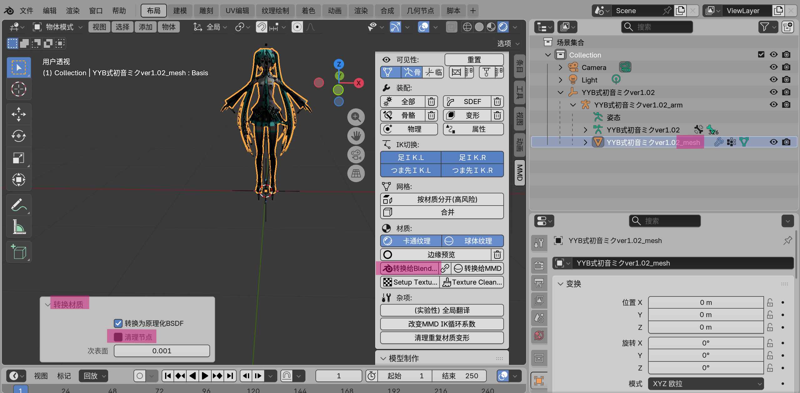

现在再导出 在导出弹窗里 右侧 操作模式 默认是自动 要将其修改为 复制 右侧有一个立体长方形盒子的图形 它现在就是灰色的没有高亮 点击一下 然后就会有高亮 鼠标悬浮在上面 显示内嵌纹理 FBX二进制文件的内嵌纹理(仅供“复制”路径模式) 意思就是把贴图内嵌到fbx文件里了 而不是一些分离的文件 在骨架一栏 可以选择性地取消勾选 添加叶骨 之后点击导出FBX

现在再导入UE 可以成功看到贴图
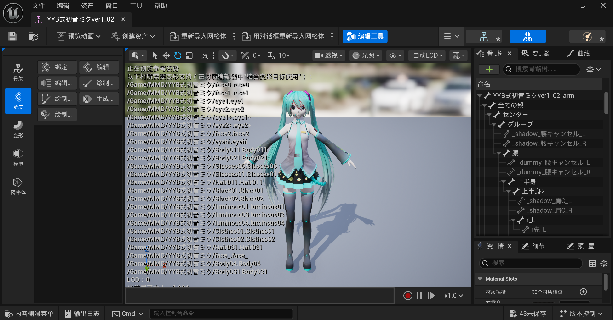

现在继续导入动作 去[模之屋](https://www.aplaybox.com/)随便下载一个动作 回到Blender 在右侧场景集合面板 选中整个模型的那个文件夹 本例中就是YYB式初音ミクver1.02文件夹 而不是\_mesh 点击上方菜单栏 文件 - 导入 - 导入MikuMikuDance动作 选择刚刚下载的动作 不需要修改什么 点击下方的导入VMD文件 导入后 在右侧场景集合面板 可以看到多了一个动画文件夹

在MMD面板里 模型设定 - 可见性 可以看到一个小人图标 旁边的文字是骨架 取消高亮它 对于人物模型我们就可以看得更清楚了 按空格就可以播放这个动作 或者点击下方播放图标也可以进行播放

如果想要**删除模型上的全部动画** 就选中整个模型的文件夹 然后点击左上方 窗口 - 新建窗口 现在会得到一个名为3D视图的弹窗 点击左上角最左侧有一个类似于画板的小图标 选择 动画摄影表 可以看到有一些关键帧序列 点击序列下方的空白处 也就是下图中黄色斜杠高亮区域 按A 就会选中全部关键帧 会变成多个橙黄色的点 再按del 就全删了
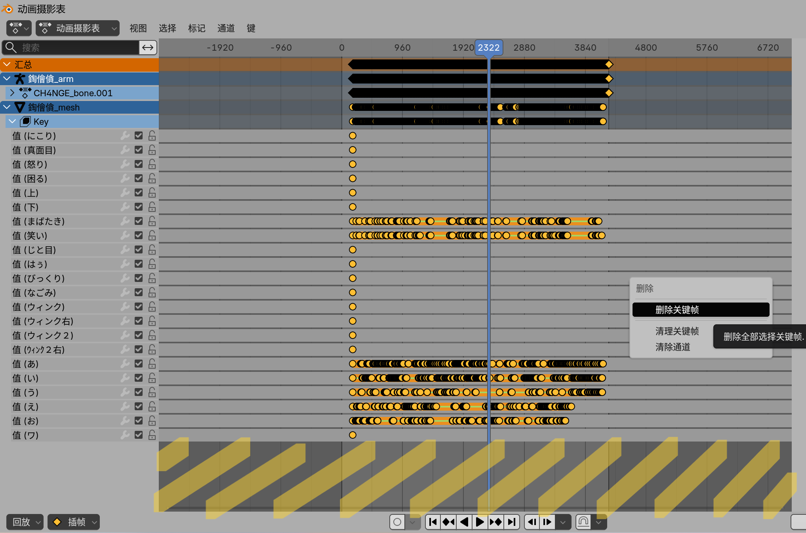
回到主窗口 按下播放 确实没有动作了 但是角色还是有姿势的 而不是静置姿态 现在去左上角 从物体模式切换到姿态模式 在右侧场景集合面板 点击整个模型文件夹 然后按下A 这样就会全选 再点击左上方姿态按钮 - 清空变换 - 全部 就会恢复到静置姿态 再到右侧场景集合面板 找到\_arm下面的动画文件夹右键点击清除动画数据 再找到整个模型文件夹里的动画文件夹 右键点击清除动画数据

这里似乎有一个更简单的办法 **无需特意删除这些关键帧 只需要先在姿态模式全选之后清空变换 然后在动画文件夹右键清除动画数据**

现在发现表情还没有变回来 需要点击\_mesh 在右下方面板 左侧菜单栏选择绿色倒三角形 也就是物体数据属性面板 如果前面把模型按材质分开了 就没有这个面板 需要点击MMD Tools里 按材质分开 这个按钮旁边的 合并 把这些部件都合并成单一一个mesh再操作 在形态中 从Basis开始 把下面所有键右侧的数字 都改成0

删完导入下一个动画之前 要把下方动画时间线的进度条拖到0 但仍然总像是没有删干净 导入UE之后可能会多了一些多余的静止帧动作文件

确认动作没有什么问题之后 导出为FBX 导出弹窗中 最下方的 动画 一定要勾选 然后导入到UE 就会多了一个动画序列 我们还是把材质纹理整理到独立的Materials Textures文件夹里

如果我们还想为这个模型导入新的动作 不需要把之前导入的全都删掉 只需要在导出含有新动作的同一个模型的fbx时 在导出弹窗中 包括 - 物体类型 只勾选骨架和其它 并且把导出的fbx命名成和之前导入时不同的名字
然后回到UE 在模型文件夹中 右键导入 导入时弹窗里 动画一栏 Common Skeletal Meshed and Animations - 骨架 它会默认是我们之前的骨架 下面还有一个 导入骨骼层级中的网格体 默认是取消勾选的 点击下方导入 就会只导入一个动作序列

播放动作时 视口一直提示我们 要去材质编辑器 结合变形目标使用 那么现在就挨个打开Materials文件夹里的材质 在左下角细节面板 搜索 变形 勾选 使用变形目标

### IK重定向

以上的流程 可以使我们在UE中使用MMD的模型和动作 但是使用不了UE的动作资产 因为MMD模型的骨架和UE的默认人物的骨架是非常不相似的 下面要做骨骼重定向

在UE 用第三人称模板创建一个新的项目 在Characters文件夹找到一个叫Quinn的女性骨骼网格体 在它旁边空白处 右键 - 动画 - 重定向 - IK绑定 命名为IK\_Quinn 打开 在右侧细节面板 选择预览骨骼网格体为Quinn的模型
然后导入我们的模型fbx 整理一下 在模型旁边空白处 右键创建一个IK绑定 命名为IK\_角色模型名 打开 在右侧细节面板 选择预览骨骼网格体为我们的模型 点击视口上方眼睛图标 骨骼 - 所有层级 将骨骼绘制大小调小 让骨骼显示得更细一些

先打开IK\_Quinn 在视口中点击双腿中间的垂直骨骼 那就是根骨骼 也可以看到左侧 绑定元素面板中 root确实被选中了 在绑定元素面板中 对root右键 - 新建重定向链 什么也不用修改 点击 添加链 现在右下方IK重定向面板 就会出现刚刚创建的链条
现在选中plevis 也就是盆骨 右键 - 设置骨盆
骨盆的上方有竖着的脊柱 挨个点它们的时候 就会看到左侧绑定元素面板 spine\_01到spine\_05被依次选中了 按shift 把这5个spine全部选中 右键 - 新建重定向链 对于弹窗什么也不用修改 点击添加链
再选中左手的上臂 下臂 手 也就是upperarm\_l lowerarm\_l hand\_l 也不要选clavicle 不要选lowarm的twist 这个是什么旋转 也不要选手指 就只选这3个骨骼 右键 - 新建重定向链 右臂也一样
clavicle 单独创建一个只有1个节点的链 命名为LeftClavicle 右侧也一样
再找到neck01和neck02 一起选中后右键 - 新建重定向链
head 这1个骨骼 单独创建与i个链
找到右腿 选中thigh\_r calf\_r foot\_r ball\_r 对于twist不要管 将这4个右键 - 新建重定向链 左腿也是一样
找到左手 index是食指 选中metacarpal 这1个骨骼单独创建一个链 再选中3个指关节 创建重定向链
thumb拇指 middle是中指 ring是无名指 pinky是小指
之后保存
其实 UE5.6有一个新功能 点击窗口上方 **自动创建重定向链** 就会自动创建成功我们刚才所做的一切 只针对于与UE类似的骨骼结构有效

打开IK\_角色模型名 点击双腿中间的竖直骨骼 就会在左侧层级面板选中 全ての親 这个就是根骨骼 选中这个全ての親 右键 - 新建重定向链 为它改个名字 因为重定向对应的时候 是按照名字模糊搜索 进行自动对应 这里就命名为root
选中腰 右键 - 设置骨盆
首 这1个节点 创建链 命名为Neck
頭 这1个节点 创建链 命名为Head
从腕L开始 到手首 都是手臂 命名为LeftArm 右臂同理
肩P\_L 肩_L 肩C\_L这3个骨骼 命名为LeftClavicle 负责旋转 右侧同理
腿部是足D\_R到ひざD\_R 3个骨骼 命名为RightLeg 左腿同理
上半身 上半身2 这2个骨骼 是脊椎 命名为Spine
再做一下手指 每个手指只绑3个骨骼 不要选择指先
点击保存 不同的MMD模型会稍有不同但大致类似 在绑定的时候可以根据骨骼的位置 选择性地绑定X先 或者不绑

在内容侧滑菜单中 IK\_角色模型名旁边空白处 右键 - 动画 - 重定向 - IK重定向器 命名为RTG\_角色模型名 双击打开 源IKRig资产 选择为IK\_Quinn 目标Default Target IK Rig选择为IK\_角色模型名

可能看到 **MMD模型悬浮在空中** 这是因为UE和Blender的缩放单位不同 回到Blender
点击右下方面板 找到场景面板 - 单位 长度默认是米 改成厘米 缩放单位默认是1 改成0.01
然后导入模型 在导入模型窗口 右侧 缩放默认是0.08 在这里改为8 再按照之前的流程进行一些操作 后导出

重新导入UE **无需全部重新做IK绑定** 现在复制原来的IK_角色模型名 制作一个副本 打开这个副本 在右侧细节面板 将预览骨骼网格体替换为修改后的角色模型 当然也可以在原IK绑定文件中清除骨骼网格体后 直接进行替换 可以发现 左侧层级面板 似乎基本都对应上了 我们只需要检查并进行细节的修改
之后新建IK重定向器 现在就不会出现浮空问题

在IK重定向器中 左侧层级面板 选中 源 点击创建 - 创建 命名为RetargetPose 然后点击自动对齐 - 对齐所有骨骼 然后点击上方 添加默认操作

左下方资产浏览器 随便双击一个动作 就可以播放动作进行演示 点击右侧细节面板中 取消勾选调试绘制 MMD模型上的绿色宽线条就消失了

可能会发现下半身完全不动 这是因为当前的MMD模型在センター和グルーブ之间 缺少一个名为 腰 的节点 现在回到Blender 为MMD模型添加一个腰骨骼
因为我们没有Blender基础 强烈建议找到一些 较小的没什么用的骨骼 比如センター先 下半身先 XX先 将其移动到上半身和下半身中间的位置 改名为腰 然后通过调整父子继承关系 制作成 センター - 腰 - グルーブ的层级结构 至于如何修改父子继承关系 请使用ctrl+F页面内搜索 父级 尽量避免对于原本主干骨骼位置的改动 至多对其名字进行修改 修改时 最好导入MMD动作辅助观察 防止由于骨骼的改变造成对于动作的改变
**在Blender中导入MMD动作时 注意也要从0.08缩放成8再导入** 否则角色的脚是不会动的

修改结束后 导出fbx 再导入到UE

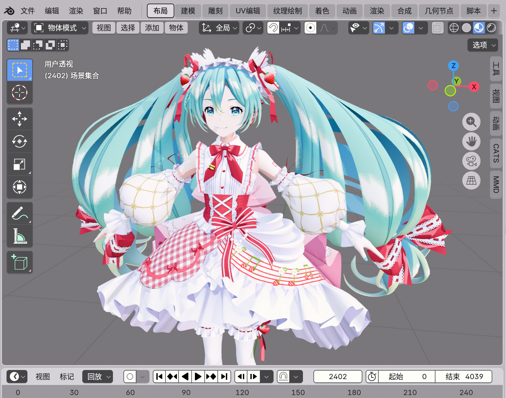

我们回到IK重定向器 还是会发现MMD模型和UE小白人的动作仍然不是很同步 这是因为二者没有的**静置姿势没有重合** 右侧细节面板中 将目标网格体偏移改成0 0 0 在右侧细节面板 调整 目标网格体缩放 使二者身高一致 再调整目标网格体偏移 使二者大致重合 然后在层级面板中 确保现在选中的是目标 现在视口中默认就是旋转工具 选中MMD模型的腕 将其旋转至与UE小白人重合 最好是在左视图和前视图调整 不要在透视模式下 如果长度不一样就确保平行 基本上要保证对应骨骼重合 如果旋转了脚 最好也把足IK旋转同样的角度

微调的时候 可以选定姿势进行演示 点击左下方的 播放参考姿势 就可以停止当前播放的参考姿势 如果不满意 就选中 源 之后点击删除 这样RetargetPose就被删除了 之后再在选中 源 的时候点击创建 创建一个RetargetPose 旋转工具才会再次出现 更快捷的方式是 切换到目标 先随便点一下MMD角色身上的某块骨骼 在左侧层级面板点击删除 再Ctrl+Z撤回 就会重新出现旋转工具
这之后不要再使用自动对齐 否则UE小白人会到达奇怪的位置 最后再切换到 目标 进行调整 如果骨骼差异很大 导出选定动画之前 也可以针对每一个动画演示的效果 都分别精细地调整

我们是UE5.6版本 之前的命名也很规范了 所以现在是正确对应的 如果想要确认是否真的正确对应 之前我们做了 添加默认操作 就可以打开IK重定向器中 左侧操作栈面板 点击Retarget FK Chains 就可以看到目标链 源链 的对应关系 点击右上方自动映射链 可以选择精确对应或者模糊对应 也可以手动地挨个调整

现在发现最严重的问题是 **手臂骨骼不一致**导致的动作变形
MMD模型手臂的5个骨骼 和UE小白人的3个骨骼 位置是不一致的 尝试了多次修改链和映射链 都没有任何作用 MMD模型的5个骨骼是 腕 腕捩 ひじ 手捩 手首 它们是依次继承的 现在希望把 腕 ひじ 手首 作为 upperarm lowerarm hand 但是 链条里不能跳过中间的腕捩 手捩 只选择这3个 捩的意思是旋转 这2个捩应该是映射到twist的
所以现在需要去Blender里修改MMD模型的父子继承关系 修改之前记得备份

进入Blender编辑模式 打开之前处理过 缩放单位 和 材质转换给Blender 的MMD模型工程 在场景集合 选中ひじ 注意要只选择它 不需要选择它的子项 然后按住ctrl再选择腕 点击视口上方 骨架按钮 - 父级 - 生成 - 保持偏移量 其原理是 最后选中的作为父级 这样之后 腕就会变成ひじ的父级 接下来选中手首 再按ctrl选中ひじ 同样地去修改父级

此时可以顺便把模型的骨骼精简一下 选中不需要的骨骼 把鼠标放在视口中 按del 再选中 骨骼 就可以删掉 发现\_dummy和\_shadow删不掉 需要随便选择一个骨骼 在右下方面板 左侧工具栏选择绿色小人 物体数据属性 在骨骼集合里 找到mmd\_dummy mmd\_shadow 点击右侧眼睛 它们就可见了 可见之后就可以删了

导入UE 在IK绑定中 LeftArm只保留腕 ひじ 手首 再分别为腕捩 手捩添加链 其位置就对应UE小白人的upperarm\_twist lowerarm\_twist

现在再进入IK重定向 手臂手腕的极端扭曲问题已经解决了 在大致上已经可以做到动作一致了 但是手臂和腿部的表现还不能令人满意 会发生扭曲

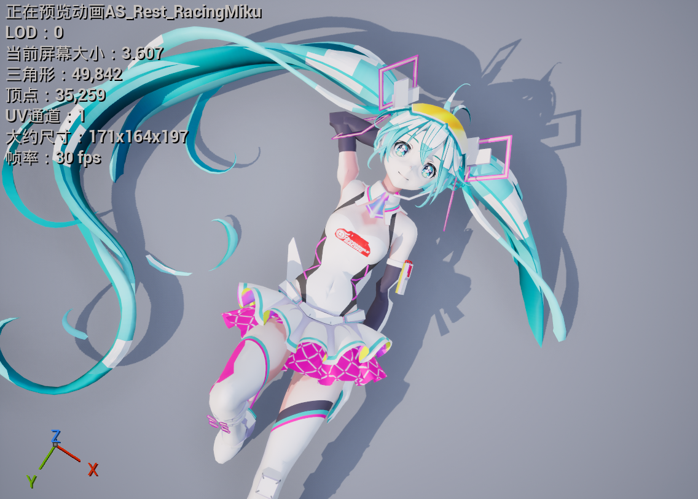

对于当前演示中的这个模型 它的腿部的网格不在 足 - ひざ - 足首这个链条上 而是在另一个链条 もも - 膝 - すね 上 もも是大腿 膝是膝盖 すね是小腿 这个链条上没有脚 这导致根本无法重定向到UE小白人 为此我们需要为足 - ひざ - 足首链条**绘制蒙皮权重** 然后删掉 もも - 膝 - すね 链条的蒙皮权重
进入物体模式 选中_mesh 如果现在是按材质分开了的 就用MMD Tools合并一下 找到右下角面板左侧菜单栏的绿色倒三角图标 在顶点组选项卡 找到もも 点选它 在左上角物体模式那里 切换为权重绘制 可以看到 我们选中的这个骨骼 上面有红色黄色绿色 可以挨个点击一下 もも 膝 すね 发现本例中 もも和すね 分别有大腿和小腿的蒙皮 而脚的蒙皮在足首上 所以现在我们要做的 就是把もも的蒙皮转移给足 すね的蒙皮转移给ひざ
在在顶点组列表里 如果能找到 足 和 ひざ 就选中足 在顶点组最右侧 点击-号 把它们都挨个删掉 然后把もも重命名为足 膝删了 すね重命名为ひざ
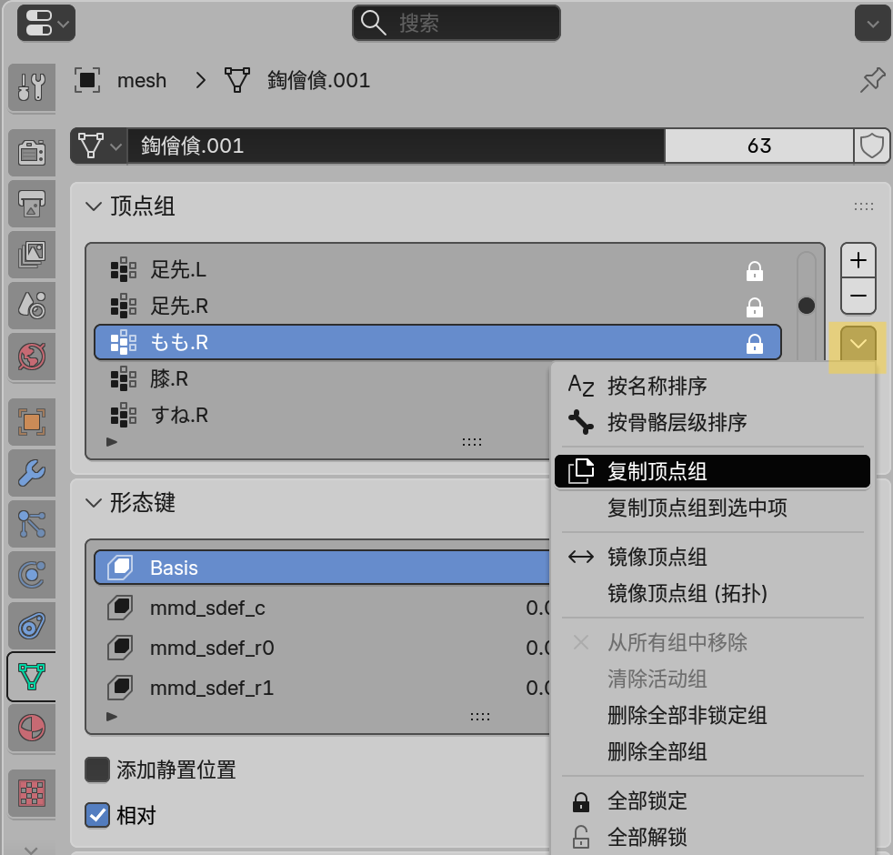

如果整条腿的蒙皮绘制零散地分布在多个顶点组中 就只能用笔刷手动绘制了 找到一个最主要的顶点组 在上面绘制
左上角权重右侧数值为0 就可以当作橡皮擦使用 右侧衰减可以调整为常值 这样之后擦除更快捷 请善用模糊 梯度渐变 采样权重功能 切换权重绘制模式的按钮右侧还有两个按钮 点击其中一个后 再点选择 就可以使得笔刷只作用于选区 刷选就是可以按三角形选中 再点击一下图标 就能回到原来的模式

回到UE里 查看UE小白人的骨骼网格体 左侧面板 蒙皮 - 编辑权重 就会发现它手臂的蒙皮是在upperarm\_twist上的 而upperarm上没有蒙皮 我们也可以模仿它去做MMD模型的蒙皮 当前演示的模型有好几个腕捩 手捩 整条手臂的蒙皮权重也分散在多个顶点组上面 我们可以修正它们的蒙皮权重位置 使其分别与UE小白人的upperarm的2个twist lowerarm的2个twist位置相对应 然后直接把这几个twist IK重映射到MMD模型的腕捩 手捩 这样就不需要为腕和ひじ绘制蒙皮权重了
腿部也是可以同理 但是当前模型大腿只有一个もも UE小白人的大腿却有2个twist 很难映射 所以对于腿部我们还是手动绘制修改蒙皮权重

至此 我们已经可以通过IK重定向为MMD模型角色制作大量动作资产了 无论是UE动作资产 还是MMD动作 都可以兼容了

### 状态机

打开BP_HelloWorldCharacter 在左侧细节面板选中网格体 在右侧细节面板就可以看到 动画模式 现在我们使用的是单一的动画资产 修改成使用动画蓝图 可以看到动画类现在是无 所以我们需要创建一个动画蓝图 内容侧滑菜单 BP\_HelloWorldCharacter周围空白处 右键 - 动画蓝图 它会让我们选择一个骨架 选择之前做好的MMD模型RacingMiku 然后命名为ABP\_RacingMiku 打开后就是动画蓝图编辑器

事件图表和其它蓝图是一样的 还有一个AnimGraph 找到右下角资产浏览器 如果默认没有调出 就点击上方窗口中的资产浏览器调出 

先找到一个跑步姿势拖入视口中 然后将这个节点右侧的小人 与Output Pose节点左侧的Result小人连接 选中这个跑步姿势的节点 在细节面板 找到 设置 - 循环动画 勾选它 之后点击左上角编译 动画就会循环播放

现在打开BP\_HelloWorldCharacter 左侧组件面板选中BP\_HelloWorldCharacter 在右侧细节面板 动画模式选中 使用动画蓝图 动画类选择ABP\_RacingMiku 就可以看到角色一直在跑

动画蓝图可以根据角色提供的数据 选择不同的序列节点播放不同的动画
回到动画蓝图编辑器 左下方有一个 我的蓝图 面板 点击左上角添加 - 变量 创建一个变量 命名为Character 默认是bool型 搜索BP\_HelloWorldCharacter 它有四种类型 对象引用 类引用 软对象引用 软类引用 软的意思是延迟加载 只有在需要这些对象的时候 它们才会被加载 在此之前没有任何值 意思就是它现在只存储指向项目中对应资源的文件路径 对象引用和类引用 就是普通的变量 对象引用就像C++里对于对象的引用一样 类引用像是一个保存类型的变量 最接近我们常用的C++变量的就是对象引用 所以我们选择对象引用 这就像是在C++中创建指针变量 它现在是空的 没有初始化 长按这个Character拖拽到事件图表视口中 选择获取Character 现在有了一个节点 但它仍然不是一个有效的变量 我们现在要初始化它

一旦我们的角色使用了这个动画蓝图 我们的角色就是它的owner/拥有者 然后动画蓝图就可以用Try Get Pawn Owner节点来获取owner 也不一定非得是角色才能被动画蓝图获取 只要是带有骨骼网格体组件的Pawn 都可以使用动画蓝图
实际上打开事件图表 我们可以看到 已经存在着一个Try Get Pawn Owner节点

另一个节点是Event Blueprint Update Animation 它有一个Delta Time节点 这个节点就像tick函数一样 每一帧都会调用 动画每次更新 它都会被调用

还有一个节点的功能类似于BeginPlay 可以在事件图表中空白处右键 搜索 Event Blueprint Initialize Animation 和Begin Play事件一样 在游戏开始 或者在拥有这个动画蓝图的Pawn角色生成时 只调用一次 我们可以利用它在游戏早期初始化一些东西 比如设置Character节点的值

Try Get Pawn Owner返回的是一个Pawn对象的引用 还记得吗 对于那个名为Character的变量 我们为它设置的类型是 对于Charcter对象的引用 但是Pawn是Character的父类 我们不能直接用父类的数值 传给子类 也就是说 Try Get Pawn Owner返回的值 不能直接赋给Character变量 所以需要一步类型转换 右键搜索 cast to BP\_HelloWorldCharacter 注意不是cast to BP\_HelloWorldCharacter class 把Try Get Pawn Owner的Return Value引脚连接到cast to BP\_HelloWorldCharacter的object引脚上 然后把刚才拖进来的Character节点删了 重新拖动一次 这次要选择 设置Character 这样就会变成一个SET Character节点 然后将cast to BP\_HelloWorldCharacter的As BP BP Hello World Character引脚连接到SET Character节点的Character引脚上 现在就可以用这个获取到的owner来初始化我们的Character变量了 然后把Event Blueprint Update Animation右侧的执行引脚连接到cast to BP\_HelloWorldCharacter的左侧执行引脚上 把cast to BP\_HelloWorldCharacter右侧的执行引脚连接到SET Character左侧的执行引脚上 这样才可以执行流程

我们现在的动画蓝图owner其实就是一个BP\_HelloWorldCharacter类型的变量 而现在这个变量被赋给了Character变量 那么现在我们就可以访问这个变量了

首先我们需要一个移动组件 之前的BP\_HelloWorldCharacter蓝图编辑器左侧组件面板里的是角色移动组件 这个角色移动组件里存放着大部分移动相关的数据 比如行走 上跳下落 重力
从SET Character节点的右下角蓝色引脚往右边拖 搜索get character movement 现在就可以得到角色移动组件了
接下来将它存储到一个变量里 点击我的蓝图面板左上角添加 - 变量 或者就把蓝图里节点的返回值提升成变量 从get character movement节点右侧引脚往右边拖的过程中 会出现一个悬浮窗 显示 放置一个新节点 然后选择Promote to variable 这样就可以把这个返回值提升为变量 在视口中会得到一个SET Character Movement节点 在左侧我的蓝图面板 可以对其重命名 默认的名字是Character Movement 这有个空格 我们将其重命名为CharacterMovement 可以看到这个变量的类型是 角色移动组件
现在把SET Character节点右侧的执行引脚与SET Character Movement左侧的执行引脚相连

现在我们的流程就是 获取这个动画蓝图的owner 将其转换为名为Character的变量并存储 然后从这个Character变量中获取角色移动组件 并将其存储到一个名为CharacterMovement的变量中

现在我们希望每一帧都访问它们 因为比如速度 是否在空中 是否在下落 这种信息在每一帧都会发生变化
找到Event Blueprint Update Animation节点 它每一帧都会被调用

首先想要一个速度变量 准确来说是地面速度 如果角色有一个速度 那么就是一个既有大小又有方向的向量 速度是一个向量 我们并不关心速度的z分量 只想知道x y分量如何变化 也就是我们想知道平行于地面移动的速度有多快 而移动组件是能获取速度的 现在把CharacterMovement变量拖入事件图表 点击 获取CharacterMovement 从Character Movement节点右侧引脚往右边拖 搜索 get velocity 然后往下翻 找到速度一栏的get velocity 从get velocity右侧引脚往右边拖 搜索 vector length 来获取这个速度向量的大小 而vector length XY 就是不考虑z轴分量的向量长度 这正是我们想要的 我们将这个值设置为一个变量 命名为GroundSpeed 然后将Event Blueprint Update Animation右侧的执行引脚 与SET Ground Speed左侧的执行引脚连接 这样就可以每一帧都更新

那么我们可以使用这个GroundSpeed来控制动画姿态 回到AnimGraph 我们希望不跑步的时候播放idle动画 跑步时播放jog动画

我们可以创建不同的状态 并在它们之间切换 要切换不同的动画状态 我们需要创建状态机
把刚才拖入的jog动画节点删除 右键 搜索state machine 选择 动画 - 状态机一栏下的 state machine 会出现一个黑色节点 将其命名为 Ground Locomotion 蓝图的命名是允许空格的 但是C++不允许
Ground Locomotion会输出动画姿态 也就是它右下角的小人 将这个小人连接到Output Pose左侧的Result小人上 这样Ground Locomotion的输出就会驱动角色动画

双击这个Ground Locomotion节点 就可以进入它的内部 上方显示 ABP\_RacingMiku \> AnimGraph \> Ground Locomotion 意思就是我们已经从AnimGraph进入了Ground Locomotion状态机 点击AnimGraph就可以返回 发现即使是返回后 Ground Locomotion选项卡也并没有被关掉 所以也可以点击选项卡进行切换 
现在误触把AnimGraph选项卡关了 可以在左侧我的蓝图面板 双击 动画图表一栏的AnimGraph重新打开 注意到这里也有Ground Locomotion 双击也可以打开

打开Ground Locomotion状态机 有一个Entry节点
这个状态机可以有多个状态 我们可以随意切换 创建新状态的方法有2种 从Entry节点拖动并选择 添加状态 或者在空白处右键点击 添加状态
将这个状态命名为Idle 再从Idle的右侧边缘往右拖 创建一个新状态 命名为Run
Idle和Run之间会出现一个双向箭头 鼠标悬停再上面 说是过渡规则 现在是Idle到Run 单向的 可以从Run的左侧边缘往左拖到Idle上 就可以从Run到Idle 这也是一个过渡规则 我们可以为每个规则设置条件
我们当前的状态决定了Ground Locomotion的返回结果 而Ground Locomotion的返回结果是连接到Output Pose的Result的 会直接决定角色的动作

我们双击进入Idle状态 里面有一个Output Animation Pose节点 当我们出于Idle状态时 这里的任何内容都将会作为Ground Locomotion的返回值 最终作用于Output Pose
将idle动画拖入视口 然后将这个idle动画节点右下角的小人 连接到Output Animation Pose左侧的Result小人上 现在我们就为Idle状态设置了动画 只要是处于Idle状态 就会播放这个idle动画

然后现在回到Ground Locomotion标签页
从Entry入口点进入 就会直接跳转到Idle状态 先点击一下编译 左侧视口里角色动作就变成了idle动作
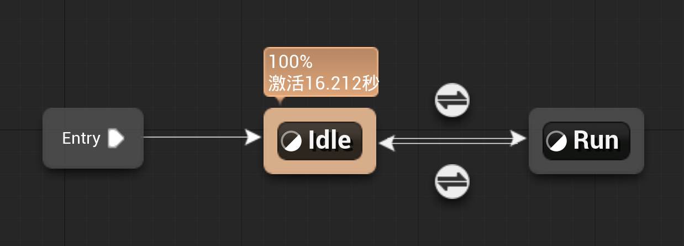
Idle状态被高亮了 显示这是当前活动的状态 这里显示的是100% 实际上是因为动画蓝图具有从一种状态到另一种状态平滑过渡的功能 过渡期间就是同时处于两种状态 但是比例是会发生变化的

那么什么时候才会从Idle状态跳转到Run状态呢 我们就需要设置一个切换到Run状态的逻辑 也就是地面速度不为0的时候 自然就进入Run状态
双击进入Run状态 可以看到它的Output Animation Pose上有个note 鼠标悬停在上面就可以查看内容 说是Result was visable but ignored 意思是Result可见但是被忽略了 这个节点上没有连接任何内容时 就会出现这个note
现在将jog动画拖入 实际上如果把jog动画直接拖到result上 它就会自动连接

回到Ground Locomotion标签页 现在我们只需要编写从Idle到Run 从Run到Idle的逻辑就行了

先双击从Idle到Run的箭头上的双向箭头 就会进入这个转换规则 里面有一个Result节点 输入参数是一个bool值 can enter transion 可以选择是否勾选 意思是 是否可以进入切换 我们需要在这里写一些返回bool值的逻辑 如果传给Result的bool值变成true 并且我们当前处于Idle状态 那么转换规则就会启动 我们就会从Idle切换到Run

现在把GroundSpeed变量 拖入 Idle到Run(规则) 视口中 选择 获取GroundSpeed 从Ground Speed节点右侧引脚向右拖 输入`>` 然后选择greater 这个节点里面的数字是0 意思就是检查地面速度是否大于0 把greater节点右侧红色引脚连接到Result节点左侧的Can Enter Transition红色引脚上
点击左上角编译 Can Enter Transition节点上的Warning就没了

现在进入PIE模式测试一下 角色确实从idle动画切换到了jog动画 然而只跑了几秒就卡住了 这是因为我们没有把jog动画设置成循环 而且就算停止移动 也不会切换回idle动画

继续进入Run到Idle(规则) 将GroundSpeed变量 拖入 Run到Idle(规则) 视口中 选择 获取GroundSpeed 从Ground Speed节点右侧引脚向右拖 输入`==` 选择equal 意思是地面速度是否为0 是就返回true 不是就返回false 再把equal节点右侧红色引脚连接到Result节点左侧的Can Enter Transition红色引脚上

### 动画蓝图 C++

这个动画蓝图有个C++父类 蓝图编辑器的右上角其实显示了 父类：动画实例 AnimInstance
事件图表上方有一排工具栏 里面有一个类设置 右侧细节面板就会出现 类选项 - 父类 现在父类默认是 动画实例

在内容文件夹 - C++ 类中 找到HelloWorldCharacter类 ·在它旁边空白处右键 - 新建C++类 搜索AnimInstance 命名为HelloWorldAnimInstance 选择公有 就放在原来的路径 也就是`???/HelloWorld/Source/HelloWorld/Public/Characters`

即使游戏没运行 动画蓝图也是一直在更新的 一旦我们的C++类对它可见 C++类就也会持续更新 所以如果我们尝试访问空指针或者其它类似问题 就会导致编辑器崩溃 所以通常要在编译AnimInstance的改动时 关闭UE 现在把动画蓝图中的Character和MovementComponent变量删了 把事件图表里相关的东西也删了 只保留velocity和ground speed那3个节点
现在点击左上角编译 会报错 因为刚才我们把连接到velocity上的移动组件删了 接下来我们会用C++创建
Event Blueprint Initialize Animation 和 Event Blueprint Update Animation

```c++
// HelloWorldAnimInstance.h
UCLASS()
class HELLOWORLD_API UHelloWorldAnimInstance : public UAnimInstance
{
    GENERATED_BODY()
public:
    virtual void NativeInitializeAnimation() override;
    virtual void NativeUpdateAnimation(float DeltaSeconds) override;
};
```

`NativeInitializeAnimation` 就是 Event Blueprint Initialize Animation 我们要override它
`NativeUpdateAnimation` 就是 Event Blueprint Update Animation

鼠标悬浮在NativeInitializeAnimation上 点击下面螺丝刀 在cpp中创建定义
NativeUpdateAnimation也是一样
NativeUpdateAnimation和Tick函数一样 接收DeltaTime为参数

```c++
// HelloWorldAnimInstance.cpp
void UHelloWorldAnimInstance::NativeInitializeAnimation()
{
    Super::NativeInitializeAnimation();
}

void UHelloWorldAnimInstance::NativeUpdateAnimation(float DeltaSeconds)
{
    Super::NativeUpdateAnimation(DeltaSeconds);
}
```

因为是重写 所以用super调用父版本

在AnimInstance类的构造函数中 可以创建一些变量 先将这些变量设置为public的

```c++
// HelloWorldAnimInstance.h
UCLASS()
class HELLOWORLD_API UHelloWorldAnimInstance : public UAnimInstance
{
    GENERATED_BODY()
public:
    virtual void NativeInitializeAnimation() override;
    virtual void NativeUpdateAnimation(float DeltaSeconds) override;

    UPROPERTY(BlueprintReadOnly)
    class AHelloWorldCharacter* HelloWorldCharacter;

    UPROPERTY(BlueprintReadOnly, Category = Movement)
    class UCharacterMovementComponent* HelloWorldCharacterMovement;
    
    UPROPERTY(BlueprintReadOnly, Category = Movement)
    float GroundSpeed;
};
```

`class AHelloWorldCharacter* HelloWorldCharacter;`
可以在一行内同时进行提前声明和声明变量 之前我们都是在头文件下面先写一个提前声明 然后在构造函数里再声明变量的 这两种方法都可以
因为我们只是需要获取这个值 所以设置成蓝图只读 还需要把GroundSpeed和HelloWorldCharacterMovement归类为Category Movement HelloWorldCharacter就不需要设置类别了

然后在NativeInitializeAnimation中初始化这些变量

```c++
// HellooWorldCharacter.cpp
#include "Characters/HelloWorldCharacter.h"
#include "GameFramework/CharacterMovementComponent.h"


```

我们之前在蓝图里使用的是try get pawn owner 然后将结果强制转换为了HellooWorldCharacter C++里也有这样的函数
首先需要在.cpp中补充include几个在.h中前向声明的头文件
鼠标悬停在TryGetPawnOwner上 可以看到它的返回类型是APawn\* 现在我们将获取它 并进行类型转换
在传统C++中 我们使用的是static_cast 它需要目标类型和要转换的值 适用于编译时已知的类型 static\_cast允许基本类型之间的转换 在用于类类型的转换时 会尝试调用相应的构造函数来创建目标类型的对象 只能用于将子类转换为父类 不能用于将父类转换为子类
如果要将父类转换为子类 就需要dynamic\_cast 现在我们就是在将父类Pawn转换为子类HelloWorldCharacter

但是在UE中 我们使用的是`Cast< >( )` 如果括号里的内容 没有指向尖括号里这种类型的对象 转换就会失败 并且返回null

我们就用这个转换后的结果 给HelloWorldCharacter变量赋值
使用HelloWorldCharacter这个变量之前 需要检查它是否是空指针
然后取得角色移动组件 来初始化HelloWorldCharacterMovement变量

接下来每一帧都要更新地面速度 需要从角色移动组件中获取速度
GroundSpeed在AnimGraph需要用到 状态机过渡规则也需要使用 所以在蓝图里先别删 把鼠标悬停在蓝图中调用vector length XY的地方 会显示 目标是Kismet数学库 所以我们把它的头文件在cpp里写上 

```c++
// HelloWorldAnimInstance.cpp
#include "Kismet/KismetMathLibrary.h"
```

我们需要取得的就是在XY上的长度

```c++
// HelloWorldAnimInstance.cpp
void UHelloWorldAnimInstance::NativeUpdateAnimation(float DeltaSeconds)
{
    Super::NativeUpdateAnimation(DeltaSeconds);

    if(HelloWorldCharacterMovement)
    {
        GroundSpeed = UKismetMathLibrary::VSizeXY(HelloWorldCharacterMovement->Velocity);
    }
}
```

Kismet数学库是一个类 它的开头是U 这个类里的函数都是静态的 不需要再创建Kismet数学库类型的对象 直接调用静态方法就可以 这些方法不改变任何状态和变量 只计算然后返回结果

现在把事件图表里的东西都删了 把变量也删了 关闭UE 按ctrl+F5编译
打开动画蓝图 把这个动画蓝图的父类设置为我们刚才写的C++类 点击上方工具栏的类设置 在右侧细节面板 - 类选项 - 父类 目前是动画实例 点击下拉菜单 搜索HelloWorldAnimInstance 之后报了很多错 现在需要重新做一下Run到Idle和Idle到Run的过渡规则 右键搜索GroundSpeed添加节点 然后连上

在左下角 我的蓝图 面板 点击它右上角的齿轮 勾选 显示继承的变量 就可以看到C++里的变量暴露到了蓝图 这样创建节点的时候就不需要右键了 拖进来就可以了 拖进来的时候注意到Set GroundSpeed是灰色的 因为我们设置的是蓝图只读 不是读写

### 跳跃

之前做轴映射的时候 应该可以看到 还有一种输入映射 叫 操作映射
轴映射是每一帧都会执行的 但是操作映射不会 操作映射就是一个一次性的事件 假设我们把某个函数绑定到操作映射上 我们的HelloWorldCharacter是自带一个Jump函数 因为它继承自Character 所以我们可以把这个Jump函数绑定到jump操作映射上 比如绑定到空格键上 那么只有按下空格键时 跳跃回调函数才会被执行 而且只执行一次 一按按键 回调函数就执行了 所以操作映射比轴映射效率高 如果不需要每一帧都发生点什么 操作映射就是首选 非常适合比如跳跃 攻击 捡东西 扔石头之类的单次动作 而角色移动是不用操作映射的 因为需要按住移动键 每一帧都检查 不可能动一下就按一下移动键

UE关卡 左上角 编辑 - 项目设置 - 输入
添加一个操作映射 命名为Jump 分配给空格键
按键按下和释放 是可以执行不同的逻辑 

来到HelloWorldCharacter.cpp的SetupPlayerInputComponent

```c++
// HelloWorldCharacter.cpp
void AHelloWorldCharacter::SetupPlayerInputComponent(UInputComponent* PlayerInputComponent)
{
    Super::SetupPlayerInputComponent(PlayerInputComponent);

    PlayerInputComponent->BindAxis(FName("MoveForward"), this, &AHelloWorldCharacter::MoveForward);
    PlayerInputComponent->BindAxis(FName("MoveRight"), this, &AHelloWorldCharacter::MoveRight);
    PlayerInputComponent->BindAxis(FName("Turn"), this, &AHelloWorldCharacter::Turn);
    PlayerInputComponent->BindAxis(FName("LookUp"), this, &AHelloWorldCharacter::LookUp);

    PlayerInputComponent->BindAction(FName("Jump"), IE_Pressed, this, &ACharacter::Jump);
}
```

我们只添加了一行 `PlayerInputComponent->BindAction(FName("Jump"), IE_Pressed, this, &ACharacter::Jump);`
IE_Pressed是一个枚举常量 枚举类是EInputEvent 第2个参数指定了我们是否希望在按下或释放时调用此函数 如果想要在释放时调用它 我们会使用IE\_Released 但现在是按下时调用 第3个参数是用户类对象 是this 和绑定轴一样 第4个参数 跳跃函数是已经存在的 不需要我们自己写了 传入就可以了 注意是`ACharacter::Jump` 而不是`AHelloWorldCharacter::Jump` 根本就没有这么个函数 我们没有重写 只是调用Character类里现成的函数 以后如果想用自己写的跳跃函数 把这里替换掉就好了

编译 回到PIE模式 发现现在还没有跳跃动画 打开VS
在HelloWorldAnimInstance.h 构造函数末尾添加

```c++
// HelloWorldAnimInstance.h
UPROPERTY(BlueprintReadOnly, Category = Movement)
bool IsFalling;
```

我们需要每一帧都设置它 因为角色可能跳起来 也可能落地 所以需要在HelloWorldAnimInstance.cpp的NativeUpdateAnimation函数里设置 要判断是否下落 需要从角色移动组件里获取 调用HelloWorldCharacterMovement的IsFalling函数

```c++
// HelloWorldAnimInstance.cpp
void UHelloWorldAnimInstance::NativeUpdateAnimation(float DeltaSeconds)
{
    Super::NativeUpdateAnimation(DeltaSeconds);

    if(HelloWorldCharacterMovement)
    {
        GroundSpeed = UKismetMathLibrary::VSizeXY(HelloWorldCharacterMovement->Velocity);
        IsFalling = HelloWorldCharacterMovement->IsFalling();
    }
}
```

热重载 现在在动画蓝图 左下角 我的蓝图面板 可以看到IsFalling变量 它每一帧都会被更新

打开AnimGraph
GroundSpeed负责处理从Idle到Run的状态 就负责地面上的移动
我们可以再创建一个状态机 命名为Main States 负责处理角色在不同状态的切换

双击这个Main States 进入其中
从Entry引脚往右拖 添加状态 命名为OnGround 这将处理在地面上的移动 如果我们双击OnGround 就能进入我们的Ground Locomotion状态机就好了 但是默认状况下我们做不到 但是我们可以保存Ground Locomotion返回的姿势 可以把姿势保存到一个缓存中 可以理解为是存储在一个变量中 但实际上是一个保存姿势数据的变量
按住alt并鼠标左键单击连线 就可以断开Ground Locomotion与Output Pose的连线 从Ground Locomotion节点右侧引脚向右拖 搜索cache pose 选择New Save cached pose 命名为Ground Locomotion 这就是缓存的Ground Locomotion姿势 它每一帧都会更新 但我们也可以在其它地方访问它 比如其它状态机 比如我们刚才的Main States

现在就进入Main States的OnGround状态机 在空白处右键 搜索use cached pose 选择Use cached pose 'Ground Locomotion' 然后把这个节点右侧的小人引脚连接到Output Animation Pose左侧的Result小人上 它返回的姿态和Ground Locomotion的一样 就就好像拥有了idle和run状态一样
现在这个OnGround是地面状态 但是希望能在跳跃 下落 飞行时 能切换到其它状态 从OnGround往右拖 创建新状态 命名为InAir 将跳起的动画拖入InAir状态机内连接上
双击OnGround到InAir的过渡规则 将IsFalling变量拖入 连接到Result节点的Can Enter Transition引脚上 这样在下落的时候就会从OnGround切换到InAir
我们可以再从InAir往右拖创建Land落地状态 但其实可以直接把动作拖入Main States 就把land的动作拖入   会出现一个新状态 将其命名为Land 双击点进去查看 发现已经连好动作了 然后从InAir拖拽箭头连接到Land 进入InAir到Land的过渡规则 拖入IsFalling变量 只有它为假的时候 才从InAir切换到Land 从IsFalling节点右侧引脚拖拽 搜索 not bool 选择NOT Boolean 然后将NOT Boolean节点右侧引脚连接到Result节点的Can Enter Transition

最好是像上图这样摆放

再从Land状态拖拽箭头到OnGround 落地动画结束后 应该自动切换回地面状态 单击过渡规则的双向箭头 在右侧细节面板中勾选 基于状态中序列播放器的自动规则 这样落地后就会自动回到地面状态
现在OnGound InAir Land三个状态是呈现一个倒三角
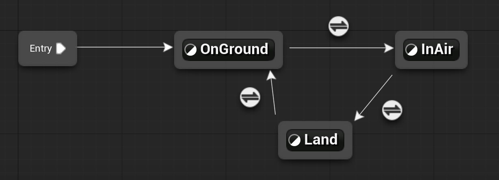

回到AnimGraph 只需要将Main States连接到Output Pose的Result节点 Main States里已经包括了Ground Locomotion 因此Ground Locomotion不需要再连了

编译 进入PIE模式 发现在跳跃过程中按下方向键 它会在空中有位移 jump动画时间太长了 而且连续跳跃会僵直 我们希望如果地面速度不为0的时候 动画能快点结束 再从InAir状态拖一个箭头到Land 现在它就会有两个过渡规则 鼠标悬浮在双向箭头上 发现一个是我们之前做的过渡规则 另一个现在显示的是False 双击进入 右键添加 get relevant anim time(InAir) 因为我们现在是从InAir状态转移到Land状态 从这个Get Relevant Anim Time(InAir)节点 Return Value引脚拖拽 搜索> 选择greater 将数字从0.0修改为0.1 这个是持续时间 当然可以根据不同的动作选择合适的数字 这个时长最好就是设置成跳跃动作跳到最高点的时长 呈现效果是最好的 但是在原地跳跃的时候我们希望呈现完整的动画 只有地面速度不为0的时候才需要缩短动画
右键 添加 get ground speed 从它右侧引脚拖拽 搜索> 选择greater 这样如果地面速度大于0 就应该快速结束跳跃动画 因此需要把这个限定动作时长的 和判断速度的 进行一个AND 右键添加 And Boolean 把两个greater右侧的引脚都连接到AND左侧两个引脚上 然后将AND右侧节点连接到Result节点的Can Enter Transition引脚上

对于从Land到OnGround的过渡规则 也可以做类似的工作 目前我们将持续时长都调成了0.1

### Control Rig 脚IK

先给角色换一个双腿叉开的idle动作 随便找个斜坡或者楼梯网格体拖入 发现脚根本就是悬空的

就需要反向动力学 利用脚部的末端计算出怎么摆放腿上的各个关节
解决方法是 首选在脚的骨头上画一个虚拟球体 然后把球体往下压到地面 这叫球体追踪 这个过程是可以在1帧内完成的 球体追踪可以检测碰撞 如果球体追踪击中了地板 球体追踪就返回球体底部与地板接触的位置 然后我们就能获得从起点到碰撞点的距离 现在不知道哪条腿是悬空 两条腿都有可能是悬空 所以两只脚都需要球体追踪 假设我们一只脚在更高一阶的楼梯 高度50 另一只脚在低一阶楼梯 高度0 我们不做IK的时候 会整个身体都处于高度50 现在IK后要做的就是 让整个身体都落到高度0 然后把一条腿抬到50

首先 进行球体追踪 计算脚到达下方表面的距离 也就是所谓的偏移量 ZOffset\_L ZOffset\_R 这两个数值肯定是不同的 找出偏移量更大的 也就是处于更低位置的脚
<div align="center">
  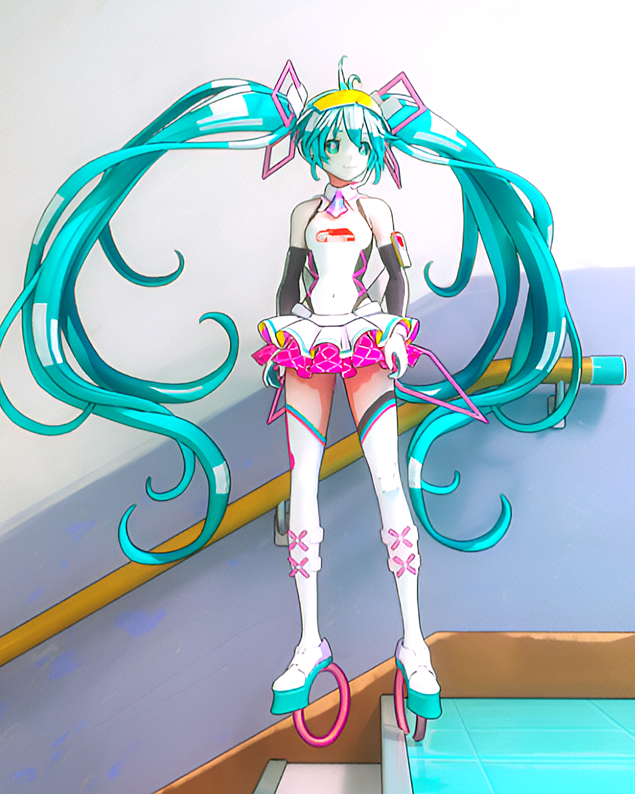
</div>
目前就是miku的右脚偏移量更大 那么就需要往下移动骨盆 把骨盆往下移之后 整个骨架都会跟着一起往下移 然后需要把左腿抬起来 利用反向运动学来调整左腿上其它骨骼的位置 让它自然弯曲 并且需要更平滑地移动 所以要用到插值
如果只是抬起腿 有很多种方案 但是我们只需要最合理的姿态 所以需要对于骨骼的约束条件 UE有这个功能 将末端骨骼称为末端执行器 我们移动的骨骼 以及与其连接的所有其它骨骼 它们会根据自动求解IK的方程随之移动
我们将创建一个用于移动骨骼的资源 控制骨架Control Rig

在内容侧滑菜单 Character蓝图旁边 新建文件夹 命名为Rigs 在文件夹内 空白处右键 动画 - 控制绑定 出现一个弹窗 写着父绑定 里面有ControlRig和ModularRig 是让我们选一个父类 我们将基于ControlRig类来创建 将其命名为CR\_RacingMikuFoot\_IK 双击进入 这个东西非常像事件图表 上方写着 向前解析Graph

先进入骨骼 RacingMiku\_Skeleton 可以找到脚部IK

回到CR\_RacingMikuFoot\_IK 左侧面板 向右拖拽扩大 就可以看到有一个 绑定层级 进入这个面板 点击导入层级 在弹窗中选择我们的骨骼网格体

然后回到 我的蓝图 面板 点击+号 创建新函数 命名为**FootTrace** 现在就会出现一个新的标签页 名为FootTrace 在这个图表中点击Entry节点 在右侧细节面板 - 输入 点击+号 添加一个新的输入参数 类型选择为rig element key 也就是绑定元素键 重命名为IKFootBone 点Entry节点里 IKFootBone右侧的小三角 就能展开引脚 里面有 类型 和 名称 绑定元素键是一种有类型和名称的数据结构 鼠标悬浮在类型上面 显示绿色 绿色是枚举的编码颜色 所以我们可以使用一个枚举来指定这个类型 这个枚举有多种类型可供选择
在空白处右键 搜索get transform 并选中 会得到一个 Get Transform \- 骨骼 节点 这个节点的作用是获取某个对象的变换信息 有类型和名称两个参数 类型现在是骨骼 在下拉菜单可以看到这个枚举的所有可能值 骨骼 控制点 曲线 参考 等等 点击这个节点里 项目 左侧的小三角 就可以收起展开 我们就可以把IKFootBone右侧的引脚 连接到 项目 左侧的这个引脚 这样 项目 就会拥有IKFootBone输入参数中传递的类型和名称 Get Transform节点的空间 选择全局空间 Get Transform节点右侧引脚 会返回一个变换 点击它旁边的小三角 就可以看到 旋转 平移 缩放3D
现在 我们就有了骨骼的变换 我们想从骨骼正上方进行球形扫描到骨骼正下方 但是需要相对于脚偏移一定距离 这样就不会追踪到脚上 展开Get Transform节点的变换节点 展开平移 从Y分量往右拖 然后搜索add并选择 把B的数值改成5 这样就是在Y轴方向移动了5个单位
在空白处右键 搜索sphere trace 选择sphere trace by trace channel 会得到一个 按追踪通道进行球体追踪 节点 可以看到 检测通道是可选的 因此可以针对特定的追踪通道进行检测 通常就针对于可视性通道进行碰撞检测 因为**几乎所有物体都会设置成block可见性通道** 这样每次进行碰撞检测并使用可见性通道时 它就会命中那些设置成block/阻挡可见性通道的物体
碰撞检测需要起点和终点
在空白处右键搜索 add 添加Add节点 然后在A或者B上右键 出现一个弹窗 里面有个下拉菜单 选择向量 然后展开A和B左侧的小三角 先把这个 添加 节点的右侧 结果 引脚 连接到 按追踪通道进行球体追踪 节点左侧的 开始 引脚上
把Get Transform的X引脚连接到向量那个添加节点的A的X引脚上 把B添加5的那个添加节点的结果引脚 连接到向量那个添加节点的A的X引脚上 把Get Transform的Z引脚连接到向量那个添加节点的A的Z引脚上
然后我们要为这个向量添加 0 0 50 因此向量那个添加节点的B的XYZ就分别设置成0 0 50 这样起点就是相对于脚骨变换的位置 向上移动了50个单位
终点就设置为脚骨向下移动100单位 右键 搜索subtract 就会得到一个 减 节点 仍然是换成向量 然后展开 A的XYZ都设置成与 添加 节点相同 B的XYZ设置成0 0 100 然后把 减 节点的结果引脚连接到 按追踪通道进行球体追踪 节点左侧的 结束 引脚上 然后把 按追踪通道进行球体追踪 节点里的半径设置为3
找到Return节点 选中它 在细节面板 - 输出 新建一个变量 在下拉菜单中改成向量类型 重命名为HitPoint
按追踪通道进行球体追踪 节点 会返回一个命中位置 把这个命中位置连接到Return节点的HitPoint上 但是本例中的模型 鞋底很厚 如果用脚骨的高度做 鞋底就会陷入地面 所以在连接return之前 从命中位置往右拖 添加一个Add节点 在B的Z轴上改成合适的值比如10 这样就可以整体上抬高 最后再把这个Add节点连接到Return节点的HitPoint上

回到向前解析Graph 在进行追踪时 想在Control Rig上添加一个bool变量 只有为真时才追踪 这样以后更好控制 在 我的蓝图 面板 点击 添加 - 变量 命名为ShouldDoIKTrace 默认就是bool类型 我们暂时先不考虑如何设置这个变量
将ShouldDoIKTrace拖入向前解析Graph 选择get 从它的Value引脚往右拖 搜索branch 分支就像if语句 检查bool值 根据真假执行对应的输出 将向前解析节点的Execute引脚连接到分支节点的执行引脚
bool值为真就进行球形追踪 所以从 分支 节点 True向右拖 搜索FootTrace 展开IKFootBone左侧的三角箭头 类型选骨骼 名称选择左脚IK 展开HitPoint引脚旁边的三角箭头 从Z向右拖 选择promote to variable 在我的蓝图面板里 将其重命名为ZOffset\_LTarget 然后把FootTrace右侧执行引脚连接到ZOffset\_LTarget节点左侧Execute引脚 再从ZOffset\_LTarget节点右侧执行引脚 向右拖 搜索FootTrace 类型选择骨骼 名称选择右脚IK 展开HitPoint 向右拖 promote to variable 重命名为ZOffset\_RTarget
如果bool值为假 比如是在游戏过程中 那么就应该将这些ZOffset重置为0 将ZOffset\_LTarget变量拖入向前解析Graph 选择set ZOffset\_LTarget 把 分支 节点的False连接到set ZOffset\_LTarget节点的Execute引脚 value值就保持为0 再把ZOffset\_RTarget拖入 选择set ZOffset\_LTarget 把ZOffset\_LTarget节点右侧执行引脚与ZOffset\_RTarget左侧执行引脚连接上

上面是第一步 下面要做之前提到的插值 我们将有一些实际变量 而不是目标变量 而是实际的Z偏移量 我们将对它将进行平滑插值 使其逐渐逼近目标值 所以现在 在我的蓝图面板 创建变量 ZOffset\_L ZOffset\_R 都修改成浮点类型 之前的那两个Target就是插值的目标
我们接下来还要连很多节点 这样蓝图就会非常长 所以使用序列节点 先把向前解析节点 和分支节点 执行引脚之间的连线断开 然后从向前解析节点Execute引脚向右拖 搜索sequence 现在整个蓝图的起点是向前解析节点 它也是会像Tick一样不断更新 但是没有DeltaTime作为输入 现在把序列节点的A引脚 连接到分支节点的执行引脚 这样它就会先执行A 把后面一系列都执行完 再来执行B 现在把A后面连接的那些全都选中 然后键盘上按下C 就可以写注释 就写成 1.从脚到地面进行一次球体追踪 现在也可以通过移动注释 批量移动这些节点 

我们要做的是 一条腿悬空 然后向下追踪到地面 比如50个单位 集中地面时 我们只保留了那个位置的Z值 我们将使用它作为目标来插值ZOffset\_L ZOffset\_LTarget拖入 选择get 从ZOffset\_LTarget右侧value引脚往右拖 搜索AlphaInterp 这个函数将返回一个浮点数 它接收我们传入的Target值 并返回一个更接近它的值 到底有多接近 取决于插值速度 也就是那个 内插速度提高和降低 参数 把这两个参数都设置为15 把Get 把ZOffset\_L拖入 选择set 然后把AlphaInterp节点右侧的结果引脚 连接到 ZOffset\_L节点左侧的value引脚上 把ZOffset\_LTarget的Value引脚连接到AlphaInterp节点的值引脚上 然后把ZOffset\_RTarget拖入 选择get 从value引脚往右拖 搜索AlphaInterp 内插速度改成15 15 把ZOffset\_R拖入 选择set 然后把AlphaInterp节点右侧的结果引脚 连接到 ZOffset\_R节点左侧的value引脚上 最后把 序列 节点的B 连接到Set ZOffset\_L的Execute引脚上 然后把ZOffset\_L右侧的执行引脚 连接到Set ZOffset\_R的Execute引脚上 选中序列节点B后面的这些节点 注释为 2.平滑地插值到目标偏移量 现在 当目标变化时 ZOffset\_L和ZOffset\_R就都会平滑地跟随 会稍微有点滞后

我们需要找出这两个Target变量中 哪个是最小值 哪个数值更低 也就是位置更低 我们就用它作为目标 让骨盆向下移动 现在把ZOffset\_LTarget和ZOffset\_RTarget都拖入 选择get 从ZOffset\_LTarget的value引脚往右拖 搜索less 也就是浮点数比较 然后把ZOffset\_RTarget的value引脚连接到 小于 引脚的B引脚上

蓝图使用branch分支 实现类似if语句的功能 但是control rig是使用if节点 一起选中ZOffset\_LTarget和ZOffset\_RTarget 然后按ctrl+D复制 从新建的ZOffset\_LTarget的value节点往右拖 搜索if 选中 然后把新建的ZOffset\_RTarget的value节点连接到if节点的False引脚上 这个if节点 需要的2个浮点数和1个bool值 如果bool值为真 它就输出连接到true的数值 本例中就是ZOffset\_LTarget 如果bool值为假 它就输出连接到false的数值 本例中就是ZOffset\_RTarget 所以要把 小于 节点的结果引脚 连接到if节点的condition节点上 小于节点 会判定ZOffset\_LTarget是否小于ZOffset\_RTarget 如果小于 它就返回真 这样if节点就会返回连接到true的值 也就是ZOffset\_LTarget的值 如果不小于 if节点就会返回ZOffset\_RTarget的值 那我就很想知道 为什么用一个节点来解决这个问题啊 就是三元运算符 `float LowerZ = (ZOffset_LTarget < ZOffset_RTarget) ? ZOffset_LTarget : ZOffset_RTarget;` 无论如何 返回的就是那个更小的值 我们将用它来偏移骨盆 暂时先保持对于蓝图的忍耐吧
现在再创建一个变量 命名为ZOffset_Plevis 设置为浮点类型 就把它设置为计算结果 拖入 选择set 把if节点的result引脚连接到 Set ZOffset\_Plevis节点的value引脚上 然后把2.平滑地插值到目标偏移量 里面最后的Set ZOffset\_R节点的右侧执行引脚 连接到Set ZOffset\_Plevis节点的Execute引脚上 这部分计算的就是骨盆的偏移量 将这一块注释为3.用最低的脚部偏移量来防止过度伸展

我们总之就是计算出来了骨盆要偏移的量 而且可以移动得非常平滑 我们将要用这个数值来移动脚IK 接下来就需要变换实际上的骨骼了 但是为什么我们不直接操作实际的骨骼呢 因为我们想要使用IK优雅地处理其它的骨骼 

在 2.平滑地插值到目标偏移量 外面的下面空白处右键 搜索modify tranforms 得到的 修改变换 节点 有一个数组元素 可以看到一个左边有三角箭头的0 这也就是一个数组类型的输入参数 是待修改的数组 点它左侧的三角箭头展开 类型默认是骨骼 名称选择左脚IK 再点击下方的左侧的有三角箭头的变换 展开它 再展开 平移 只需要改变Z轴 把ZOffset\_L拖入 选择get 连接到这里的Z 再把下面的模式改成Additive全局 意思就是用这个修改变换节点里的这些值 对于左脚IK做变换 也就是XY都不变 就在Z上增加一个ZOffset\_L的数值 现在把序列节点的C引脚 连接到修改变换节点的Execute引脚上 如果没有C引脚 点击添加引脚就有了 继续新建一个修改变换节点 把右脚也做了 最后把左脚的修改变换节点的右侧执行引脚 连接到右脚修改变换节点的Execute引脚上 然后我们就移动了脚IK

现在还需要移动实际上的身体 就用移动骨盆来实现这一点 继续新建修改变换节点 展开0 - 项目 名称选择骨盆骨骼 这是一个真正的有蒙皮的骨骼 展开变换 - 平移 把之前计算得到的ZOffset_Plevis拖入 选择get 连接到Z上 当然它实际上只是两个ZOffset里最小的那个 也选成Additive全局 现在把连接到C后面的这些节点都选中 命名为4.把插值偏移量添加到脚IK骨骼

现在来处理一下IK UE5有个功能是 全身IK 在空白处右键 搜索full body IK 它让我们可以对身体上任意一串骨骼使用IK 所以我们可以指定末端执行器 也就是节点里的执行器 要动哪块骨头 身体其它部位也会跟着动 把根选择为骨盆骨骼 把它接入序列节点的D 在全形体IK节点中 点击执行器右边的加号 骨骼下拉菜单 选择我们要移动的骨骼 是真正的骨骼 不是IK和虚拟骨骼 选择左脚 注意是左脚 不是左脚腕 在选中的瞬间 就可以看到视口里 左脚发生了一些扭曲 我们需要传入一个变换 来告诉它要怎么动 需要传入的就是IK骨骼的变换 右键 搜索get transform 将get transform节点 类型设置为骨骼 名称设置为左脚IK 然后把get transform节点的变换 连接到全形体IK的变换上 这样视口里就恢复正常了 再点执行器右边的加号 对右脚也这样做 全身IK可以使得在我们移动脚部的时候 腿会自然弯曲 把连接到序列节点D上的这一块 注释为5.使用全身IK节点来解决IK问题 并使用脚IK骨骼作为每只脚的效应器目标

**现在对着蓝图 回顾一下我们做的事情** 这非常重要

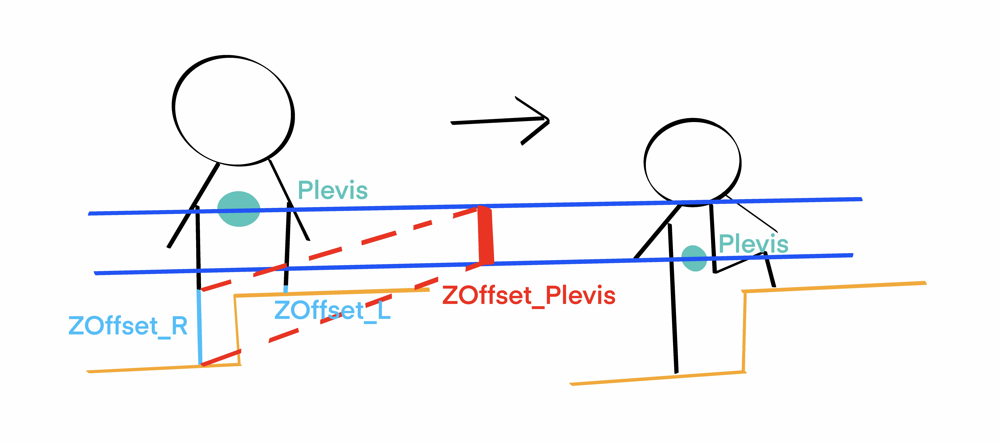

1. 首先检查一下要不要做IK追踪 如果要追踪 就开始两只脚的球体追踪 然后把它从当前位置到击中地面的位置的差值 赋值给ZOffset\_Target 注意这个值是一个差值 起点到地面的Z的差值 而不是一个绝对的Z坐标的值 这个值是用终点的Z坐标 减去起点的Z坐标得到的 因为球体必然是向下落的 所以这个**ZOffset\_Target是一个负数** 那实际上我们的脚最后一定是要落地的 因为我们做IK的目的就是这个 最终的目的是落地 所以从最终落地到起点的那个Z坐标的差值 就是目标Target 如果不要做IK追踪 就把这个ZOffset\_Target清零
   这一步做完 我们就得到了两个ZOffset\_Target的值

2. 但是突然迅速落地明显不符合人类运动规律 所以要用插值 缓慢地落地 所以我们再设置一个变量 就是ZOffset 它的意思就是**当前**我这个IK骨骼的位置与起点的差值 我们的目标是到达终点 也就是让ZOffset的值最终要变成ZOffset\_Target 但是当下我们需要缓慢地接近 缓慢接近的这个速度或者说运动规律 就是通过插值控制的
   但是IK骨骼毕竟不是实际上有蒙皮的骨骼 我们真正的目的是要在蒙皮上看到效果 所以就要移动骨盆 我们有两只脚 如果不做IK 两只脚应该是一样高的 但是必然有一只脚是悬空的 最终我们希望悬空的脚应该落下去 悬空的脚最终到达的位置必然更低 也就是说它移动的距离是更大的 为了符合运动规律 整体的身体的趋势肯定也是要往下落 而那只 最终要到达更低位置的脚 所移动的数值 正是骨盆需要向下移动的数值 骨盆最终是要向下移动这么多的 所以这个数值就是处在更低位置的那只脚的ZOffset\_Target的值 而因为ZOffset\_Target是负数 所以也就是两个脚的ZOffset\_Target中数值更小的那个
   这一步做完 我们就可以平滑地从起点移动到落地的终点了 并且还计算出了骨盆骨骼要移动的数值

3. 由于我们之前在第1步已经得到了脚需要移动的数值 也就是两个ZOffset\_Target的值 我们现在就先去移动脚IK骨骼 然后再移动实际的骨盆骨骼 并且要平滑地移动

现在回到动画蓝图 进入AnimGraph
右键 搜索 control rig 它是在Misc.一栏 需要往上翻 把Main States和Output Pose的连接断开 然后把Main States的小人引脚连接到Control Rig的Source小人引脚上 把Control Rig右侧的小人引脚连接到Output Pose的Result小人引脚上 选中Control Rig节点 右侧细节面板 在Control Rig一栏 可以找到 控制绑定类 在下拉菜单 选择CR\_RacingMikuFoot\_IK
还记得吗 那个我们并未设置的神秘ShouldDoIKTrace bool型变量 回到CR\_RacingMikuFoot\_IK 点击它右侧的眼睛 使其可见 之后对于CR\_RacingMikuFoot\_IK进行编译 现在这个编译终于不报错了
回到动画蓝图 在细节面板继续下拉 找到 输出 一栏 勾选 ShouldDoIKTrace的使用引脚 现在在Control Rig就出现了引脚 我们现在勾选ShouldDoIKTrace

编译动画蓝图后进入PIE模式查看 运动效果是非常奇怪 回到CR\_RacingMikuFoot\_IK 找到第5个注释那一块 全形体IK这里面的值 我们都是用的默认参数 展开设置左边的三角箭头 迭代的意思是 在找到解决方案之前 要进行多少次计算 这都可以用默认值 但是 根行为 需要修改成 锁定到输入

那么关于ShouldDoIKTrace这个参数 到底应该是怎样呢 当我们确定不在空中时 就应该进行射线追踪
回到动画蓝图 把IsFalling变量拖入AnimGraph 从IsFalling节点向右拖 搜索not boolean 再把NOT节点的右侧引脚连接到Control Rig的Should Do IKTrace引脚
但是如果是跑步时 也不会想要使用control rig 右键 搜索 blend poses by bool 这个节点接收一个bool值 如果是真 就使用一个姿势 如果为假 就使用另一个姿势 那么如果GroundSpeed为0 就正常做control rig 如果不为0 就是跑步姿势 拖入GroundSpeed变量 从它右侧节点往右拖 搜索== 选择Equal 然后将Equal节点右侧的引脚连接到Blend Poses by bool的Active Value引脚上那么 如果GroundSpeed为0 它就会返回我们连接到True Pose的动作 如果不为0 他就会返回连接到False Pose的动作 所以就把Control Rig右侧的小人引脚连接到 我们想把Main States连接到True Pose 但是Main States并不能直接复制 需要使用缓存姿势 把Main States与Control Rig的连接先断开 从小人引脚往右拖 搜索cached pose 选择New Save cached pose 命名为Main States 这样就可以用它来代替Main States了 并且还能多次使用 右键搜索use cached pose 选择use cached pose "Main States" 把这个节点右侧小人引脚连接到Control Rig节点的Source小人引脚 选中并且按ctrl+D就能又复制一个use cached pose "Main States"节点 连接到Blend Poses by bool的False Pose上 最后把Blend Poses by bool节点右侧的小人连接到Output Pose的Result小人引脚上 编译

现在显示效果上 MMD模型的IK绑定导致出了很多问题 因为MMD的脚IK不是UE想要的IK 还是使用虚拟骨骼 对之前做重定向到root的那个骨骼 本例中就是全ての親2 右键 - 添加虚拟骨骼 在这里继续选择全ての親2 就会在全ての親2的子项得到一个名为 VB全ての親2\_全ての親2 的虚拟骨骼 再对这个 VB全ての親2\_全ての親2 右键  - 添加虚拟骨骼 选择实际上的左脚骨骼 这个就可以充当IK骨骼 再添加一个右脚的 现在就用这些虚拟骨骼 代替IK骨骼 这样就很精准了 建议就算有IK骨骼 也还是使用虚拟骨骼

现在倾斜角度很奇怪 因为我们还没有做法向
打开FootTrace的编辑面板 在左侧 我的蓝图面板 找到FootTrace函数 在右侧细节面板 输出 添加 HitNormal 和HitNormal一样 也设置成向量型 这样最终的Return就会出现一个HitNormal引脚 然后把 按追踪通道进行球体追踪 右侧的 命中法线 引脚连接到Return的HitNormal引脚 回到向前解析Graph 可以看到注释1那一块里面 两个FootTrace节点上 都出现了HitNormal

直接使用法向数据 会导致如果碰到很凹凸不平的地面就会发生抖动 所以需要插值 从左脚的HitNormal往右拖 搜索节点 spring interp 添加一个弹簧插值节点 先创建两个FVector类型的变量 命名为CurrentNormal\_L和CurrentNormal\_R 把get CurrentNormal\_L连接到弹簧插值节点的 当前 引脚 然后将弹簧插值的结果引脚 连接到set CurrentNormal\_L 右脚同理 再从注释1那一块最右侧的SetZOffset\_RTarget右侧执行引脚 连接到set CurrentNormal\_L的左侧执行引脚 再从set CurrentNormal\_L的右侧执行引脚 连接到set CurrentNormal\_R的左侧执行引脚 将这一块注释命名为1.5.法线插值

我们需要计算的是 原本垂直向上的向量(0,,0,1)和地面法向向量之间差了多少度
右键 搜索 quat from two vectors 得到一个名为 从双向量 的节点 这样就能算出这两个角度之间相差的旋转 并且这个旋转是用四元数表示的 展开A 设置成0 0 1 将get CurrentNormal\_L连接到B

找到注释4那一块里面左脚的 修改变换 节点 在  要修改的变换 - 变换 - 旋转 目前是0 0 0 这也就是没有旋转 注意到这个旋转引脚是蓝色的 鼠标悬浮在上面 意思就是这个引脚是一个四元数 把刚才的 从双向量 节点的结果引脚 连接到这个修改变换节点的旋转引脚上 右脚同理 将这一块命名为4.0.将法线旋转添加到脚IK骨骼

### 动画技术

现在在这里补充一些来自于 [GAMES104(第8-9节)](https://www.bilibili.com/video/BV1pY411F7pA) 的知识 

刚体的3个方向的移动 XYZ轴的移动 3个方向的旋转 绕XYZ轴的旋转 这6个维度 **6自由度** 6DOF 就可以制作动画了

如果是一个非常软的东西 动画表现得又很好 要么是顶点动画 要么是物理动画 因为如果绑骨骼你根本不知道绑在哪里 要绑多少 先用离线的物理引擎模拟好 然后记录下来每一帧每个顶点和顶点法向的位置 就变成了**顶点动画** 水流的效果其实也是用顶点动画做的

<div align="center">
  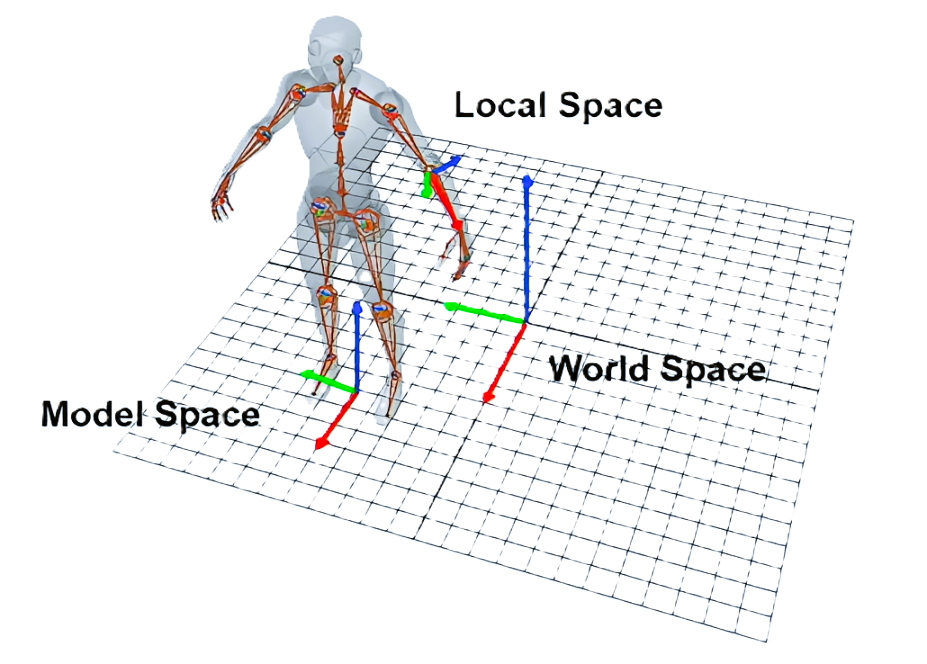
</div>
整个世界是有世界坐标系的 world space 对于角色模型 有自己的坐标系model space模型坐标系 不是那个local space 从世界坐标系 到模型坐标系 就是6自由度在发生变化 这样就能定义唯一的一个在空间里的姿态
动画是在模型之上还有一个坐标系 是local坐标系 局部坐标系 动画里的每一根骨骼 都会发生平移和旋转 那么它相对于模型坐标系也是有变化的 实际上手掌的朝向 是从肩膀 手肘 手腕的坐标系 一个一个传递过去形成的 动画很多时候是在local坐标系的 而把local坐标系 一路从它的根节点累积上来 才能计算出来它的模型坐标系 把模型坐标系考虑到这个角色站的位置和它的旋转 才能变成世界坐标系 只有变到世界坐标系 这个角色才会被渲染

人类模型的骨骼 根骨是在盆骨 脊椎的最后一根骨头 向下就分化出两条腿 向上就是脊椎 到肩膀展开 分成两只手 但是对于四肢的动物 就不是这种骨架

我们一直都在说在用骨骼构建了骨架 skeleton 但实际上在游戏引擎里 真正表达的是joint关节 就是之前在Blender里导入MMD模型之后 删掉了的其中一个
实际上比如肘关节前面连了一个刚体的骨骼 所以当肘关节发生旋转变化或者平移偏移时 骨骼就会跟着动 但是我们并不会直接存储骨骼的数据 而是存储肘关节的数据 这个肘关节在层级上的下一个节点 是手腕关节 手腕关节前面就控制了手掌 真正在游戏引擎里的是joint关节 而两个关节之间的才是bone骨骼 **joint是有很多自由度的 bone没有 bone是由2个joint联合在一起定义出来的** joint它是个刚体 它不会被twist 但是bone是可以twist的
对于武器 就是绑定在角色那个单一的武器骨骼上 还比如人骑到一个坐骑上 它是有一个骑的骨骼点

root骨骼 一般可以发现是在两脚中间 root并不是骨盆 为什么要放在两脚中间呢？
比如我们要表达一个角色的移动速度 或者它跳起来了 有一定的离地高度 如果是使用骨盆作为root 人物在不同姿势比如蹲和跳的时候 离地高度都是会变化的 但是这个root距离地面的高度是不会变的 等同于手办的底座支架 无论上面角色怎么换动作 支架还是在那里
但是对于四肢动物 骨盆是放在后两条腿的骨盆位置 root是在肚子下面的地上的中心点

object之间是有父子关系的 比如人骑马 其实是人有人的动画 马有马的动画 怎么让它的动画一致呢？
人的身上有一个骑的骨骼 马身上有一个乘坐的骨骼 这两个骨骼要重合在一起 坐标和旋转的的6自由度全部要重合 类似于一个插槽 当马前倾的时候 人也要跟着前倾 这就实现了bounded animation 载具系统会使用到

T-pose对于肩膀有挤压 所以现在都倾向于做A-pose 当我们真正表达一个pose姿态时 它是有9自由度的 平移旋转 还有一个缩放 缩放对于做人脸的变形 角色弹性的变化 是很有用的

我们关节上做的最多的事情是旋转 之前用的是旋转矩阵 欧拉角 但是欧拉角难以去插值 不能线性地去做 也很难进行旋转的叠加 而且对于旋转的表达是按着坐标轴 但是真实世界里的旋转 很难沿着坐标轴 如果给定空间中任意一个轴做旋转 就会很难 欧拉角是做物体的摆放时经常用 但是做动画时不用 而是使用四元数
四元数详情可以查看 [#4 从欧拉角到四元数](https://chocomintopia.github.io/4-从欧拉角到四元数.html#万向死锁)

多数时候动画都是joint做旋转 但也有平移 比如角色站起时 盆骨就要上下平移 做表情时也有平移 还有一项是缩放scale 在表情里常用 

动画一般都会存储在它的local space里 而不是model space 只会存储相对于它父亲的变化 它的动作是从根节点 一个骨骼一个骨骼算下来的

如果一个顶点mesh只绑定在了一个骨骼上 那在骨骼运动的时候 这个顶点和骨骼的相对位置是不变的 这就是**绑定**
角色身上的顶点有几万个 但是骨骼就只有几十个 所以是把所有骨骼的位置先算好 之后把蒙皮的矩阵算好 这样计算顶点的时候 就可以重复使用蒙皮矩阵的值 蒙皮是有很多权重加在一起的 真正的蒙皮矩阵skinny matrix还会再乘一个模型坐标系到世界坐标系的转换

**每一根骨骼 都是从根节点 一路累积上来的 这个transform包括旋转平移放缩 一路上来 就计算出来了它在模型空间的transform变形**
**得到这个transform之后 对于所有绑定的顶点 它的新位置怎么得到呢？ 要乘上绑定时默认pose的时候矩阵的逆 再左乘在当前模型空间的pose矩阵 这样就能得到一个蒙皮矩阵 就可以计算出新的位置 在真正渲染的时候 需要再左乘一个从模型坐标系到世界坐标系的转换**

实际上的蒙皮的顶点 几乎不止和一个joint起作用 这个顶点 相对于依赖的joint1 计算出在模型空间的新的坐标 再算出依赖的joint2的模型空间的坐标 然后加权平均 也就是插值 这样就可以做出来twist的效果 **必须是在模型空间做** 不能在joint的本地空间做 因为每个joint的本地空间都是不同的 

动画资产 clips 帧数不会那么高 类似于关键帧 但是游戏的帧率是很高的 这中间就需要插值 让动作更平滑 平移的插值 线性就可以做了 旋转的插值 就是用四元数 前一帧的joint旋转是q1 下一帧是q2 那么只需要做q1和q2的线性插值就可以了 再做一个归一化变成单位四元数 这样就能得到一个新的旋转 这个方法叫NLERP 欧拉角的旋转矩阵是很难做这种插值的 其实插值就是做动画的中割

NLERP里面还有细节上的处理 因为人的直觉是 运动肯定是要在最短路径 用q1点乘q2 结果为正 直接插值 结果为负 说明两者之间为大于180°的角 需要反向插值 这样就保证了是**最短路径的插值**
但是即使是做了这样的插值 但它其实在角度空间中的插值旋转是不均匀的 比如做整个180°的旋转过程中 它是一开始快 中间慢 然后又加快

现在还有SLERP的做法 使用arccos的运算 把两个旋转之间的夹角 $$\theta$$ 找到 然后利用 $$\theta$$ 一点点地插值 这样的效果比较好 但是反三角函数运算是比较慢的 是要查表的 另外就是角度 $$\theta$$ 很小的时候 sin很小 sin当分母 所以插值是很不稳定的
所以真正的做法是给一个magic number 两个旋转的夹角小于这个值的时候 就用NLERP 其它时候再用SLERP

总结一下动画的runtime pipeline 现在就是我们有动画的clips 里面就是这个角色的pose 需要找到当前帧和下一帧 如果这一帧在clips里没有的话 就做插值得到一个pose 这个pose我们要将其转换到模型空间 然后算出来一个蒙皮矩阵 这之后运算就转移到GPU里了 每一个顶点利用蒙皮矩阵去计算 这样每一个骨骼都可以表达出来它的蒙皮mesh 当然现代游戏引擎基本上是也会把前面的运算也放到GPU里

***动画压缩***

大部分的骨骼放缩都是1 位移也很少 主要就是旋转 而且比如走路的时候 手指也几乎没有什么旋转 上臂的数据量也很少 主要是腿
那么就把有些骨骼上不会用到的缩放平移全都删掉
对于旋转 引入关键帧key frame的概念 其他的只需要在关键帧之间插值就能做出来 从一个点开始走走走 在走到下一个点之前线性插值 当原始的值和插值出来的值之间的误差error到达一个阈值的时候 就把这个点退回来然后把上一个点作为关键帧 然后再以这个点为起点继续插值 这样就可以把很多帧的动画变成少量的关键帧 关键帧和关键帧之间的时间间距不一定是均等的 取决于你这个信号在时间轴上的变化频率 线性插值效果不是特别好 这里就需要引入catmull曲线 不详细介绍

对于数值的表达也不会用浮点数 因为浮点数是32位 如果这个数值在一定区间范围内 可以用定点数模拟 比如把这个范围内的数规划到0到1上面就可以用16位整数表达

**四元数的归一化压缩**是有一个数学特性的 虽然abcd中的每一个数值都有可能在-1到+1之间波动 但是如果把最大的那个数扔掉的话 其他三个数值每一个都必然在 $$-1/\sqrt{2}$$ 与 $$1/\sqrt{2}$$ 之间 那么就只需要2bit来存储哪一位是最大值 再把剩下的那三位存下来 通过四个数的平方和是1 就可以把最大值这一位数还原 这样用15个bit就可以表达的很准确

但是压缩也会带来问题 虽然每一个关节在压缩的时候error都控制住了 但是关节是一节一节传递的 这个误差会越来越大 动画的目的最终是为了视觉 所以最简单的办法就是在像素上计算压缩前和压缩后的差距 但是网格上的顶点太多了不可能一个一个地计算 所以一般就是在joint附近定义两个相互垂直的点 去计算压缩前后的误差 重要的骨骼就设计小一点的offset

dcc动画制作的顺序 大概是先制作一个mesh 然后绑定骨骼 之后绘制蒙皮权重 再制作关键帧动画之后导出 大部分动画是直接导出的 假设骨盆root也发生了位移 比如跳跃或者蹲下的动作 动画一般是不会把这个root存下来的 要把root单独导出成一个位移曲线

***动画blending混合***

比如要从走路动画过渡到跑步动画 想要更平滑 自然就想到线性插值 但是之前的关键帧插值是在同一个动画的帧之间插值 而现在的blending是在两个动画clips之间插值
就看从走到跑这个案例 怎么计算它的weight 如果是移动速度发生了变化 那就用当前速度作为一个自变量 将跑步的权值记为weight2 走路的权值记为weight1 然后将weight2逐渐提升到1 weight1逐渐降低为0 保证weight1+weight2=1 

blend space 前后左右多个动作都能混合了

比如有鼓掌的动作 只发生在上半身 希望和多种下半身的姿势比如站着蹲下 都能进行混合 那么就需要对skeleton做一个mask 上半身使用鼓掌动画 下半身使用姿势的动画 这样还可以使得动画数据量更小 这也是一种blending混合 skeleton mask blending

additive blending 给动画再附加一个偏移量

***状态机 state machine***

之前已经说过 如果做跳跃动作 我们的做法是要把这个位移去掉的 是因为根本不知道高度有多高 在空中要悬浮多久 所以一般是做3个动画 1个起跳 1个落地 1个在空中的loop 这不是一个blending的问题 是彼此依赖的一个状态切换的问题 动画之间的切换 blending插值的时间 0.2s是一个经典的magic number

***动画树***

古典的时代 使用layered ASM 多层状态机 上半身 下半身 头部 都有不同的状态机 这样就可以组合出很多复杂的动作 而且角色可以看起来很灵活

但是现代游戏引擎都用动画树了 UE里的blend poses by bool就是动画树混合 能做出动画树的分支 像我们之前做的把两个状态机都连接到blend poses by bool节点 最后再连接到Output Pose节点

***IK***

人体的不同joint旋转的能力和可能的角度是不同的 比如胯部就只可能抬那么高 是**有特定的活动范围的 这就是约束**

***表情***

人类的表情可以划分为多少种 固定的模式 绝大多数的表情都可以用这些模式来表达 表情是用顶点动画morph做的
对于很多卡通风格的游戏 可以把live2d变成一张texture 反而比morph更实用
面部表情也可以做IK重定向

## 碰撞

首先是需要为我们的模型**制作物理资产** 因为MMD模型骨骼不是标准命名 它没有自动生成 我们需要自己制作物理资产
选中骨骼网格体 右键 - 创建 - 物理资产 - 创建 在弹出窗口把最小骨骼尺寸改成5 进入视口之后 最好精密地调整一下

然后在角色蓝图 在左侧组件面板 选中网格体组件 在右侧细节面板 - 物理资产覆盖 选中我们制作的物理资产 编译

现在找一块岩石的静态网格体拖入关卡 拖入的时候发生了什么呢？
岩石是静态网格体 不是Actor 是UStaticMesh类型的对象 但是世界里的所有东西都必须继承自Actor类或者其子类 所以当我们拖入这个静态网格体时 UE是自动创建了一个静态网格体Actor 在右侧大纲视图里就会出现一个StaticMeshActor类型 是Actor的子类
选中查看细节面板 这里就会有一个SM\_Stone(实例) 它下面有一个StaticMeshComponent类型的组件 这是一个StaticMeshActor 它只有一个组件 StaticMeshComponent 选中这个组件 就可以看到这个静态网格体组件自带一个静态网格体 自动设置成了我们拖入的静态网格体

这有一个静态网格体组件 组件是具有碰撞设置 细节面板可以找到 现在碰撞预设是default 下拉菜单里有很多选项
打开BP\_HelloWorldCharacter 在细节面板可以看到它的碰撞预设是CharacterMesh

回到那个石头静态网格体 碰撞预设下拉菜单里有一个custom自定义 下面就会出现很多选项 要是再从custom改成比如NoCollision无碰撞 这些选项就变成灰色了

现在选择custom来查看这一个个选项

- 碰撞已启用 下拉菜单里有
  1. 无碰撞 该组件会直接穿过其它物体 反之亦然 不会有任何反应 没有任何碰撞
  2. 纯查询(无物理碰撞) 只进行查询 不进行物理碰撞检测 空间查询
     比如射线检测 就是进行某种追踪 之前的control rig里 我们对于每只脚都进行了球形追踪 想象一个球体向下碰到地面 获取碰撞结果 就能知道碰撞点的位置了 这是一种查询
     扫描 是指物体检测自己是否即将与其它物体重叠 
     重叠检测 就是两个物体真的重叠了
     只有启用查询 才能进行上面这些种类的空间查询 仅查询模式之下没有物理模拟
     UE是自带物理的 叫做Chaos 启用组件的物理特性之后 就会进行各种物理计算 这样就能模拟重力 力 等各种物理现象 当两个模拟物理的物体碰撞时 就会产生反作用力 导致它们互相反弹 
  3. 纯物理(不查询碰撞) 只进行物理模拟 这样就能实现物理碰撞 可以模拟重力 并对其它物理对象施加作用力 这个模式下不支持查询
  4. 已启用碰撞(查询和物理)  这个模式下就既可以做物理 也可以查询 但是成本也很高 通常用于那些可以被推动 抛掷 并且能够响应追踪(比如control rig用到的追踪)的对象
  5. 仅探测(接触数据，无查询或物理碰撞)
  6. 查询和探测(查询碰撞和接触数据，无物理碰撞)
- 对象类型 里面有WorldStatic WorldDynamic Pawn PhysicsBody Vehicle Desturctible 所有带碰撞的组件都有各自的对象类型 决定其它组件如何与之交互
- 碰撞响应 下面分为检测响应和物体响应 都可以设置为 忽略/重叠/阻挡 这意思是其它那些不同的对象类型的组件对于当前这个预设下的组件的反应 可以在这里对于每一种类型对于当前类型的反应进行设置

现在把石头设置为custom模式 并且把碰撞已启用设置为无碰撞 它现在对象类型默认是WorldStatic 进入PIE模式 果然这个石头没有什么碰撞

将石头设置成 纯查询(无物理碰撞) 进入PIE模式 发现有碰撞了 站在石头上 IK正常生效 查看碰撞 只能看到角色和地面上有很多碰撞体积 但是这块石头上没有碰撞体积 并且之前我们没有做物理资产的时候 脚IK还是在生效 这就说明**control rig脚IK的生效不是依赖于碰撞体积/物理资产的 而是依赖骨骼的查询**
结束PIE 打开这块石头资产的静态网格体编辑器 在视口右上角点击眼睛 - 简单碰撞 发现什么也没有 这是因为这块石头没有简单碰撞 simple collision指的是**碰撞体积** 静态网格体通常是有碰撞体积的 因为网格本身就有很多三角形 如果使用这个网格进行空间查询 就会导致大量计算 在眼睛那里 选择复杂碰撞 就可以看到大量三角形
现在关闭复杂碰撞 在上方菜单栏 点击碰撞按钮 在这里可以添加很多类型的碰撞 先选择添加球形简化碰撞 发现完全不匹配我们的石头 但是重新进入PIE模式 发现我们再也无法通过走路踩上这块石头 查看碰撞 就可以看到石头是具有球形的碰撞体积的 可以通过跳跃上去 脚IK仍然在生效 踩在了真实的石头上

回到静态网格体编辑器 移除这个球形碰撞 碰撞下拉菜单里的一串字母数字的很多种类碰撞 是生成简化碰撞的算法 10-DOP-X方法会在X轴方向创建一个类似圆柱体的形状 经过多次倒角处理后 最终形成一个具有10个平面的多面体 但相对于石头而言 形状还是太方正了 Y就是在Y轴方向做倒角处理 18DOP 26DOP 是生成轴向对齐的盒型碰撞体 所有倒角分别经过18面和26面倒角处理 26DOP是最合适石头的 这就是**空间查询** 但本例中对于这个碰撞体积还是难以直接走上去 还是需要跳上去

把石头改成纯物理(不查询碰撞) 发现角色是直接穿过了石头 因为胶囊体不再进行空间查询 所以**只有启用空间查询 胶囊体才能阻止我们穿过去**

现在将石头设置为 已启用碰撞(查询和物理) 仍然是比较艰难地跳上去了 启用物理之后 在细节面板 - 物理 就可以勾选**模拟物理** 我们原本是把这块石头放在半地下 现在已经完全到地面上来了 角色走过去就可以移动这块石头 这是因为物理引擎让我们可以施加作用力

打开角色蓝图 选中胶囊体组件 在细节面板 可以看到它的碰撞预设是Pawn 已启用碰撞(查询和物理) 所以我们可以对其它正在进行物理模拟的物体施加作用力

将这块石头上移到空中 勾选**启用重力**  进入PIE 就可以看到它掉下来了

下面看看碰撞响应 分为检测响应和物体响应 而我们的角色蓝图胶囊组件碰撞预设是Pawn 现在把石头的物体响应设置成**忽略Pawn 现在角色是可以穿过石头的 但是停在它上面的时候 IK又是生效的**
保持这个忽略Pawn 改成纯物理(不查询碰撞) 那么空间查询就不生效了 IK不再生效 直接走过去了 而且它不会影响摄像机的弹簧臂长度了 在已启用碰撞(查询和物理)模式下 是会影响弹簧臂长度的

所以如果只想使用脚部IK 但是不想摄像机的视角依据这个石头发生任何变化 那么就可以将检测响应里的**camera修改为忽略** 现在修改成已启用碰撞(查询和物理) 进入PIE 可以发现脚IK在正常工作 但是摄像机视角不会发生任何变化了 **不会阻挡摄像机 就不会修改摄像机的弹簧臂长度**

现在找一个木板资产 将它变成垂直于地面的 在细节面板 将碰撞预设修改为Custom 可以看到 这个对象类型默认是WorldStatic 这个就适用于我们不希望玩家移动的物体 设置为已启用碰撞(查询和物理) 碰撞响应里 将**Camera设置成阻挡 Pawn设置成忽略** 进入PIE 就可以看到 角色可以穿过它 并且在穿过它的瞬间 相机弹簧臂长度发生了改变 这样就类似于一个**隐藏门**的效果

打开BP\_Item蓝图 事件图表 Event BeginPlay和Event Tick中间还有个Event ActorBeginOverlap节点 鼠标悬停在上面 显示这是一个Actor与另一个Actor重叠时调用的事件 比如玩家走入触发器时 如需了解对象拥有阻挡碰撞的事件(如玩家与墙壁发生碰撞) 请查看命中事件 意思就是 这个是重叠事件 对于玩家与墙壁发生碰撞的 是属于命中事件 不属于重叠事件 又说要出发重叠事件 需要将这个Actor和其它Actor上的bGenerateOverlapEvents属性都设置为true

重叠的意思是和任何组件重叠 只要组件配置正确 就能正确响应重叠事件

在左侧组件面板选中Item Mesh 在右侧细节面板找到 生成重叠事件 它默认是已经勾选的 现在碰撞预设默认是BlockAllDynamic 它是启用了查询和物理 碰撞响应是阻挡了所有类型 但是如果要想发生重叠事件 这个组件必须设置成能与其它物体重叠 我们希望它能和Pawn也就是角色胶囊体的类型重叠 打开角色蓝图查看 选中胶囊体组件 可以看到它碰撞预设是Pawn 碰撞响应忽略Visibility 其它类型都阻挡 包括摄像机也阻挡 这个Visibility可见性是检测响应的一种 在control rig使用球形追踪就是这个

现在把BP\_Item的碰撞预设改为Custom 将Pawn设置为重叠 确保生成重叠事件已开启 打开事件图表 Event ActorBeginOverlap节点 从执行引脚往右拖 搜索print string 我们可以打印一个字符串看看效果 把Hello修改成 Overlapped an Actor 编译 进入PIE 走到它附近与它重叠时 确实会打印字符串 也可以看到摄像机弹簧臂瞬间拉近了 因为我们把摄像机设置成了阻挡
对于BP\_Item的任何组件都会产生同样的效果 我们可以再添加一个静态网格体组件试验一下 在组件面板 点击添加 新建一个静态网格体组件 在视口把它拖到原来的网格体旁边 放得稍远一些然后为它指定一个静态网格体 把这个新的网格体组件也指定为Custom并且Pawn重叠 编译进入PIE 这两个网格体都在照着我们很久以前连到Event Tick的World Offset在进行运动 而且与这个新的网格体重叠时 也会打印 现在把新建的那个组件删掉

我们的网格体现在比较小 很难发生重叠 如果我们想检测与网格周围区域的重叠 也就是在靠近时就触发重叠事件 要怎么做？
在BP\_Item蓝图 左侧组件面板 点击添加 搜索sphere collision 现在网格体的周围就会出现球体 在细节面板可以修改它的半径 将它设置得大一些 在细节面板往下翻 可以看到它的碰撞预设是OverlapAllDynamic 与每一种类型的碰撞响应都是重叠 编译进入PIE 现在可以在附近就触发
就算网格体离这个球体很远 也可以通过这个球体触发 把这个球体拖到离网格很远 为了演示 我们要在细节面板 - 渲染 把这个球体取消勾选 游戏中隐藏 并且我们只希望用这个球体触发 不希望用网格体本身触发 就需要把Item Mesh的Pawn重叠换成阻挡 但是更好的方式是 **单独为每个组件设置事件**

在事件图表中 把Event ActorBeginOverlap以及它的后续节点都删了 在左侧组件面板选中那个sphere collision 在事件图表右键搜索 add on component begin overlap 就会得到一个on component begin overlap (sphere)节点 这个事件和ActorBeginOverlap类似 但信息量更大 而且它有(sphere)字样 表示只有当sphere组件发生重叠时 才会触发这个事件 从它的执行引脚往右拖 搜索print string 打印Overlapped with the sphere

现在再与网格体重叠 就不会打印 但是摄像机弹簧臂会发生变化 效果和把Pawn设置成忽略时是一样的 所以仍然觉得还是把网格体的设置成阻挡Pawn更好 并且设置成忽略Camera

对于开发者而言 重叠事件是很好用 这样就可以让球形组件生成重叠事件 而不是Actor本身 这很适合拾取游戏中会被摧毁的道具 一旦拾取 就可以提升Actor的某种属性
这个on component begin overlap (sphere)节点有Overlapped Component引脚 把之前的print string删了 从这个引脚往右拖 搜索get object name 再从return value节点往右拖 搜索print string 把on component begin overlap (sphere)节点的执行引脚连接到print string的执行引脚 编译进入PIE 与球体重叠时 就会打印sphere
从Other Actor引脚get object name 就会打印与当前这个东西重叠的东西 我们将它称之为另一个Actor(Other Actor) 也就是我们的角色名 也就是BP\_HelloWorldCharacter\_0 这里多了一个0 这是为了追踪信息
从Other Comp引脚get object name 这个Other Comp也就是另一个Actor上进行重叠检测的组件 会打印CollisionCylinder 这是HelloWorldCharacter的胶囊体组件 打开角色蓝图 查看组件面板 确实可以看到 胶囊体组件(CollisionCylinder) 这个CollisionCylinder就是它的内部名称 还记得创建默认子对象时使用的文本TEXT宏吗 我们在指定一个内部名称 这CollisionCylinder就是那个内部名称 这个内部名称时用get object name节点返回的
通过Other Body Index就可以知道是哪个物理体被碰撞或重叠 物理体与一种称为物理资源physics asset的资源相关联 在编辑器中游玩时 每当显示碰撞信息 我们都会看到那些包围角色各个身体部位的胶囊体 它们代表物理体
From Sweep 就可以知道重叠事件是否是扫描生成的 暂时我们还没有深入了解扫描 如果发生了扫描 我们会得到一个名为FHitResult的数据结构 包含重叠点发生的信息 比如空间位置等

### 委托 delegate

首先要了解设计模式 在软件开发中 设计模式就是解决常见问题的方案 为了避免重复造轮子

观察者模式 有个对象object叫做主题subject 这个subject维护着一份观察者列表 通常是程序中其它对象的指针 每个观察者都有一个函数 我们叫它回调函数 观察者希望这些回调函数能响应程序中的事件Event而被调用 这个设计模式的目标就是让每个观察者的回调函数响应Event然后被调用 subject知道Event什么时候发生 一旦发生 subject就会循环遍历它的观察者列表 并为每个观察者执行响应的回调函数 这种设计模式建立了一对多的关系 subject不需要观察者的任何信息 也不需要预先知道会有多少观察者 程序启动时 观察者会把自己添加到subject的观察者列表中 并指定Event发生时 应该调用哪个回调函数 subject只是可以添加观察者到列表中并且在事件发生时循环遍历列表并调用这些回调函数

UE的委托Delegate是一种特殊的类 可以存储观察者列表 称之为委托列表 我们可以为游戏中某个特定用途的对象创建委托 游戏事件发生时 subject可以向每个观察者广播 这需要循环遍历委托列表 并调用观察者对象上的所有回调函数

比如现在游戏中 你有一个首领敌人 我们可以创建一个名为 召唤小弟 的委托 假设游戏中存在三种不同类型的小弟敌人 比如尖叫者 冲锋者 轰炸者 可能都有各自的回调函数 尖叫者可能有一个尖叫函数 它接收一个名为volume音量的浮点数参数 调用此函数时 尖叫者就会以这个音量尖叫 在UE中 我们会使用委托机制 将这个回调函数绑定到委托上 因此尖叫者需要一个指向首领敌人的引用 它可以通过指向首领敌人的指针 访问召唤小弟的委托 并将它的尖叫回调函数绑定到这个委托上 这样尖叫者的回调函数就添加到召唤小弟委托列表中了 冲锋者可能有它自己的回调函数 接收一个名为speed速度的浮点数参数 调用此函数时 冲锋者会以指定的速度冲向目标 冲锋者要将它的回调函数绑定后到召唤小弟委托列表的冲锋回调上 轰炸者有一个名为投掷炸弹的函数 该函数接收一个名为damage伤害值的浮点数参数 调用时 轰炸者会投掷一枚炸弹 轰炸者对象需要将它的回调函数绑定到召唤小弟委托 从而将它的回调函数添加到委托列表中
游戏中发生某些事件时 首领敌人就可以广播这个委托 甚至可以广播包含某些值的委托 这样委托列表里的每个回调函数都会被调用 并收到那个值 所以如果首领敌人广播召唤小弟委托 比如传入50 那么尖叫者的名为尖叫的回调函数就会被调用 收到50这个值 就会以50的音量尖叫 冲锋者以50的速度 轰炸者以50的伤害值
任何想要绑定到这个委托的回调函数 都必须有合适的签名 它们必须接收一个浮点型输入参数 所以我们不能随便把任何回调函数绑定到召唤小弟委托 我们必须绑定一个带有浮点型输入参数的回调函数 

UE里的重叠事件用的是委托 场景组件USceneComponent可以附加东西 球体组件USphereComponent是从场景组件继承来的 所以我们才能把球体组件加到BP\_HelloWorldCharacter里 并把它附加到根组件上 但这两个类中间 还有一个类叫原始组件UPrimitiveComponent 球体组件其实是继承自原始组件 原始组件自带很多委托 其中一个委托叫做OnComponnetBeginOverlap 所以我们才能选中sphere 在事件图表右键 添加一个OnComponentBeginOverlap节点 我们把球体添加到BP\_Item里时 检查了它的碰撞设置 发现它设置为和Pawn类型重叠 我们的角色有个胶囊体 这个胶囊体的碰撞类型是Pawn 只要胶囊体没有设置成忽略球体的类型也就是没有设置成忽略WorldDynamic 就会发生重叠事件 因为可能发生重叠事件 UE就会检测这两个组件的碰撞 它会检查它们是否重叠 一重叠 就会触发事件 这些都是在UE后台自动完成的 事件触发后 蓝图事件就会执行 并接收委托广播时传入的值 蓝图节点OnComponentBeginOverlap是有很多引脚的 所以其实它委托广播了很多值 Overlapped Component、Other Actor、Other Comp、Other Body Index、From Sweep(C++里是bFromSweep 因为是bool值)、Sweep Result 这个委托属于原始组件类 所以我们的球体组件才会也有一个 我们可以在C++里绑定一个回调函数到这个委托 但是绑定到委托的回调函数必须有正确的签名 也就是要接收特定数量和类型的输入参数 所以如果我们要把回调函数绑定到球体组件(同时也是一个原始组件)的OnComponentOverlap上 回调函数就必须有正确的签名

### 重叠事件 C++

尝试用C++实现 现在把sphere组件删了 OnComponentOverlap及其后续节点都删了 打开VS Item.h 在官方文档里找到USphereComponent的头文件

```c++
// Item.cpp
#include "Components/SphereComponent.h"
```

所以现在需要在头文件下面前向声明

```c++
// Item.h
class USphereComponent;
```

找到 `class HELLOWORLD_API AItem : public AActor` 的private部分 在结尾添加

```c++
// Item.h
UPROPERTY(VisibleAnywhere)
USphereComponent* Sphere;
```

按下**ctrl+K ctrl+O** VS就会跳转到这个.h文件对应的.cpp文件

写好头文件 `#include "Components/SphereComponent.h"`
在 `AItem::AItem()` 构造函数结尾添加

```c++
// Item.cpp
Sphere = CreateDefaultSubobject<USphereComponent>(TEXT("Sphere"));
Sphere->SetupAttachment(GetRootComponent());
```

这样就是在构造函数中创建了球体默认子对象 并且绑定到了根组件上
球体继承自UPrimitiveComponent原始组件 UPrimitiveComponent类型包含很多委托 比如OnComponentBeginOverlap 我们先打开UPrimitiveComponent的头文件 看看这些委托是什么样子

在解决方案资源管理器搜索PrimitiveComponent.h 双击打开 在其中搜索OnComponentBeginOverlap

搜索结果的第一部分是

```c++
// PrimitiveComponent.h
/**
 * Delegate for notification of blocking collision against a specific component.  
 * NormalImpulse will be filled in for physics-simulating bodies, but will be zero for swept-component blocking collisions. 
 */
DECLARE_DYNAMIC_MULTICAST_SPARSE_DELEGATE_FiveParams( FComponentHitSignature, UPrimitiveComponent, OnComponentHit, UPrimitiveComponent*, HitComponent, AActor*, OtherActor, UPrimitiveComponent*, OtherComp, FVector, NormalImpulse, const FHitResult&, Hit );
/** Delegate for notification of start of overlap with a specific component */
DECLARE_DYNAMIC_MULTICAST_SPARSE_DELEGATE_SixParams( FComponentBeginOverlapSignature, UPrimitiveComponent, OnComponentBeginOverlap, UPrimitiveComponent*, OverlappedComponent, AActor*, OtherActor, UPrimitiveComponent*, OtherComp, int32, OtherBodyIndex, bool, bFromSweep, const FHitResult &, SweepResult);
```

这都是宏 DECLARE DYNAMIC MULTICAST 声明了动态多播委托 后面XXXParam就是指定参数个数 这个宏是UE自带的 **用来声明委托的类型**
看`DECLARE_DYNAMIC_MULTICAST_SPARSE_DELEGATE_SixParams`这个宏
第1个参数 FComponentBeginOverlapSignature 因为这个宏是用来声明委托的类型的 其实就是创建了一个新的C++类型 现在这个新的类型就起名为FComponentBeginOverlapSignature 后面的参数都是用来描述这个新的类型的
第3个参数OnComponentBeginOverlap 这是委托的名字 同名的委托是很多的 但是是不同的类型 我们当前在做的这个委托类型是FComponentBeginOverlapSignature 其实也有别的类型的OnComponentBeginOverlap
所以第2个参数就是UPrimitiveComponent 这个委托将会被声明在UPrimitiveComponent类中 其实就是因为UE在这里写了 所以才会形成所谓的原始组件自带那么一个OnComponentBeginOverlap委托
从第4个参数开始 后面是`UPrimitiveComponent*, OverlappedComponent, AActor*, OtherActor, UPrimitiveComponent*, OtherComp, int32, OtherBodyIndex, bool, bFromSweep, const FHitResult &, SweepResult` 可以发现类型与名字交替出现 这就是决定能绑定到这种委托的回调函数的参数类型 首先是指向OverlappedComponent的UPrimitiveComponent指针 之后是名为OtherActor的Actor指针 以此类推
所以这些属于原始组件的任何委托都可以绑定 只要我们创建一个函数 它需要接收这些特定的输入参数 所以我们需要做的就是创建一个能够绑定到OnComponentBeginOverlap委托的函数

在Item.h的protected 声明一个新函数 命名为OnSphereOverlap 这就是回调函数 实际上这里可以随意命名

```c++
// Item.h
UFUNCTION()
void OnSphereOverlap(UPrimitiveComponent* OverlappedComponent, AActor* OtherActor, UPrimitiveComponent* OtherComp, int32 OtherBodyIndex, bool bFromSweep, const FHitResult& SweepResult);
```

将其绑定到OnComponentBeginOverlap事件 委托给一个基础组件 特别是我们的球体组件 因为它派生自UPrimitiveComponent 所以刚才在头文件PrimitiveComponent.h里看到的OnComponentBeginOverlap(这是委托的名称)后面的一串名称类型序列 就是回调函数的输入参数 无非是把刚才那一串字母复制过来 把多余的逗号删掉 就可以变成类型声明 这些类型正是之前在蓝图节点里看到的类型 最后一个参数是`const FHitResult&`类型 这是引用 直接传入 不用复制 但是通过引用传递很危险 因为如果我们在函数内部修改这个输入值 它就会改变传入的实际变量 所以这里使用了const 这样函数内部就不能修改实际值了 这样就既可以避免创建副本获得高效性 也保证了输入参数不会被修改的安全性 这就是const引用的好处

现在我们就得到了这个可以绑定到基本组件的OnComponentBeginOverlap委托的回调函数在头文件里的声明 接下来我们就要把OnSphereOverlap绑定到一个动态多播委托 要将回调函数绑定到动态多播委托 它必须对反射系统可见 因为这种类型的委托可以被蓝图访问 我们可以把事件绑定到这些委托上 这就是为什么蓝图会有OnComponentBeginOverlap事件节点 因为它是一个动态多播委托 绑定到它的任何函数都必须是UFUNCTION 才能被反射系统识别 所以OnSphereOverlap需要一个**UFUNCTION宏** 这样就能确保我们真正地将这个绑定到委托上

现在我们为球体重叠事件定义一个函数 用螺丝刀在Item.cpp中创建函数定义

```c++
// Item.cpp
void AItem::OnSphereOverlap(UPrimitiveComponent* OverlappedComponent, AActor* OtherActor, UPrimitiveComponent* OtherComp, int32 OtherBodyIndex, bool bFromSweep, const FHitResult& SweepResult)
{

}
```

这样一来 只要与球体组件发生重叠 就会触发球体重叠事件 如果其它物体与它重叠 就会调用此函数 委托会遍历其委托列表 并调用所有绑定在其上的回调函数 当然我们现在还没有绑定 一旦调用这个函数 它就会接收多个输入参数 当委托调用此函数时 会传入关于重叠事件的信息 当我们在Item.cpp中调用回调函数时 就可以使用这些信息 也就是蓝图里那些Overlapped Component、Other Actor、Other Comp、Other Body Index、From Sweep、Sweep Result引脚代表的信息 这些参数的含义在使用on component begin overlap (sphere)蓝图节点时已经介绍过

现在我们要把这个名为OnSphereOverlap的回调函数绑定到球体组件的委托上 我们需要在BeginPlay里做这个 在构造函数里做还是太早了 

```c++
// Item.cpp
void AItem::BeginPlay()
{
    Super::BeginPlay();

    Sphere->OnComponentBeginOverlap.AddDynamic(this, &AItem::OnSphereOverlap);
}
```

我们要访问球体组件的委托 也就是叫做OnComponentBeiginOverlap的委托 这个委托是原始组件类型自带的 而球形组件时原始组件的子类 所以它也自带这个委托 鼠标悬停在OnComponentBeiginOverlap就可以看到 类型正是PrimitiveComponent.h里面写着的FComponentBeginOverlapSignature类型 这就是名为OnComponentBeiginOverlap的这个委托的数据类型 这种类型里有很多函数和宏 要绑定函数到这个委托 用AddDynamic 这里用的是`.`而不是`->` 这是因为OnComponentBeiginOverlap不是指针 这个AddDynamic需要2个参数 第1个参数是UserObject类型 这个object包含回调函数 在这里我们就用this 指向我们当前的BP_Item实例 第2个参数是回调函数的地址 仍然是注意要带上`AItem::`

那么现在就是一旦BeginPlay函数被调用 就会把OnSphereOverlap这个回调函数 绑定到sphere组件的OnComponentBeginOverlap委托上 这样之后 只要发生这个委托(即发生重叠事件) OnSphereOverlap函数就会被调用 当然了现在我们还没有实现OnSphereOverlap这个函数

```c++
// Item.cpp
void AItem::OnSphereOverlap(UPrimitiveComponent* OverlappedComponent, AActor* OtherActor, UPrimitiveComponent* OtherComp, int32 OtherBodyIndex, bool bFromSweep, const FHitResult& SweepResult)
{
    const FString OtherActorName = OtherActor->GetName();
    if (GEngine)
    {
        GEngine->AddOnScreenDebugMessage(1, 5.f, FColor::Red, OtherActorName);
    }
}
```

那么现在只要某个物体与sphere重叠 就会将这个Actor的名字打印到屏幕上 委托触发时 这个名字将会作为参数传到我们的回调函数里 然后回调函数的函数体里执行的就是打印

热重载 回到BP\_Item蓝图 可以看到左侧组件面板有了Sphere组件 选中它 在视口里查看 我们可以调整它的大小 编译进入PIE 尝试碰撞BP\_Item实例 屏幕上会输出红色文字BP\_HelloWorldCharacter\_0

所以我们现在成功把回调函数绑定到了委托上
回顾一下我们刚刚在做的事情是
首先打开了PrimitiveComponent.h 查看回调函数到底要接收什么样的参数 才能绑定到OnComponentBeginOverlap事件上
然后我们创建了一个名为OnSphereOverlap的回调函数 其实这个函数叫什么名字都可以 但是它的参数结构要和我们在PrimitiveComponent.h里查阅到的一致 其实也和蓝图节点里看到的参数一致 而且因为是动态多播委托 必须要将这个回调函数使用UFUNCTION声明暴露给蓝图使用
最后在BeginPlay里绑定了委托 不在构造函数里是因为构造函数执行得太早了 那时候组件还没有初始化

接下来做OnComponentEndOverlap 和OnComponentBeginOverlap的区别是 只有当某个物体停止与组件重叠时 它才会被触发
所以现在先去PrimitiveComponent.h搜索OnComponentEndOverlap

```c++
// PrimitiveComponent.h
/** Delegate for notification of end of overlap with a specific component */
DECLARE_DYNAMIC_MULTICAST_SPARSE_DELEGATE_FourParams( FComponentEndOverlapSignature, UPrimitiveComponent, OnComponentEndOverlap, UPrimitiveComponent*, OverlappedComponent, AActor*, OtherActor, UPrimitiveComponent*, OtherComp, int32, OtherBodyIndex);
```

发现参数比OnComponentBeginOverlap少了bFromSweep和SweepResult

现在我们要为OnComponentEndOverlap委托创建一个回调函数 之前我们为OnComponentBeginOverlap创建的回调函数命名为OnSphereOverlap 现在更名为OnSphereOverlapBegin 然后新建一个名为OnSphereOverlapEnd的回调函数

```c++
// Item.h
UFUNCTION()
void OnSphereOverlapEnd(UPrimitiveComponent* OverlappedComponent, AActor* OtherActor, UPrimitiveComponent* OtherComp, int32 OtherBodyIndex);
```

```c++
// Item.cpp
void AItem::OnSphereOverlapBegin(UPrimitiveComponent* OverlappedComponent, AActor* OtherActor, UPrimitiveComponent* OtherComp, int32 OtherBodyIndex, bool bFromSweep, const FHitResult& SweepResult)
{
    const FString OtherActorName = OtherActor->GetName();
    if (GEngine)
    {
        GEngine->AddOnScreenDebugMessage(1, 5.f, FColor::Red, FString::Printf(TEXT("OverlapBeginOtherActorName: %s"), *OtherActorName));
    }
}

void AItem::OnSphereOverlapEnd(UPrimitiveComponent* OverlappedComponent, AActor* OtherActor, UPrimitiveComponent* OtherComp, int32 OtherBodyIndex)
{
    const FString OtherActorName = OtherActor->GetName();
    if (GEngine)
    {
        GEngine->AddOnScreenDebugMessage(1, 5.f, FColor::Blue, FString::Printf(TEXT("OverlapEndOtherActorName: %s"), *OtherActorName));
    }
}
```

为了区分Begin和End 从打印`OtherActorName`变成了打印`FString::Printf(TEXT("OverlapBeginOtherActorName: %s"), *OtherActorName))` 因为`FString::Printf`是C风格 而OtherActorName是FString 使用`*OtherActorName`加一个`*` 是为了传入`const char*` 当然对于UE是`TCHAR*`

```c++
// Item.cpp
void AItem::BeginPlay()
{
    Super::BeginPlay();

    Sphere->OnComponentBeginOverlap.AddDynamic(this, &AItem::OnSphereOverlapBegin);
    Sphere->OnComponentEndOverlap.AddDynamic(this, &AItem::OnSphereOverlapEnd);
}
```

热重载 PIE 靠近时就会打印红色的`OverlapBeginOtherActorName: BP_HelloWorldCharacter_0` 远离时会打印蓝色的`OverlapEndOtherActorName: BP_HelloWorldCharacter_0`

比如这个BP\_Item实例是一个我们想拾取的物品 比如武器 如果我们与它重叠 我们希望能够拾取它 并将武器附加到角色网格体上 接下来我们就做拾取武器

## 武器

我们想在Item创建一个子类Weapon 这样就可以继承Item类的属性 又可以专门化自身的行为 我们之前的Item类蓝图里是为它添加了正弦曲线运动的 又在C++里写了重叠Begin和End事件 而且Item类还有一个Item Mesh 所以我们如果创建Weapon类 它就会继承这些属性

除了上述的属性 我们希望武器类有特有的属性 比如可以装备 这样如果我们按下按钮并且靠近武器 武器就将连接到角色的网格体上 也就是手上 还希望这个武器是可以进行攻击的

在UE 内容侧滑菜单 - C++类 - HelloWorld - Public - Items 对于Item类右键 - 创建派生自Item的C++类 选择公共 命名为Weapon 路径为`XXX/HelloWorld/Source/HelloWorld/Public/Items/Weapons/`

创建成功之后 先把UE关了 再ctrl+F5

在内容文件夹 - Blueprints - Items 右键新建文件夹Weapons 在文件夹内右键新建蓝图类 选择Weapon类 也可以在C++类中Weapon类右键新建蓝图 这个蓝图类命名为BP\_Weapon

打开这个BP\_Weapon 可以发现它继承了BP\_Item类 有Sphere组件
找一个剑的网格体来替换Item Mesh 如果找到的剑的资产是骨骼网格体 在导入到UE时 弹窗中 - 静态网格体 - Common Meshes 强制所有网格为类型 下拉菜单中选择静态网格体 之后再导入
然后把球形组件根据剑的大小放大一些 编译 进入PIE 可以发现这柄剑是在按照Item类C++里写的在进行旋转的 但是没有出现Item蓝图类中增添的的旋转运动 也仍然具备重叠组件的功能

```c++
// Item.cpp
void AItem::Tick(float DeltaTime)
{
    Super::Tick(DeltaTime);

    AddActorWorldRotation(FRotator(0.f, 45.f*DeltaTime, 0.f));

    RunningTime += DeltaTime;
}
```

查看Item.cpp的Tick函数 这里只写了一种运动 这就是目前这柄剑的运动 是原地旋转 但是BP\_Item蓝图里还有另一种按照正弦函数上下跳动的运动 打开BP\_Item蓝图 复制连接到Event Tick之后的节点 可以直接粘贴连接到BP\_Weapon的事件图表中 将Event Tick的执行引脚连接上 这就是继承的好处 这个`TransformedSin`蓝图纯函数是在Item类中定义并暴露到蓝图的 现在派生自Item类的Weapon类也可以使用这个函数
编译进入PIE 现在这柄剑的运动状态就和BP\_Item实例一样了

我们想要靠近的时候能够捡起来武器 而不是只打印信息 所以现在要重写重叠函数 为了能够在Weapon类中进行重写 需要将它们设置为虚函数

```c++
// Item.h
UFUNCTION()
virtual void OnSphereOverlapBegin(UPrimitiveComponent* OverlappedComponent, AActor* OtherActor, UPrimitiveComponent* OtherComp, int32 OtherBodyIndex, bool bFromSweep, const FHitResult& SweepResult);

UFUNCTION()
virtual void OnSphereOverlapEnd(UPrimitiveComponent* OverlappedComponent, AActor* OtherActor, UPrimitiveComponent* OtherComp, int32 OtherBodyIndex);
```

1. Item.h中的声明 已经写了UFUNCTION() 那么**重写的方法中就不能再写UFUNCTION()了** 所以Weapon.h中不能再出现UFUNCTION() 因为已经把UFUNCTION()继承过来了 虽然在Weapon.h里看不到
2. 要把声明写在protected里 这样就对于这个类和它的子类可见 对于这个类的实例不可见
3. 要在声明末尾写上`override` 这样就告诉编译器 这是一个重写方法 编译器就会在编译时检查父类 确保存在同名虚函数 如果没有 就会报错 这是为了安全 也能让查看这个方法的人知道 这是一个重写方法 开头加virtual也表示这是一个虚函数 但我们现在重写的这个函数本来就是虚函数 所以在子类重写方法中前面添加virtual是可选的 主要用于文档说明 表示这是一个重写方法

```c++
// Weapon.h
UCLASS()
class HELLOWORLD_API AWeapon : public AItem
{
    GENERATED_BODY()
protected:
    virtual void OnSphereOverlapBegin(UPrimitiveComponent* OverlappedComponent, AActor* OtherActor, UPrimitiveComponent* OtherComp, int32 OtherBodyIndex, bool bFromSweep, const FHitResult& SweepResult) override;
    virtual void OnSphereOverlapEnd(UPrimitiveComponent* OverlappedComponent, AActor* OtherActor, UPrimitiveComponent* OtherComp, int32 OtherBodyIndex) override;
    
};
```

现在用螺丝刀为这两个函数在Weapon.cpp中添加定义

```c++
// Weapon.cpp
void AWeapon::OnSphereOverlapBegin(UPrimitiveComponent* OverlappedComponent, AActor* OtherActor, UPrimitiveComponent* OtherComp, int32 OtherBodyIndex, bool bFromSweep, const FHitResult& SweepResult)
{

}

void AWeapon::OnSphereOverlapEnd(UPrimitiveComponent* OverlappedComponent, AActor* OtherActor, UPrimitiveComponent* OtherComp, int32 OtherBodyIndex)
{

}
```

现在就热重载 进入PIE 再去和剑重叠 就不会打印消息 说明这不是默认行为

```c++
void AWeapon::OnSphereOverlapBegin(UPrimitiveComponent* OverlappedComponent, AActor* OtherActor, UPrimitiveComponent* OtherComp, int32 OtherBodyIndex, bool bFromSweep, const FHitResult& SweepResult)
{
    Super::OnSphereOverlapBegin(OverlappedComponent, OtherActor, OtherComp, OtherBodyIndex, bFromSweep, SweepResult);

}

void AWeapon::OnSphereOverlapEnd(UPrimitiveComponent* OverlappedComponent, AActor* OtherActor, UPrimitiveComponent* OtherComp, int32 OtherBodyIndex)
{
    Super::OnSphereOverlapEnd(OverlappedComponent, OtherActor, OtherComp, OtherBodyIndex);

}
```

使用`Super::OnSphereOverlapBegin`就可以调用父类的版本 OnSphereOverlapBegin有6个输入参数 直接使用传入的那些参数 热重载进入PIE 就可以发生打印 这是因为我们调用了父类函数

### 插槽 sockets

接下来我们就要在里面重写 要把剑捡起来 并且拿到角色的手上 这就需要插槽 插槽可以添加到骨骼网格体的骨骼上

现在打开角色的骨骼网格体资产 可以看到骨骼树 找到手腕的骨骼 对它右键 - 添加插槽 这样就有了一个插槽 可以连接各种物件
如果我们把东西连接到插槽上 而不是直接连接到手骨上 我们可以相对于骨骼移动插槽 而且因为插槽连接在骨骼上 它就会跟着骨骼一起动
我们可以给插槽添加一个预览网格体 查看游戏中连接网格体后的效果 对这个插槽右键 - 添加预览资产 选中我们的剑 现在剑就出现在了角色的手附近 我们可以平移这个插槽 调整一下位置
也可以预览它在动画下的效果 在预览场景设置面板 - 动画 - 预览控制器 选择 使用特定动画 就可以查看动画资产下的效果

### 手K动画

那么现在我们就需要寻找一些剑攻击的动作资产
我们遭遇了一个资产 双脚相对于地面有位移 但双脚之间没有相对位移 而是合并在了一起 缩放单位都是按照之前的办法设置的 无法解决问题 明显是脚IK的问题 这种时候就需要解除IK之后手K了

首先用MMD Tools - IK切换 关闭足IK.L 足IK.R つま先IK.L つま先IK.R 然后单独创建动画摄影表窗口 在里面把脚IK的关键帧删了
Blender项目自带的下方的那个播放动画的面板 现在把它换成动画摄影表面板 在右侧大纲面板 批量选中大腿小腿脚腕的6个骨骼 在动画摄影表里就可以看到它们的关键帧 点击图钉图标 将这6个序列固定在面板里

在动画摄影表里 把需要修改的帧都删掉 然后在姿态模式下用旋转工具摆好姿势 务必选择线框模式或者实体模式 这样能防止卡死 绝对不要在材质预览模式或者渲染模式下K帧
**注意在选中旋转工具后 方向要从默认改成局部 姿态模式右侧稍远的 变换坐标系也要从全局改成局部** 这样之后再K 保存时才能定点到我们在编辑器里看到的位置
之后在对应序列对应帧数 右键 - 新建关键帧 但是这样只能保存单一骨骼的关键帧 摆好动作之后 可以在视口里按shift之后挨个点选 批量选中这6个骨骼 然后在对应帧数 键盘上按I 这样就能批量保存
我们分别K了很多段动作 如果想上一段和下一段衔接上 只需要在上一段项目里的最后一帧 姿态模式下 对于\_arm在右侧大纲面板键盘按A全选 点击左上角姿态按钮 - 复制姿态 再在下一段动作的项目里 姿态模式下 对于\_arm在右侧大纲面板键盘按A全选 在第一帧时 点击姿态按钮 - 粘贴姿态 发现地面是有位移的 但我们不想要位移 保持现在这个全选的模式 选中根骨骼 在右下方属性面板选择绿色骨头图标的骨骼面板 - 变换 可以看到位置的XYZ都不是0 把它们都设置成0 地面位移就回到了原点 然后一定要键盘上按下I 保存当前姿态作为关键帧

### 拾取并装备

我们成功地制作了一些动画资产 现在首先用蓝图实现一下在靠近剑时捡起来的功能 打开BP\_Weapon 先断开Event Tick和Add Actor World Offset节点的连接 因为我们不想剑到手中的时候还在上下运动 稍后我们会介绍如何保持悬浮效果 并在装备武器后禁用它

我们已经知道球形组件Sphere有OnComponentBeginOverlap事件 在C++里 我们有个回调函数来响应这个事件 蓝图里用的OnComponentBeginOverlap并不是我们自己写的C++回调函数 但无论如何 现在先在蓝图里实现

选中Sphere组件 在事件图表右键 搜索并添加On Component Begin Overlap(sphere)节点 当这个球形组件和另一个角色碰撞时 我们要保证碰撞的时我们的HelloWorldCharacter角色 所以从Other Actor引脚往右拖 搜索 cast to helloworldcharacter 可以看到好几个结果 可以转换成BP\_HelloWorldCharacter 也可以转换成HelloWorldCharacter C++类 我们就选择Cast To BP\_HelloWorldCharacter 连上执行引脚 把On Component Begin Overlap(sphere)节点的Other Actor引脚连接到Cast To BP\_HelloWorldCharacter节点的Object引脚上 如果Other Actor确实是BP\_HelloWorldCharacter 那么就会执行Cast To BP\_HelloWorldCharacter节点的右上方执行引脚连接的后续的内容 如果转换失败 就会执行Cast Failed执行引脚后续的内容 我们关心的是转换成功的情况
为了装备这柄剑 我们需要访问HelloWorldCharacter的mesh 也就是ItemMesh 把组件面板里的Item Mesh拖入事件图表 从这个Item Mesh节点的引脚往右拖 UE中有很多方法可以实现附加attach 其中一种方法是使用AttachComponentToComponent函数 我们就搜索这个 得到Attach Component To Component节点 可以看到这个函数左侧有很多引脚 是它需要的输入参数 现在Item Mesh连接到了它的Target引脚 鼠标悬停在节点上方Attach Component To Component字样的附近 显示 将此组件附加到另一个场景组件 可以选择附加到命名插槽上 无论组件是否已注册 在组件上调用此方法都是有效的 目标Target是场景组件 我们自然可以推断 这个函数是属于SceneComponent类 并且它可以被蓝图调用 我们现在这个Item Mesh确实是场景组件 所以我们是调用了ItemMesh的AttachComponentToComponent函数 ItemMesh是我们的剑 我们要把它附加到HelloWorldCharacter的角色mesh上 我们可以获取HelloWorldCharacter的mesh 从Cast To BP\_HelloWorldCharacter节点的As BP Hello World Character引脚往右拖 搜索get mesh 点击变量 - 角色那一栏的Get Mesh 会得到一个左侧引脚名为Target 右侧引脚名为Mesh的节点 把这个右侧的Mesh引脚连接到Attach Component To Component节点左侧的Parent引脚上 鼠标悬停在这个Parent引脚上 显示 场景组件 对象引用 要添加到的父项 那么现在就是剑mesh附加到了角色mesh上 角色mesh现在是剑mesh的父项了
这个Attach Component To Component节点左侧还有一个Socket Name引脚 这里可以指定SceneComponent上的插槽 这个SceneComponent是角色的骨骼网格体组件 它确实有个插槽 就是我们之前制作的那个 填入它的名字 手首\_R插槽 现在左侧还剩几个Rule引脚 在组件绑定到另一个组件上时 我们需要决定怎么绑定 要不要保持偏移量 在本例中 我们不需要保持相对偏移 我们想要直接吸附到目标上 所以Location Rule下拉菜单 有保持相对(Keep Relative) 保持场景(Keep World保持世界坐标) 对齐到目标(Snap To Target吸附到目标) 我们选择对齐到目标 后面的Rotation Rule和Scale Rule都选择对齐到目标 鼠标悬停在Location Rule 显示是EAttachmentRule枚举值 这几个Rule都是Enum枚举类型 最后一个左侧引脚是Weld Similated Bodies 这是一个bool值 表示要不到把模拟物理焊接在一起 默认是勾选的 我们现在没有模拟物理 所以勾选与否都可以 现在我们就保持这个勾选状态
把Cast To BP\_HelloWorldCharacter节点右上方执行引脚与Attach Component To Component节点左侧执行引脚连接上 这样角色只要和球形组件重叠 转换就成功了 然后就调用AttachComponentToComponent函数
编译 现在Item Mesh节点报错 说是ItemMesh对蓝图不可见 要改成蓝图只读或者蓝图读写属性 现在打开Item.h 现在ItemMesh是在private里 `UPROPERTY(VisibleAnywhere)` 也就是可以在细节面板中显示 但事件图表中看不到 如果想在事件图表中看到它 就要改成BlueprintReadOnly和BlueprintReadWrite 而且现在是在private里 就还需要添加meta元说明符 也就是要改成和RunningTime一样的`UPROPERTY(VisibleAnywhere, BlueprintReadOnly, meta = (AllowPrivateAccess = "true"))` 如果不想用meta元说明符 就把它放到protected或者public里 我们现在把它转移到protected里 因为我们想在Item的子类Weapon中访问ItemMesh protected是对于这个类和它的子类可见 这个类的实例不可见 而子类是访问不了private的 为了能在事件图表中访问 还要给它添加一个BlueprintReadOnly 因为现在我们只需要访问 就不设置成读写了

```c++
// Item.h protected中
UPROPERTY(VisibleAnywhere, BlueprintReadOnly)
UStaticMeshComponent* ItemMesh;
```

热重载 编译 进入PIE 现在明显是摄像机碰撞出了一些问题 打开BP\_Weapon 组件面板选中BP\_Weapon(自我) 碰撞预设改成Custom 设置成忽略Camera 重叠Pawn 其余全都阻挡
而且它还在继承我们在Item.cpp中写的旋转 现在回到Item.cpp把那个旋转删掉 也就是删掉`AddActorWorldRotation(FRotator(0.f, 45.f*DeltaTime, 0.f));`这一行 把这个旋转转移到BP\_Item蓝图里 也就是添加一个AddActorWorldRotation节点 制作一个旋转 也就是从Event Tick的Delta Seconds引脚往右拖 搜索multiply 乘45 再右键创建Rotator From Axis and Angle节点 把Multiply的右侧引脚连接到这个节点左侧的Angle引脚上 Axis引脚那里填0 0 1 意思就是旋转轴为Z轴 右侧Return Value引脚连接到Delta Rotation引脚上 再连接到Add Actor World Offset执行引脚的后面 顺便把这个旋转的蓝图也复制到BP\_Weapon里 当然目前在BP\_Weapon中 这些都是没有连接到Tick函数上的
编译 现在就都正常了

删除所有这些蓝图节点 现在用C++实现 打开Weapon.cpp 我们就要去写Overlap函数的实现

在蓝图实现中 我们首先获取了Other Actor 将其转换为HelloWorldCharacter类型 这也就是传入OnSphereOverlapBegin的那个OtherActor参数 那么我们先要HelloWorldCharacter的头文件 **寻找头文件时可以访问Public文件夹内的所有内容** 而这个HelloWorldCharacter.h的目录为`Public/Characters/HelloWorldCharacter.h` 所以就写成

```c++
// Weapon.cpp
#include "Characters/HelloWorldCharacter.h"
```

```c++
// Weapon.cpp
void AWeapon::OnSphereOverlapBegin(UPrimitiveComponent* OverlappedComponent, AActor* OtherActor, UPrimitiveComponent* OtherComp, int32 OtherBodyIndex, bool bFromSweep, const FHitResult& SweepResult)
{
    Super::OnSphereOverlapBegin(OverlappedComponent, OtherActor, OtherComp, OtherBodyIndex, bFromSweep, SweepResult);

    AHelloWorldCharacter* HelloWorldCharacter = Cast<AHelloWorldCharacter>(OtherActor);
    if (HelloWorldCharacter)
    {
        FAttachmentTransformRules TransformRules(EAttachmentRule::SnapToTarget, true);
        ItemMesh->AttachToComponent(HelloWorldCharacter->GetMesh(), TransformRules, FName("RightHandSocket"));
    }
}
```

现在我们就要使用UE的cast函数 将OtherActor转换为HelloWorldCharacter类型 这是一个模板函数 需要指定转换的目标类型 括号内就写上要转换的对象 `Cast<AHelloWorldCharacter>(OtherActor)` 这样这个Cast就会返回一个指向HelloWorldCharacter类型的对象的指针 否则 如果其它类型与球形组件重叠 并且无法转换成HelloWorldCharacter类型 这个Cast函数就会返回一个null 和C++的dynamic\_cast还是有些相似的 现在我们就把这个Cast函数的返回值存储在一个HelloWorldCharacter类型指针的局部变量里
接下来需要检测一下这个指针是否为空 如果非空 意思是这个OtherActor确实是HelloWorldCharacter类型 那么我们就可以使用AttachComponentToComponent函数 把剑mesh附加到角色mesh上了 在这里我们可以写ItemMesh 正是因为在Item.h中 我们将其放在了protected里 如果我们当时将它保留在了private里 即使用了meta元说明符 现在我们也无法使用它 ItemMesh是一个StaticMeshComponent类型的指针 所以要用->箭头运算符来调用C++函数 `ItemMesh->AttachToComponent`
鼠标悬停在AttachToComponent上 查看一下它需要的参数 第1个参数是父项的场景组件 那也就是这个HelloWorldCharacter的mesh `HelloWorldCharacter->GetMesh()`
第2个参数是FAttachmentTransfdormRules类型的AttachmentRules **一般而言看到F 就说明它大概是一个结构体** 那么我们就需要创建一个FAttachmentTransfdormRules类型的结构体 命名为TransformRules 直接写`FAttachmentTransformRules TransformRules;` 就会报错 鼠标悬浮在上面 显示FAttachmentTransformRules这个类没有默认构造函数 那么我们只能通过传参数来构造 VS弹窗里显示它有4种构造方式 也就是有4个构造函数重载 可以使用InLocationRule InRotationRule InScaleRule bInWeldSimulatedBodies这4个参数来构造 那就是和蓝图的引脚一样 前3个参数的类型是EAttachmentRule枚举 第4个参数是bool型 也可以使用2个参数来构造 第1个参数是EAttachmentRule类型的InRule 第2个参数是bool型的bInWeldSimulatedBodies 或者也可以用现有的FAttachmentTransfdormRules类型作为参数传入来构造 我们现在就选用2个参数的那种构造方式 也就是说我们传入的第1个参数 会同时赋值给InLocationRule InRotationRule InScaleRule 3个Rule使用同一个值 我们需要传入的这个值是枚举类型 就需要`EAttachmentRule::`来使用这个枚举 这是一个作用域枚举 所以每次使用时都要写全名之后`::` 写到这里VS就会弹出一些选项 选择SnapToTarget就可以了 至于那个bool值 就写成true 和我们在蓝图中设置的一样 之后把TransformRules写为`ItemMesh->AttachToComponent`的第2个参数
第3个参数是socket的名字 默认是none 如果我们只想附加到网格体本身 在这里保持none就好了 忽略传入这个参数即可 但是我们想要指定为手上特定的插槽手首\_R插槽 既然已经写入C++中了 还是去骨骼网格体中把插槽名字修改为RightHandSocket更好 那么这里就写入`FName("RightHandSocket")`
那么现在我们就成功把剑mesh连接到角色mesh的RightHandSocket插槽上了 编译 进入PIE 非常成功

现在是靠近武器就会迅速拿起来 但我们希望能够通过一个按钮来连接武器 那么我们就还需要一个操作映射
打开编辑 - 项目设置 - 输入 现在操作映射里只有一个Jump 我们点击操作映射右侧的+号 再创建一个名为Equip的操作映射 将它绑定到按键E上 那么我们就需要一个回调函数绑定到这个映射 回到VS 把这个回调函数添加到HelloWorldCharacter类里面

```c++
// HelloWorldCharacter.h
protected:
    virtual void BeginPlay() override;
    void MoveForward(float Value);
    void MoveRight(float Value);
    void Turn(float Value);
    void LookUp(float Value);
    void EKeyPressed();
```

我们添加了一行`void EKeyPressed();` 意思就是按下E键 这是一个操作映射 不是轴映射 **操作映射没有浮点型输入参数 因为这些函数是一次性的 只在按下按键时调用一次**
这里面没有Jump函数是因为在[跳跃](###跳跃)一节介绍过 Jump函数是UE的Character类自带的 不需要我们声明和重写

用螺丝刀在HelloWorldCharacter.cpp中创建EKeyPressed的定义
首先我们需要在SetupPlayerInputComponent里把它绑定到操作映射

```c++
// HelloWorldCharacter.cpp
void AHelloWorldCharacter::SetupPlayerInputComponent(UInputComponent* PlayerInputComponent)
{
    Super::SetupPlayerInputComponent(PlayerInputComponent);

    PlayerInputComponent->BindAxis(FName("MoveForward"), this, &AHelloWorldCharacter::MoveForward);
    PlayerInputComponent->BindAxis(FName("MoveRight"), this, &AHelloWorldCharacter::MoveRight);
    PlayerInputComponent->BindAxis(FName("Turn"), this, &AHelloWorldCharacter::Turn);
    PlayerInputComponent->BindAxis(FName("LookUp"), this, &AHelloWorldCharacter::LookUp);

    PlayerInputComponent->BindAction(FName("Jump"), IE_Pressed, this, &ACharacter::Jump);
    PlayerInputComponent->BindAction(FName("Equip"), IE_Pressed, this, &AHelloWorldCharacter::EKeyPressed);
}
```

这样按下E键就会调用EkeyPressed函数了 我们想要的是 如果与武器重叠 按下E键 就装备它 现在Weapon类的OnSphereOverlapBegin函数只是简单地把武器装备上 但现在我们想在角色类里添加一个变量 用来存储拾取的物品 这个变量类型应该是AItem 因为我们可能拾取各种物品 不只是武器

打开HelloWorldCharacter.h 添加一个private变量
首先需要前向声明一下Item类

```c++
// HelloWorldCharacter.h
class AItem;
```

现在就可以用AItem类型了

```c++
// HelloWorldCharacter.h private中
UPROPERTY(VisibleInstanceOnly)
AItem* OverlappingItem;
```

最好还是设置UPROPERTY 因为**指针变量 只要继承自UObject 都应该设置UPROPERTY** Actor类当然也是继承自UObject 设置成VisibleInstanceOnly 这样蓝图编辑器的细节面板不可见 这样就不会扰乱蓝图 但是实例的细节面板中可见

那么现在我们有了这个变量 就需要在重叠时设置这个变量 这是一个private变量 对于Item类及其子类Weapon类都是不可见的 所以就还需要写一个public的set函数 为了保持代码整洁 就接在这个下面再写一个public 而不是到上面的public里面写

```c++
// HelloWorldCharacter.h
    UPROPERTY(VisibleInstanceOnly)
    AItem* OverlappingItem;
public:
    FORCEINLINE void SetOverlappingItem(AItem* Item) { OverlappingItem = Item; }
```

直接在同一行里写函数实现 没必要去cpp里面再实现 **最好把这些简单的函数比如get和set设置为inline内联 内联函数的执行效率更高 因为不用jump跳转到函数的位置 只是把函数体复制过去** 在前面写inline关键字即可
`inline void SetOverlappingItem(AItem* Item) { OverlappingItem = Item; }`
但是inline关键字标注的是否真正为内联函数 最终决定权在编译器 编译器可以选择不内联任何函数 但是UE提供了一个宏FORCEINLINE 可以强制编译器内联函数 这样就不用C++的inline关键字了

现在就可以在OnSphereOverlapBegin中设置这个变量了 之前在Item类的OnSphereOverlapBegin的函数实现里 我们就没写什么有用的东西 只是打印调试信息 我们要把刚才在Weapon类的OnSphereOverlapBegin函数里做的事情写到Item类的OnSphereOverlapBegin函数里面 但是不需要绑定到插槽了
先把打印调试信息删了 在Item.cpp里写头文件`#include "Characters/HelloWorldCharacter.h"`

```c++
// Item.cpp
void AItem::OnSphereOverlapBegin(UPrimitiveComponent* OverlappedComponent, AActor* OtherActor, UPrimitiveComponent* OtherComp, int32 OtherBodyIndex, bool bFromSweep, const FHitResult& SweepResult)
{
	AHelloWorldCharacter* HelloWorldCharacter = Cast<AHelloWorldCharacter>(OtherActor);
	if (HelloWorldCharacter)
	{
		HelloWorldCharacter->SetOverlappingItem(this);
	}
}

void AItem::OnSphereOverlapEnd(UPrimitiveComponent* OverlappedComponent, AActor* OtherActor, UPrimitiveComponent* OtherComp, int32 OtherBodyIndex)
{
	AHelloWorldCharacter* HelloWorldCharacter = Cast<AHelloWorldCharacter>(OtherActor);
	if (HelloWorldCharacter)
	{
		HelloWorldCharacter->SetOverlappingItem(nullptr);
	}
}
```

SetOverlappingItem需要传入一个Item指针 而我们重叠的Item就是当前的这个物品 这个Item也将是我们要捡起来的物品 想要在HelloWorldCharacter类里面保存的也就是这个Item 所以这里传入this 获取当前的这个类的实例的指针 一旦我们不再与Item重叠 就应该把那个重叠Item的指针设置为空指针 这样我们离开那个Item 并且不在球形组件内的时候 我们就不会带着这个Item走 所以要在OnSphereOverlapEnd里把 设置成空指针 把存储在HelloWorldCharacter变量里的内容置为空

现在我们做的就只是 在就角色靠近时 把这个与角色重叠的物体存储到角色类里面 不再重叠之后就删除掉这个存储
那么这能为我们的角色绑定武器带来什么呢？
我们之前在Weapon.cpp里写的OnSphereOverlapBegin函数是 重叠了就直接绑定上 现在我们不再在OnSphereOverlapBegin函数里做这件事 现在写一个public的函数专门做这件事

```c++
// Weapon.h
UCLASS()
class HELLOWORLD_API AWeapon : public AItem
{
	GENERATED_BODY()
public:
	void Equip();
```

想要做到装备武器这件事情 首先需要一个HelloWorldCharacter 至少是有HelloWorldCharacter的mesh组件 也就是角色mesh 因为我们要使用AttatchToComponent函数 实际上AttatchToComponent函数是只接收一个USceneComponent参数 所以甚至不需要角色mesh 我们还需要直到插槽的名字 因为Equip函数是写在Weapon类里 所以我们直接已经知道是要把哪个武器绑定到角色mesh上了 那么Equip函数就是需要2个参数 1个USceneComponent类型  命名为InParent 就和AttatchToComponent函数的参数一样 1个插槽的名字FName 变量名为InSocketName
用螺丝刀在Weapon.cpp中创建定义

```c++
// Weapon.cpp
void AWeapon::Equip(USceneComponent* InParent, FName InSocketName)
{
	FAttachmentTransformRules TransformRules(EAttachmentRule::SnapToTarget, true);
	ItemMesh->AttachToComponent(InParent, TransformRules, InSocketName);
}
```

只是模仿了我们之前在`AWeapon::OnSphereOverlapBegin`函数里写的东西 因为现在传入的就是场景组件 所以不需要再转换成HelloWorldCharacter类型并传入mesh了
现在把`AWeapon::OnSphereOverlapBegin`函数里面除了`super::OnSphereOverlapBegin`那行都删了

现在我们有了一个能单独处理附加到插槽上的函数Equip 我们希望按下E键就能在HelloWorldCharacter类调用这个函数

打开HelloWorldCharacter.cpp 现在去完成EKeyPressed函数的内部实现
只有在与武器重叠时才会做附加 也就是只有重叠时进行按键才能调用Equip函数 所以我们首先要判断是否发生了重叠 再判断重叠的是否是武器 最简单的方法就是把重叠的Item转换成武器 所以现在需要写Item和Weapon的头文件

```c++
// HelloWorldCharacter.cpp
#include "Items/Item.h"
#include "Items/Weapons/Weapon.h"
```

```c++
// HelloWorldCharacter.cpp
void AHelloWorldCharacter::EKeyPressed()
{
	AWeapon* Weapon = Cast<AWeapon>(OverlappingItem);
	if (Weapon)
	{
		Weapon->Equip(GetMesh(), FName("RightHandSocket"));
	}
}
```

这个OverlappingItem 就是声明在HelloWorldCharacter.h里的变量 它是private的 只能通过HelloWorldCharacter类的SetOverlappingItem函数进行赋值 也就是说 在Item类的OnSphereOverlapBegin函数中 发生重叠事件之后 传给OnSphereOverlapBegin函数的OtherActor参数 也就是与Item发生重叠的角色 这个角色是HelloWorldCharacter类型 角色发生重叠之后 就会把与这个角色发生重叠的那个Item 赋值给OverlappingItem变量 也就是说在**发生重叠事件之后 HelloWorldCharacter类把与角色发生碰撞的Item的指针 存储在了HelloWorldCharacter类的内部** 于是现在我们就可以在HelloWorldCharacter类的内部使用这个Item了

如果没有发生重叠事件 OverlappingItem就是一个空指针 因为在重叠事件End的时候会清空已经存储了的OverlappingItem 所以**如果OverlappingItem不是空的 那么必然是这个Item在当下正在与角色重叠中**
再做一步转换 当然如果OverlappingItem是空指针 这个转换是做不了的 而且如果OverlappingItem非空但不是武器 转换也不会成功 所以通过这步转换 就可以判断这个存储在了HelloWorldCharacter类内部的Item是否为武器 如果是武器 我们就能得到一个非空的Weapon指针 所以需要判断一步Weapon是否为空 如果非空 就说明与角色发生重叠的Item确实是武器 那么就可以绑定到插槽上了 Weapon这个变量是一个Weapon类型的指针 我们已经在Weapon类写了Equip函数 现在只需要传入一个场景组件也就是角色网格 和一个插槽名称 我们现在是在HelloWorldCharacter类内部 所以可以直接写GetMesh函数

编译 进入PIE 现在打印到屏幕的调试信息没有了 但我们想知道是否发生了重叠 选中BP\_HelloWorldCharacter0 在细节面板里搜索OverlappingItem 现在是无 走到剑附近 OverlappingItem的值就会变成BP\_Weapon 发现在靠近Item实例的时候 这里就会显示为BP\_Item 此时按下按键E 角色并不会装备这个Item实例 但是在靠近武器时按下E 就会装备这个武器
实际上我们现在可以拾取任何一个继承自Item类的物品 只要把那里的类型转换修改一下就可以 但是这就需要针对于每一个想要被捡起来的Item子类类型去写 当然还有更高效的方法 暂时不介绍

### 角色状态枚举

是时候使用我们制作的持剑动画资产了
希望持剑的时候就用持剑的idle 平时还是用平时的idle 所以需要一个变量来知道角色是否持有武器 希望为这个表示角色状态的变量使用一个枚举

```c++
// HelloWorldCharacter.h // 未采用
enum CharacterState
{
	Unequipped,
	EquippedOneHandedWeapon
};
```

然后就可以在private里创建这个表示状态的变量

```c++
// HelloWorldCharacter.h // 未采用
private:
	CharacterState State = CharacterState::Unequipped;
```

这是标准C++的做法 然后后面就可以检测State的不同值来控制不同的游戏逻辑
但是UE中有其它的做法

```c++
// HelloWorldCharacter.h
UENUM(BlueprintType)
enum class ECharacterState : uint8
{
	ECS_Unequipped UMETA(DisplayName = "Unequipped"),
	ECS_EquippedOneHandedWeapon UMETA(DisplayName = "Equipped One-Handed Weapon")
};
```

```c++
// HelloWorldCharacter.h
private:
	ECharacterState CharacterState = ECharacterState::ECS_Unequipped;
```

我们创建了名为Character的enum 但是**UE中的枚举都以E开头** 这样一眼就能看出是枚举类型 因此我们要更名为UCharacterState 而且UE中常用的是作用域枚举 也就是enum class 这样使用这个枚举的时候就必须用命名空间`::` 每一个枚举都对应着一个整数 是int32 因为要跨平台 默认情况下第1个是0 第2个是1 以此类推 鼠标悬停在Unequipped上就可以看到它的值为0 当然也可以指定它们的值 但通常不关心枚举的数值 枚举的数量不多 所以我们可以指定它们为8位整数 就是uint8 和int32类似 但是uint8的u表示无符号 而且它是8位 相比int32的32位要节省内存
为了让每个枚举单拿出来也足够有特征 UE的惯例是**使用类型的缩写当前缀** ECharacterState就缩写成ECS 这样看到ECS\_就知道它是ECharacterState的枚举
现在这个枚举是C++原生枚举 但我们想在蓝图中直接访问名为CharacterState的这个ECharacterState变量是做不到的 我们不能直接在蓝图中使用它作为类型 需要使用UE的宏**UENUM** 这样这个类型就能够被反射系统识别 UENUM的**BuleprintType**说明符 允许我们在蓝图中使用它作为类型
但是现在的ECS\_前缀 在使用时还是很麻烦 我们可以为它们设置显示名称 这样在蓝图中使用这个枚举时 就能决定这些枚举常量的显示名称了 使用**UMETA**宏 设置DisplayName属性 后面再接一个字符串 这样就能设置这个枚举常量的显示名称 这样在蓝图里会显示Unequipped 而不是ECS\_Unequipped **蓝图里的名称都是有空格的** 而不是程序员风格的

CharacterState初始化的值是ECS\_Unequipped 因为默认状态下是没有装备武器的 拿起武器后 就要把状态改成ECS\_EquippedOneHandedWeapon

```c++
// HelloWorldCharacter.cpp
void AHelloWorldCharacter::EKeyPressed()
{
	AWeapon* Weapon = Cast<AWeapon>(OverlappingItem);
	if (Weapon)
	{
		Weapon->Equip(GetMesh(), FName("RightHandSocket"));
		CharacterState = ECharacterState::ECS_EquippedOneHandedWeapon;
	}
}
```

武器装到插槽上之后 角色状态也要随之更改 设置这个状态的意义在于**要让动画蓝图知道我们是否装备了武器** 然后它就可以改变动作了 现在打开HelloWorldAnimInstance类

```c++
// HelloWorldAnimInstance.h
#include "Characters/HelloWorldCharacter.h"
#include "HelloWorldAnimInstance.generated.h"
```

```c++
// HelloWorldAnimInstance.h public中
ECharacterState CharacterState;
```

这个头文件必须要放在generated.h的上面 **generated.h必须是最后include的头文件** 但是现在这样头文件就会越写越多 因为我们只是需要这个枚举类型 并不需要整个HelloWorldCharacter类 还记得吗 我们之前写过自己的调试宏头文件 现在我们要做类似的事情 在里面定义枚举
在Public - Characters - 右键 - 添加 - 新建项 - 头文件 命名为CharacterTypes.h 可以看到下面的位置是 把它默认放到了Intermediate文件夹 这个文件夹是自动生成的 编译的时候会使得这个头文件消失不见 应该将它放到`???\HelloWorld\Source\HelloWorld\Public\Characters`文件夹里
现在就把那个枚举剪切到这里

```c++
// CharacterTypes.h
#pragma once

UENUM(BlueprintType)
enum class ECharacterState : uint8
{
	ECS_Unequipped UMETA(DisplayName = "Unequipped"),
	ECS_EquippedOneHandedWeapon UMETA(DisplayName = "Equipped One-Handed Weapon")
};
```

```c++
// HelloWorldCharacter.h
#include "CharacterTypes.h"
```

```c++
// HelloWorldAnimInstance.h
#include "CharacterTypes.h"
```

现在HelloWorldAnimInstance类已经有了CharacterState变量 反映角色的当前状态
在HelloWorldAnimInstance.cpp的NativeUpdateAnimation函数中 我们每一帧都会设置GroundSpeed和IsFalling 那我们也可以在这里设置角色状态

```c++
// HelloWorldAnimInstance.cpp // 未采用
void UHelloWorldAnimInstance::NativeUpdateAnimation(float DeltaSeconds)
{
	Super::NativeUpdateAnimation(DeltaSeconds);

	if(HelloWorldCharacterMovement)
	{
		GroundSpeed = UKismetMathLibrary::VSizeXY(HelloWorldCharacterMovement->Velocity);
		IsFalling = HelloWorldCharacterMovement->IsFalling();
		CharacterState = HelloWorldCharacter->CharacterState;
	}
}
```

添加了一句`CharacterState = HelloWorldCharacter->CharacterState;`
HelloWorldCharacter是一个已经在HelloWorldAnimInstance.h里定义了的值 箭头运算符后面的CharacterState会报错 因为CharacterState是一个private变量 所以要么设置成public 要么创建一个public的get函数 和之前写那个set函数是一样的原因
因为get函数并不修改类中的任何内容 所以可以声明为const

```c++
// HelloWorldCharacter.h
public:
	FORCEINLINE void SetOverlappingItem(AItem* Item) { OverlappingItem = Item; }
	FORCEINLINE ECharacterState GetCharacterState() const { return CharacterState; }
```

```c++
// HelloWorldAnimInstance.h
void UHelloWorldAnimInstance::NativeUpdateAnimation(float DeltaSeconds)
{
	Super::NativeUpdateAnimation(DeltaSeconds);

	if(HelloWorldCharacterMovement)
	{
		GroundSpeed = UKismetMathLibrary::VSizeXY(HelloWorldCharacterMovement->Velocity);
		IsFalling = HelloWorldCharacterMovement->IsFalling();
		CharacterState = HelloWorldCharacter->GetCharacterState();
	}
}
```

现在这样 在每一帧都会更新角色状态变量 我们还需要把CharacterState暴露给蓝图

```c++
// HelloWorldAnimInstance.h public中
UPROPERTY(BlueprintReadOnly, Category = Movement | Character State)
ECharacterState CharacterState;
```

这个CharacterState也是和Movement有关的 这个`|`就是创建了一个子类别 Ctrl+F5编译 打开动画蓝图 左侧我的蓝图面板 可以看到变量 - Movement - Character State一栏 确实有Character State这个变量 但是它现在的组织形式并不是我们想要的下面的效果

```
Movement
  ├──── HelloWorldCharacterMovement
  │──── GroundSpeed
  │──── IsFalling
  └── Character State
        └── CharacterState
```

它现在是

```c++
移动
  ├── HelloWorldCharacterMovement
  │── GroundSpeed
  └── IsFalling
Movement
  ├── Character State
        └── CharacterState
```

这很奇怪 但是C++里只用Category是实现不了第一种形式的

```c++
// HelloWorldAnimInstance.h public中
UPROPERTY(BlueprintReadOnly, Category = "Movement | Basic")
UCharacterMovementComponent* HelloWorldCharacterMovement;

UPROPERTY(BlueprintReadOnly, Category = "Movement | Basic")
float GroundSpeed;

UPROPERTY(BlueprintReadOnly, Category = "Movement | Basic")
bool IsFalling;

UPROPERTY(BlueprintReadOnly, Category = "Movement | Character State")
ECharacterState CharacterState;
```

```
Movement
  ├── Basic
  │     ├── HelloWorldCharacterMovement
  │     ├── GroundSpeed
  │     └── IsFalling
  └── Character State
        └── CharacterState
```

改成这样算了

在视口中打开Ground Locomotion 我们现在处于Idle状态 双击进入Idle
把Character State拖入Idle视口中 可以看到只能选择get 不能选择set 这是因为我们设置了蓝图只读 从右侧引脚往右拖 搜索equal 选择equal(enum) 就可以判断它是否等于某个枚举常量 可以看到下拉菜单里备选的名字是UMETA宏命名的名字 删掉这个equal节点
再把持剑idle动作拖入 在视口右键搜索**blend poses echaracterstate** 把之前的idle和Output Animation Pose连线断开 将blend poses右侧引脚连到Output Animation Pose上 对blend poses节点上的Default Pose右键 可以看到添加元素引脚 下面是不同的枚举常量 选择Uneuiqpped 添加一个引脚 再添加一个Equipped One-Handed Weapon 把原来的idle动作连接到Uneuiqpped Pose引脚上 把持剑idle连接到Equipped One-Handed Weapon Pose引脚上
把Character State右侧引脚连接到blend poses节点上的Active Enum Value引脚上 这样blend poses节点就会检查角色状态 并返回不同的动作 如果既不是Unequipped状态也不是Equipped One-Handed Weapon状态 就返回默认姿势Default Pose 所以我们还是把原来的idle同时连接到Default Pose上 Ctrl+D复制一个原始idle节点 连上 如果不连就能更清楚地知道角色状态是否无效 如果无效就会呈现A-Pose 目前我们还是先连上
这个blend poses节点还有几个blend time引脚 就是切换动画的平滑过渡所需的时间 现在先编译 进入PIE 把Equipped One-Handed Weapon Blend Time改成0.2衔接比较流畅
用同样的办法在run状态里也添加一个持剑的跑步动画
我们的跑步动画是含有地面位移的 打开这个动画资产 在左侧资产详情面板 - 根运动 - 取消勾选启用根骨骼运动 这样就是原地跑步的动画了

### 多个动画蓝图

现在动画蓝图越来越复杂了 我们要使用多个动画蓝图来处理不同的内容 现在在Blueprints文件夹内为RacingMiku再创建一个动画蓝图 命名为ABP\_RacingMiku\_MainStates 双击打开 回到ABP\_RacingMiku把Ground Locomotion状态机和Main States状态机以及它们返回到的名为Ground Locomotion和Main States的cached pose节点 一共4个节点 复制到ABP\_RacingMiku\_MainStates 双击进入Ground Locomotion状态机的idle状态 此时那个Character State节点有些泛白 因为现在Character State不是这个动画蓝图的变量 现在这个动画蓝图不是基于我们的C++类HelloWorldAnimInstance的 之前那个蓝图里的CharacterState IsFalling GroundSpeed变量 最好是在蓝图中找到它们使用的位置 对变量的节点右键 - 创建变量 或者就在左侧 我的蓝图 面板创建这3个变量 变量命名要和ABP\_RacingMiku保持一致 由于UE的显示名称 不清楚变量名中是否有空格 就选择变量 之后查看细节面板 编译 有些地方报Warning 暂时不用理会 回到这个动画蓝图的AnimGraph 右键搜索use cached pose main states 连接到Output Pose的Result引脚上 但其实那3个变量根本就没有被赋值 而且怎么在ABP\_RacingMiku中使用这个蓝图呢？
回到ABP\_RacingMiku 在之前被复制的那4个节点附近右键 - 搜索linked anim graph 选择动画 - 关联动画图表一栏的Linked Anim Graph 选中这个Linked Anim Graph节点 在右侧细节面板 - 设置 - 实例类 选择ABP\_RacingMiku\_MainStates 那么现在Linked Anim Graph节点 会显示已经更名为了ABP\_RacingMiku\_MainStates 当然副标题还是Linked Anim Graph 它的小人引脚的返回值就是ABP\_RacingMiku\_MainStates的AnimGraph的 返回到Output Pose节点的值
所以现在是Ground Locomotion状态机的返回值放在了Main States状态机中被使用 Main States状态机的返回值就是ABP\_RacingMiku\_MainStates动画蓝图的返回值 现在变成了ABP\_RacingMiku动画蓝图的一个节点 将被使用
这样就把另一个动画蓝图与链接到了这个动画蓝图里 但是现在ABP\_RacingMiku\_MainStates里面那3个变量还是没有被赋值
选中这个Linked Anim Graph节点 在细节面板 - Exposable Properties可公开属性 可以看到那3个变量的名字 右侧下拉菜单默认显示**绑定** 这个下拉菜单有很多选项 可以公开为引脚 这样就可以使用一些节点对其传入值 比如将Character State公开为引脚 将Character State变量拖入 选择get 连上 也可以取消公开为引脚 在下拉菜单中选择 属性 - CharacterState 这样就是直接绑定 不再需要连上节点 Is Falling和Ground Speed也是一样地去做 现在这些值就会关联到那个动画图表里
现在可以把被复制的那4个节点删了 但是保留返回的那个Main States节点 也就是有Pose引脚的那个 其实这是一个cached pose节点 把Linked Anim Graph右侧小人引脚连接到Pose引脚上 把ABP\_RacingMiku\_MainStates返回的动作缓存到Main States中 这样后续才能使用use cached pose "Main States"节点 其它3个节点都删除即可

ABP\_RacingMiku里的control rig也非常值得单独一个动画蓝图处理 创建一个命名为ABP\_RacingMiku\_IK
在ABP\_RacingMiku中 我们的做法是 blend poses by bool true就做control rig false就做cached pose main states bool判断标准是ground speed是否为0
右键搜索Linked AnimGraph 但可以发现动画 - 关联动画图表一栏 有很多和Link Anim Graph同为跑步小人图标的一些其它选项 选择ABP\_RacingMiku\_IK - Linked Anim Graph 这样就不需要在细节面板里再进行设置实例类 它已经为我们设置好了
把blend poses by bool及其前面的所有节点都复制到ABP\_RacingMiku\_IK 顺便把ABP\_RacingMiku中被复制的这些节点都删了 然后在ABP\_RacingMiku\_IK中 把blend poses by bool返回值引脚连接到Output Pose的Result引脚上 但是可以发现 这个control rig是需要use cached pose main states的 但这甚至没办法创建成为一个变量
发现这个control rig也用到了IsFalling GroundSpeed变量 总之先把这两个变量创建一下
把ABP\_RacingMiku\_IK里那2个use cached pose main states节点删了 我们需要其它的办法把main states的pose传入到ABP\_RacingMiku\_IK动画蓝图中 在ABP\_RacingMiku\_IK的AnimGraph 右键 - 搜索input pose 选择动画 - 关联动画节点里的Input Pose 编译ABP\_RacingMiku\_IK 回到ABP\_RacingMiku 找到属于ABP\_RacingMiku\_IK的那个Linked Anim Graph节点 右键 - 刷新节点 就可以看到有了一个In Pose引脚 回到ABP\_RacingMiku\_IK 选中Input Pose节点 在细节面板 - 输入 - 名称 可以对它改名 更名为MainStates 编译 回到ABP\_RacingMiku 创建一个use cached pose main states节点连接到Linked Anim Graph的Main States引脚上 然后将Linked Anim Graph返回值引脚连接到Output Pose的Result引脚上
回到ABP\_RacingMiku\_IK 使用Input Pose节点取代之前的那2个use cached pose main states节点的位置 但是Input Pose节点不能复制成2个 所以还是要把Input Pose缓存 右键 - 搜索选择 New Saved cached pose 命名为Main States 然后把Input Pose节点连接到这个Main States节点上 然后用use cached pose main states 取代之前的那2个use cached pose main states 我们是使用Input Pose从ABP\_RacingMiku动画蓝图获取Main States的
再绑定一下IsFalling和GroundSpeed变量
双击Linked Anim Graph节点就可以进入对应的动画蓝图

### 蒙太奇 montages

我们之前都是使用状态机 每个状态对应不同的动画姿势 再根据转换规则 在这些状态之间切换 但有时候我们希望在游戏中发生某些事情时只播放一次动画 就可以使用蒙太奇 蒙太奇可以看作是装载一个或多个动画的容器 可以为动画创建不同的部分 然后通过函数调用来指定播放哪个蒙太奇和跳转到哪个部分

我们要制作攻击动作 那首先就需要为攻击设定一个按键 创建一个操作映射 然后把这个映射关联到某个按键 那么在HelloWorldCharacter类中就需要一个攻击回调函数 这样点击按键时 攻击函数就会被调用 攻击函数里也需要内容 需要做一些事情
我们要播放一个动画蒙太奇 那么就需要访问AnimInstance类 就可以指定并播放一个蒙太奇

先在蓝图中实现
在关卡编辑器 - 编辑 - 项目设置 - 输入 - 操作映射 添加一个Attack 绑定到鼠标左键 按照通常的做法 这时候我们应该去C++绑定了 但是为了快速原型 先在BP\_HelloWorldCharacter事件图表右键搜索attack 选择输入 - Action Events一栏的Attack 得到一个InputAction Attack节点

绑定之前 我们得有一个动画蒙太奇 在角色资产Animations文件夹内部新建一个Montages文件夹 右键 - 动画 - 动画蒙太奇 选择RacingMiku骨骼 命名为AM\_AttackMontage 双击打开
下方是蒙太奇的面板 在右侧资产浏览器面板 找到attack动画1 拖入蒙太奇 - DefaultGroup.DefaultSlot那一行里 就会出现一个绿条 非常像剪辑软件 上方红色图标是用来预览动画的时间位置 下面的横条可以缩放时间轴的比例 按ctrl+鼠标滚轮也是类似的效果 右键按住 拖动顶端的时间数字轴 也可以用于查看这个序列
再拖入attack动画2 现在动画就是连着的 动画蒙太奇可以分成多个部分 可以给蒙太奇分段 也可以为每个部分命名 可以看到面板左上方有个名为Default的紫色条 在这个紫色条所在的那一行右键 - 新建蒙太奇片段 命名为Attack1 会得到一个紫色条 拖动紫色的竖线就可以选择这个部分开始的位置 我们把它放在第1个动画开始的地方 实际上就是和Defaut重合了 点击选中就会高亮成蓝色 Default变成蓝色时 按del 把它删掉 或者右键 - 删除蒙太奇片段也可以 选中后在右侧细节面板还可以给动作调速率 现在新建一个蒙太奇片段Attack2 放到attack动画2开始的位置 一定要严格地对好轴

播放蒙太奇时 我们可以选择跳转到某个部分 在右下角蒙太奇片段面板 现在有一行 "预览 Attack1 -> Attack2" 意思是从Attack1片段开始播放蒙太奇 Attack1动画结束之后 会自动播放Attack2部分 但是按下红色的清除按钮 就不是这样了 动画播完之后不会进入Attack2 如果想再次设置成Attack1播放完之后自动进入Attack2 就点击Attack1右侧的白色方块 选择 将Attack2设为下个片段 所以一定要记得**检查蒙太奇片段面板**

现在我们要播放蒙太奇 蒙太奇可以关联到插槽上 插槽只是一个标签或标记 创建动画蒙太奇时 默认会分配到DefaultSlot默认插槽 就是我们摆放动画的那一行 所以我们的动画现在都在默认插槽里 如果我们要播放与特定插槽关联的蒙太奇 就要让我们的动画蓝图知道我们正在使用那个插槽
现在打开ABP\_RacingMiku 现在与Output Pose节点相连的节点是Linked Anim Graph(ABP\_RacingMiku\_IK) 从它右侧的小人引脚往右拖 搜索slot 选择Animation - Montage一栏的Slot 'DefaultSlot' 这样在Linked Anim Graph与Output Pose节点之间 就会出现一个Slot 'DefaultSlot'节点 这样动画蓝图里的所有pose就都会分配到默认插槽

回到BP\_HelloWorldCharacter事件图表 播放蒙太奇的函数在AnimInstance类上 我们的动画蓝图其实就是一个AnimInstance 我们总是能通过角色的网格体来访问AnimInstance 所以在左侧组件面板 把网格体拖入事件图表 从Mesh引脚往右拖 搜索并选择get anim instance 现在我们能从AnimInstance访问它的函数 从Get Anim Instance的Return Value引脚往右拖 搜索并选择montage play 然后把InputAction Attack节点的Pressed执行引脚连接到Montage Play节点的执行引脚上 Montage Play节点的Montage to Play引脚可以在下拉菜单选择资产 选择AM\_AttackMontage 再下面的In Play Rate引脚可以修改播放速率 保持在1就是原速播放 Montage Play节点右侧Return Value引脚是绿色 说明会返回一个浮点数值 我们可以通过在左侧Return Value Type引脚来设置这个浮点数的含义 可选为蒙太奇长度或者时长 默认是返回蒙太奇长度 左侧In Time to Start Montage At引脚可以指定从一个时间点来播放蒙太奇 默认0就是从头播放 Stop All Montage引脚是bool值 默认勾选 意思是这个函数被调用时 如果我们正在播放其它蒙太奇 它会停止那些并播放这个
现在我们按下鼠标左键时 这个输入动作就会响应 我们就会从网格体中获取AnimInstance 然后调用Montage Play函数 播放我们指定的Attack蒙太奇
现在编译 PIE 按下鼠标左键  默认就会播放蒙太奇里的第1个动作 如果我们不想播放第1段 从Get Anim Instance节点Return Value引脚往右拖 注意不要和Montage Play节点断开 这个引脚Get Anim Instance节点节点可以同时连接到多个节点 搜索并选择Montage Jump to Section 把Section Name引脚的名字None换成Attack2 发现这个引脚是紫色的 还记得吗之前做control rig时 新建的名字引脚就是紫色的 刚才蒙太奇里的蒙太奇片段条也是相同的紫色 因为它们都是Name类型 选择资产AM\_AttackMontage 把Montage Play节点右侧的执行引脚连接到Montage Jump to Section节点的执行引脚
编译 进入PIE 按下鼠标左键  现在就会播放第2个动作 当然了这里目前还有个问题是 就算我们没有拿起武器 按下左键也会采取挥剑动作 还有个问题就是一直按左键 就会一直停留在动作的前几帧 暂时我们先不修复

现在要用C++来做 先把BP\_HelloWorldCharacter里那些都删了

```c++
// HelloWorldCharacter.h protected中
void Attack();
```

用螺丝刀创建一个函数定义

```c++
// HelloWorldCharacter.cpp
void AHelloWorldCharacter::Attack()
{
}
```

```c++
// HelloWorldCharacter.cpp
PlayerInputComponent->BindAction(FName("Attack"), IE_Pressed, this, &AHelloWorldCharacter::Attack);
```

现在就绑定完了 接下来在Acttack函数中实现播放动画蒙太奇
首先需要设置一个变量 动画蒙太奇在C++中的数据类型是UAnimMontage 所以要前向声明

```c++
// HelloWorldCharacter.h
class UAnimMontage;
```

```c++
// HelloWorldCharacter.h
private:
	/**
	* Animation Montages
	*/
	UPROPERTY(EditDefaultsOnly, Category = Montages)
	UAnimMontage* AttackMontage;
```

把这个功能开放给蓝图 我们就能从角色蓝图中选取一个动画蒙太奇 希望能在角色默认蓝图里设置这个 所以设置一个EditDefaultsOnly属性

接下来回去补全Attack函数

```c++
// HelloWorldCharacter.cpp
void AHelloWorldCharacter::Attack()
{
	UAnimInstance* AnimInstance = GetMesh()->GetAnimInstance();
	if (AnimInstance && AttackMontage)
	{
		AnimInstance->Montage_Play(AttackMontage);
		int32 Selection = FMath::RandRange(0, 1);
		FName SectionName = FName();
		switch (Selection)
		{
		case 0:
			SectionName = FName("Attack1");
			break;
		case 1:
			SectionName = FName("Attack2");
			break;
		default:
			break;
		}
		AnimInstance->Montage_JumpToSection(SectionName, AttackMontage);
	}
}
```

需要访问AnimInstance 可以通过角色mesh来获取 所以要调用GetMesh函数 `GetMesh()->GetAnimInstance()` 现在鼠标悬停在GetAnimInstance上 可以看到它返回一个UAnimInstance指针 查阅[官方文档](https://dev.epicgames.com/documentation/en-us/unreal-engine/API/Runtime/Engine/UAnimInstance) 可以找到它的头文件

```c++
// HelloWorldCharacter.cpp
#include "Animation/AnimInstance.h"
```

将这个返回的UAnimInstance指针存储到一个变量中 所以接下来要检查指针是否为空 调用蒙太奇播放函数Montage\_Play 它会接收一个UAnimMontage指针类型的参数 意思是要播放的蒙太奇 后面那些参数和在蓝图里看到的一样 这里就传入我们之前在HelloWorldCharacter类中创建的蒙太奇变量AttackMontage 我们计划在角色蓝图中设置这个 如果没有设置 这个AttackMontage就是一个空指针 所以我们还要检测它是否为空
现在我们那个蒙太奇有两部分 如果想随机跳到蒙太奇的一个部分 可以通过生成随机数来实现 FMath库的**RandRange函数**接收2个参数 第1个参数是最小值 第2个参数是最大值 它会返回最大值和最小值之间的(包含最大值和最小值)相应类型的数字 现在我们写`FMath::RandRange(0, 1)` 又只能返回int32 那就是只能随机返回0或1 这之后非常适合switch语句 default对于本例中就是既不是0也不是1的情况 就是不匹配我们已经设置的任何case 通常每一个case结束时都会加一个break 这样就可以跳到下一部分
声明一个FName类型的变量 表明不同的蒙太奇片段 就是紫色的那个类型 确保它一定要被初始化 设置成一个空的FName 之后就是设置蒙太奇的跳转

Ctrl+F5 编译
打开BP\_HelloWorldCharacter 左侧组件面板就保持选中BP\_HelloWorldCharacter(自我) 在右侧细节面板搜索montage 可以看到Attack Montage 我们设置的时EditDefaultsOnly 所以这里可见也可以编辑 选择AM\_AttackMontage 编译 进入PIE 按下鼠标左键 就发现是实现了在这2个攻击动作之间随机

### 动画通知

现在需要解决的问题是 不持剑按鼠标左键也会触发攻击动作 以及连续按鼠标左键 就只停留在前几帧 还有我们的攻击动画是有地面位移的 但是攻击完之后没有保留这个位移 而是
先把Attack动画蒙太奇改成5段动画的 然后把C++里switch case也改成5个

现在先解决连续按鼠标左键会卡在前几帧 而不是等待播放完动画 我们需要在正在攻击的时候 阻止再次攻击

整理一下Attack函数 把代码块挪到一个独立的函数里 需要采用重构 把播放蒙太奇的部分放到单独一个函数里 也是时候给代码写注释了

```c++
// HelloWorldCharacter.h
protected:
	virtual void BeginPlay() override;

	/**
	* Callbacks for input
	*/
	void MoveForward(float Value);
	void MoveRight(float Value);
	void Turn(float Value);
	void LookUp(float Value);
	void EKeyPressed();
	void Attack();

	/**
	* Play montage functions
	*/
	void PlayAttackMontage();
```

```c++
// HelloWorldCharacter.cpp
void AHelloWorldCharacter::Attack()
{
	PlayAttackMontage();
}

void AHelloWorldCharacter::PlayAttackMontage()
{
	UAnimInstance* AnimInstance = GetMesh()->GetAnimInstance();
	if (AnimInstance && AttackMontage)
	{
		AnimInstance->Montage_Play(AttackMontage);
		const int32 Selection = FMath::RandRange(0, 4);
		FName SectionName = FName();
		switch (Selection)
		{
		case 0:
			SectionName = FName("Attack1");
			break;
		case 1:
			SectionName = FName("Attack2");
			break;
		case 2:
			SectionName = FName("Attack3");
			break;
		case 3:
			SectionName = FName("Attack4");
			break;
		case 4:
			SectionName = FName("Attack5");
			break;
		default:
			break;
		}
		AnimInstance->Montage_JumpToSection(SectionName, AttackMontage);
	}
}
```

为了让函数符合const规范 我们已经使用const标记了那些在函数中创建的未被更改的局部变量 比如Selection 但是AnimInstance不能被标记为const 会标红显示和成员函数Montage\_Play不兼容

要决定我们此刻能不能攻击 需要跟踪角色的状态 打开CharacterTypes.h 为角色的战斗状态设定一个特定的状态 为此新建一个枚举 用于追踪角色的动作状态 比如攻击或者与Item互动之类的

```c++
// CharacterTypes.h
enum class EActionState : uint8
{
	EAS_Unoccupied UMETA(DisplayName = "Unoccupied"),
	EAS_Attacking UMETA(DisplayName = "Attacking")
};
```

Unoccupied 表示角色未被占用 也就是没有进行攻击或者与某个Item互动 在这种状况下角色才能去攻击

现在也需要在HelloWorldCharacter.h添加一个变量

```c++
// HelloWorldCharacter.h private中
ECharacterState CharacterState = ECharacterState::ECS_Unequipped;
EActionState ActionState = EActionState::EAS_Unoccupied;
```

```c++
// HelloWorldCharacter.cpp
void AHelloWorldCharacter::Attack()
{
	if (ActionState == EActionState::EAS_Unoccupied)
	{
		PlayAttackMontage();
		ActionState = EActionState::EAS_Attacking;
	}
}
```

但是现在一旦进入Attacking状态 就无法回到Unoccupied状态上 攻击一次之后再按鼠标左键就再也不会攻击了 而我们希望在攻击动画结束之后能够立即再次攻击

一种办法是使用**动画通知** 打开AttackMontage动画蒙太奇 希望在动画的某个时刻发生点什么 尤其是在动画结束时 当攻击动画结束时 我们想把ActionState重置为Unoccupied 蒙太奇下方面板中 有一栏通知 展开 可以看到有一个标为1的一横条 在这一条的编辑器那里右键 而不是在栏上右键 选择添加通知 - 新建通知 命名为AttackEnd 就会在1这条 我们右键的地方出现一个通知 可以移动它 放在蒙太奇中第一个动作的接近末尾处 但是要在第二个动作之前 它的位置就是那个菱形标所在的位置 最好放在最后一帧开始时

蒙太奇编辑器右上角 有比如骨骼和跑步小人图标 可以切换到骨架 骨骼网格体 蒙太奇 动画蓝图 通过这些图标**快速切换到不同编辑器** 右侧的3个点就是从多个资产中进行切换 它们都通过共享的骨骼连接在一起 现在就进入主动画蓝图的事件图表 右键搜索AttackEnd 选择Event AnimNotify\_AttackEnd 这个事件会在动画蒙太奇片段到达通知时触发 可以在这里将ActionState重置为Unoccupied 所以**ActionState就必须暴露给蓝图** 设置成蓝图可读写 但是这是一个private变量 所以还需要一个元说明符

```c++
// HelloWorldCharacter.h
UPROPERTY(BlueprintReadWrite, meta = (AllowPrivateAccess = "true"))
EActionState ActionState = EActionState::EAS_Unoccupied;
```

但是这样写是不行的 因为现在**EActionState并不是蓝图类型 还需要将其指定为BlueprintType**

```c++
// CharacterTypes.h
UENUM(BlueprintType)
enum class EActionState : uint8
{
	EAS_Unoccupied UMETA(DisplayName = "Unoccupied"),
	EAS_Attacking UMETA(DisplayName = "Attacking")
};
```

Ctrl+F5编译 打开主动画蓝图 将HelloWorldCharacter变量拖入 从它右侧引脚往右拖 搜索action state 这里显示可以get也可以set 这正是蓝图读写 选择set 把Event AnimNotify\_AttackEnd节点的执行引脚连接到SET节点的执行引脚上 SET Action State节点的Action State引脚选择Unoccupied 这样Attack动画通知一旦发生 就会进行SET 设置为Unoccupied状态
现在只有第1个动画有动画通知 回到动画蒙太奇 为第2个动作设置动画通知时 不需要再新建 右键之后 选择AttackEnd即可

但我们其实不太想将这个变量暴露给蓝图 所以还是用C++来做 如果我们想在动画通知响应时调用某个C++函数 我们可以创建一个蓝图可调用函数 并用C++来处理这个行为
其实C++和用蓝图做 性能差别不大 现在来演示用C++要怎么做 先把SET Action State节点和HelloWorldCharacter节点删了 创建一个蓝图可调用函数 在AttackEnd通知时调用它

```c++
// HelloWorldCharacter.h protected中
// 放在/** Play montage functions */ void PlayAttackMontage(); 后面
UFUNCTION(BlueprintCallable)
void AttackEnd();
```

```c++
// HelloWorldCharacter.cpp
void AHelloWorldCharacter::AttackEnd()
{
	ActionState = EActionState::EAS_Unoccupied;
}
```

然后把ActionState变量的`UPROPERTY(BlueprintReadWrite, meta = (AllowPrivateAccess = "true"))`删了

回到主动画蓝图事件图表 SET Action State节点已经报错了 把它删了 从HelloWorldCharacter节点往右拖 搜索attackend 再连上和AnimNotify\_AttackEnd的执行引脚
这个HelloWorldCharacter是HelloWorldAnimInstance类中的变量 它是通过`HelloWorldCharacter = Cast<AHelloWorldCharacter>(TryGetPawnOwner());`来做初始化的 就像C++中的指针一样 再调用函数使用之前最好还是检查一下这个变量已经被设置好了 从HelloWorldCharacter引脚往右拖 搜索is valid 选择Utilities一栏中前面带问号的Is Valid节点 现在这个HelloWorldCharacter引脚就同时连了两个节点 把AnimNotify\_AttackEnd的执行引脚连接到Is Valid的Exec执行引脚 再将Is Valid的Is Valid执行引脚连接到Attack End节点上
如果选择前面是f的那个Is Valid 可以看到它是一个蓝图纯函数 返回的是一个bool值 如果对象有效就是真 否则为假
最简单的办法是 对HelloWorldCharacter节点右键 - **转换为有效的get** 这样它就会自带Is Valid 这样从AnimNotify\_AttackEnd执行引脚连到GET左侧执行引脚 再从GET的Is Valid执行引脚连接到Attack End节点 同时把GET的Hello World Character引脚连接到Attack End的Target引脚上 如果它是一个有效的HelloWorldCharacter 那么Is Valid执行引脚就会被激活

进入PIE 现在再怎么连续按下鼠标左键 也不会打断当前的攻击动作

现在还有一个更大的问题 就算没有拿起剑 按下鼠标左键 还是会触发攻击动画

```c++
// HelloWorldCharacter.cpp
void AHelloWorldCharacter::Attack()
{
	if (ActionState == EActionState::EAS_Unoccupied && CharacterState != ECharacterState::ECS_Unequipped)
	{
		PlayAttackMontage();
		ActionState = EActionState::EAS_Attacking;
	}
}
```

只需要多检查一步 是否为Unequipped状态 只有不是Unequipped状态 才能播放攻击动画
但是这一句`ActionState == EActionState::EAS_Unoccupied && CharacterState != ECharacterState::ECS_Unequipped`实在太长了 将其创建成一个局部bool变量更好 并且要**换行写 更易读**

```c++
// HelloWorldCharacter.cpp
void AHelloWorldCharacter::Attack()
{
	const bool bCanAttack = 
		ActionState == EActionState::EAS_Unoccupied &&
		CharacterState != ECharacterState::ECS_Unequipped;
	if (bCanAttack)
	{
		PlayAttackMontage();
		ActionState = EActionState::EAS_Attacking;
	}
}
```

这里也可以创建成函数 看起来更整洁

```c++
// HelloWorldCharacter.h protected中
// 放在/** Play montage functions */ void AttackEnd(); 后面
FORCEINLINE bool CanAttack();
```

```c++
// HelloWorldCharacter.cpp
void AHelloWorldCharacter::Attack()
{
	if (CanAttack())
	{
		PlayAttackMontage();
		ActionState = EActionState::EAS_Attacking;
	}
}

bool AHelloWorldCharacter::CanAttack()
{
	return ActionState == EActionState::EAS_Unoccupied &&
		CharacterState != ECharacterState::ECS_Unequipped;
}
```

还剩下一个问题 希望我们的剑能够旋转展示
回到BP\_Weapon 是时候把事件图表中那些旋转的节点连接到Event Tick了 我们在前面已经尝试过 如果这里连上了 武器就算在角色手中 也还是漂浮旋转
现在的修复方案是 对于武器 它需要知道自己是否已经被装备了 如果未被装备 就漂浮旋转 继续使用枚举

但我们希望捡起各种类型的物品 不只是武器 所以要在Item类里面写 Weapon类只是Item类的子类

```c++
// Item.h
// 前向声明之后 class HELLOWORLD_API AItem : public AActor之前
enum class EItemState : uint8
{
	EIS_Hovering,
	EIS_Equipped
};
```

这个枚举只能写在Item.h里 不能写在CharacterTypes.h里 那个头文件里存放的都是角色的状态 Hover的意思是悬浮 我们暂时不将其暴露给蓝图 **不要过分地暴露给蓝图**

```c++
// Item.h protected中
EItemState ItemState = EItemState::EIS_Hovering;
```

写入protected中 这样Weapon类也可以继承 **这个变量现在也写不了UPROPERTY 因为EItemState枚举类没有标记为UENUM**
初始化为EIS\_Hovering 会使得所有Item在世界中一开始都会处于悬浮状态

先在Item.cpp中把漂浮旋转实现一下 不在蓝图的事件图表里做了 到头来还是要写在Tick函数里 看来之前就不应该删除 把事件图表里的关于AddActorWorldOffset和AddActorWorldRotation的都删了

```c++
// Item.cpp
void AItem::Tick(float DeltaTime)
{
	Super::Tick(DeltaTime);
	RunningTime += DeltaTime;

	if (ItemState == EItemState::EIS_Hovering)
	{
		AddActorWorldRotation(FRotator(0.f, 45.f * DeltaTime, 0.f));
		AddActorWorldOffset(FVector(0.f, 0.f, TransformedSin());
	}
}
```

这样就和在BP\_Item事件图表里用节点做的一样了 还添加了只在悬浮状态下才漂浮旋转

但是现在还没有做把Item的ItemState设置成Equipped的时机 Weapon类现在也继承了ItemState 可以在Equipped函数里做

```c++
// Weapon.cpp
void AWeapon::Equip(USceneComponent* InParent, FName InSocketName)
{
	FAttachmentTransformRules TransformRules(EAttachmentRule::SnapToTarget, true);
	ItemMesh->AttachToComponent(InParent, TransformRules, InSocketName);
	ItemState = EItemState::EIS_Equipped;
}
```

热重载 进入PIE 现在这柄剑在旋转展示 到了角色手里之后就变为了静态

继续修复最后一个问题 角色在攻击时 WASD键应该是失效的 不应该边跑动边攻击 在HelloWorldCharacter类中 在MoveForward函数和MoveRight函数的第一行都加上

```c++
// HelloWorldCharacter.cpp
if (ActionState == EActionState::EAS_Attacking) return;
```

### 声音 meta sounds

在音效下载网站 找到一个剑攻击声音资产wav 重命名为whoosh.wav 在UE中 管理我们的资产的文件夹附近 新建一个Sounds文件夹 把这个wav放进去
那么如何在挥剑时播放这个声音？

先介绍来自于UE4的方法
希望在攻击动画的某一时刻播放这个声音 打开攻击动画资产
在下方编辑器 1那一条上 合适的位置右键 - 添加通知 - 播放音效 这样就有了一个名为PlaySound的通知 选中它 在细节面板里 动画通知 - 音效 下拉菜单里选择刚才的whoosh.wav
当然也可以把音效通知直接放在攻击动画蒙太奇里 如果会发生重叠 就新建一个轨道2
最好是把动画通知打在蒙太奇里 这样假如动画资产出了问题需要进行替换 把通知放在蒙太奇里 就可以尽量保留这些通知的信息 防止需要再次重复地对时间轴

但是现在这样是直接使用wav资产 很难调节一些细节 而且这个资产如果改变 所有使用了它的地方都会改变 这时候需要使用声音线索 在sounds文件夹右键 - 音频 - sound cue 命名为sc\_whoosh1 打开它 在内容侧滑菜单里 把whoosh1.wav拖入视口 就转换成了Wave Player whoosh1节点 把它的output引脚连接到Output节点上 点击上方的播放Cue 就能听到它是什么声音 也可以直接对于whoosh1右键 - 创建Cue 就会得到一个已经连接好节点的cue 选中Output节点 在左侧面板就会出现一些参数 可以调整这些参数
现在回到音效通知 就可以选择这个cue作为资产了

更加UE5的方式是**meta sounds**
在Sounds文件夹空白处右键 - 声音 - meta sounds 命名为SFX\_Whoosh 双击打开 这个界面很像蓝图 从Input节点 播放时引脚开始 最后要到Output节点 完成时引脚结束 可以看到还有另一个Output节点 有输出单声道引脚 单声道的意思是同时从左右扬声器播放 不区分左右声道
MetaSound也可以接收输入 在左上角成员面板 点击 输入 右侧的加号 就可以创建一个输入 将其命名为Woosh 选中它 在左下角细节面板 - 常规 - 类型 下拉菜单可以选择数据类型 选择为WaveAsset 其实就是wav
把这个Woosh输入拖入视口 可以看到这也是个Input节点 在视口空白处右键 搜索wave player 选择声波播放器 2.0立体声 其实5.1的是更好的环绕声 但我们现在不做那么复杂的 现有的资产也是仅有双声道 把Input播放时引脚连接到Wave Player节点的运行引脚 把Input Woosh引脚连接到Wave Player节点的声波资产引脚 开始时间引脚默认是0 那么就是从头开始播放 音高频移偏移引脚就是改变音调 循环引脚是循环这段音频 默认不勾选 右侧完成时引脚连接到Output完成时引脚上 把输出左或者输出右连接到Output输出单声道引脚上 连哪个都可以 本次演示中选择了输出左
选中这个Input Woosh节点 查看细节面板 - 默认值 - 值 - 默认 下拉菜单可以选择wav资产 点击播放就有声音了 右侧还有音高和声音波形的条

现在可以做很多复杂的事情了
从Input播放时引脚往右拖 搜索random float 选择随机浮点 随机浮点数需要一个种子 默认是-1 种子是一个传递给随机数生成器的值 用来决定输出 还可以设置最小最大值  默认是0到1之间随机 右侧值引脚返回的就是一个随机值 把这个值引脚连接到Wave Player节点的音高频移偏移引脚上 再按播放 似乎每一次的听感变得有些不一样 如果想看到更明显的效果 就把最小最大值之间的差值放大 比如-5到5 这样不需要寻找多个资产 也能做出**每一剑之间声音的差异化**
也可以随机调整音量 从Wave Player节点输出左引脚往右拖 搜索`*` 选择乘以(Audio乘以Float) 从Input播放时引脚往右拖 搜索random float 随机范围设置成了0.8到1.2 然后把值引脚连接到乘以节点左侧另一个引脚上 乘以节点的右侧引脚连接到Output输出单声道引脚上 这样Wave Player节点输出单声道引脚和Ouutput节点输出单声道引脚就会自动断开
回到动画资产里 就可以选择这个MetaSounds作为声音资产

再创建一个MetaSounds 用来**随机播放攻击语音** 命名为SFX\_Exert
在左侧成员面板 创建一个名为Exert的输入 拖入视口 下方细节面板 - 类型 修改为WaveAsset类型 右侧可以勾选 为数组 然后下方默认值 - 默认 这里就显示0数组元素 点击右侧加号就可以添加元素 在下拉菜单选择相应资产 也可以从内容侧滑菜单同时选中多个wav资产 拖到附近 会看到数组元素变成蓝色 就拖到那里 就可以批量创建数组元素 同时也可以看到视口里Input节点Exert引脚的图表变成了多个点的方块 而不是一个圆 这就是数组的符号 可以看到它是蓝色 和刚才把wav文件拖动到数组元素那里时的蓝色是一样的 这个蓝色就是声音类型的颜色

在视口中空白处右键 搜索shuffle 选择随机播放WaveAsset Array 把Input节点的Exert引脚连接到Shuffle节点的输入数组引脚 把Input节点的播放时引脚连接到Shuffle节点的 下个 引脚 右侧的值引脚是蓝色 意思是这个节点的输出仍然是一个声音类型 从值引脚往右拖 搜索wave player 仍然选择2.0立体声 把Shuffle节点的下个时引脚 连接到Wave Player的运行引脚 把Wave Player的完成时引脚连接到Output节点完成时引脚 输出左引脚连接到Output节点单声道引脚
点击上方播放键 就可以听到它在随机播放那些攻击语音
不再添加随机音高节点 这些人声声音较大 希望调整一下音量 从输出左引脚往右拖 搜索`*` 选择乘以(Audio乘以Float) 下面绿色引脚的float值直接填0.8 意思就是音量变为0.8倍

在动画资产里添加新的通知轨道和通知来添加声音 选中SFX\_Exert作为资产 在右侧细节面板中往下翻 - 触发设置 - 通知触发几率 改成0.5

继续做脚步声和跳跃声 都是用meta sounds 脚步声要从一段脚步音频里切出来多个片段 用数组导入 但是这里为了简化 还是采取改变音调和音量的方式来制造差异化

### 脚下Niagara粒子

也可以为动画添加Niagara粒子 新建一个通知轨道 在合适的位置右键 - 添加通知 - 播放粒子效果 在细节面板 - 动画通知 - Niagara系统 选择一个脚下效果的Niagara粒子资产 点击播放就可以看到脚下的效果 但是它现在的位置只在根骨 可以发现细节面板有一个插槽命名 在这里输入脚骨的名字比如足首_L 就可以绑定到骨骼插槽上
可以先选好位置 然后批量选择资产

演示中在此处保存时一直失败 解决方法是重启电脑 之后删除项目文件夹中的 Saved Intermediate DerivedDataCache文件夹

### 动画修复 MMD骨骼修改

先修复一些动作的问题
首先 从jog动画切换回持剑idle动画的瞬间 角色会突然向右剧烈瞬移一下 这是因为持剑idle动画的全ての親骨骼 其XY位置并没有在坐标原点
还有一个问题是 手K的攻击动作的根运动 也就是攻击完之后又回到攻击之前的原点了 没有发生攻击动作里的地面位移
这些都是根运动导致的

在Blender编辑模式里直接把全ての親这个骨骼删了 全ての親2作为根节点 在编辑模式查看 注意现在左上角的模式应该都为全局 在右下方绿色骨头面板也就是骨骼属性面板 - 变换 可以看到全ての親2的头部尾端的XY不都是0 本例中是X为0 Y为-5.88 但是全ての親2现在是根骨骼了 它的XY必须为0 所以需要批量移动全部的骨骼 所有骨骼的Y都应该加上5.88cm 按A全选骨骼 在左侧工具栏选择移动工具 在Y方向进行移动 并在左下角弹窗填入数据 Y为5.88

是时候大幅修改MMD骨骼了 这次就彻底模仿UE标准骨骼来做

现在MMD的骨骼结构为 全ての親 - 全ての親2 - センター - グルーブ - 腰 - 上半身/下半身 观察发现 从上半身/下半身开始才有蒙皮 而导入大量的动画观察 发现一般而言 全ての親没有任何关键帧 基本上全ての親2也是虽有关键帧但没有位移 センター和グルーブ 通常有关键帧 腰没有关键帧 那么实际上 而我们最终的目标是做成和UE一样的 全ての親2 - 腰 - 上半身/下半身 这种结构的骨骼 全ての親2作为root 腰作为plevis
那么 既然动画系统是靠骨骼层级结构层层传递的 就需要让全ての親2作为root拥有第1个发生地面位移的骨骼的位置、四元数旋转、缩放数据 无论这个骨骼是全ての親还是センター或者グルーブ 都要转移到全ての親2 之后把那个骨骼的数据清空 然后把センター和グルーブ上 现在不为空的数据 全都传递给腰 之后把センター和グルーブ骨骼删除

使用约束和烘焙来做吧
本例中全ての親2是有地面位移和旋转数据的 所以不需要把其它骨骼的数据迁移给它了 只需要直接处理腰 先把腰的父骨骼修改成全ての親2
本例中腰上没有关键帧 需要打上第一个关键帧 才能有序列 选中腰 现在腰这个骨骼在姿态模式是不可见的 右下角进入绿色骨头面板也就是骨骼面板 - 视图显示 取消勾选隐藏 把动画摄影表里的所有序列都取消固定 在第1帧键盘按下I 如果腰已经有关键帧序列 就不需要打了 但仍然需要取消勾选隐藏才能看到这个序列 如果看不到腰的序列 后续就添加不了约束 烘焙动作就做不了
选中腰 在姿态模式 右下角蓝色骨头周围有锁链的图标也就是约束面板 点击添加骨骼约束 - 复制变换 目标选择骨架名字也就是XXX\_arm 骨骼选择全ての親2 然后再创建两个约束 骨骼分别选择センター和グルーブ
在姿态模式 按A全选 在左上角菜单 - 姿态 - 动画 - 烘焙动作 起始帧和结束帧默认是动画的开始和结束的帧 勾选仅选中的骨骼 勾选可视插帧 勾选清除约束 点击确定
播放一下动作 发现动作是没有变化 但是可以看到动画摄影表上全都打上了关键帧 先把センター和グルーブ上的关键帧删了 然后回到编辑模式 把センター和グルーブ骨骼都删了 现在骨骼结构真的变成了全ての親2 - 腰 和UE的root - previs是一样的了

回到UE 先修复一下UE中的骨骼 在骨骼网格体左侧面板 - 骨架 - 编辑骨架 使用断开连接和移除工具 使其骨骼结构变成 全ての親 - 腰 - 上半身/下半身 不要保留XXX\_arm 这就和UE是一样的了 在下方点击接受 弹窗下拉菜单选择合并 勾选合并所有 在右下角先批量保存一下

继续修复其它相关资产
打开control rig资产 在左下角绑定层级面板 对根骨骼右键 - 刷新 - 选择刚才修改过的骨骼网格体
打开之前的动作资产 可以看到有非常多的动画已经扭曲了 打开IK绑定 右侧细节面板 - 预览骨骼网格体 先点击右侧弯箭头重置一下 再重新选择修改过的骨骼网格体 可以看到左侧骨骼结构就已经更新了
打开IK重定向器 在左侧操作栈面板 点击垃圾桶图标把这些都清空 然后点击上方菜单栏的添加默认操作 播放一个动作 就可以看到一切都正常了 在这里重新做重定向即可 同时也可以看到 在角色发生移动的时候 根骨骼真的也在发生移动 证明我们已经成功做成了根运动

现在来解决在Blender里做的手K攻击动画的问题
导入刚才Blender删除全ての親骨骼后的fbx 弹窗中选择仅导入动画 骨架选择我们刚刚修改完的以全ての親作为根的骨架 双击打开这个动画 在左侧资产详情面板 搜索root 在根运动一栏 勾选启用根运动 不勾选根锁定 动画蒙太奇里替换一下这个动作 我们终于可以惊喜地发现 动作结束之后 不会再回到原地 而是真的发生了地面位移 并且摄像机也跟着一起运动
如果是在动画资产里做的动画通知 现在就全都被替换没了 所以一定一定要在动画蒙太奇里做动画通知

还需要修复最后一个动作的方向问题 有一个攻击动作做完之后 身体和脚的方向是直接左转了 然后它blend回了idle 导致脚面朝的方向没有变 最初到最终面朝的方向左转了 其实就是因为根骨骼向左旋转了 才导致这个动画在向左而不是向前 这个动画看起来是向着偏左45度的方向在运动的
这完全是全ての親2的问题 全ての親2也就是根骨骼的变换最初四元数旋转WXYZ 0.8666 0 -0.5 0 最终是四元数旋转WXYZ 1 0 0 0 根据四元数计算 实际上是根骨骼发生了旋转60度
所以现在需要把全ての親2的旋转通过约束烘焙给腰 注意要叠加上腰已有的旋转数据 添加约束时选择复制旋转 混合那一栏默认是替换 我们之前做的约束也全都使用的替换 那是因为之前腰的关键帧都是空的 现在这个混合 在下拉菜单中要选择相加 轴向XYZ都选的话 角色直接躺下了 只选Z轴 看到的动作是正常的 并且其实我们只想修复Z轴旋转也就是Yaw 但是如果只相加Z轴 之后在关键帧序列里 不能只删除掉全ての親2的Z轴旋转数据 旋转是以四元数的形式 不是欧拉数 不能单独删除某个轴 所以使用复制旋转并相加的方式是做不了了 要想其他的办法

Blender物体模式 左上方工具栏点击添加 - 空物体 - 纯轴 在大纲面板选中它 为它添加复制变换约束 目标选XXX\_arm 骨骼选盆骨 本例中就是腰 混合选择替换 目标和拥有者都是世界空间 其余都保持默认 左上方菜单栏 物体 - 动画 - 烘焙动作 勾选可视插帧和清除约束 这样现在空物体就已经完全复制了腰的位置旋转缩放 播放动画也可以看到这个纯轴就在腰的位置上
进入姿态模式 把根骨骼全ての親2的四元数旋转4条序列上的关键帧都删了 现在在每一帧 绿色骨头骨骼面板里的旋转数值WXYZ一定不会变了 但它很可能是某个固定的旋转 而不是1 0 0 0 一定要把它置为1 0 0 0 这样就是无旋转 如果这里不清零 后续全部做完会导致 根骨骼从头至尾都是做了这个旋转 就不可能解决动画放完之后角色朝向转变的问题 现在再播放动作肯定是出现了异常 不用管它
仍然在姿态模式 选中腰 添加一个复制变换约束 目标选择刚才添加的纯轴 默认名字应该是空物体 目标和拥有者都是世界空间 混合选择替换 其它都是默认 现在再播放动画 动作恢复了正常
在大纲视图按A全选 左上角工具栏 姿态 - 动画 - 烘焙动作 勾选可视插帧和清除约束 之后把根骨骼全ての親2的四元数旋转4条序列上的关键帧都删了 顺便把脚IK 控制表情和服装的骨骼上的关键帧都删了 再去查看 就发现动画初始和动画结束 根骨骼都没有发生任何旋转 最后再去把空物体删了
这个**使用空物体中转**的办法 可以无视任何欧拉角或者四元数带来的复杂问题 直接复制
其实去看其它方向正常的动作 会发现根骨骼从头至尾的四元数旋转都是1 0 0 0

上面的方法适用于根骨骼有旋转并想删除这个旋转的情况 如果根骨骼没有旋转只有位移 直接依据根骨骼给盆骨打约束就可以了 不需要中转 但其实如果根骨骼没有旋转只有位移 我们也并不需要打约束然后删除根骨骼的关键帧 毕竟我们是想要保留根运动

重新导入动画的时候 选中原来的动画 右键 - 用新源重新导入 选中我们新做出来的fbx即可

### 连招

攻击蒙太奇的动作不再随机播放 而是做成连招 用户超过一段时间不再按下攻击键 就blend回到idle

```c++
// HelloWorldCharacter.h private中
int32 ComboCount = 0;
```

设置一个连招计数器

```c++
// HelloWorldCharacter.cpp
void AHelloWorldCharacter::Attack()
{
	if (CanAttack())
	{
		PlayAttackMontage();
		ActionState = EActionState::EAS_Attacking;

		ComboCount++;
		if (ComboCount >= 5)
		{
			ComboCount = 0;
		}
	}
}
```

首先设置连招计数器 每次按下鼠标左键 就会触发一次Attack函数 那么就攻击计数一次 如果达到了5次 就重置为0

```c++
// HelloWorldCharacter.cpp
void AHelloWorldCharacter::PlayAttackMontage()
{
	UAnimInstance* AnimInstance = GetMesh()->GetAnimInstance();
	if (AnimInstance && AttackMontage)
	{
		AnimInstance->Montage_Play(AttackMontage);
		
		FName SectionName = FName();
		switch (ComboCount)
		{
		case 0:
			SectionName = FName("Attack1");
			break;
		case 1:
			SectionName = FName("Attack2");
			break;
		case 2:
			SectionName = FName("Attack3");
			break;
		case 3:
			SectionName = FName("Attack4");
			break;
		case 4:
			SectionName = FName("Attack5");
			break;
		default:
			break;
		}
		AnimInstance->Montage_JumpToSection(SectionName, AttackMontage);
	}
}
```

不再使用随机动作播放 而是根据ComboCount指定 那么现在就已经实现了根据连招的动作段数指定攻击的动作 但是现在这样 无论角色在原地停止多久 下一次攻击的永远是下一段 不会从头开始 所以需要一个计时器 玩家超过一段时间不按下攻击键 攻击段数也就是ComboCount就会清零

下面来进行实现

```c++
// HelloWorldCharacter.h private中
FTimerHandle ComboResetTimer;
```

```c++
// HelloWorldCharacter.h
class UTimerHandle;
```

```c++
// HelloWorldCharacter.cpp
#include "Engine/TimerHandle.h"
```

设置一个计时器 用于计算当前攻击之后又过了多长时间 比如我们希望玩家如果2秒不按下按键 就重置攻击段数 那么就是这个ComboResetTimer到达了2秒之后 我们就需要做一个重置攻击段数的行为 所以先写一个用于重置的函数

```c++
// HelloWorldCharacter.h private中
void ResetCombo() { ComboCount = 0; };
```

在攻击结束 在Attack函数里设置了一个计时器 动画通知到AttackEnd的时候 就会使用变量ComboResetTimer开始计时

```c++
// HelloWorldCharacter.cpp
void AHelloWorldCharacter::AttackEnd()
{
	ActionState = EActionState::EAS_Unoccupied;

	GetWorldTimerManager().SetTimer(
		ComboResetTimer,
		this,
		&AHelloWorldCharacter::ResetCombo,
		2.f,
		false
	);
}
```

SetTimer的第1个参数是计时器 第4个参数是定时的时间 我们设置的是2秒 第2 3个参数是 如果定时的时间到了 就调用第2个参数指定的对象的 第3个参数指定的函数 第5个参数是指定是否循环 我们选择了不循环 意思是这2秒计时完了就自动销毁

但是如果这2秒中间 用户又按下了攻击键 就必须要停止计时了 销毁这个2秒时间到了就触发什么操作的设置

```c++
// HelloWorldCharacter.cpp
void AHelloWorldCharacter::Attack()
{
	if (CanAttack())
	{
		GetWorldTimerManager().ClearTimer(ComboResetTimer);

		PlayAttackMontage();
		ActionState = EActionState::EAS_Attacking;

		ComboCount++;
		if (ComboCount >= 5)
		{
			ComboCount = 0;
		}
	}
}
```

在Attack函数里添加了一行 `GetWorldTimerManager().ClearTimer(ComboResetTimer);` 首先清除ComboResetTimer计时器 这样就不会触发那个定时到2秒的操作

Ctrl+F5编译 现在已经可以实现连招了 但是想做成能在攻击完之后停滞在最后一帧一段时间 再缓慢blend回idle
先在AM\_AttackMontage左侧资产详情面板 把混出触发时间从-1.0改成0
得到的效果还是不能令人满意 想要最后收招动作定格时间长一点 这样等到玩家2秒内按下攻击键 动作看起来就可以比较连续

创建一个AnimNotifyState_MontageSpeed类 等会就在蒙太奇里打通知就可以了

```c++
// AnimNotifyState_MontageSpeed.h
#pragma once

#include "CoreMinimal.h"
#include "Animation/AnimNotifies/AnimNotifyState.h"
#include "AnimNotifyState_MontageSpeed.generated.h"

UCLASS()
class HELLOWORLD_API UAnimNotifyState_MontageSpeed : public UAnimNotifyState
{
	GENERATED_BODY()

public:
	float ExactDuration = 0.5f; // 通知持续时间 可调节

	virtual void NotifyBegin(USkeletalMeshComponent* MeshComp, UAnimSequenceBase* Animation, float TotalDuration, const FAnimNotifyEventReference& EventReference) override;
	virtual void NotifyEnd(USkeletalMeshComponent* MeshComp, UAnimSequenceBase* Animation, const FAnimNotifyEventReference& EventReference) override;
	
};

```

```c++
// AnimNotifyState_MontageSpeed.cpp
#include "Characters/AnimNotifyState_MontageSpeed.h"
#include "Animation/AnimInstance.h"
#include "Animation/AnimMontage.h"

void UAnimNotifyState_MontageSpeed::NotifyBegin(USkeletalMeshComponent* MeshComp, UAnimSequenceBase* Animation, float TotalDuration, const FAnimNotifyEventReference& EventReference)
{
	Super::NotifyBegin(MeshComp, Animation, TotalDuration, EventReference);

	if (MeshComp && MeshComp->GetAnimInstance())
	{
		const FAnimNotifyEvent* NotifyEvent = EventReference.GetNotify();
		if (!NotifyEvent) return;

		float OriginalLength = NotifyEvent->GetDuration(); // 这段原来的动画时长

		if (ExactDuration <= 0.0f) ExactDuration = 0.01f; // 防止除以0
		float NewPlayRate = OriginalLength / ExactDuration; // 计算播放倍率

		UAnimInstance* AnimInstance = MeshComp->GetAnimInstance();
		if (AnimInstance->Montage_IsPlaying(nullptr))
		{
			AnimInstance->Montage_SetPlayRate(nullptr, NewPlayRate);
		}
	}
}

void UAnimNotifyState_MontageSpeed::NotifyEnd(USkeletalMeshComponent* MeshComp, UAnimSequenceBase* Animation, const FAnimNotifyEventReference& EventReference)
{
	Super::NotifyEnd(MeshComp, Animation, EventReference);

	if (MeshComp && MeshComp->GetAnimInstance())
	{
		UAnimInstance* AnimInstance = MeshComp->GetAnimInstance();

		if (AnimInstance->Montage_IsPlaying(nullptr))
		{
			AnimInstance->Montage_SetPlayRate(nullptr, 1.0f);
		}
	}
}
```

在蒙太奇中右键添加通知状态 选择Anim Notify State Montage Speed即可

### 收起剑

现在用几个[Mixamo](https://www.mixamo.com/)的资产 在Character找到X-Bot 下载这个模型 默认就选择FBX Binary(.fbx) T-Pose 搜索axe能得到一些单手武器攻击动画 下载一个收起剑到背后和一个从背后拿出剑的动画 下载之前要确保演示视窗里是x-bot的模型 可以调节一下Character Arm-Space 本次演示中的角色比较纤细 所以调小一点变成40 点击下载后的弹窗里 Skin选择Without Skin 其它都默认
做个IK重映射 得到新的动作

把从背后拔出剑的动画重命名为Equipping 把收起剑到背后的动画重命名为Unequipping
制作一个蒙太奇 命名为AM\_Equip 把这两个动画放进去 蒙太奇片段分别命名为Equipping和Unequipping

```c++
// HelloWorldCharacter.h private中
UPROPERTY(EditDefaultsOnly, Category = Montages)
UAnimMontage* EquipMontage;
```

现在我们打算在重叠范围之外 按E就能卸下武器

在与武器重叠的范围之外 如果角色身上有武器 并且正在闲置状态 没有在进行攻击 并且Equip蒙太奇非空 如果是这样的情况 按E就是卸下武器
可以写成`if (CharacterState != ECharacterState::ECS_Unequipped && ActionState == EActionState::EAS_Unoccupied && EquipMontage)` 但是这个Bool太长了 可以模仿之前写CanAttack函数的时候一样 写一个CanUnequipping 意思就是可以卸下武器 播放卸下武器的动画了

```c++
// HelloWorldCharacter.h protected中 
bool CanUnequipping();
```

```c++
// HelloWorldCharacter.cpp
bool AHelloWorldCharacter::CanUnequipping()
{
	return CharacterState != ECharacterState::ECS_Unequipped &&
		ActionState == EActionState::EAS_Unoccupied &&
		EquipMontage;
}
```

那么在这个条件下 就要播放Equip蒙太奇

```c++
// HelloWorldCharacter.h protected中 
void PlayEquipMontage(FName SectionName);
bool CanUnequipping();
```

```c++
// HelloWorldCharacter.cpp
void AHelloWorldCharacter::PlayEquipMontage(FName SectionName)
{
	UAnimInstance* AnimInstance = GetMesh()->GetAnimInstance();
	if (AnimInstance && EquipMontage)
	{
		AnimInstance->Montage_Play(EquipMontage);
		AnimInstance->Montage_JumpToSection(SectionName, EquipMontage);
	}
}
```

蒙太奇非空放在播放蒙太奇之前检查了 那么CanUnequipping就不需要检查了 修改成

```c++
// HelloWorldCharacter.cpp
bool AHelloWorldCharacter::CanUnequipping()
{
	return CharacterState != ECharacterState::ECS_Unequipped &&
		ActionState == EActionState::EAS_Unoccupied;
}
```

那么现在EKeyPressed函数就应该是这样

```c++
// HelloWorldCharacter.cpp
void AHelloWorldCharacter::EKeyPressed()
{
	AWeapon* OverlappingWeapon = Cast<AWeapon>(OverlappingItem);
	if (OverlappingWeapon)
	{
		OverlappingWeapon->Equip(GetMesh(), FName("RightHandSocket"));
		CharacterState = ECharacterState::ECS_EquippedOneHandedWeapon;
	}
	else
	{
		if (CanUnequipping())
		{
			PlayEquipMontage(FName("Unequipping"));
            CharacterState = ECharacterState::ECS_Unequipped;
		}
	}
}
```

同样地 要写播放Equipping的条件 能播放Eqquipping的条件应该是 我们已经有了武器 并且是未装备的状态 且正在闲置状态 没有在进行攻击
所以需要添加一个表示我们已经有武器的变量

```c++
// HelloWorldCharacter.h private中
UPROPERTY(VisibleAnywhere, Category = Weapon)
AWeapon* EquippedWeapon;
```

还需要写一个前向声明

```c++
// HelloWorldCharacter.h
class AWeapon;
```

HelloWorldCharacter.cpp中已经写了Weapon的头文件了 所以不需要再写了

那么之前在捡起武器时 就需要设置这个EquippedWeapon变量

```c++
// HelloWorldCharacter.cpp
void AHelloWorldCharacter::EKeyPressed()
{
	AWeapon* OverlappingWeapon = Cast<AWeapon>(OverlappingItem);
	if (OverlappingWeapon)
	{
		OverlappingWeapon->Equip(GetMesh(), FName("RightHandSocket"));
		CharacterState = ECharacterState::ECS_EquippedOneHandedWeapon;
		EquippedWeapon = OverlappingWeapon; // 添加了一行
	}
// 后半省略
```

那么现在就可以写播放蒙太奇Eqquipping的条件 已经有武器 并且未装备 并且正在闲置状态 没有在进行攻击

```c++
// HelloWorldCharacter.h protected中 
void PlayEquipMontage(FName SectionName);
bool CanUnequipping();
bool CanEquipping();
```

```c++
// HelloWorldCharacter.cpp
bool AHelloWorldCharacter::CanEquipping()
{
	return CharacterState == ECharacterState::ECS_Unequipped &&
		ActionState == EActionState::EAS_Unoccupied &&
		EquippedWeapon;
}
```

```c++
// HelloWorldCharacter.cpp
void AHelloWorldCharacter::EKeyPressed()
{
	AWeapon* OverlappingWeapon = Cast<AWeapon>(OverlappingItem);
	if (OverlappingWeapon)
	{
		OverlappingWeapon->Equip(GetMesh(), FName("RightHandSocket"));
		CharacterState = ECharacterState::ECS_EquippedOneHandedWeapon;
		EquippedWeapon = OverlappingWeapon;
	}
	else
	{
		if (CanUnequipping())
		{
			PlayEquipMontage(FName("Unequipping"));
			CharacterState = ECharacterState::ECS_Unequipped;
		}
		if (CanEquipping())
		{
			PlayEquipMontage(FName("Equipping"));
			CharacterState = ECharacterState::ECS_EquippedOneHandedWeapon;
		}
	}
}
```

然而现在 持剑idle时 角色总是在和武器重叠 并不能触发不重叠时的条件去装卸武器
所以需要在武器被装备之后 关掉武器上用于检测重叠的碰撞体 否则这把剑就会一直触发重叠

然而现在 持剑idle时 角色总是在和武器重叠 所以不能触发不重叠的条件之后去装卸武器
所以需要在武器被装备之后 将OverlappingItem置空 这样之后再按E 就没有可能捡拾武器 而是只能装卸武器

```c++
// HelloWorldCharacter.cpp
void AHelloWorldCharacter::EKeyPressed()
{
	AWeapon* OverlappingWeapon = Cast<AWeapon>(OverlappingItem);
	if (OverlappingWeapon)
	{
		OverlappingWeapon->Equip(GetMesh(), FName("RightHandSocket"));
		CharacterState = ECharacterState::ECS_EquippedOneHandedWeapon;
		EquippedWeapon = OverlappingWeapon;
		OverlappingItem = nullptr; // 添加了一行
	}
// 后半省略
```

热重载 需要到BP\_HelloWorldCharacter中 左侧组件面板选中BP\_HelloWorldCharacter(自我) 右侧细节面板搜索montage 将Equip Montage指定为AM\_EquipMontage

进入PIE 角色拿起武器之后再按E 发现它总是在播放从背后拿出武器的动作
能进入else分支 说明此时OverlappingItem是空指针 因为角色正在拿着武器 肯定是不处于未装备状态 此时也没有再攻击 那么就是满足了CanUnequipping的要求 然后播放Unequipping的蒙太奇 之后CharacterState被置为未装备武器 那么 处于未装备 也不处于攻击状态 EquippedWeapon也是非空 就会满足CanEquipping的要求 然后播放Equipping的蒙太奇 最后CharacterState被置为了装备武器的状态 那么在Equipping的蒙太奇播放完之后 角色就又处于持剑idle了 使得我们永远看不到播放Unequipping的蒙太奇 因此这里需要是else if

```c++
// HelloWorldCharacter.cpp void AHelloWorldCharacter::EKeyPressed()中
else
{
    if (CanUnequipping())
    {
        PlayEquipMontage(FName("Unequipping"));
        CharacterState = ECharacterState::ECS_Unequipped;
    }
    else if (CanEquipping()) // 改为else if
    {
        PlayEquipMontage(FName("Equipping"));
        CharacterState = ECharacterState::ECS_EquippedOneHandedWeapon;
    }
}
```

现在进入PIE 已经可以正常装卸了 但是收起武器之后武器还在手上 这是一个我们需要修复的问题 我们希望武器能够放到后背上

### 绑定到背后

打开骨骼 对脊柱上偏上的骨骼右键 - 新建插槽 命名为SpineSocket 用剑预览 右侧预览场景设置面板 - 动画 - 预览控制器 选择使用特定动画 选择装卸的动画 把剑旋转到合适的位置

仍然是需要在蒙太奇里打通知 到达一定的位置 剑就应该从手部插槽换到背部插槽上了 或者从背部插槽换到手部插槽上 在Uneuipping的片段中剑应该彻底被放到背上的位置右键 - 添加通知 - 新建通知 命名为HandToSpine
现在打开ABP\_RacingMiku 事件图表 里面已经有AttackEnd的动画通知了 在空白处右键 搜索handtospine 选择AnimNotify\_HandToSpine 然后打开VS 我们要做的事情是 把剑从手上转移到背上

当时把武器从地上捡到手上的时候 我们做的事情是
`OverlappingWeapon->Equip(GetMesh(), FName("RightHandSocket"));` 碰到一个OverlappingWeapon 使用Equip函数 将它装备到手部插槽上 Equip函数是在Weapon类中 调用ItemMesh上AttachToComponent的功能 附着规则是指定为SnapToTarget 这样就实现附着了 之后再把ItemState切换为Equipped

```c++
// Weapon.cpp void AWeapon::Equip中
FAttachmentTransformRules TransformRules(EAttachmentRule::SnapToTarget, true);
ItemMesh->AttachToComponent(InParent, TransformRules, InSocketName);
```

真正核心的就是这两行 选中这两行 右键 - 快速操作和重构 - **提取函数** 在弹窗中命名为AttachMeshToSocket 下面可以预览函数签名 `void AWeapon::AttachMeshToSocket(USceneComponent * InParent, const FName &InSocketName);` 看到它接收的参数是一个场景组件 一个插槽名字 其它选项都保持默认 点击确定 就可以发现从

```c++
// Weapon.cpp
void AWeapon::Equip(USceneComponent* InParent, FName InSocketName)
{
	FAttachmentTransformRules TransformRules(EAttachmentRule::SnapToTarget, true);
	ItemMesh->AttachToComponent(InParent, TransformRules, InSocketName);
	ItemState = EItemState::EIS_Equipped;
}
```

变成了

```c++
// Weapon.cpp
void AWeapon::Equip(USceneComponent* InParent, FName InSocketName)
{
	AttachMeshToSocket(InParent, InSocketName);
	ItemState = EItemState::EIS_Equipped;
}

void AWeapon::AttachMeshToSocket(USceneComponent* InParent, const FName& InSocketName)
{
	FAttachmentTransformRules TransformRules(EAttachmentRule::SnapToTarget, true);
	ItemMesh->AttachToComponent(InParent, TransformRules, InSocketName);
}
```

这就是单独提取出来变成了一个函数 其实一样的办法在我们当时写CanAttack那个bool的时候也可以用

现在我们就可以在其它地方复用这两行了 按下Ctrl+K Ctrl+O 打开Weapon.h 可以看到这个AttachMeshToSocket函数的声明是紧挨着在Equip函数的下面

在播放Unequipping时 蒙太奇会播放到HandToSpine通知 那么我们可以创建一个蓝图可调用的函数 将武器放到背后

```c++
// HelloWorldCharacter.h protected中
UFUNCTION(BlueprintCallable)
void HandToSpine();
```

```c++
// HelloWorldCharacter.cpp
void AHelloWorldCharacter::HandToSpine()
{
	if (EquippedWeapon)
	{
		EquippedWeapon->AttachMeshToSocket(GetMesh(), FName("SpineSocket"));
	}
}
```

首先要拿到武器 检查是否为空 AttachMeshToSocket现在正是Weapon类的方法 所以可以被EquippedWeapon调用

回到ABP\_RacingMiku动画蓝图 和AttackEnd一样 使用带有Is Valid的GET 从GET的Is Valid引脚往右拖 搜索HandToSpine 发现搜索不到 那么关闭UE 在VS Ctrl+F5
再从Is Valid引脚往右拖 搜索HandToSpine 然后把GET的HelloWorldCharacter引脚连接到AnimNotifyHandToSpine节点的Target引脚上

编译 进入PIE 非常成功地放到了背上 那么对于Equipping动画蒙太奇片段 也是一样的做法 添加一个名为SpineToHand的动画通知 在C++里写SpineToHand 在事件图表里设置

```c++
// HelloWorldCharacter.h protected中
UFUNCTION(BlueprintCallable)
void SpineToHand();
```

```c++
// HelloWorldCharacter.cpp
void AHelloWorldCharacter::SpineToHand()
{
	if (EquippedWeapon)
	{
		EquippedWeapon->AttachMeshToSocket(GetMesh(), FName("RightHandSocket"));
	}
}
```

编译 进入PIE 按E装卸很成功 但是一边走路一边按E 角色就开始在地面滑行了 现在我们希望在按下E时 角色就会自动开始停止走路

```c++
// CharacterTypes.h
UENUM(BlueprintType)
enum class EActionState : uint8
{
	EAS_Unoccupied UMETA(DisplayName = "Unoccupied"),
	EAS_Attacking UMETA(DisplayName = "Attacking"),
	EAS_Equipping UMETA(DisplayName = "Equipping")
};
```

```c++
// HelloWorldCharacter.cpp void AHelloWorldCharacter::EKeyPressed中
if (CanUnequipping())
{
    PlayEquipMontage(FName("Unequipping"));
    CharacterState = ECharacterState::ECS_Unequipped;
    ActionState = EActionState::EAS_EquippingWeapon; // 添加了一行
}
else if (CanEquipping())
{
    PlayEquipMontage(FName("Equipping"));
    CharacterState = ECharacterState::ECS_EquippedOneHandedWeapon;
    ActionState = EActionState::EAS_EquippingWeapon; // 添加了一行
}
```

那么在`AHelloWorldCharacter::MoveForward`和`AHelloWorldCharacter::MoveRight` 它只检查`if (ActionState == EActionState::EAS_Attacking) return;` 只确保我们没有在攻击 所以这里需要改成

```c++
// HelloWorldCharacter.cpp
void AHelloWorldCharacter::MoveForward(float Value)
{
	if (ActionState != EActionState::EAS_Unoccupied) return;
```

```c++
// HelloWorldCharacter.cpp
void AHelloWorldCharacter::MoveRight(float Value)
{
	if (ActionState != EActionState::EAS_Unoccupied) return;
```

**Unoccupied状态表示我们没有做任何会阻碍移动或者其它任何事情的事 很多事情都需要检查这个状态 非常有用 所以应该随时在做完事情之后 将其置为Unoccupied状态 状态在游戏中至关重要 因为它们能启用或禁用特定行为**

那么在动画蒙太奇快要播放结束时 应该设置一个动画通知 用于置为Unoccupied状态 在动画蒙太奇里右键添加通知 - 新建通知 - 命名为TrunToOccupied 然后在另一个蒙太奇片段里也粘贴一个

```c++
// HelloWorldCharacter.h
UFUNCTION(BlueprintCallable)
void TrunToOccupied();
```

```c++
// HelloWorldCharacter.cpp
void AHelloWorldCharacter::TrunToOccupied()
{
	ActionState = EActionState::EAS_Unoccupied;
}
```

Ctrl+F5编译 在动画蓝图事件图表里添加TrunToOccupied事件 继续都是一样的做法

### 播放声音 C++

拔剑和收剑的都直接在蒙太奇里做动画通知就可以 但是 从地面上捡起剑的音效 需要用C++写 捡武器是按E键 所以要写在`AHelloWorldCharacter::EKeyPressed`的 if 分支里 但是每一种武器都有不同的音效 所以要在Weapon类里面做 最好的播放声音的位置是`AWeapon::Equip`

MetaSound是从一个C++类派生的 MetaSound有一个父类是USoundWave sound cue也有同样的父类

```c++
// Weapon.h
class USoundBase;

// class HELLOWORLD_API AWeapon : public AItem 中
private:
	UPROPERTY(EditAnywhere, Category = "Weapon Properties")
	USoundBase* EquipSound;
```

```c++
// Weapon.cpp
#include "Sound/SoundBase.h"
#include "Kismet/GameplayStatics.h"

void AWeapon::Equip(USceneComponent* InParent, FName InSocketName)
{
	AttachMeshToSocket(InParent, InSocketName);
	ItemState = EItemState::EIS_Equipped;
	if (EquipSound)
	{
		UGameplayStatics::PlaySoundAtLocation(this, EquipSound, GetActorLocation());
	}
}
```

先检查EquipSound确实已经被设置了
PlaySoundAtLocation在某个位置播放声音 所以需要我们提供一个位置 这个PlaySoundAtLocation函数是静态函数 它属于GameplayStatics这个类 它是静态函数 所以不需要GameplayStatics实例来调用 直接调用静态函数就可以 因为直接调用静态函数而不是通过实例调用 所以静态函数需要知道我们所在的世界 它一般需要传入一个WorldContextObject类型 是我们世界的任何一个对象都可以 它就可以通过这个对象找到我们的世界 通常传入this就可以 第1个参数是WorldContextObject 类型为Object 所以这里传入this即可 第2个参数是USoundBase类型指针的名为Sound的参数 传入我们的EquipSound 第3个参数是FVector类型的名为Location的参数 直接使用GetActionLocation() 再后面的参数是音量 音高 开始时间 衰减设置 也就是这个声音随着我们离它越来越远会如何衰减 都有默认值 所以直接跳过 如果想**设置函数的默认值** 可以点击函数的名字也就是本例中的PlaySoundAtLocation 右键转到声明 也可以按Ctrl同时点击 看它传入的参数列表 就可以看到默认值

热重载 再打开BP\_Weapon 右侧细节面板 搜索weapon 可以看到weapon properties这个类别 将Equip Sound设置为从地面拔剑的音效

对于前面防止武器在被装备时候重叠 仅仅设为nullptr是不够的 因为会发现在其它位置仍然触发从地面拔剑的音效 说明仍然会重叠 有一个更好的方式是一旦装备武器之后 就把武器改成NoCollision

```c++
// Item.h 将Sphere从private转移到protected
UPROPERTY(VisibleAnywhere)
USphereComponent* Sphere;
```

这样之后 Weapon类作为Item的子类 才能调用Sphere

```c++
// Weapon.cpp
#include "Components/SphereComponent.h"

void AWeapon::Equip(USceneComponent* InParent, FName InSocketName)
{
	AttachMeshToSocket(InParent, InSocketName);
	ItemState = EItemState::EIS_Equipped;
	if (EquipSound)
	{
		UGameplayStatics::PlaySoundAtLocation(this, EquipSound, GetActorLocation());
	}
	if (Sphere)
	{
		Sphere->SetCollisionEnabled(ECollisionEnabled::NoCollision);
	}
}
```

编译 热重载 进入PIE Shift+F1找回鼠标 在右侧大纲面板找到BP\_HelloWorldCharacter0 在下方细节面板搜索overlap 找到Overlapping Item OverlappingItem是我们之前在HelloWorldCharacter.h设定的VisibleInstanceOnly变量 所以在这个细节面板可见 蓝图里就不可见了 靠近剑后 OverlappingItem变为了BP\_Weapon 一旦装备好剑之后 Overlapping Item就永远都是无

## 攻击

### 盒体追踪 Box Trace C++

为了命中目标 剑上应该有某种碰撞体积 box形状的是比较合适的

```c++
// Weapon.h private中
UPROPERTY(VisibleAnywhere, Category = "Weapon Properties")
UBoxComponent* WeaponBox;
```

```c++
// Weapon.h
class UBoxComponent;
```

这个box要在构造函数中就创建 但是Weapon.cpp中现在还没有构造函数 需要创建一个

```c++
// Weapon.h public中
public:
	AWeapon();
```

```c++
// Weapon.cpp
#include "Components/BoxComponent.h"

AWeapon::AWeapon()
{
	WeaponBox = CreateDefaultSubobject<UBoxComponent>(TEXT("WeaponBox"));
    WeaponBox->SetupAttachment(GetRootComponent());
}
```

仍然是创建默认子对象 绑定到根组件 热重载 打开BP\_Weapon 在视口中选中Weapon Box可以看到是一个立方体 **碰撞组件不要缩放** 否则它会带着附着的所有其它场景组件一起缩放 所以在细节面板里 把变换 - 缩放 右侧的锁图标变成锁定 想要调整box的大小要在 细节面板 - 盒体范围那里调节 使其恰好包含整个剑刃部分

仍然是保持选中Weapon box 在事件图表右键 搜索on component begin overlap 就会得到一个On Component Begin Overlap(WeaponBox)节点 因为BoxComponent也是从PrimitiveComponent派生出来的 所以它自带这个BeginOverlap事件

想要在剑击中的位置呈现出一些效果比如血迹 就需要追踪
线性追踪是从起点到终点画一条虚拟的线 如果有物体处于起点和终点之间 画这条线 如果这个物体能被线追踪击中 就会生成命中结果FHitResult FHitResult类型是一个结构体 包含了大量信息 当我们触发命中事件事 这些信息就会被填充 对于线性追踪而言 我们就会得到一个OtherActor 一个撞击点 一个代表空间位置的FVector 这样就可以利用这些信息来生成血液粒子 或者如果是在射击子弹 就生成碰撞粒子或者其它效果 如果能够访问OtherActor 就能对其造成伤害
用形状追踪 和线性追踪类似 起点终点是由形状的 比如起点和终点都是球体 不用直线 而是从起点到终点扫过一个球体 ●■■■■■■■■■● 这样就是形成一个胶囊体 如果在起点和终点之间有物体 并且它的碰撞预设设置为能够被追踪击中 那么我们的球体追踪就会从起点出发 击中这个物体并产生命中结果 命中结果就包含了大量信息 比如一个OtherActor 一个撞击点ImpactPoint 一个代表空间位置的FVector也就是命中位置HitLocation 这个撞击点和命中位置是不一样的 因为球体是一个球形 它与其它物体相撞时 它是与那个物体的表面相切的 这个球体的半径越大 它的中心自然就距离那个其它物体的中心越远 HitLocation的意思就是相撞时 球体的中心 ImpactPoint的意思是它们相切的位置
也可以用其它形状追踪 比如box 如果有一个起点和一个终点 并且中间有物体存在 这个box扫过空间 刚好停在不与那个物体重叠的地方 当然也会得到一个HitResult 里面包含了各种信息 比如 OtherActor ImpactPoint HitLocation
扫描是判断我们看不见的扫描是否撞到东西的良好方式

我们的剑有一个重叠box 当我们挥剑时 可能会与物体重叠 但是box会继续穿过它 我们想知道box开始重叠的那个点在哪里 可以通过追踪来解决这个问题 从剑柄做起点 到剑尖做终点 沿着刀刃扫描一个box 直到它被阻挡block命中 在那个点就可以得到一个HitResult 从而得到ImpactPoint 有了这个撞击点 就可以在撞击点放一些特效比如血迹 
<div align="center">
  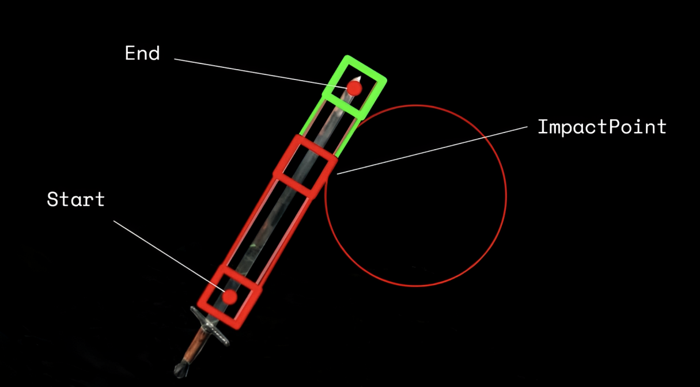
</div>
打开BP\_Weapon 现在我们想要在剑上做一个起点和一个终点 并且希望能控制它们 比如添加一个轻巧的组件 没有网格或者任何可视元素 只是有一个位置 就需要场景组件
在左侧组件面板点击添加 搜索并添加场景组件 重命名为Start 把它移动到剑的底部 不是剑柄的底部 而是剑刃的根部 再添加一个场景组件命名为End 它不能附着在Start上 应该附着在根组件ItemMesh上 将其移动到剑尖 这样我们就得到了两个不可见的场景组件

先用蓝图做
在事件图表右键 搜索box trace 可以看到有好几种盒体追踪 比如by channel by profile for objects 其中object指的是碰撞对象类型 channel指的是碰撞通道 现在就选择box trace by channel
得到这个节点 可以看到它默认的trace channel追踪通道是可见性通道 多数物体都会被设置为阻挡可见性通道 block visibility 如果对这个可见性通道进行追踪 就能击中任何我们能看到的东西 只要这个可见的东西被设置为阻挡可见性通道
Box Trace By Channel节点有Start和End引脚 把场景组件Start拖入视口 从Start引脚往右拖 搜索get world location 这样它就会返回一个向量类型 连接到Box Trace By Channel节点的Start引脚 End节点同理 连接到End引脚 那么现在就是指定了盒体追踪的起点和终点
half size引脚的意思是 盒体中心到每个轴的距离 有XYZ三个方向 就是用来设置盒子的大小的 现在暂时都指定为2.5 这个是可以可视化的 因为这个节点下面还有一个Draw Debug Type引脚 下拉菜单选择持久 就可以一直绘制debug 点击节点下方向下的三角箭头展开 就可以指定追踪颜色 命中颜色 绘制时间

我们的计划是 一旦武器盒子与其它物体重叠 就执行Box Trace By Channel 那么把On Component Begin Overlap(WeaponBox)节点的执行引脚与Box Trace By Channel节点的执行引脚连接 编译 PIE 拿起武器 挥剑就可以看到盒体追踪的效果 一直在空中残留的红色盒子 命中后就变为绿色 

Box Trace By Channel节点有一个输出引脚是Out Hit 在C++中这是一个FHitResult类型 是一个包含很多关于命中的信息的结构体 从Out Hit引脚往右拖 选择Break Hit Result 在这个Break Hit Result节点下方三角箭头下拉菜单 就可以看到这个FHitResult的所有重要变量 Location是盒子碰撞时的中心点 Impact Point是碰撞点 可以在这里画一个调试球体 那么从Impact Point引脚往右拖搜索draw debug sphere 然后把Box Trace By Channel节点右侧执行引脚连接到Draw Debug Sphere左侧执行引脚上 半径Radius设置为25  持续时间Duration设置为5 线条颜色选择蓝色
编译 PIE 找到一个可以攻击的东西攻击 就可以看到碰撞点的位置出现了蓝色的调试球

往地图里拖入一个BP\_HelloWorldCharacter 进入PIE 用我们能操纵的这个角色攻击它 发现扫描从没有碰到网格体 而是永远离它有一定距离 这是因为击中的是地图里这个HelloWorldCharacter的胶囊 所以要调整BP\_Weapon的碰撞预设 不能调整角色蓝图的碰撞预设 因为它在正常工作 在左侧组件面板选中Weapon Box 在右侧细节面板找到碰撞预设 默认是OverlapAllDynamic 是与所有其它类型重叠 而我们的HelloCharacter自身的对象类型是Pawn 在那个关卡中的HelloWorldCharacter实例上 右侧细节面板 在这里调整就不会影响角色蓝图本身 而只针对于这个实例 选中网格体(CharacterMesh0) 碰撞预设改成Custom 对象类型设置成WorldDynamic 那么这个实例的对象类型就不再是Pawn 在稍微上方的碰撞一栏里 勾选生成重叠事件 这样就能触发我们写在BP\_Weapon事件图表中的On Component Begin Overlap 一旦触发 我们就进行盒体追踪
进入PIE 攻击这个角色 有盒体追踪 但还是没有命中 没有出现蓝色调试球
关闭PIE 仍然是在细节面板里选中它的网格体 现在它的碰撞响应中 对于Visiblity是忽略 而我们的盒体追踪就是对可见性通道追踪的 那么既然它设置成忽略Visiblity 就不会被我们的盒体追踪命中 所以对于这个实例的Visiblity碰撞响应要设置成阻挡 这样盒体追踪才能命中
再PIE 攻击 在这个角色实例周围已经可以看到很多碰撞球
BP\_Weapon事件图表 从Break Hit Result节点Hit Actor引脚往右拖 搜索get object name 再从Get Obejct Name节点右侧Retuen Value引脚往右拖 搜索print string 把Draw Debug Sphere右侧执行引脚连接到Print String左侧执行引脚 这样就可以把被武器击中的物体的名字打印出来

接下来用C++实现 这些碰撞预设也可以写在C++里 大概就是像下面被注释掉的部分这样写

```c++
// Weapon.cpp
AWeapon::AWeapon()
{
	WeaponBox = CreateDefaultSubobject<UBoxComponent>(TEXT("WeaponBox"));
	WeaponBox->SetupAttachment(GetRootComponent());
	// WeaponBox->SetCollisionEnabled(ECollisionEnabled::QueryOnly); // 仅查询 可以通过枚举类修改成 无碰撞 仅查询 查询和物理
	// WeaponBox->SetCollisionResponseToAllChannels(ECollisionResponse::ECR_Overlap); // 这样碰撞预设中对于所有通道的响应都是重叠
	// WeaponBox->SetCollisionResponseToChannel(ECollisionChannel::ECC_Pawn, ECollisionResponse::ECR_Ignore); // 做完所有通道 再修改单一通道 这样碰撞预设中对于Pawn通道的响应是忽略
}
```

我们之前做的事情是 把角色实例网格体碰撞预设换成Custom 对象类型从Pawn改成WorldDynamic 并且设置阻挡Visibility 勾选生成重叠事件

之前在BP\_Weapon事件蓝图中的行为的执行引脚是从event overlap开始的 之前的重叠函数是Sphere重叠函数 现在要为box也做一个 现在对结束重叠不太关心 所以不需要做OverlapEnd了 需要绑定到动态多播委托 所以要声明为`UFUNCTION()` 而其实OnSphereOverlap的UFUNCTION是在Item类已经写了 所以Weapon类里重写之后就不需要写了

```c++
// Weapon.h protected中
UFUNCTION()
void OnBoxOverlapBegin(UPrimitiveComponent* OverlappedComponent, AActor* OtherActor, UPrimitiveComponent* OtherComp, int32 OtherBodyIndex, bool bFromSweep, const FHitResult& SweepResult);
```

在Weapon.cpp中创造OnBoxOverlapBegin的定义 现在还需要把这个OnBoxOverlapBegin函数绑定到BoxComponent盒组件的onComponentBeginOverlap BeginPlay是适合做这件事的地方 但是Weapon类里没有BeginPlay 查看其它类的BeginPlay 都是写在protected中 所以我们要在protected中重写它

```c++
// Weapon.h protected中
virtual void BeginPlay() override;
```

```c++
// Weapon.cpp
void AWeapon::BeginPlay()
{
	Super::BeginPlay();

	WeaponBox->OnComponentBeginOverlap.AddDynamic(this, &AWeapon::OnBoxOverlapBegin);
}
```

现在就已经绑定好了 那么在盒组件发生重叠事件时就会收到那个回调

现在来补全OnBoxOverlapBegin的函数实现 蓝图里我们做了Begin和End的场景组件 把这些和事件图表里的东西都删了

```c++
// Weapon.h
UPROPERTY(VisibleAnywhere)
USceneComponent* BoxTraceStart;

UPROPERTY(VisibleAnywhere)
USceneComponent* BoxTraceEnd;
```

现在要去构造函数初始化它们

```c++
// Weapon.cpp AWeapon::AWeapon中
BoxTraceStart = CreateDefaultSubobject<USceneComponent>(TEXT("Box Trace Start"));
BoxTraceStart->SetupAttachment(GetRootComponent());

BoxTraceEnd = CreateDefaultSubobject<USceneComponent>(TEXT("Box Trace End"));
BoxTraceEnd->SetupAttachment(GetRootComponent());
```

编译 PIE 就可以看到Start和End组件了 将它们移动到剑上的合适位置
接下来写一下OnBoxOverlapBegin的定义

```c++
// Weapon.cpp
void AWeapon::OnBoxOverlapBegin(UPrimitiveComponent* OverlappedComponent, AActor* OtherActor, UPrimitiveComponent* OtherComp, int32 OtherBodyIndex, bool bFromSweep, const FHitResult& SweepResult)
{
	const FVector Start = BoxTraceStart->GetComponentLocation(); // 全局位置 不是本地位置 GetRelativeLocation是本地位置
	const FVector End = BoxTraceEnd->GetComponentLocation();
}
```

设置好了Begin和End 接下来应该Box Trace By Channel了
在[官方文档](https://dev.epicgames.com/documentation/en-us/unreal-engine/BlueprintAPI/Collision/BoxTraceByChannel?application_version=5.7)搜索Box Trace By Channel 这是一个蓝图API 不是C++ 但下面有一行Target is Kismet System Library 说明这个函数在Kismet系统库里是有的 Kismet系统库和GamePlayStatics库有些相像 这是一个静态函数库 和GamePlayStatics一样是U开头的类 在[官方文档](https://dev.epicgames.com/documentation/en-us/unreal-engine/API/Runtime/Engine/UKismetSystemLibrary)搜索UKismetSystemLibrary 当然这个UKismetSystemLibrary是非常magic 所以其实可以先搜索Kismet BoxTrace 搜索的结果里发现都是UKismetSystemLibrary类的方法 所以直接搜索这个UKismetSystemLibrary类 在这个类的页面内搜索BoxTrace 可以看到好几种 有BoxTraceMulti 旁边解说是Sweeps a box along the given line and returns all hits encountered 用一个box沿着给定的线扫描 返回所有碰撞 还有BoxTraceSingle 旁边解说是Sweeps a box along the given line and returns the first blocking hit encountered 是返回第一个碰撞 我们需要的是这个BoxTraceSingle 还有by profile和for objects的版本 profile配置文件就是碰撞预设里面的 也就是蓝图细节面板里碰撞预设那一栏里面设置的东西 Custom或者其它模式 BoxTraceSingle只对特定的碰撞通道进行扫描 可以使用Visibility这样的参数传进去
先找到头文件

```c++
// Weapon.cpp
#include "Kismet/KismetSystemLibrary.h"
```

```c++
// Weapon.cpp
void AWeapon::OnBoxOverlapBegin(UPrimitiveComponent* OverlappedComponent, AActor* OtherActor, UPrimitiveComponent* OtherComp, int32 OtherBodyIndex, bool bFromSweep, const FHitResult& SweepResult)
{
	const FVector Start = BoxTraceStart->GetComponentLocation(); // 全局位置 不是本地位置 GetRelativeLocation是本地位置
	const FVector End = BoxTraceEnd->GetComponentLocation();

	TArray<AActor*> ActorsToIgnore;
	ActorsToIgnore.Add(this);

	FHitResult BoxHit;

	UKismetSystemLibrary::BoxTraceSingle(
		this, 
		Start, 
		End,
		FVector(5.f, 5.f, 5.f),
		BoxTraceStart->GetComponentRotation(),
		ETraceTypeQuery::TraceTypeQuery1,
		false,
		ActorsToIgnore,
		EDrawDebugTrace::ForDuration,
		BoxHit,
		true
	);
}
```

静态函数需要知道我们所在的世界 所以传入this 函数从第一个使用默认值的参数开始 后面所有参数也必须是默认值了 所以在函数定义里 也是要**从那个参数开始 后面所有参数都要有默认值**
第4个参数是HalfSize 需要传入一个FVector 需要在三个维度上指定half size
第5个参数是Orientation 这是一个方向 我们可以使用与盒子追踪起始相同的方向
第6个参数是ETraceTypeQuery类型的TraceChannel 这是一个枚举 所以直接输入`ETraceTypeQuery::` 看VS给我们弹出什么选项 然而这些选项都是TraceTypeQuery一串数字 不能明白什么意思 所以对于ETraceTypeQuery右键 - 速览定义 注释里写Specifies custom collision trace types, overridable per game 意思是custom碰撞追踪类型可以在每个游戏中重写 枚举常量只是TraceTypeQuery1到32 所以如果我们想做custom TraceTypeQuery 自定义追踪类型查询 就可以在这里设置并传入对应我们自定义类型的数字 但我们没做custom 所以这里传入TraceTypeQuery1
第7个参数是名为bTraceComplex的bool值 我们的骨骼网格体是有一个物理资产的 如果这个bTraceComplex设置为false 就按胶囊或者物理资产做追踪 如果设置为true 就按实际上的网格体做追踪 明显更消耗性能 所以这里设置为false
第8个参数是const TArray类型的引用 名为ActorsToIgnore 所以我们需要创建一个TArray 在这里面添加我们希望这个盒体追踪忽略的Actor `TArray<AActor*> ActorsToIgnore;` 但是什么是TArray呢？ 和C++ Array差不多 是一个容器 实际上是一个包含数组的模板类 这个类可以根据需要动态扩展数组的大小 可以像Vector那样动态扩容 这个容器可以存储我们在尖括号里指定的类型的多个值 因为这是一个模板类 现在这个ActorsToIgnore是一个TArray 而不是指向TArray的指针 所以调用函数时要使用`.`而不是`->` Add函数接收一个Actor类型的指针 比如如果想要让盒体追踪忽略武器本身 这里就可以传入this `ActorsToIgnore.Add(this);` 这样就确保不会击中武器本身
第9个参数是EDrawDebugTrace类型的枚举 表示我们能看到盒体追踪生成的调试盒子 仍然是先输入`EDrawDebugTrace::` 看VS给我们的选项 选择`EDrawDebugTrace::ForDuration` 这样就可以持续显示一段时间
第10个参数是FHitResult类型的引用 名为OutHit 在蓝图节点中这个OutHit是输出引脚 但在这里却变成了函数的输入参数 这是UE中一些函数的表现方式 它们会把FHitResult作为输入 填入这个名为OutHit的参数 这里是**用引用传入**的 所以就是为了能在函数里修改这个参数 所以也事先创建一个FHitResult类型的变量 `FHitResult BoxHit;` 传入之后 就可以使用BoxTraceSingle函数修改这个BoxHit 在BoxTraceSingle函数声明中 这个参数名为OutHit 意思是这个参数**最终是要传出的** 所以**一个参数如果是使用引用传递 而且不是常量引用 这就是一个良好的指示 意思是它最后会是输出参数** 如果是常量引用 这个函数就无法修改它 那就只是为了能同时接收左值右值罢了
第11个参数是名为bIgnoreSelf的bool值 设置为true 就是在忽略自己 这个的效果有点像把this添加到ActorsToIgnore中 所以看起来有点多余 但这是一个必需的参数
再后面的参数就都有默认值了 追踪颜色红色 命中时绿色 持续时间5s 这些都不用修改了

热重载 PIE 效果和在蓝图里做的一样 可以看到在绿色长方体附近有一个红色的点 这就是从FHitResult获取的impact point撞击点 也就是那个BoxHit传出来的值

现在来右键FHitResult 转到定义 查看一下这个数据结构 为了方便查看 此处把注释和UPROPERTY宏都删了

```c++
struct FHitResult
{
	GENERATED_BODY()

	int32 FaceIndex;
	float Time;
	float Distance;
	FVector_NetQuantize Location;
	FVector_NetQuantize ImpactPoint;
	FVector_NetQuantizeNormal Normal;
	FVector_NetQuantizeNormal ImpactNormal;
	FVector_NetQuantize TraceStart;
	FVector_NetQuantize TraceEnd;
// 后面还有一些参数 再之后就是一些方法
```

`FVector_NetQuantize`是`FVector`的子类 只是针对于网络复制进行了优化

现在还有一个问题 在没有意图攻击的时候 只是动作幅度使得剑碰到物体 也会触发碰撞 所以要先明确什么时候启动武器上盒子组件的重叠事件 所以可以在攻击动画中使用动画通知 在一段时间内启用碰撞 然后再关掉盒子组件的碰撞
打开攻击动画蒙太奇 只在挥剑的动作时间段启用碰撞 其余时间都关闭 新建一个通知轨道 命名为EnableCollision 在挥剑开始的位置上新建一个通知 命名为EnableBoxCollision 在挥剑结束的位置新建通知命名为DisableBoxCollision 为每一个攻击动画都打上

打开ABP\_RacingMiku事件图表 添加AnimNotify\_EnableBoxCollision和AnimNotify\_DisableBoxCollision到其中
接下来到C++写蓝图可调用的函数来开关武器碰撞 先把UE关了 因为写这种函数之后 通过热重载基本上都加载不出来 必须Ctrl+F5编译

最开始的时候 我们希望我们的武器是无碰撞的 也就是说在Weapon类构造函数初始化那个WeaponBox时 就应该设置成无碰撞 而不是默认的仅查询

```c++
// Weapon.cpp
AWeapon::AWeapon()
{
	WeaponBox = CreateDefaultSubobject<UBoxComponent>(TEXT("WeaponBox"));
	WeaponBox->SetupAttachment(GetRootComponent());
	WeaponBox->SetCollisionEnabled(ECollisionEnabled::NoCollision);
// 后面省略
```

```c++
// HelloWorldCharacter.h public中
UFUNCTION(BlueprintCallable)
void EnableWeaponCollision(ECollisionEnabled::Type CollisionEnabled);

UFUNCTION(BlueprintCallable)
void DisableWeaponCollision();
```

因为要在蓝图中调用 所以要写在public里 这个EnableWeaponCollision函数 打算将其设置成带有参数的 也就是可以传入ECollisionEnabled枚举类型 输入`ECollisionEnabled::`到VS之后 选项里前面都是枚举常量的全部选项 最后一行是Type 这样就代表一个类型 那么现在EnableWeaponCollision函数就需要传入这个枚举类型
但是不如直接写一个接受这个枚举类型的SetWeaponCollisionEnabled函数 这样就不需要什么Enable和Disable 把要设置的碰撞类型传入就可以了 先把刚才创建的EnableWeaponCollision和DisableWeaponCollision声明删了

```c++
// HelloWorldCharacter.h
UFUNCTION(BlueprintCallable)
void SetWeaponCollisionEnabled(ECollisionEnabled::Type CollisionEnabled);
```

那么这个函数就应该是用来设置WeaponBox的碰撞的 但是现在WeaponBox是private的 所以要先给它写一个public的Get

```c++
// Weapon.h
FORCEINLINE UBoxComponent* GetWeaponBox() const { return WeaponBox; }
```

```c++
// HelloWorldCharacter.cpp
void AHelloWorldCharacter::SetWeaponCollisionEnabled(ECollisionEnabled::Type CollisionEnabled)
{
	if (EquippedWeapon)
	{
		EquippedWeapon->GetWeaponBox()->SetCollisionEnabled(CollisionEnabled);
	}
}
```

现在EquippedWeapon上标红了 因为没有头文件 就不能使用UBoxComponent

```c++
// HelloWorldCharacter.cpp
#include "Components/BoxComponent.h"
```

但是现在这个GetWeaponBox返回的是一个指针 需要检查是否非空 先检查`&&`左边 如果为false就被截断了 不会再检查`&&`后面的部分 所以要修改成

```c++
// HelloWorldCharacter.cpp
void AHelloWorldCharacter::SetWeaponCollisionEnabled(ECollisionEnabled::Type CollisionEnabled)
{
	if (EquippedWeapon && EquippedWeapon->GetWeaponBox())
	{
		EquippedWeapon->GetWeaponBox()->SetCollisionEnabled(CollisionEnabled);
	}
}
```

Ctrl+F5 打开ABP\_RacingMiku 复制一个Is Valid GET节点过来 连接到AnimNotify\_EnableBoxCollision执行引脚后面 从HelloWorldCharacter引脚往右拖搜索set weapon collision enabled 它需要一个Collision Enabled输入 这也就是那个枚举类型 因为我们是连在启用盒子碰撞通知后面 所以这里要选择纯查询 AnimNotify\_DisableBoxCollision执行引脚后面同理 但是要选择无碰撞

编译 PIE 现在不会再只要转个身剑就触发碰撞了

### UE接口 Interface

那么剑要如何击中物体？ 我们之前做的事情是 武器上的盒子组件会触发重叠事件 然后我们用盒子追踪来确定击中的确切位置 这个HitResult信息中包含了一个被击中的Actor 我们可以随时检查这个被击中的Actor 并对它做一些操作
最直接的方法应该是 把被我们击中的Actor进行cast转换为特定的类 然后调用一些这个类受击后会发生的一些行为的函数 比如怪物掉血 罐子破碎 但是这样剑就需要检查很多种不同的情况 并且为每种情况准备不同的函数 但其实在剑的类内部 不应该包含这些其它类的信息
这里应该使用**回调** 也就是说 剑并不在乎它击中了什么 它只知道它发生了击中 然后在每一个受击的类中 只知道针对于自己被击中了 去执行一些行为 就像[Button类回调](https://chocomintopia.github.io/1-Cherno-C++.html#%E5%9B%9E%E8%B0%83)

那么这里就需要使用**接口** 比如我们可能创建一个类 这个类有自己的函数 但是它只在这个类里提供函数的声明 不提供函数的实现 其实这就是标准C++的接口 或者叫做纯虚函数 接口类里面只有没有被实现的函数 然后强制子类去实现这些函数 比如我们有一个怪物 它是APawn类 但它也可以从接口类IHitInterface继承 这样这个怪物就既是Pawn 也是HitInterface 那么它就继承了接口类中未被实现的函数 怪物类就可以为这个函数提供自己的实现 甚至这件事是强制的 必须要实现 那么其实就可以专门写一个GetHit类 这样怪物类就可以重写GetHit函数 在里面调用自己的函数 比如掉血和死亡的函数 这样**剑不需要知道它到底击中了什么** 剑只需要检查被剑击中的Actor是否实现了这个IHitInterface接口 然后就调用接口上的GetHit函数 由于被剑击中的类有它自己独特版本的GetHit函数 那么就可以根据受击发生一些行为 可以对任意多个类这样做 无论这个Actor是到底属于哪个类 都可以从IHitInterface派生并重写它自己的GetHit函数版本

所以我们接下来要做的事情是 挥剑 击中目标 检查被剑击中的对象所属的类是否实现了我们即将创建的接口 如果实现了 就调用GetHit函数 剑不需要知道那个被它击中的对象的类型究竟是什么 我们只是调用接口的函数 剩下的事情在那个被击中的类内部 它会自行处理

在内容侧滑菜单 - C++类 - HelloWorld - Public 空白处右键 - 新建C++类 在常见类一栏中往下翻到最后 找到Unreal接口 点击下一步 类型选择公共 将其放到`???/HelloWorld/Source/HelloWorld/Public/Interfaces`专门的文件夹里 类命名为HitInterface 点击创建类 这样VS中就会出现HitInterface头文件和cpp文件

打开HitInterface.h 可以看到`class UHitInterface : public UInterface` 那么这个UHitInterface类是继承自UInterface类 但是下面还有一行`class HELLOWORLD_API IHitInterface` 这里是有两个类 一个是UHitInterface 一个是IHitInterface
这与UE的反射系统有关 **UHitInterface允许我们的接口参与反射 不需要做任何修改 IHitInterface是在其它类中要继承时使用的接口 在这里声明那些要被它的子类重写的函数** 因为接口类只需要声明函数而不提供实现 所以HitInterface.cpp是空的

先写一个GetHit函数的声明 需要设置成纯虚函数 纯虚函数就是在它声明的类中 在本例中就是HitInterface类 无法实现的函数 需要写上`= 0` 这样VS就不会提示我们要创建这个函数的定义 写上`= 0`就意味着它必须在一个子类中实现 如果子类中不实现 这个子类就无法实例化 当然因为接口类只写了函数声明没写实现 接口类本身也不能实例化
因为C++中没有Interface关键字 所以接口类没有什么特殊 这仍然只是一个Class 只不过是我们通过标记为`virtual`并且写上了`= 0` 才使得接口类能够只写声明不写实现并且强迫子类实现函数

```c++
// HitInterface.h
class HELLOWORLD_API IHitInterface
{
	GENERATED_BODY()

public:
	virtual void GetHit() = 0;
};
```

