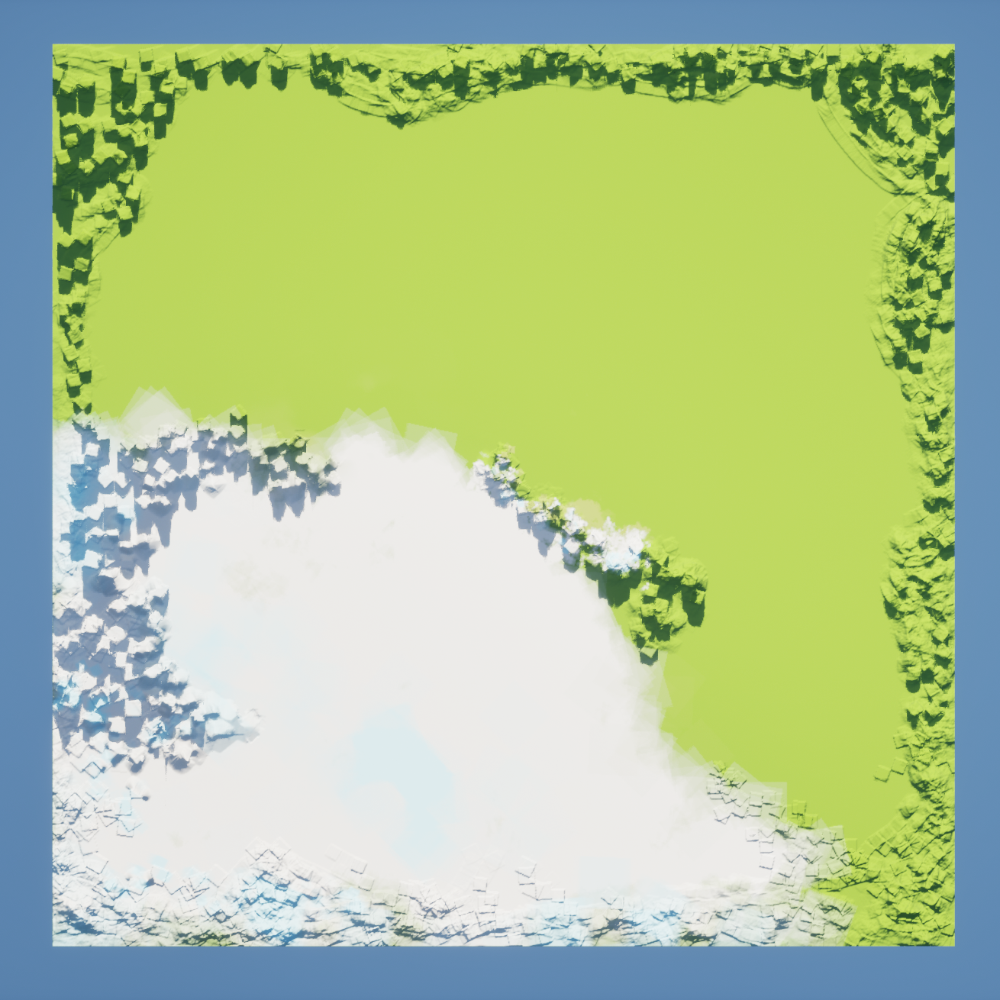
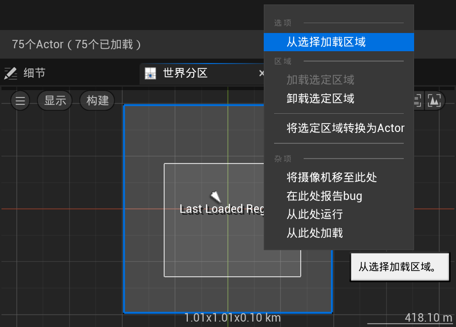
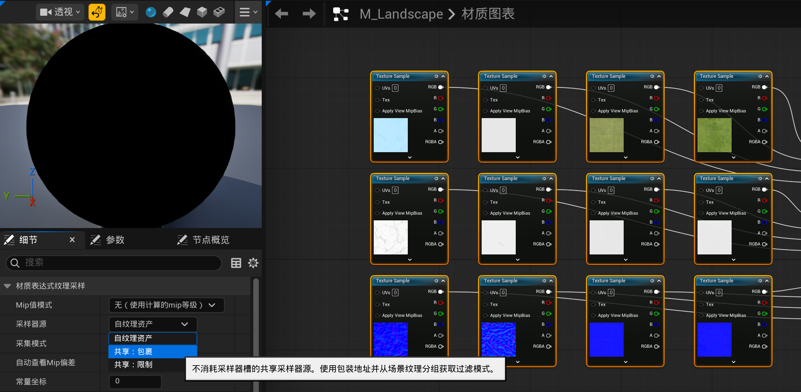

# 编辑器

在UE5.6中创建一个游戏-空白-蓝图 命名为Slash

点击窗口上方的绿色三角 开始**模拟** 点一下视口 进入PIE模式 play in editor 在编辑器里玩游戏 现在就可以用WASD进行移动 E上升 C下降 按shift+F1就可以退出视口 找回鼠标 按红色正方形就停止模拟 也可以按esc

现在我们不是模拟模式 不能移动任何东西 但是我们可以一直按着鼠标左键拖动 就可以前后左右移动
但我们不能调节俯仰角 在之前的模拟模式下 一直按着鼠标左键就可以调节俯仰视角 现在我们需要按着鼠标右键移动来调节俯仰视角 但是我们所在的位置并没有发生任何变化
同时按鼠标左右键 就可以上下左右移动 但不会发生前后移动
最好的办法当然是**一边按鼠标按键 一边按WASD进行移动** 按C放大 Z缩小 都是聚焦于鼠标所在之处的视野 E上升 F下降 ctrl+鼠标滚轮也可以放大缩小
右上角那个旁边有数字的摄像机图标可以调节摄像头速度 我们将其调节为3

视图右上角点击**眼睛图标** 最上边视口统计数据 FPS就可以查看帧率
再往下 随便开关一个复选框比如大气或者地形 就可以看到一些变化
注意到碰撞是没有被勾选的 尝试勾选 发现CPU占用率就开始提高 看到物体周围会有一些蓝紫色轮廓线 这个轮廓显示的是它们的碰撞体积 碰撞体积让引擎的物理计算更高效 碰撞体积越简单 计算越快 游戏性能越好 所以往往是比较简单的形状
再往下翻 尝试启用或禁用一些后处理与光源类型

仍然是视图右上角 **光照按钮** 可以切换很多模式 无光照模式就是灰色的 线框模式是呈现几何结构 可以看到每个网格体中多边形的每条边 调节一下俯仰 就会发现无论是地底还是天空 都是圆形 这也就是天空球 完全是球体

切换回光照模式 再看另一个按键 **透视按钮** 可以切换各种正交模式 通过鼠标滚轮缩放 这样就可以根据网格精确摆放物体了
再往下翻可以看到**书签**功能 可以设置书签 按ctrl+1就是设置书签1 按键盘上的数字1 就可以跳转到书签1 这些书签其实就是摄像机的位置
继续往下可以看到**游戏视图** 快捷键是G 开启之后 一些莫名其妙的灰白色图标就消失了 只显示游戏中会出现的物体
继续往下 可以看到**高分辨率截图** 左上角的方形可以选择位置 点击捕获 它就存储在了`Slash\Saved\Screenshots\WindowsEditor`文件夹里 上面的图片就是用这个功能截图的 虽然我也不认为这到底哪里很高清

最右上角的田字格 点击就可以变成4个**窗格** 每个窗格都有属于它自己的功能图标 这样就可以同时查看不同模式的 田字格左侧的三个点 点击就可以切换成不同的窗格排列格式
在下方还有一个沉浸式视图 就可以**全屏显示** 快捷键是F11 无论是模拟还是非模拟下都可以使用

要移动对象 我们首先要先有对象 鉴于我们的项目是空白的 现在就需要导入资产 去Epic Games的Fab里下载资产 为了拯救我们的C盘 现在需要修改一个缓存路径 打开UE的安装目录 找到`Epic Games\UE_5.6\Engine\Config`里的`BaseEngine.ini` 用记事本打开 搜索`ENGINEVERSIONAGNOSTICUSERDIR%DerivedDataCache` 将其替换为`GAMEDIR%DerivedDataCache` 就可以把缓存放在项目所在目录 接下来来到Epic Games的设置 找到下载与安装 点击转至下载设置 就会弹出download settings 下面的Advanced - Fab library Data Cache Directory 修改目录 总之放到非C盘的地方

然后去Fab里挑选喜欢的资产 Add to my library 然后去My library里 将它添加到项目里 这样我们打开UE 按ctrl+空格 或者鼠标点击左下角**内容侧滑菜单** 按右上角的停靠在布局中 就可以将其固定在视口下方 点×就可以直接关掉 现在我们将它关掉 以看到更大的视口 还可以拖动视口右侧边缘来放大

我们再次调出内容侧滑菜单 在 内容 文件夹里 就可以找到很多资产 静态网格体都是在Mesh文件夹里 随便拖动一个到视口

视口左下角有个x y z轴 我们旋转视角的时候 它也在旋转 让我们知道x y z轴的方向 **蓝色为z轴 红色为x轴 绿色为y轴**

视图左上角有4个图标 **选择Q 平移W 旋转E 缩放R**
点击选择 被选中的资产就会有黄色边缘 按delete就可以删除它
点击移动 这样就是选中并平移对象 在对象上会出现坐标轴 鼠标放在坐标轴上 坐标轴箭头亮了 这个方向拖动就可以移动 鼠标放在小方块上就可以同时选中两个方向 两个坐标轴箭头都会亮 按住shift的同时拖动 相机就会跟着选中的对象一起移动
旋转 缩放 都是类似 缩放数值改为-1 就是对应方向镜像
在移动模式下按alt 随便往一个箭头方向拖动 就能复制这个资产 按shift挨个点击就可以同时选中多个 这时再按alt 就可以批量复制 旋转模式下按alt也可以复制 发生旋转的是副本

发现我们在做这些操作时 是不流畅的 稍微右边的3个旁边有数字的蓝色图标就是调整这个的 都是**网格吸附**功能 吸附到网格 旋转固定角度 缩放固定增量 点按一下就关闭了 旁边的数字是每次能移动的距离 左侧紧挨着的灰色的图标是吸附到平面 数值可以调整它距离平面的默认距离

再左边那个旁边有3个点的圆地球图标 是切换**世界坐标轴**和对象自己的box的坐标轴 通常认为对象的局部x轴是它的前进方向 这样就可以决定到底是按世界坐标方向移动它 还是按它自己的朝向移动它

如果找不到自己想选中的物体 就可以去看视口右侧的**大纲**选项卡 可以发现光源、地面、出生点也在里面 在大纲视图里点击 就会发现对象在视口里被选中了 双击或者按F键 就可以在视口里聚焦到它 左侧的眼睛图标可以隐藏它 上方有搜索框可以搜索 按ctrl挨个点选就可以同时选中多个 按shift点选目标的第一个和最后一个 就可以选中这之间的所有对象 这时再按ctrl点击某个不想要的对象 就可以取消点选 这时再按delete 就可以一起删除

在视口里随便找个地方 右键 放置Actor 比如放置一个定向光源 就可以看到影子的位置改变了

大纲视图的下方 有**细节**选项卡
在**变换**这一栏中 有位置 旋转 缩放 右侧三角箭头可以选择是绝对坐标还是相对坐标 再右侧可以修改数字进行调整 而在我们使用WER快捷键的3种模式进行移动时 这些数字也在发生改变 在修改数字时 按下tab 就会跳到右侧的下一个框继续进行修改 最右侧的弯曲箭头 是重置为默认
看变换上方有一些选项按钮 目前我们默认所在的是**所有**
如果点击比如物理 就是在 所有 中筛选成只保留 物理 相关的属性 现在我们把一个物体让它腾空 找到物理这一栏中的**模拟物理** 点击视口上方绿色三角进入模拟模式 我们会发现它发生了坠落 甚至可能发生倾倒与滚动 比如下面这棵树

在下方也可以勾选是否**启用重力** 现在我们挑选一个质量较轻的物体 将它置于空中 打开模拟物理 但是关闭启用重力 然后我们飞过去撞这个物体 它就会飘到远处 比如这个箱子

选中这个物体 按一下end 它就会吸附到地面上了

现在我们看整个UE编辑器的最右下角 大概会显示有什么未保存 或者我们直接按ctrl+S **保存当前关卡** 建议在内容文件夹里创建一个名为Maps的文件夹 这样我们下次进入这个UE项目时 就可以点击左上角 文件 - 打开关卡 找到那个我们保存的关卡 来继续我们上次编辑的部分

*试着练习了基本操作 使用了Fab商店里下载的 Stylized Fantasy Provencal、RPG Hero Squad PBR Ployart、Sallon Interior*

上方绿色三角稍微左侧 有一个盾牌形状右下角是绿色加号的按钮 点击它 可以看到导入内容和Fab 也能看到Quixel Bridge 点击它 里面有很多扫描真实物体得到的素材 点击右上角人物头像 登录账号 就可以下载一些素材 但我们还是倾向于使用Fab

现在打开内容侧滑菜单 找到一个静态网格体 静态网格体图片下方 名字上方的线是蓝绿色的 这是它的颜色标识 双击这个静态网格体 会有一个弹窗 我们就进入了静态网格体编辑器 在此之前我们的视口一直都是关卡编辑器 按滚轮就可以对其进行缩放 比如我们可以在右边切换它的材质

***开放世界***

一般来说 大型世界都是分成好几个关卡 你只会加载一个关卡 角色在这里移动 角色到达边缘后 就加载下一个关卡 这样玩家到达下一个地图时 前一个地图就卸载了 现在UE支持开放世界 与其用很多小地图 不如用一张大地图 UE会把这个世界分成很多块 只加载玩家所在的那一块 这叫世界分区 

现在点击左上角文件 - 新建关卡 - 空白开放世界 先把这个关卡保存一下 我们希望这个新的关卡成为打开项目时的默认关卡 点击左上角编辑 - 项目设置 左侧边栏 找到地图和模式选项 将编辑器开始地图和游戏默认地图都修改为我们刚刚新建的地图

创建之后就是一片漆黑 什么都没有 现在我们可以从零开始创建了 现在大纲视图里只有WorldDataLayers世界数据层和WorldPartitionMiniMap世界分区小地图

左上角点击 窗口 - 世界分区 - 世界分区编辑器 现在可以看到右下方细节选项卡旁边出现了一个名为**世界分区**的选项卡 我们将可以在这个小地图上看到我们整个世界的地图 并且看到我们在地图上的位置

## 天空

1. 天空大气 sky atmosphere 和真实的大气层一样 如果有光源 它就会散射光线 产生各种美丽的气象效果 最多可以有两个大气光源 比如用两个光源分别模拟太阳和月亮
2. 定向光源 directional light 模拟一个无限远处的光源 所有物体上的阴影都是平行的 我们将**使用定向光源来模拟太阳**

点击左上方那个盾牌右下角绿色加号按钮 选择**放置Actor面板** 我们直接搜索天空 或者在 更多 里找到**天空大气** 将它拖到视口里随便一个地方 然后再光源里找到**定向光源** 随便拖到一个地方 现在我们可以看到天空和太阳 我们还可以拖入一个定向光源 会提醒我们 多个定向光源正在竞争

必须要按下ctrl的同时移动 才能移动太阳 现在我们有**两个太阳** 可以通过更改它们的大气层太阳索引来区分二者 再大纲视图里找到DirectionalLight 在细节选项卡里搜索 大气太阳光 可以看到**大气太阳光索引** 现在显示为0 我们不动它 现在在大纲视图里找到DirectionalLight2 修改它的大气太阳光索引为1 天空中仍然只有一个太阳 这是因为如果按照之前那种移动位置的办法 我们只是拖动了光源 改变了它的坐标 却没有修改光的方向 需要按ctrl+L 同时鼠标移动 才会**改变光的方向** 不再是两个平行的光源 天空中终于出现两个太阳 但是ctrl+L只能移动DirectionalLight的方向 而对于移动DirectionalLight2 需要ctrl+shift+L

也可以完全不用快捷键 在大纲视图中选中那个光源 直接在细节选项卡 - 通用 - 变换 - 旋转 里修改旋转角度数值

可以发现 变换里还有一行是移动性 目前是固定 还有静态和可移动两个选项
光源的移动性设置决定了它在游戏中的行为和操作方式

- 静态
  其照明效果在游戏中无法更改 无法更改该光源的位置 方向 强度 颜色 静态光源的计算速度最快 因为它们在游戏中不会发生变化 这也允许我们烘焙光照 如果某个静态物体的阴影永远不会改变 就可以把阴影和光照信息烘焙进场景 这样计算就在游戏开始前完成了 而不是在游戏里实时计算
- 固定
  可以在游戏中改变颜色和亮度 但是位置和方向不能改变 这样能实现部分光照烘焙 照在不动的静态物体上的光 它的阴影就可以被烘焙 但是动态物体的阴影还是得跟着动
- 可移动
  最耗费计算资源 可以在游戏中移动和改变属性 就像会移动的太阳一样 会投射动态阴影 无法烘焙

现在我们把这两个太阳都修改成可移动 顺便我们把这两个定向光源分别重命名为Sun0和Sun1 对应索引为0和1

3. 天空光照 sky light 捕捉整个场景 并将捕捉到的光照信息应用到场景中 就像天空 山脉 和所有其它事物都在将光反射到场景中 这是获得全局光照效果的方式 天空光照只在特定条件下执行这些捕捉 取决于天空光照的移动性
   静态天空光照 它会在你构建光照时更新 对于静止和可移动的天空光照 它会在加载时更新一次 如果你手动捕捉也会更新 所以你可以运行一个函数来执行捕捉 现在有一个选项叫做实时捕获 如果你启用它 我们将持续执行此捕捉 所以当我们的场景发生变化 例如太阳升起落下或者其他变化时 天空光照将持续更新 执行此捕捉并将光线应用到场景中

在放置Actor面板里搜索天空 或者在光源选项卡里找到 **天空光照** 将其拖入视口 在细节- 通用 - 变换里 将它设置成可移动的 稍微往下翻 在 光源 里 可以找到**实时捕获** 将其勾选上

现在就可以实现**昼夜循环**了 天空光照会随着天空中的光源变化而自动调整 

4. 指数级高度雾 exponential height fog 雾的浓度会随着高度变化 越低的地方雾越浓 模拟的是气压 指数高度雾可以设置两种颜色 一种用于星球向阳面 一种用于背阳面
5. 体积云 volumetric clouds 以前 云只是天空球体网格上的材质 但现在我们可以拥有体积云了 它是动态的三维的 并且由材质驱动 所以你可以改变材质 云也会随之改变 它们还会向大气一样散射光线 所以我们可以获得一些非常酷炫的效果 让光线穿过这些云 

我们搜索指数级高度雾 或者在 更多 - 视觉效果 里找到**指数级高度雾** 将其拖入视口

注意到下方不再是黑色了 而是填充成了蓝色 在细节选项卡里 我们可以修改雾的密度 雾高度衰减

在 更多 - 视觉效果 里找到体积云 拖入视口

现在我们选中一个太阳 将其旋转方向到地平线附近 在细节选项卡里找到使用色温并勾选 然后修改温度 这样就会呈现不同的颜色

我们在大纲视图里新建一个名为sky的文件夹 把刚刚添加的所有这些关于天空的Actor都移动到里面 按住ctrl可以批量选中 顺便把它们的x y都修改成0 同时把z轴坐标拉开一些距离 方便我们找到它 同时也方便我们通过聚焦它来找到世界的中心 当然也可以通过双击世界分区上的某个位置来快速跳转

## 地形

项目名称下方 我们现在是选择模式 接下来切换到**地形模式**

在左侧面板 将**组件数量**修改成16×16 当然这个数字是随意的 然后点击下方的创建 创建的时候一定要选一个材质 这样才能看到地面

看左侧面板 我们现在处于雕刻模式 这种状况下鼠标就不能轻易使用了 于是我们最好使用快捷键shift+1 切换到选择模式 这样就可以摆放各种物体 选择模式下 我们点选地面 发现是选中了一个格子 在大纲视图下是定位到了LandscapeStreamingProxy一串数字 这代表的就是一个组件 而我们之前创建了16×16个这样的组件 选中它时 按下delete 就可以删除

**圆形笔刷** 笔刷衰减的意思就是 内圆和外圆之间的差距 其余笔刷的各种功能 请自行体会

*选择了草地材质创建地形 试着使用雕刻模式下的星星图标Alpha笔刷雕刻了*

**材质**一般都是和网格体绑定在一起 我们随便拖入一个静态网格体 **静态网格体都是`SM_`一串字母命名的** 在大纲视图里 右键 浏览至资产 双击这个静态网格体 进入静态网格体编辑器 就可以查看它的材质 或者在细节面板 往下翻 就能看到它的材质 如果是复杂的静态网格体 比如房子 它应该有多种材质 这些很多的材质都是`MI_`一串字母 这是基于`M_`材质创建的一个材质实例 我们在内容浏览器里搜索`M_` 随便找到一个材质 右键 引用查看器 就能知道到底有哪个静态网格体使用了这个材质 我们先把使用了这个材质的静态网格体 随便选一个拖入视口中

双击这个材质 就可以看到它的各种参数

我们可以把这个弹出来的编辑器选项卡 拖到我们的关卡旁边 从此之后 我们再点击静态网格体或者材质 它都不会是一个新的弹窗 而是**作为选项卡 出现在我们的关卡选项卡旁边** 我们点击Texture Sample里的方形纹理贴图 它就会在内容管理器里 以文件夹视图显示

我们回到那个材质 按住alt键 然后鼠标左键点击纹理采样的RGB输出节点 就能看到没有这个贴图时的样子

点击左上角的应用 所有使用这个材质的东西就会都发生变化 可以回到关卡里查看一下差异

再刚才点击的RGB那里 鼠标左键拖拽连接到基础颜色 就重新连接上了

我们整个地形都是完全相同的草地材质 之前我们用的材质都是从静态网格体借用的 现在去Fab里专门下载一些适用于地形的各种材质

现在打开的这个是雪地材质 这种蓝紫色的就是**法线贴图** 名字常常是一串字母_normal 它是管理材质的凹凸不平的

现在 我们在内容文件夹里 创建一个名为landscape的文件夹 顺便整理一下我们之前导入的资产 如果想要移动资产的位置 请务必在UE里移动 而不是在windows文件资源管理器里移动 会发生混乱

进入Landscape文件夹 右键新建一个材质 命名为`M_Landscape` 然后双击进入材质编辑器 左侧细节面板 往下翻 可以找到一个名为**完全粗糙**的复选框 因为地面是没有反射性的 它没有光泽和闪光 应该是粗糙的

我们现在主要关心基础颜色和法线 其实我们可以导入纹理作为基础颜色 或者 导入一个法线贴图 连接上就可以了 但我们希望地形可以使用多种材质 就需要使用**图层** 在材质图表的空白处右键 搜索Landscape Layer Blend 

左侧细节选项卡出现了 材质表达式地形层混合 图层 0数组元素 点击右边的加号 这样我们就添加了一个数组元素 点击 索引[0] 左侧的小三角 就可以展开 看到这5个成员 在材质列表里现在显示的是Layer None 这是因为我们在细节面板里命名的图形名称为None

我们将其重命名为Snow 不要使用空格 混合类型可选权重混合、透明度Alpha混合、高度混合 我们使用**权重混合**来混合这个材质层和其它图层

回到内容侧滑菜单里 找到一个想要的纹理 拖拽到`M_Landspace`的选项卡上 然后放到材质图表里 将纹理的RGB连接到Landscape Layer Blend上 再将Layer Blend连接到基础颜色上

现在我们需要添加法线纹理 选中Layer Blend 按ctrl+D直接复制这个图层列表 或者按ctrl+C再ctrl+V也可以 同样是连接上 再将图层连接到法线上 我稍微更换了一些材质 调整了布局 增加了AO和Normal纹理 如下图

现在把我们的Landscape的材质切换为刚才我们编辑的材质M_Landscape 然后切换到地形模式 - 绘制 - 目标层 - 层 点击右侧倒数第二个像地球一样旁边有箭头的图标 如下图中黄色高亮部分 **从指定的材质创建层**

然后可能还是没有任何变化 重新打开UE 先把地形材质换成其它的 再换回来 就会出现 如果还没出现 就再重启UE

点击Grass1右边的加号 **创建层信息** 会让我们选择 是权重混合层 还是非权重混合层 权混合图层会彼此混合 当我们在一个图层上绘制另一个图层时 它们会混合在一起 非权重混合层不会混合在一起 是一层一层叠加的 比如泥土上的雪 不会混合在一起 而就是呈现出 雪覆盖在泥土之上 我们现在使用**权重混合层** 会出现一个弹窗 创建新地形层信息对象 我们就将其保存在Landscape文件夹里 也不需要修改名字 它默认的名字就是 Grass1_LayerInfo 我们对每一个图层都这样做

现在可以开始绘制了 先在绘制面板中右键Grass1选择填充图层 这样整个地图就都是这个材质了 选择材质和笔刷进行绘制就好

有时候我们打开地图时 发现之前做的东西都消失了 这时候打开世界分区选项卡 随便用鼠标选定框选一个区域 右键 从选择加载区域 这样我们做的东西就又出现了

为了方便地形的快速加载 我们可以打开M_Landscpae 选中所有纹理 都换成 **共享：包裹** 然后点击应用

## 植被

现在我们添加植被 从选择模式切换到植被模式 在资产中找到**静态网格体植物** 拖入+植被下方的空白处 使用静态网格体植物 就可以使很大数量的相同植物共享纹理的内存位置 效率更高 它们唯一不同的地方就是位置、旋转角度、缩放比例 我们也可以将静态网格体拖入其中 它会有弹窗 创建成为新的静态网格体植物

植物面板里的植被 左上方有复选框 按住ctrl或者shift可以多选 这时点击其中一个植物的复选框 其余被选中的都会跟着一起勾选 进入绘制模式 请尽量将绘制密度缩小 否则加载地图会很慢

对于静态网格体 我们可以在编辑器里打开它 找到它的材质 它的材质的参数组里有一栏为wind 我们可以将遥远的批量植被的风力关掉 优化性能 可以对会动的物体使用Nanite的 Nanite允许你使用极高多边形网格 而计算成本只是很小的一部分

如果想批量修改某些资产的属性 可以批量选择后 右键 - 资产操作 - 编辑**属性矩阵**中的选择 这个操作对于静态网格体和静态网格体植物都能使用

我们就使用这个功能 对于这几种树的静态网格体植物 打开属性矩阵编辑器 在右侧 固定列 面板中 搜索碰撞 将碰撞描述文件名修改为 BlockAll 现在双击某一种树的静态网格体植物 在弹窗中往下拉 可以看到碰撞预设现在是BlockAll 我们进入PIE模式 就能发现自己无法穿过这些树

## 后期处理特效

回到选择模式 点击左上方那个盾牌右下角绿色加号按钮 打开放置Actor面板 在更多 - 体积 里找到 **后期处理体积** 将其拖入视口 在细节面板 - 通用 里找到 后期处理体积设置 - 无限范围（未限定） 勾选它 这样就可以应用到整个关卡

后期处理体积可以改变场景的显示效果 在细节面板可以看到很多调色功能面板 颜色分级 电影 透镜 都可以尝试 透镜 - bloom就是光晕效果 会对场景中的太阳和灯光造成影响 透镜 - Exposure里的Min EV100和Max EV100 都是亮度 

*仅调节色温5500 global绿色饱和度3 bloom2.5 变化不明显*

## 关卡实例

可以批量选中静态网格体 右键 - 关卡 - **创建关卡实例** 也可以**创建已打包关卡Actor** 使我们将关卡实例打包到称为Actor的东西中 我们还没有正式讨论过Actor 但我们知道场景里的所有东西都是Actor 我们就选择创建已打包关卡Actor *New Packed Level Actor* 它让我们选择枢纽点类型 枢纽点的意思就是旋转中心 我们想让它怎么旋转 它会将旋转中心放在网格体最低高度的中心位置 我们就使用默认的中心最小Z 接下来就出现一个另存为的弹窗 我们在Maps文件夹内新建一个名为 PackedLevelInstances的文件夹 将这个关卡起个名字保存起来 之后又出现 资产另存为的弹窗 我们就将它存储在刚才保存的关卡旁边
现在可以发现 大纲视图中那些零散的静态网格体消失了 而是整合成了一个**蓝图类** 现在它们可以整体地拖动 点击这个关卡 因为没有灯光所以漆黑一片 但是在大纲视图里可以看到组成它们的静态网格体 点击其中的某一个就可以看到轮廓 也可以从光照模式切换到无光照或者线框模式 看到它们 而在现在的这个小关卡内 我们就可以随意移动它们 修改结束之后 右键这个关卡 点击**更新压缩蓝图** 大关卡里的对应部分就会发生变化
不存储成蓝图 直接将其它关卡拖拽进现在的关卡也可以 但是就不能像蓝图一样能保持更新

双击我们刚刚保存的蓝图类 就会打开蓝图编辑器 我们进来的时候默认是 事件图表 选项卡 点稍微左边的 视口 我们就可以看到这个蓝图的图形 这就是Actor 它是由许多单独组件组成的 在左侧的 组件 选项卡中 可以看到组成它的组件的名字 这些都是关卡实例组件 比普通的静态网格体效率要高 

回到我们的关卡 点选视口里的这个蓝图类 右键 - 关卡 - 中断 - 破坏关卡实例 这样它就变回了离散的静态网格体

现在去Epic Games里 下载Project Titan示例 我们将从中获取资产 顺便使用一些蓝图类的资产 继续地编

地图中的某个静态网格体或者关卡摆好了位置 可以在大纲视图对其右键 替换选中的Actor 在它原来的位置上替换为其它Actor 也可以在细节面板里切换
如果某个关卡导入后 拖拽时 不能使所有部件都一起移动 可以先移动其主要部分到达理想位置 再在细节面板 所有 - 关卡 里先换成None 再切换为我们导入的关卡 就会全都跟着过来了

如果有静态网格体的某个部分很多余 可以从选择模式切换到**建模模式** 选中静态网格体 在左侧面板中 选择 - **三角形选择** 用笔刷在静态网格体上选中需要删除的部位 之后点击 网格体编辑 - 删除 最后点击视口下方的 选择三角形 - 接受 如果是想把这一部分分离出来 比如把门从房子上拆下来 成为独立的静态网格体 就点选 网格体编辑 - 分隔 还需要做一步改变旋转轴 选中门 在想作为旋转中心的地方右键 - 锚点 - 在此处设置枢轴偏移

## 向量

向量 包含大小和方向 那么它是如何存储的呢 和二维坐标一样 也是存储在一个**有序对**中 x, y分别是顶点到终点在x轴或y轴上的距离之差

假设有一个角色 它有个坐标 敌人也有自己的坐标 假如有个AI系统 那么就需要知道敌人到角色的距离和方向 也就是敌人到角色的向量 才能追上角色 那么(x2-x1, y2-y1, z2-z1)就是向量 又比如角色要瞄准敌人 射出一支箭 那么就需要角色到敌人的向量 假设角色打偏了 枪声使敌人注意到角色 试图反击 此时就需要知道敌人到角色的向量 这是角色到敌人向量的反向向量 只有符号相反

向量也有数乘 加减法

假设有一个敌人 在空间中有坐标 并且占据一定范围的空间 也有一个角色 在某个坐标 假设这个角色有一个特殊攻击 比如火球 火球只能飞那么远 假设角色正瞄准敌人 那么就是需要角色到敌人的向量 但是向量的长度是只有那么远 还不足以打到敌人 假设这个角色得到了某种buff或强化 射程翻倍 这时候就需要向量数乘 ×2

我们可以用向量来表示一个东西的坐标 也就是从原点到这个坐标的向量 **位置向量** 坐标也用向量表示之后 就可以通过 一个东西的位置向量 一个东西到另一个东西的向量 使用向量加法 就得到另一个东西的位置向量

敌人要接近玩家 每个敌人都有指向玩家角色的向量 但是这个向量的长度要根据敌人的移动速度进行缩放 这就需要单位向量 再乘以敌人的移动速度 就是我们需要的向量 将向量除以向量的长度 就可以得到单位向量

UE使用的是**左手系** 但是物体也有它自己的坐标 也就是相对于世界坐标的那个local坐标系 规定**物体的前进方向为x轴** z代表它的上方 而既然使用左手系 y轴就是它的右侧方向 那么绕y轴旋转就是改变它的俯仰角 pitch 绕z轴旋转是改变了它的偏航角度 yaw 绕x轴旋转是改变它的滚转角 roll

# UEC++

## UE的Visual Studio推荐设置

工具 - 选项 - 项目和解决方案 - 常规 取消勾选生成完成时有错误则始终显示错误列表

工具 - 选项 - 文本编辑器 - 所有语言 - 滚动条 勾选使用垂直滚动条的缩略图模式

工具 - 选项 - 文本编辑器 - C/C++ - 高级 - 浏览/导航 将 隐藏外部依赖项文件夹 置为True

工具 - 选项 - 文本编辑器 - C/C++ - IntelliSence - 启用64位IntelliSence

工具 - 选项 - 文本编辑器 - C/C++ - 查看 将 **显示非活动块** 置为False
因为UE5建议我们使用实时编码 而不是热重载

工具 - 选项 - 调试 - 常规 - 启用热重载 取消勾选

工具 - 自定义 - 命令 - 工具栏 将下拉菜单修改为 标准 然后点击下方预览中的 解决方案配置 再点击其右侧的 修改所选内容 将宽度变更为200
